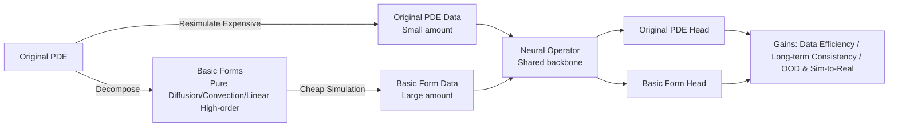

# Learning Data-Efficient and Generalizable Neural Operators via Fundamental Physics Knowledge

**Conference**: ICLR 2026  
**OpenReview**: [https://openreview.net/forum?id=mJiPqOzc3O](https://openreview.net/forum?id=mJiPqOzc3O)  
**Code**: [https://sites.google.com/view/sciml-fundemental-pde](https://sites.google.com/view/sciml-fundemental-pde)  
**Area**: AI for Science / Neural Operators / PDE Solving  
**Keywords**: Neural Operators, PDE Surrogate Models, Multi-physics training, Data efficiency, OOD Generalization, FNO  

## TL;DR
Complex PDEs are decomposed into "basic forms" (e.g., pure diffusion or pure convection terms). By training neural operators to simultaneously learn the original PDE and its low-cost basic forms, the model achieves lower error, stable long-term extrapolation, and stronger OOD/sim-to-real generalization using significantly less simulation data.

## Background & Motivation
**Background**: Neural Operators (NO), such as FNO, have become fast surrogate models for solving partial differential equations (PDEs). Recently, SciML foundation models (e.g., MPP, DPOT) pre-trained on multiple PDEs have emerged, learning spatiotemporal evolution directly from simulation data of target PDEs.

**Limitations of Prior Work**: Compared to traditional numerical solvers that inherently satisfy physical laws (conservation, symmetry) and generalize stably across different parameters/boundaries/geometries, data-driven models are highly sensitive to training distributions. Three major issues exist: ① **High data demand**: Lack of physical priors requires massive diverse datasets to achieve accuracy; ② **Physical inconsistency**: Lack of inductive bias leads to violations of conservation laws and non-physical results in long-range rollouts; ③ **Poor generalization**: Re-training is often required for unseen simulation settings.

**Key Challenge**: Existing "multi-physics pre-training" merely aggregates various, sometimes weakly related, PDE systems without explicitly verifying whether the model truly masters the fundamental physical terms constituting complex equations. The authors made a critical observation on 2D Navier-Stokes (Figure 2): when the decomposed convection term is evaluated separately, mainstream neural operators show significantly higher errors (0.133–0.308) on this basic term than on the original PDE (0.008–0.056), despite a Pearson correlation of **0.9625**. This suggests that while strong models implicitly learn basic terms, they do so unreliably because these terms never appear in the training data.

**Goal**: To answer two scientific questions—Can neural operators simultaneously understand original PDEs and fundamental physical knowledge? Does explicit learning of basic physical knowledge provide benefits?

**Core Idea**: **Systematically decompose original PDEs into "basic forms" as low-cost, physically reasonable auxiliary tasks for joint training**. Since basic forms are much cheaper to simulate than original PDEs, they allow for an "exchange": obtaining more samples of basic forms within the same simulation budget, thereby saving data and enhancing generalization. The method is **architecture-agnostic**.

## Method

### Overall Architecture
The method follows two steps: first, **define and decompose** the PDE into basic forms (retaining dominant dynamics while removing terms that introduce stiffness, high cost, or minor contributions to target patterns); second, **jointly train** the neural operator on both the original PDE and the basic forms—sharing a backbone while using two independent prediction heads. Since basic forms are cheap to simulate, half of the baseline simulation budget is "reallocated" to generate a large number of basic form samples, achieving gains in data efficiency, long-term consistency, and OOD generalization at equal or lower total cost.

### Key Designs

**1. Systematic Decomposition Criteria: Preserve Dominance, Discard Stiffness**. The authors formalize "fundamental physical knowledge" into a decomposition pipeline—retaining terms that govern the essence and dominant dynamics, while removing terms that introduce solver stiffness, increase computational cost, or contribute little to target pattern formation. Using the general second-order PDE form $\sum_{i,j} a_{ij}\partial^2_{x_ix_j}u + \sum_i b_i\partial_{x_i}u + c = f$ as a template, specific decompositions are provided: for Diffusion-Reaction, nonlinear reaction terms $R_u, R_v$ are dropped, leaving pure diffusion $\partial_t u = D_u\partial_{xx}u + D_u\partial_{yy}u$ (diffusion is the main cause of spatial coupling in pattern formation); for Navier-Stokes, the pressure term $\frac{1}{\rho}\nabla p$ and viscous diffusion $\nu\nabla^2 u$ are dropped, leaving inertial convection $\frac{\partial u}{\partial t} = -(u\cdot\nabla)u + f$ (pressure terms are extremely expensive to solve); for Kuramoto-Sivashinsky, the nonlinear convection $-u\partial_x u$ is dropped, leaving the linear "anti-diffusion + diffusion" competition $\partial_t u = -\partial_{xx}u - \partial_{xxxx}u$. From a machine learning perspective, this decomposition is essentially **physics-driven data augmentation**.

**2. "Sample Mixture Ratio" based on Simulation Cost**. Since basic forms are significantly cheaper to simulate (e.g., 2D NS original simulation takes 2.775s/step vs. 0.113s/step for basic forms), the authors define a **Sample Mixture Ratio** (Original PDE : Basic Form). This replaces original data with basic form data based on the cost ratio, ensuring the total simulation budget remains equal or lower. Tested ratios are 1:3 for Diffusion-Reaction, 1:24 for 2D NS, 1:3 for 3D NS, and 1:12 for KS. This converts "saved compute" directly into more training samples rich in physical knowledge.

**3. Multi-task Joint Training: Basic Forms as Auxiliary Tasks**. Drawing from curriculum learning and auxiliary task learning, basic forms are treated as simpler, physically motivated auxiliary tasks optimized alongside the original PDE main task. Basic forms help the model learn representations more efficiently and accelerate convergence of the main task. Note: basic form data is **only used during training**; all tests are performed on the original PDE to evaluate its prediction performance.

**4. Architecture-Agnostic Dual-Head Design**. The method does not bind to a specific network. Using FNO as an example, the **shared neural operator backbone** learns both the main PDE and basic terms, with only **two independent final prediction layers** to distinguish the tasks. This design allows smooth migration to Transformer-based operators.

## Key Experimental Results

### Main Results (OOD Generalization, nRMSE, lower is better)
Comparing the original PDE baseline with the joint basic form method across four PDEs, evaluated on source and two target OOD distributions:

| PDE | Method | Source | Target 1 | Target 2 |
|---|---|---|---|---|
| Diffusion-Reaction (2D) | Baseline | 0.0289 | 0.0413 | 0.0770 |
| | **Ours** | **0.0231** | **0.0331** | **0.0538** |
| Navier-Stokes (2D) | Baseline | 0.0487 | 0.0825 | 0.0369 |
| | **Ours** | **0.0175** | **0.0222** | **0.0125** |
| Navier-Stokes (3D) | Baseline | 0.0675 | 0.0393 | 0.0836 |
| | **Ours** | **0.0481** | **0.0329** | **0.0602** |
| Kuramoto-Sivashinsky (1D) | Baseline | 0.0037 | 0.0021 | 0.0200 |
| | **Ours** | **0.0034** | **0.0018** | **0.0197** |

The most significant improvement occurs in 2D NS (Source error reduced from 0.0487 to 0.0175, ~64% reduction), with consistent improvements in OOD (viscosity $\nu$ shift).

### Sim-to-Real Generalization (ScalarFlow Dataset)
Trained on 3D Navier-Stokes simulations and transferred to real smoke plume observations:

| Method | nRMSE |
|---|---|
| Baseline | 0.250 |
| **Ours** | **0.213** |

### Key Findings
- **Data Efficiency (Figure 5)**: Across all PDEs and architectures, the proposed method yields lower error with less simulation cost than the baseline.
- **Long-term Consistency (Figure 6)**: In 5-step autoregressive rollouts, the advantage persists with smaller cumulative errors and better physical consistency.
- **Mechanism Observation**: The high Pearson correlation (0.9625) between original and basic term errors, contrasted with high absolute error on basic terms, proves that existing models possess "implicit but unreliable" knowledge, justifying explicit learning.

## Highlights & Insights
- **Redefining "Multi-physics"**: Contrary to simple aggregation in SciML foundation models, this work argues that **complex PDEs must be grounded in their basic terms**, providing a verifiable, decomposable vision of physical consistency.
- **"Compute for Data" Free Lunch**: Decomposed basic forms are so cheap that they provide multi-faceted gains at almost zero extra computational cost by reallocating budget from high-fidelity simulations.
- **Simplicity and Generality**: The method requires no modification to loss functions or network backbones (unlike PINNs), only changing the data composition and adding a prediction head.

## Limitations & Future Work
- **Manual Decomposition**: Deciding which terms to keep or drop currently relies on physical priors and manual design, lacking an automated discovery mechanism for basic forms.
- **Sample Mixture Ratio Tuning**: Setting ratios based on simulation cost is heuristic; optimal ratios vary significantly across PDEs (1:3 to 1:24) and lack theoretical guidance.
- **Testing Scope**: Evaluations remain within the same PDE family; more aggressive cross-family generalization (e.g., training on NS and testing on KS) is not addressed.
- **Future Work**: Automated discovery of fundamental terms, integration into large-scale SciML foundation model pre-training, and validation in more 3D real-world physical scenarios.

## Related Work & Insights
- **PINNs**: Constrain physics via PDE residuals in the loss function but face optimization difficulties; this work takes a complementary "data-side enhancement" route.
- **Neural Operators (FNO/DeepONet/etc.)**: Learn function space mappings but are data-hungry. This work emphasizes the multifaceted gains of explicit learning of basic physical knowledge rather than just cheap simulation.
- **SciML Foundation Models (MPP/DPOT/Hyena)**: Pursue generalization through multi-PDE joint pre-training but often ignore data efficiency and consistency on basic terms. This work addresses that gap.

## Rating
- **Novelty**: ⭐⭐⭐⭐ — The "decomposed basic form + joint training" perspective is refreshing and distinct from existing pre-training; however, individual components (multi-task, augmentation) are established techniques.
- **Experimental Thoroughness**: ⭐⭐⭐⭐ — Covers four PDE types (1D/2D/3D), data efficiency, long-term stability, OOD, and real-world ScalarFlow data. Cross-family generalization and more architecture variety could be further explored.
- **Writing Quality**: ⭐⭐⭐⭐ — Clear logic from motivation to method; physical explanations for each decomposition are well-provided.
- **Value**: ⭐⭐⭐⭐ — Highly practical for SciML surrogate models, providing an architecture-agnostic way to improve efficiency and generalization with zero additional overhead.

<!-- RELATED:START -->

## Related Papers

- [\[ICLR 2026\] Locally Subspace-Informed Neural Operators for Efficient Multiscale PDE Solving](locally_subspace-informed_neural_operators_for_efficient_multiscale_pde_solving.md)
- [\[ICLR 2026\] DGNet: Discrete Green Networks for Data-Efficient Learning of Spatiotemporal PDEs](dgnet_discrete_green_networks_for_data-efficient_learning_of_spatiotemporal_pdes.md)
- [\[ICLR 2026\] From Cheap Geometry to Expensive Physics: A Physics-agnostic Pretraining Framework for Neural Operators](from_cheap_geometry_to_expensive_physics_a_physics-agnostic_pretraining_framewor.md)
- [\[NeurIPS 2025\] DeltaPhi: Physical States Residual Learning for Neural Operators in Data-Limited PDE Solving](../../NeurIPS2025/physics/deltaphi_physical_states_residual_learning_for_neural_operators_in_data-limited_.md)
- [\[ICLR 2026\] CFO: Learning Continuous-Time PDE Dynamics via Flow-Matched Neural Operators](cfo_learning_continuous-time_pde_dynamics_via_flow-matched_neural_operators.md)

<!-- RELATED:END -->
