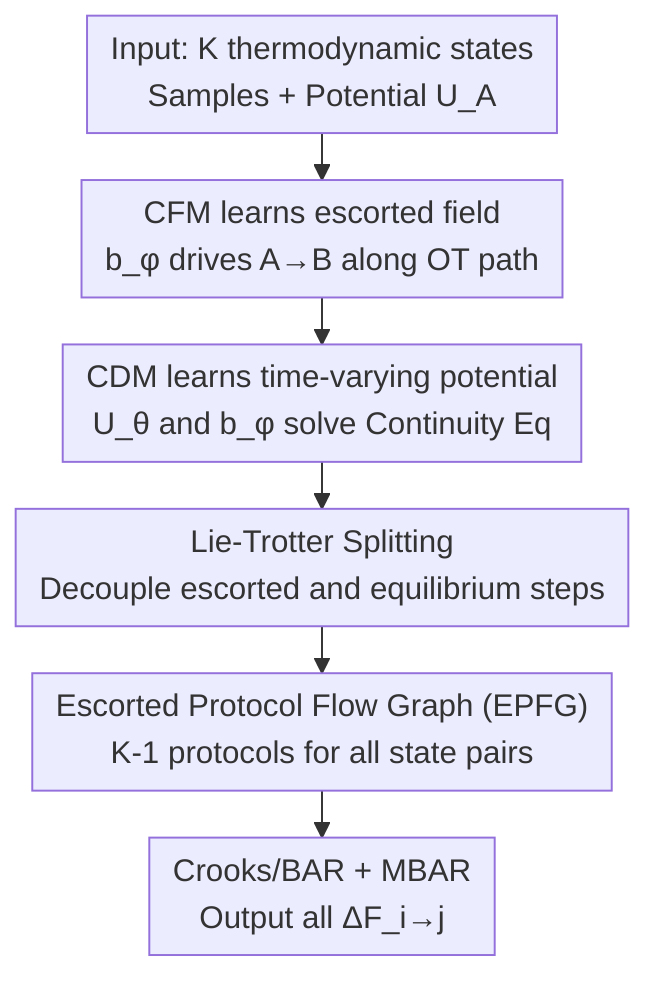

# Learning Escorted Protocols For Multistate Free-Energy Estimation

**Conference**: ICLR 2026  
**OpenReview**: [https://openreview.net/forum?id=Da8PJXp0js](https://openreview.net/forum?id=Da8PJXp0js)  
**Code**: To be confirmed  
**Area**: Physical Science Applications / Molecular Simulation / Flow Matching  
**Keywords**: Free-energy estimation, escorted protocols, conditional flow matching, Jarzynski equality, multistate MBAR

## TL;DR
This paper employs Conditional Flow Matching (CFM) alongside a proposed Conditional Density Matching (CDM) to **learn** the escorted vector field $b$ and time-varying potential $U$ for Escorted Non-Equilibrium (E-NEQ) free-energy estimation. It utilizes Lie-Trotter splitting to reduce work calculation costs and an Escorted Protocol Flow Graph (EPFG) to compress the number of protocols for multistate estimation from $O(K^2)$ to $K-1$, achieving higher accuracy than TFEP on the alanine dipeptide (ADP) six-state system.

## Background & Motivation

**Background**: In computational biochemistry, estimating the relative free-energy difference $\Delta F_{A\to B}$ between two thermodynamic states $A$ and $B$ is central to tasks such as binding affinity prediction and lead compound optimization. Mainstream non-equilibrium (NEQ) approaches are based on the Jarzynski Equality (JE): a switching protocol $U_{A\to B}(x,t)$ is defined to "transition" $A$ into $B$ over time. Samples evolve along this path and accumulate work $W$, from which the free-energy difference is recovered via $\langle e^{-\beta W}\rangle = e^{-\beta\Delta F}$.

**Limitations of Prior Work**: The variance and bias of JE estimators grow with the "excess work" $W^{ex}=\langle W\rangle-\Delta F$. At any given time, $W^{ex}_t \ge \beta^{-1}D_{KL}(\rho(x,t)\,\|\,p(x,t))$—meaning the estimation degrades as the instantaneous distribution $\rho$ lags further behind the equilibrium distribution $p$. To minimize this lag, Vaikuntanathan & Jarzynski proposed "escorted protocols": in addition to stochastic dynamics that maintain equilibrium, a deterministic escorted vector field $b(x,t)$ is added to actively push samples toward the target distribution. Theoretically, if $(b,p)$ satisfy the continuity equation $\partial_t p + \nabla\cdot(pb)=0$, a single trajectory can yield $\Delta F$ with zero variance.

**Key Challenge**: The problem is that such a pair $(b, U)$ is **extremely difficult to construct manually**. Existing neural methods (like the TFEP series) mostly learn only the deterministic mapping $b$ and discard the equilibrium-preserving stochastic dynamics, which is a special case of escorted protocols. There has been no unified framework to simultaneously and effectively learn both $b$ and $U$ such that they collaboratively satisfy the continuity equation.

**Goal**: (1) Propose a **unified learnable** framework to jointly learn the escorted vector field $b_\phi$ and time-varying potential $U_\theta$ so they approximately satisfy the continuity equation; (2) Solve practical implementation barriers—specifically the high cost of work calculation and the exponential growth of protocol numbers in multistate scenarios.

**Key Insight**: The authors observe that the search for $(b,p)$ satisfying the continuity equation in escorted protocols is structurally identical to the conclusion in Conditional Flow Matching (CFM), where the "marginal vector field and marginal distribution together solve the continuity equation." Consequently, they assign the learning of $b$ to CFM and design a dual density matching objective for learning $U$.

**Core Idea**: Use **CFM to learn the escorted field $b_\phi$ and the proposed CDM to learn the time-varying potential $U_\theta$**. These two components compensate for each other's small errors, resulting in a low-variance E-NEQ estimator that is more accurate than "vector-field-only" methods.

## Method

### Overall Architecture

The method addresses how to learn a pair of escorted protocols $(U_\theta, b_\phi)$ and efficiently use them for multistate free-energy estimation. The process follows three steps: first, use **Conditional Flow Matching** to regress the escorted vector field $b_\phi$; second, use a dual **Conditional Density Matching** to learn the corresponding time-varying potential $U_\theta$, ensuring both together solve the continuity equation; finally, during estimation, use **Lie-Trotter splitting** to decouple and reduce the cost of work calculation, and use an **Escorted Protocol Flow Graph (EPFG)** to stitch and reuse protocols between multiple states. Combined with MBAR, this provides free-energy differences for all state pairs. Bidirectional Crooks fluctuation theorem + BAR/MBAR are used to convert work samples into free-energy differences.

### Key Designs

**1. CFM + CDM: Joint Learning of Escorted Vector Field and Time-Varying Potential**

The difficulty of escorted protocols lies in finding a pair $(b, U)$ that jointly satisfy the continuity equation, which traditionally lacks an analytical solution. The authors split this into two dual regression problems. For the **escorted vector field** $b_\phi$, CFM is directly applied: by using a coupling distribution $q(z)$ and conditional vector field $v_t(x_t\mid z)$, $L_{CFM}=\mathbb{E}\big[\|v_\phi(x_t,t)-v_t(x_t\mid z)\|^2\big]$ is minimized, using Optimal Transport (OT) coupling to ensure paths are straight. CFM guarantees that the marginal vector field $v_t$ and marginal distribution $p_t$ solve the continuity equation. After rescaling with $t=st_f$ and $t_f^{-1}v_\phi(x,s)=b_\phi(x,t)$, $b_\phi$ becomes the sought escorted field.

However, the **time-varying potential** $U_\theta(x,t)$ (where $p_\theta(x,t)\propto e^{-\beta U_\theta(x,t)}$) is still unknown. The authors propose a dual density matching objective: while the ideal MLE objective $L_{DM}=\mathbb{E}_{x_t\sim p_t}[-\log p_\theta(x_t,t)]$ is intractable because $p_t$ is unknown, they use the **conditional distribution** $p_t(x_t\mid z)$ following the CFM logic:

$$L_{CDM}=\mathbb{E}_{t,\,z\sim q(z),\,x_t\sim p_t(x_t\mid z)}\big[-\log p_\theta(x_t,t)\big].$$

The key property is $\nabla_\theta L_{DM}=\nabla_\theta L_{CDM}$—meaning MLE with the conditional distribution yields the **same** learned marginal density $p_\theta^t$ as MLE with the unknown marginal. Thus, CFM learns $b$ and CDM learns $U$ as a synergistic pair. The hypothesis is that the two branches compensate for each other's errors (stochastic steps correct integration drift of the deterministic field, while deterministic steps reach regions the stochastic walker cannot), outperforming vector-field-only methods like TFEP.

**2. Lie-Trotter Splitting: Decoupling Divergence Calculation from Unstable Dynamics**

The escorted dynamics $\widehat{\mathcal{L}}_t=\mathcal{L}_t+\mathcal{E}_t$ ($\mathcal{E}_t$ is the escorted transport term) require repeatedly evaluating the divergence of the field $\nabla\cdot b(x,t)$ in the work formula. Because molecular dynamics potentials contain sharp terms like Lennard-Jones, they require extremely small global time steps $dt$ for numerical stability (e.g., $dt=10^{-8}$ for overdamped Langevin), leading to an explosion in the number of divergence evaluations.

The authors use Lie-Trotter splitting to break the combined dynamics into two independent substeps: an escorted step $x_k'=x_k+b(x_k,t_k)h$, followed by an equilibrium-preserving transition kernel $x_{k+1}\sim K_{t_k}(x_k',\cdot)$, such that $e^{h\widehat{\mathcal{L}}_t}\approx e^{h\mathcal{L}_t}e^{h\mathcal{E}_t}$. Under this splitting, a "split-version escorted Jarzynski equality" holds, where work calculation simplifies to:

$$\widehat{W}_{A\to B}(x,h)=\sum_{k=0}^{N-1}\Big(\tfrac{\partial U_{A\to B}(x_k',t_k)}{\partial t}-\beta^{-1}\nabla\cdot b(x_k,t_k)\Big)h,$$

which exactly recovers E-JE as $h\to 0$. This allows the divergence to be evaluated at a global step $h$, while the **equilibrium-preserving kernel can be sub-divided independently with much smaller steps**, decoupling divergence costs from unstable dynamics and making the estimation computationally feasible.

**3. Escorted Protocol Flow Graph (EPFG): Compressing Protocols from $O(K^2)$ to $K-1$**

To estimate free-energy differences $\{\Delta F_{i\to j}\}$ among $K$ states, the most accurate way is to provide work samples $\{W_{i\to j}\}$ for all state pairs to a self-consistent Multistate BAR (MBAR). However, training models for all pairs requires $K(K-1)/2$ protocols, which is intractable for many states. Simply training $K-1$ protocols from a central state $k$ and using the state-function property $\Delta F_{i\to j}=-\Delta F_{k\to i}+\Delta F_{k\to j}$ saves models but lacks the accuracy of MBAR.

The authors propose the EPFG: treating the $K$ states as nodes and protocols as edges, they train only $K-1$ edges originating from a center node $k$. **Non-direct edges $(i\to j)$ are generated by time-reversing and concatenating two trained protocols**: the first half follows the reverse of $k\to i$, and the second half follows the forward of $k\to j$:

$$(U_{i\to j},b_{i\to j})=\begin{cases}(U^{\theta_i}_{k\to i}(x,t_f-2t),\,-2b^{\phi_i}_{k\to i}(x,t_f-2t)) & 0\le t<\tfrac{t_f}{2}\\[2pt](U^{\theta_j}_{k\to j}(x,2t-t_f),\,2b^{\phi_j}_{k\to j}(x,2t-t_f)) & \tfrac{t_f}{2}\le t\le t_f.\end{cases}$$

This requires training only $K-1$ protocols while providing independent work samples for **all** state pairs (including concatenated ones) to MBAR, preserving MBAR's accuracy with minimum training cost. Experiments confirm that concatenated protocols (EPFG=Y) are more accurate than pure pairwise summation (EPFG=N) and even improve estimates for direct state pairs.

### Loss & Training

The escorted field $b_\phi$ is implemented using an SE(3)-equivariant Graph Neural Network with learnable time embeddings and OT coupling. The time-varying potential $U_\theta$ is parameterized by a discrete normalizing flow with conditional affine coupling layers (using negative log-probability as the potential; discrete flows are chosen over general energy models to simplify MLE training). The two branches are trained using $L_{CFM}$ and $L_{CDM}$ respectively. During estimation, $b_\phi$ is integrated via Runge-Kutta, and equilibrium-preserving steps use overdamped/underdamped Langevin or HMC, all with Metropolis-Hastings correction. The splitting operator iterates for 100 steps to accumulate work; finally, BAR/MBAR is used with the bidirectional Crooks theorem to solve for $\Delta F$.

## Key Experimental Results

Experiments are conducted on the alanine dipeptide (ADP) solvated system, which has six metastable states ($\alpha_R, \alpha_L, \alpha_D, \beta, C5, \alpha'$). 10,000 samples are collected for each state using harmonic flat-bottom constraints. Baselines include Umbrella Sampling (US) with many windows (serving as ground truth) and neural TFEP sharing the same $b_\phi$. The only difference between TFEP and E-NEQ is the inclusion of equilibrium-preserving stochastic dynamics.

### Main Results

Using state $\alpha_R$ as the reference, $\Delta F$ (kJ/mol) for direct states and MAE for all pairs are reported:

| Method | Integrator | EPFG | $\alpha_L$ | $\beta$ | $C5$ | MAE |
| :--- | :--- | :--- | :--- | :--- | :--- | :--- |
| US (Ground Truth) | - | - | 7.42 | -1.11 | 1.37 | - |
| TFEP | - | N | 8.60 | 0.77 | 2.39 | 1.17 |
| E-NEQ (Ours) | UL | N | 7.93 | 0.54 | 1.47 | 0.93 |
| E-NEQ (Ours) | UL | Y | 7.35 | 0.78 | 1.31 | **0.88** |
| E-NEQ (Ours) | OL | Y | 8.06 | 0.24 | 1.69 | **0.59** |
| E-NEQ (Ours) | HMC | Y | 7.33 | 0.50 | 1.83 | 0.95 |

E-NEQ achieves lower MAE than TFEP (1.17) across all three integrators, with the best result (OL+EPFG) at 0.59. Correlation with US ground truth shows $R^2=0.91$ and Pearson $r=0.96$ for E-NEQ, slightly better than TFEP (0.90 / 0.95). Both methods stay within the 1 kcal/mol tolerance, with most cases even within 1 kJ/mol. The $\beta$ state is a notable exception where all methods deviate from US.

### Ablation Study

| Configuration | Key Metric | Description |
| :--- | :--- | :--- |
| TFEP (No equilibrium dynamics) | MAE 1.17 | Uses only deterministic vector field |
| E-NEQ (UL, pairwise N) | MAE 0.93 | Error drops upon adding equilibrium stochastic steps |
| E-NEQ (UL, EPFG Y) | MAE 0.88 | Concatenation further improves accuracy |
| E-NEQ (OL, EPFG Y) | MAE 0.59 | Overdamped Langevin performs best |

Additionally, comparing the number of successful trajectories (max 50,000): Underdamped/Overdamped Langevin maintain 48k+ success rates across states, while HMC drops to 32,477 for the $C5$ state and is more prone to divergence during long-range concatenation.

### Key Findings
- **Equilibrium-preserving stochastic dynamics are key to E-NEQ's superiority over TFEP**: Both share the same escorted field; the only difference is the stochastic step in E-NEQ, which reduces MAE from 1.17 to 0.88-0.93, validating the "mutual compensation" hypothesis.
- **EPFG concatenation improves accuracy comprehensively**: Not only do non-direct state pairs improve, but direct pair estimates also gain from the self-consistency of MBAR—achieving better results with the same number of trajectories.
- **HMC is less stable for long ranges**: When concatenating long protocols, HMC tends to push samples into high-energy regions of the learned potential, causing divergence that MH correction cannot fix (the root cause is the deterministic field, not the stochastic step). Langevin variants are more robust.
- **Lie-Trotter splitting is a prerequisite for feasibility**: Overdamped Langevin requires a $dt=10^{-8}$ step; without splitting to decouple divergence calculations, the computational cost would be prohibitive.

## Highlights & Insights
- **Translating "escorted protocol search" into dual flow matching regressions**: While CFM for $b$ is known, the new CDM uses the same "conditional distribution instead of unknown marginal" trick to learn $U$, with a proof that their gradients match. This decomposition of a hard constraint (continuity equation) into two regressible goals is elegant and transferable to other joint field-density learning tasks.
- **EPFG time-reversal and concatenation construction**: Utilizing the physical fact that free energy is a state function to reduce complexity from $O(K^2)$ to $K-1$ without sacrificing MBAR's accuracy is a smart combination of physics and engineering.
- **Controlled comparison using the same escorted field**: By having TFEP reuse the $b_\phi$ learned by E-NEQ, the authors cleanly isolate the contribution of "equilibrium-preserving stochastic dynamics" as a single variable, reflecting rigorous experimental design.

## Limitations & Future Work
- **Verification limited to ADP toy system**: The authors admit that while ADP involves multiple metastates and challenges similar to larger systems, it is still a toy problem compared to real-world drug discovery. Scaling to larger systems is required, specifically in learning the time-varying potential $U_\theta$ more accurately (possibly leveraging scalable discrete normalizing flows).
- **Systematic deviation of the $\beta$ state**: Estimates for the $\beta$ state consistently deviate from US across all methods, which is not deeply explained.
- **Conservative choices for theoretical alignment**: The paper uses MH correction for equilibrium, fixed Runge-Kutta instead of adaptive ODE solvers, treats the continuity equation as a soft reward during training rather than a hard constraint, and only stitches EPFG during estimation. Relaxing these or adopting stronger frameworks like Schrödinger Bridge or Flow-Map could offer further improvements.

## Related Work & Insights
- **vs TFEP (Targeted Free-Energy Perturbation)**: TFEP is a special case of escorted protocols using only a deterministic invertible mapping $b$, discarding stochastic dynamics. This paper learns both $b$ and $U$ and retains stochastic steps, reducing MAE from 1.17 to 0.59 via their synergy.
- **vs FEAT (He et al., 2025)**: FEAT also parameterizes escorted protocols but uses separate protocols for forward/backward directions and ignores multistate scenarios. This paper uses a unified protocol + EPFG to reduce training cost to $K-1$ models for multistate estimation.
- **vs Traditional FEP / Thermodynamic Integration (TI)**: Traditional equilibrium methods rely on the Zwanzig equation or integration along a coupling parameter. This paper follows the non-equilibrium escorted route, using neural networks to learn the switching protocol, which fits naturally into the machine learning framework and theoretically allows estimation from a single trajectory.

## Rating
- Novelty: ⭐⭐⭐⭐⭐ First to use CFM + proposed CDM to jointly learn $(b,U)$ for escorted protocols, with EPFG to solve multistate complexity.
- Experimental Thoroughness: ⭐⭐⭐ Systematically covers six states and three integrators with clear comparisons against US/TFEP, but limited to the ADP toy system.
- Writing Quality: ⭐⭐⭐⭐ Theoretical derivation (JE→E-JE→Crooks) is progressive and well-connected to the methodology.
- Value: ⭐⭐⭐⭐ Provides a unified learnable framework and cost-reduction tools for neural non-equilibrium free-energy estimation, with potential value for binding affinity prediction.

<!-- RELATED:START -->

## Related Papers

- [\[NeurIPS 2025\] FEAT: Free Energy Estimators with Adaptive Transport](../../NeurIPS2025/physics/feat_free_energy_estimators_with_adaptive_transport.md)
- [\[ICLR 2026\] PINFDiT: Energy-Based Physics-Informed Diffusion Transformers for General-purpose Time Series Tasks](pinfdit_energy-based_physics-informed_diffusion_transformers_for_general-purpose.md)
- [\[ICLR 2026\] HSG-12M: A Large-Scale Benchmark of Spatial Multigraphs from the Energy Spectra of Non-Hermitian Crystals](hsg-12m_a_large-scale_benchmark_of_spatial_multigraphs_from_the_energy_spectra_o.md)
- [\[ICLR 2026\] Stretching Beyond the Obvious: A Gradient-Free Framework to Unveil the Hidden Landscape of Visual Invariance](stretching_beyond_the_obvious_a_gradient-free_framework_to_unveil_the_hidden_lan.md)
- [\[AAAI 2026\] Adaptive Fidelity Estimation for Quantum Programs with Graph-Guided Noise Awareness](../../AAAI2026/physics/adaptive_fidelity_estimation_for_quantum_programs_with_graph.md)

<!-- RELATED:END -->
