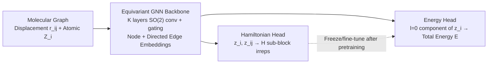

# Learning from the Electronic Structure of Molecules across the Periodic Table

**Conference**: ICLR 2026  
**OpenReview**: [https://openreview.net/forum?id=PS1YS8Wv4t](https://openreview.net/forum?id=PS1YS8Wv4t)  
**Code**: To be confirmed  
**Area**: AI for Science / Quantum Chemistry / Machine Learning Interatomic Potentials  
**Keywords**: Hamiltonian prediction, MLIP, electronic structure, equivariant GNN, pretraining, DFT  

## TL;DR
This paper introduces HELM—the first "universal" Hamiltonian matrix prediction model capable of scaling to 100+ atoms, 58 elements, and large basis sets including diffuse functions. It releases the largest molecular Hamiltonian dataset to date, OMol CSH 58k, and demonstrates that transferring shared representations from Hamiltonian pretraining to energy prediction achieves up to ~2× accuracy improvement in low-data scenarios.

## Background & Motivation
**Background**: Machine Learning Interatomic Potentials (MLIPs) approximate the Born–Oppenheimer potential energy surface by fitting energies and forces calculated via DFT. While performance scales with training data (e.g., Meta’s UMA trained on 459 million energy labels), DFT calculations for an $N$-atom system generate an $O(N^2)$ Hamiltonian matrix $H$ in addition to a single energy and $O(N)$ force labels. This matrix encodes excited states, ionization energies, electron density, and multipole moments—information far richer than forces or energies—yet this "free" data has been largely ignored for training large-scale atomic property models.

**Limitations of Prior Work**: On one hand, SOTA MLIPs remain data-constrained, but consuming more than 10 billion core-hours of DFT data makes further scaling through raw data volume increasingly impractical. On the other hand, existing Hamiltonian prediction models (e.g., PhiSNet, QHNet, SPHNet) are limited to small molecules, small basis sets, and few elements, failing to scale to the structural sizes, basis sets (including d/f orbitals), and elemental diversity required by MLIPs.

**Key Challenge**: The electronic structure information in Hamiltonian matrices is both high-volume ($O(N^2)$ vs. $O(N)$) and high-quality (physical information far exceeding forces/energy). However, its utilization is blocked by two engineering bottlenecks: **model scalability** ($O(l_{max}^6)$ complexity of tensor products at high $l_{max}$, memory explosion for large structures) and **data availability** (lack of large-scale Hamiltonian datasets with diverse elements and sizes).

**Goal**: To bridge the gap between "Hamiltonian prediction" and "universal MLIPs," providing a feasible recipe to integrate orbital interaction data from $H$ into atomic property training pipelines.

**Core Idea**: **Electronic interaction as a rich and transferable data source**. The strategy involves training a scalable equivariant backbone on Hamiltonian matrices to learn fine-grained descriptors of the atomic environment, then transferring (freezing or fine-tuning) this shared embedding space to energy prediction tasks to enable efficient learning even when energy labels are scarce.

## Method

### Overall Architecture
HELM (Hamiltonian-trained Electronic-structure Learning for Molecules) consists of a **weight-sharing feature extraction backbone** and **two independent output heads**: a Hamiltonian head to predict matrix $H$, and an energy head to predict total energy from atomic structures. The typical workflow involves pretraining the backbone on $H$, then reusing or fine-tuning its features for energy prediction.

### Key Designs

**1. Node-edge dual-prediction backbone with unidirectional edge dependence**: Unlike MLIPs that perform only per-node predictions, learning the Hamiltonian requires predicting both node (intra-atomic interaction $H_{ii}$) and directed edge (inter-atomic interaction $H_{ij}$) components. HELM, based on an equivariant message-passing GNN, initializes node/edge embeddings as multi-channel spherical harmonic coefficients (shape $(l_{max}+1)^2 \times C$). A critical structural constraint is applied: while node embeddings for layer $k+1$ are computed from node embeddings at layer $k$, **edge embeddings are computed only from the two connected nodes at the same layer** ($z^{(k+1)}_{ij} = f_{edge}([y^{(k)}_i, y^{(k)}_j], r_{ij})$). This unidirectional dependence introduces the physical prior that Coulomb electronic integrals decay with $1/r$ and allows bypassing edge updates during energy inference to save computation.

**2. Replacing full tensor products with SO(2) convolutions to tame high $l_{max}$**: Handling large basis sets with d and f orbitals requires $l_{max}$ up to 6. The $O(l_{max}^6)$ complexity of traditional full tensor products is computationally prohibitive. HELM adopts SO(2) convolutions (following Passaro & Zitnick), reducing complexity to $O(l_{max}^3)$. The Hamiltonian head is further adapted with sigmoid-gated learnable scalars for non-zero order irreps (to distinguish multiple identical orbital shells under large basis sets) and parity constraints $\delta((-1)^{\ell_1+\ell_2}, (-1)^{\ell_3})$ for diagonal blocks to compute only unique non-zero node values.

**3. Losses and reference value preprocessing for large systems/diverse elements**: Simple MAE/MSE losses fail on diverse datasets because $H$ matrix element magnitudes diverge as atomic numbers increase. Furthermore, standard MSE on components can introduce bias for rotationally equivalent edges. Borrowing the "per-element reference" concept from energy prediction, HELM scales and centers the $l=0$ components of node labels (derived from element-specific local core state energies) to flatten variance across elements. It then uses a combination of root-MSE and MSE losses that are invariant to irrep orientation, avoiding the expensive overhead of reconstructing $H$ during training.

**4. Direct energy head from node embeddings**: Although total energy can theoretically be computed from the predicted $H$, this requires reconstructing the full matrix and performing numerical integration for exchange-correlation energy, which is too slow for gradient-based force prediction or fine-tuning. HELM instead designs an energy head $E = f_E([z_i^{(K)}])$ translating $l=0$ (scalar) components through a linear transformation $w$, followed by global summation: $E = \sum_{i=1}^{N} w^\top z^{(K+1)}_{i,l=0}$.

## Key Experimental Results

### Main Results
HELM achieves SOTA performance on two public Hamiltonian benchmarks (Matrix element error $H_{err}$, unit $\times 10^{-6}$ Eh):

| Model | Water | Ethanol | Malondial. | Uracil | ∇²DFT-2k | ∇²DFT-5k | ∇²DFT-10k |
|-------|-------|---------|-----------|--------|----------|----------|-----------|
| SchNOrb | 165.4 | 187.4 | 191.1 | 227.8 | 21500 | 20700 | 20700 |
| PhiSNet | 17.59 | 12.15 | 12.32 | 10.73 | 180 | 330 | 350 |
| QHNet | 10.79 | 20.91 | 21.52 | 20.12 | 840 | 730 | 520 |
| SPHNet | 23.18 | 21.02 | 20.67 | 19.36 | – | – | – |
| **HELM** | **9.33** | **5.79** | **4.86** | **3.61** | **60.33** | **57.41** | **59.21** |

On ∇²DFT, HELM’s matrix element error is ~60 $\mu$Eh, roughly 3–5× better than previous models. Recomputing total energy from predicted $H$ reproduces reference values within 30 meV per molecule.

### Ablation Study
The impact of Hamiltonian pretraining on low-data energy prediction (∇²DFT splits, energy MAE in meV, with 95% CI):

| Split | Strategy | Train $E_{err}$ | Test $E_{err}$ |
|-------|----------|-----------|-----------|
| 2k | Direct | 97.16 | 791.02 |
| 2k | Pretrained-frozen | 217.58 | 324.64 |
| 2k | Finetuned | **76.30** | **266.23** |
| 5k | Direct | 240.63 | 592.54 |
| 5k | Finetuned | **116.52** | **199.50** |
| 10k | Direct | 285.39 | 506.80 |
| 10k | Finetuned | **176.75** | **198.40** |

On the more challenging OMol CSH 58k, the pretrained-frozen model improves test accuracy by ~1.8× over the direct model (OMol common 1k: 3631 $\rightarrow$ 2119 meV; OMol all 5k: 5976 $\rightarrow$ 3255 meV).

### Key Findings
- **Direct models overfit rapidly** with limited energy labels, while pretraining (frozen or fine-tuned) simultaneously reduces overfitting and improves test accuracy, with the largest gains observed on the smallest (2k) split.
- **UMAP visualizations** reveal that pretrained-frozen embeddings exhibit significantly more distinct clustering and better separation of under-sampled heavy elements compared to direct models. This proves that Hamiltonian data facilitates learning more refined descriptors of atomic environments.
- The authors estimate that achieving equivalent performance gains solely by stacking force/energy data would require **over an order of magnitude** more DFT calculations.

## Highlights & Insights
- **Repurposing "Waste"**: By treating the $O(N^2)$ Hamiltonian matrix—often discarded after DFT—as a supervision signal, the paper finds a leverage point for data efficiency as MLIPs approach data saturation.
- **Engineering Expansion**: The combination of SO(2) convolutions, gating, parity constraints, and reference preprocessing pushes Hamiltonian prediction from "small-molecule toys" to a scale comparable with modern universal MLIPs.
- **OMol CSH 58k Dataset**: This dataset is a major contribution, covering 58 elements (up to $Z=83$, excluding first-row transition metals and lanthanides), 10–150 atoms, large def2-TZVPD basis sets, and interaction distances up to 15 Å.
- **Representation Analysis**: The paper closes the loop by visualizing *why* pretraining works, attributing performance gains to the fine-grained atomic environment descriptors revealed in the embedding space clusters.

## Limitations & Future Work
- **Memory Ceiling**: Pretraining scale remains limited by memory; edge labels and basis set sizes grow with system size. First-row transition metals and lanthanides (requiring g-orbitals) were excluded to manage VRAM.
- **Sensitivity of Indirect Energy**: Calculating energy directly from predicted $H$ is highly sensitive to small matrix element errors, necessitating fine-tuning on high-precision energy labels.
- **Fine-tuning Trade-offs**: On OMol, fine-tuning sometimes degrades the refined representation structure if heavy element energy labels are sparse, resulting in lower gains (~1.5×) than frozen features (~1.8×).
- **Practical Accuracy Gap**: Current results are controlled low-data experiments; reaching production-level MLIP accuracy requires fine-tuning on larger portions of datasets like OMol25 and further innovation in memory handling and loss functions (e.g., eigenvalue or symmetry losses).

## Related Work & Insights
- **Equivariant GNN Lineage**: HELM follows the trajectory from PhiSNet’s full tensor products to efficiency gains via CG-coefficient sparsity (QHNet/SPHNet) and finally complexity reduction via SO(2) convolutions.
- **Universal MLIPs**: While models like MACE or UMA pretrain on massive heterogeneous data to cover the periodic table, HELM provides the missing "electronic structure signal" component.
- **Inspiration**: In any scientific computing scenario where expensive simulations produce intermediate variables (beyond just quantum chemistry), researchers should consider whether these discarded representations can serve as self-supervised/pretraining signals to enhance downstream data efficiency.

## Rating
- **Novelty**: ⭐⭐⭐⭐ Utilizing the neglected Hamiltonian matrix as a transferable pretraining signal is a fresh perspective.
- **Experimental Thoroughness**: ⭐⭐⭐⭐ Includes MD17/QM7 and ∇²DFT benchmarks, multi-strategy controlled experiments, and UMAP analysis, alongside a new dataset.
- **Writing Quality**: ⭐⭐⭐⭐ Logical flow from motivation to method; physical priors (e.g., $1/r$ decay, parity) are well-explained.
- **Value**: ⭐⭐⭐⭐ Points toward a path for breaking the "data wall" in MLIPs using electronic structure data; both the dataset and model are valuable to the community.

<!-- RELATED:START -->

## Related Papers

- [\[ICLR 2026\] Advancing Universal Deep Learning for Electronic-Structure Hamiltonian Prediction of Materials](advancing_universal_deep_learning_for_electronic-structure_hamiltonian_predictio.md)
- [\[ICLR 2026\] OXtal: An All-Atom Diffusion Model for Organic Crystal Structure Prediction](oxtal_an_all-atom_diffusion_model_for_organic_crystal_structure_prediction.md)
- [\[ICLR 2026\] MatRIS: Toward Reliable and Efficient Pretrained Machine Learning Interatomic Potentials](matris_toward_reliable_and_efficient_pretrained_machine_learning_interatomic_pot.md)
- [\[ICLR 2026\] Beyond Structure: Invariant Crystal Property Prediction with Pseudo-Particle Ray Diffraction](beyond_structure_invariant_crystal_property_prediction_with_pseudo-particle_ray_.md)
- [\[AAAI 2026\] Towards a Foundation Model for Partial Differential Equations Across Physics Domains](../../AAAI2026/physics/towards_a_foundation_model_for_partial_differential_equations_across_physics_dom.md)

<!-- RELATED:END -->
