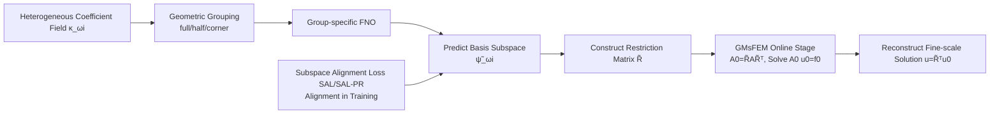

# Locally Subspace-Informed Neural Operators for Efficient Multiscale PDE Solving

**Conference**: ICLR 2026  
**OpenReview**: [https://openreview.net/forum?id=RqXxkiCYip](https://openreview.net/forum?id=RqXxkiCYip)  
**Code**: TBD  
**Area**: AI for Science / Multiscale PDE Solving  
**Keywords**: Neural Operators, GMsFEM, Multiscale Finite Element Method, Subspace Alignment Loss, High-contrast Heterogeneous Media, Operator Learning  

## TL;DR
Neural operators (FNO) are used to directly predict the **subspace** spanned by the multiscale spectral basis functions of GMsFEM. Combined with a subspace-informed loss that aligns subspaces rather than individual basis functions, this approach accelerates the most expensive offline basis function construction phase of GMsFEM by over 60x while preserving the accuracy and reliability of traditional numerical methods.

## Background & Motivation

**Background**: High-contrast and strongly heterogeneous multiscale PDEs (e.g., subsurface flow, diffusion in composite materials) are extremely common in engineering, but solving them directly on fine grids is computationally expensive. The Generalized Multiscale Finite Element Method (GMsFEM) is a mature tool for these problems—it solves local spectral eigenvalue problems on each coarse grid subdomain to construct multiscale basis functions that capture fine-scale information. It then projects the fine-grid system onto a low-dimensional coarse space for solving, significantly reducing online costs while maintaining accuracy.

**Limitations of Prior Work**: The accuracy of GMsFEM relies on the spectral basis functions constructed in the offline phase. However, solving numerous local eigenvalue problems is extremely expensive—constructing basis functions on a $100 \times 100 \times 100$ 3D grid can take tens of thousands of seconds, making the offline cost a bottleneck. On the other hand, data-driven neural operators (FNO, DeepONet, etc.), while fast in inference, often fail to capture fine local features in high-contrast heterogeneous coefficients, require massive amounts of data and large networks, and lack robustness—they can fail catastrophically when the distribution of external forces (right-hand side terms) shifts during testing.

**Key Challenge**: GMsFEM is slow but reliable (supported by rigorous numerical analysis), whereas pure neural operators are fast but unreliable. Most existing hybrid methods assume the macro-scale equation form is known and only learn effective coefficients, which does not hold in scenarios without scale separation or with high contrast.

**Goal**: To construct a solver that is both fast and accurate, using neural operators to accelerate the offline phase of GMsFEM while retaining its numerical analysis foundations.

**Core Idea**: **Instead of learning the complete PDE solution or individual basis functions, the neural operator is tasked with directly mapping the heterogeneous coefficient field to the low-dimensional subspace spanned by GMsFEM basis functions.** Because the subspace itself is smoother and lower-dimensional than individual eigenvectors, it is more data-efficient to learn. Since the final solution is still obtained via the GMsFEM online stage, the validity is guaranteed even if the subspace prediction has minor flaws, making it more robust than pure neural operators.

## Method

### Overall Architecture
GMsFEM-NO replaces the offline "solve local eigenproblems → obtain basis functions" stage of GMsFEM with a "neural operator forward pass → obtain basis subspace" stage, while the online stage follows GMsFEM exactly. During training, for the heterogeneous coefficient field $\kappa^{\omega_i}$ on each local subdomain $\omega_i$, the neural operator predicts $N_{bf}$ basis functions $\{\tilde\psi^{\omega_i}_j\}$. A subspace alignment loss aligns the predicted subspace with the true basis subspace. During inference, the predicted basis functions are extended by zero to the full domain and vectorized to form the restriction matrix $\tilde R$. The fine-grid matrix $A$ and right-hand side $b$ are projected to the coarse space as $A_0=\tilde R A\tilde R^\top$ and $f_0=\tilde R b$. After solving the coarse system $A_0 u_0 = f_0$, the fine-grid solution is reconstructed using $\tilde R^\top$.

### Key Designs

**1. Subspace Prediction instead of Basis Prediction: Focusing on "What to Learn".** The solution of GMsFEM depends only on the subspace spanned by the basis functions, not their specific representation—infinitely many sets of bases can span the same subspace. Learning individual basis functions forces the network to fit redundant information sensitive to small perturbations, such as rotation and sign degrees of freedom. This work instead lets the neural operator learn the mapping from coefficient fields to the subspace. The target is smoother and lower-dimensional (taking only basis functions corresponding to the smallest $N_{bf}=8$ eigenvalues), making it more data-efficient and stable than learning full PDE solutions or individual bases.

**2. Subspace Alignment Loss (SAL): Using Subspace Geometry instead of Pointwise Error.** The core is measuring the "overlap" between the predicted and true subspaces. Let $Q_{R_i}$ be the orthogonalized true basis and $Q_{\tilde R_i}$ be the predicted one. The loss is defined as $L_{\text{SAL}}=\mathbb{E}_i\big[N_{bf}-\|Q_{R_i}^\top Q_{\tilde R_i}\|_F^2\big]$, where the Frobenius norm term measures the overlap, reaching its maximum $N_{bf}$ when aligned. This loss is naturally invariant to rotation and sign—it only cares if the subspaces match, ignoring how the network represents the bases. The appendix provides theoretical error bounds linking subspace alignment error to solution accuracy.

**3. Projection Regularization (SAL-PR): Fine-grained Consistency in Projection.** While SAL ensures overall subspace overlap, it might ignore subtle differences after projecting vectors. A projection regularization term is added: $L_{\text{SAL-PR}}=L_{\text{SAL}}+\lambda\cdot\mathbb{E}_{i,c}\|(P_{R_i}-P_{\tilde R_i})v_i\|^2_2$, where $P_{R_i}=Q_{R_i}Q_{R_i}^\top$ is the projection matrix and $v_i=\sum_k c_k\psi^i_k$ is a random test vector ($c\sim\mathcal N(0,I)$). This measures the difference in projecting the same random vector onto the true vs. predicted subspace. This term has little impact on small grids but is significant for large problems—reducing L2 error from 1.82% to 1.72% on $250^2$ Richards equations. However, its computational cost is too high for $100^3$ scales, so pure SAL is used for massive problems.

**4. Local Subdomain Geometric Grouping + Rotation Normalization: Handling Shape and Orientation Diversity.** Local subdomains exhibit different shapes and orientations based on their relative position to coarse nodes $x_i$ (2D includes full/half/corner; 3D includes full/half/quarter/corner). Before training, input data and target bases for each subdomain are rotation-normalized to ensure consistent coarse node positions within a group. A dedicated neural operator is trained for each category. This specialization allows each network to handle only one geometric variant, significantly improving prediction accuracy. The backbone used is Factorized FNO (F-FNO), which decomposes spectral convolutions by dimension, reducing parameters from $O(LH^2M^D)$ to $O(LH^2MD)$ for scalability to deeper networks and 3D problems.

## Key Experimental Results

### Main Results: GMsFEM-NO vs. Original GMsFEM (Nearly Zero Accuracy Loss)

| Grid (Nv) | Dataset | GMsFEM L2 | GMsFEM-NO L2 | GMsFEM H1 | GMsFEM-NO H1 |
|---|---|---|---|---|---|
| 100×100 (36) | Diffusion | 1.15% | 1.06% | 11.68% | 11.57% |
| 100×100 (36) | Richards | 2.03% | 1.87% | 11.68% | 11.25% |
| 250×250 (121) | Richards | 1.79% | 1.72%(SAL-PR) | 14.57% | 14.53% |
| 50³ (216) | Diffusion | 3.07% | 3.10% | 20.72% | 20.39% |
| 100³ (729) | Richards | 2.54% | 2.57% | 17.83% | 17.91% |

GMsFEM-NO achieves accuracy almost identical to, and occasionally better than, GMsFEM across all datasets and 2D/3D grids.

### Key Speedup: Basis Construction Time

| Grid | Nv | GMsFEM (s) | GMsFEM-NO (s) | Speedup |
|---|---|---|---|---|
| 100×100 | 36 | 16.87 | 0.28 | ~60× |
| 250×250 | 121 | 210.5 | 0.31 | ~680× |
| 50³ | 216 | 935.4 | 0.84 | ~1100× |
| 100³ | 729 | 10547.2 | 1.33 | ~7900× |

The speedup ratio magnifies drastically as grid size and dimensionality increase.

### Ablation Study

| Comparison | Result |
|---|---|
| Loss Function (100², Nbf=8, Richards) | RBFL2 L2=3.46% → SAL 1.88% (1.8× gain), SAL-PR 1.87% |
| vs. Pure Neural Operators (250², Richards-9) | F-FNO 4.45% / GNOT 14.69% / Transolver++ 8.82% → GMsFEM-NO **1.60%** (2.8× lower than best NO) |
| Data Efficiency (250², Richards-8) | F-FNO error 2.44%→6.52% (from 800 to 200 samples); GMsFEM-NO only 1.82%→2.07% |
| OOD Force Terms | Pure NOs fail catastrophically on OOD right-hand sides; GMsFEM-NO remains stable as it is independent of RHS |
| Resolution Invariance | Low-res training to high-res inference shows minimal accuracy loss |

### Key Findings
- Subspace alignment loss provides consistent improvements over basis-wise L2 loss, validating the "learn subspace, not basis" design.
- The GMsFEM-NO solution is independent of the external force term, inheriting the generalization of GMsFEM—this is its fundamental advantage over pure neural operators.
- High data efficiency: performance degradation is minimal even with only 200 samples.

## Highlights & Insights
- **Capturing Invariants**: Since the solution depends on the subspace rather than the specific basis, aligning the subspace using Frobenius overlap naturally eliminates rotation/sign degrees of freedom. This is an elegant way to inject numerical structure into the learning objective.
- **Hybridizing rather than Replacing**: The neural operator only takes over the most expensive offline construction, while the online solve remains with GMsFEM. Thus, "speed" comes from learning, while "accuracy and reliability" come from numerical analysis.
- **Scaling Speedup**: From 60x to nearly 8000x, the benefit increases for larger 3D problems, directly addressing the main pain point of traditional methods.
- **Reliability as Validity**: Even if those subspace predictions are imperfect, the result is still a valid GMsFEM solution, avoiding the "black-box failure" of pure NOs.

## Limitations & Future Work
- **Unresolved Data/Training Costs**: The method amortizes offline costs over repeated simulations; there is a "break-even point" (number of inferences needed to offset training cost). It is not economical for one-off problems.
- **Grouping and Rotation**: Training multiple networks by geometry increases pipeline complexity and relies on manual subdomain classification.
- **SAL-PR Scalability**: The computational cost of the projection regularization term is prohibitive on $100^3$ grids, requiring a fallback to pure SAL, suggesting high-order constraints need better scalability.
- **Validation Scope**: Primarily validated on elliptic diffusion and steady-state Richards equations. Extension to time-dependent and multiphysics coupled PDEs requires further experimentation (preliminary results are in the appendix).

## Related Work & Insights
- **GMsFEM Spectral Methods**: The multiscale finite element framework by Efendiev et al. is the numerical foundation, providing the theory for local spectral basis construction.
- **Neural Operators**: FNO/F-FNO and DeepONet provide the operator learning backbone; F-FNO is preferred here for parameter efficiency and 3D scalability.
- **Difference from Existing Hybrid Methods**: Most ML + Numerical homogenization/upscaling methods assume the macro-scale equation is known and learn effective coefficients; Ours learns the macro-scale solution space (multiscale bases) directly.
- **Reduced Order Modeling (ROM)**: POD, DeepPOD, and PCANet learn compact solution representations and serve as efficiency baselines.
- **Insights**: Identifying the structure "solution only depends on a geometric invariant (subspace)" and designing a loss around it is a general paradigm for fusing traditional numerical analysis with deep learning—applicable to other operator learning tasks with inherent invariants.

## Rating
- Novelty: ⭐⭐⭐⭐ The combination of subspace prediction + subspace alignment loss hits the essence of "solution only depends on the subspace," distinguishing it from basis-wise learning and existing hybrid methods.
- Experimental Thoroughness: ⭐⭐⭐⭐ Covers 2D/3D, linear/nonlinear equations, various losses/baselines, data efficiency, resolution, and OOD tests. Speed and accuracy quantification is comprehensive.
- Writing Quality: ⭐⭐⭐⭐ The logic from motivation to contradiction to method is smooth. Diagrams and tables are clear, with strong theoretical support in the appendix.
- Value: ⭐⭐⭐⭐ Accelerating the GMsFEM offline bottleneck by 60–8000x while maintaining reliability has direct utility for high-contrast multiscale engineering problems like subsurface flow and composites.

<!-- RELATED:START -->

## Related Papers

- [\[ICLR 2026\] Learning Data-Efficient and Generalizable Neural Operators via Fundamental Physics Knowledge](learning_data-efficient_and_generalizable_neural_operators_via_fundamental_physi.md)
- [\[ICLR 2026\] Operator Learning with Domain Decomposition for Geometry Generalization in PDE Solving](operator_learning_with_domain_decomposition_for_geometry_generalization_in_pde_s.md)
- [\[ICLR 2026\] CFO: Learning Continuous-Time PDE Dynamics via Flow-Matched Neural Operators](cfo_learning_continuous-time_pde_dynamics_via_flow-matched_neural_operators.md)
- [\[NeurIPS 2025\] DeltaPhi: Physical States Residual Learning for Neural Operators in Data-Limited PDE Solving](../../NeurIPS2025/physics/deltaphi_physical_states_residual_learning_for_neural_operators_in_data-limited_.md)
- [\[ICLR 2026\] (U)NFV: (Un)supervised Neural Finite Volume Methods for Solving Hyperbolic PDEs](unfv_unsupervised_neural_finite_volume_methods_for_solving_hyperbolic_pdes.md)

<!-- RELATED:END -->
