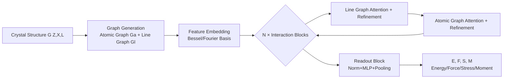

# MatRIS: Toward Reliable and Efficient Pretrained Machine Learning Interatomic Potentials

**Conference**: ICLR 2026  
**OpenReview**: [https://openreview.net/forum?id=5xBT5Ziute](https://openreview.net/forum?id=5xBT5Ziute)  
**Code**: To be confirmed  
**Area**: Machine Learning Interatomic Potentials / Computational Materials Science / Equivariant vs. Invariant Networks  
**Keywords**: MLIP, Three-body Interactions, Linear Complexity Attention, Invariant Models, Matbench-Discovery  

## TL;DR
MatRIS explicitly models three-body (bond angle) interactions using a set of "separable attention" mechanisms with $O(N)$ complexity. It demonstrates that carefully designed **invariant models** can achieve or even surpass the accuracy of computationally expensive equivariant models on benchmarks like material discovery, while reducing training costs by 6–13 times.

## Background & Motivation
**Background**: Machine Learning Interatomic Potentials (MLIP) have become mainstream tools for replacing Quantum Mechanics (QM) calculations, accelerating molecular dynamics simulations by several orders of magnitude while maintaining near-quantum accuracy. Current leaders on accuracy leaderboards (e.g., eSEN-30M, eqV2 S DeNS on Matbench-Discovery) are almost exclusively **equivariant models**—they hard-code rotational equivariance into the network through tensor products and high-order irreducible representations (irreps, degree $L$) to achieve SOTA performance.

**Limitations of Prior Work**: The cost of equivariance is extremely high. The paper identifies three cost sources: expensive equivariant operations like tensor products, large parameter counts, and long training cycles (eSEN-30M-MP / eqV2 S DeNS / SevenNet-l3i5 require 100 / 150 / 600 epochs respectively). Consequently, eSEN-30M-MP and eqV2 S DeNS consumed 335 and 228 A100 GPU-days respectively to achieve F1 scores of 0.831 / 0.815.

**Key Challenge**: Equivariance is essentially a form of implicit data augmentation. However, with the explosive growth of QM reference datasets (OMat, OMol, etc.), works like AlphaFold have shown that non-equivariant models can also learn symmetries when data is sufficient. This raises the question: **"In an era of continuously expanding data, is strict equivariance still indispensable? Can we use more compact architectures to fully mine high-dimensional atomic interactions in QM data?"**

**Goal**: Construct a compact MLIP that is both efficient (computational advantage of invariant models) and expressive (capable of capturing interactions beyond two-body), matching equivariant models on mainstream benchmarks.

**Core Idea**: The authors observe that (1) element types + two-body interactions are insufficient to distinguish graphs with different chemical properties, necessitating the inclusion of **three-body interactions**; (2) self-attention is an effective means for enhancing expressivity and scalability. **They unite these two points—explicitly modeling three-body (bond angle) interactions using linear complexity attention**, which is, to the best of their knowledge, the first MLIP to model three-body interactions with $O(N)$ attention.

## Method

### Overall Architecture
MatRIS is an invariant MLIP that adopts the dual-graph structure of "atomic graph + line graph" from CHGNet: in the atomic graph $G^a$, nodes are atoms and edges are bonds (two-body); **the line graph $G^l$ converts edges of the atomic graph into nodes, and connects two edges sharing an atom into an edge in the line graph—this edge precisely encodes the bond angle formed by three atoms (three-body interaction)**. Data passes through feature embedding, followed by $N$ stacked "graph attention + refinement" modules that pass information between the two graphs. Finally, a readout block uses automatic differentiation to derive energy, force, stress, and magnetic moments.

### Key Designs

**1. Line Graph—Atomic Graph Interaction: Explicitly representing three-body interactions.** Invariant models using only two-body scalars like distance lose angular information and suffer from limited expressivity. MatRIS transforms the atomic graph into a line graph—each node in the line graph corresponds to an edge (bond) in the atomic graph. Each edge in the line graph connects two bonds sharing the same atom, naturally encoding the bond angle $\theta_{ijk}$ of three atoms. The model updates bond/angle features on the line graph and then **passes these updated edge features back to the atomic graph**, allowing atomic features to absorb high-order information. This maintains invariance (angles are invariant under rotation and translation) while incorporating three-body interactions into message passing.

**2. Dim-wise Softmax: Independent scoring for each feature dimension.** Existing attention methods calculate a single scalar weight $a_i$ for a neighbor and use it to weight the entire $D$-dimensional value vector, implicitly assuming all dimensions are equally important. MatRIS argues this limits the model's ability to distinguish independent contributions of dimensions and instead performs **softmax independently along the feature dimension**: given input $x\in\mathbb{R}^{\text{neighbors}\times D}$,

$$\alpha_{id} = \text{Dim-wise Softmax}(x_{id}, N(i)) = \frac{\exp(x_{id})}{\sum_{k\in N(i)}\exp(x_{kd})}$$

The resulting weight matrix $\alpha\in\mathbb{R}^{\text{neighbors}\times D}$ re-normalizes neighbors across each dimension $d$, preserving dimensional independence and characterizing local structures with finer granularity. Ablations show that reverting to standard softmax increases energy MAE from 28.0 to 28.4 meV/atom.

**3. Separable Attention: Decoupling the "source" and "target" roles of atoms.** In real physical systems, interactions are directional—in polar bonds, charged environments, or defect structures, the influence of a source atom on a target atom $\neq$ the influence of the target on the source. Most methods only perform source→target aggregation, assuming symmetric information flow. MatRIS calculates two independent sets of weights for each interaction edge $e_{ij}$:

$$t_{ij}=\text{Linear}(e_{ij}),\quad ta_{ij}=\text{Dim-wise Softmax}(t_{ij}, N(i))$$
$$s_{ij}=\text{Linear}(e_{ij}),\quad sa_{ij}=\text{Dim-wise Softmax}(s_{ij}, N(j))$$

The target weight $ta_{ij}$ is normalized over the target node's neighborhood $N(i)$, characterizing how neighbors affect the central atom; the source weight $sa_{ij}$ is normalized over the source node's neighborhood $N(j)$, characterizing how the central atom affects its neighbors. The final output is a weighted sum of $ta_{ij}$, $sa_{ij}$ and the fused feature $e'_{ij}$ (concatenated $e_{ij},v_i,v_j$ followed by gMLP fusion). These mechanisms have **$O(N)$ complexity** (compared to $O(N^2)$ for full attention), ensuring scalability. Ablations show removing the source branch (reverting to unidirectional) deteriorates MAE further to 29.1.

**4. Reliable Physical Outputs and Training Augmentation.** The Readout block normalizes the last-layer node features and predicts atomic energy and magnetic moments via MLP; total energy $E$ is the sum of atomic energies. To ensure physical reliability, forces and stress are derived by differentiating energy with respect to coordinates/strain:

$$F_i = -\frac{\partial E}{\partial X_i},\qquad \sigma = \frac{1}{V}\frac{\partial E}{\partial \epsilon}$$

Training includes three augmentations: denoising pre-training (mitigating oversmoothing), magnetic moment prediction (node-level task aiding differentiation of chemical environments), and graph-level loss reduction. These progressively reduced MAE from 30.2 to 27.2 meV/atom in ablations.

## Key Experimental Results

### Main Results (Matbench-Discovery compliant, trained on MPTrj)

| Model | Params | F1↑ | Precision↑ | MAE↓ (meV/atom) | RMSD↓ |
|------|--------|-----|-----------|------|-------|
| eqV2 S DeNS | 31.2M | 0.815 | 0.771 | 0.036 | 0.0757 |
| eSEN-30M-MP | 30.1M | 0.831 | 0.804 | 0.033 | 0.0752 |
| MatRIS-S | 4.3M | 0.811 | 0.784 | 0.036 | 0.0766 |
| MatRIS-M | 6.3M | 0.833 | 0.820 | 0.033 | 0.0742 |
| **MatRIS-L** | **10.4M** | **0.847** | **0.829** | **0.031** | **0.0717** |

MatRIS-L achieves SOTA across all metrics (F1 0.847, RMSD 0.0717). MatRIS-S/M match eqV2/eSEN with significantly fewer parameters (4.3M/6.3M vs 30M+), improving training efficiency by **13.0×/6.4×**. It also achieves SOTA or near-SOTA on MatCalc, MDR phonon, and zero-shot molecular benchmarks (TorsionNet-500, MD22, ANI-1x, AIMD-Chig)—energy error on TorsionNet-500 is reduced by 22%–33% compared to the SOTA DPA3.

### Ablation Study

| Module Combination | Ef MAE (meV/atom) |
|----------|-------|
| All Modules | 28.0 |
| w/o Dim-wise Softmax | 28.4 |
| w/o Separable Attention (Unidirectional) | 29.1 |
| w/o learnable envelope | 31.3 |

| Training Method | Ef MAE (meV/atom) |
|----------|-------|
| Denoising + Moment + Graph-level loss | 27.2 |
| w/o denoising | 28.0 |
| w/o magnetic moment | 29.7 |
| None | 30.2 |

### Key Findings
- **Invariant ≥ Equivariant (given sufficient data)**: MatRIS-M matches the 30M-parameter equivariant eSEN-30M-MP with only 6.3M parameters, directly answering the necessity of equivariance—well-designed invariant models are sufficient.
- **Superior Efficiency-Accuracy Trade-off**: Inference speed is faster than eqV2/eSEN (though slower than 2-layer MACE-L due to MatRIS-S/M using 4/6 layers); it achieves an excellent balance in relaxation throughput and accuracy.
- **Cross-dataset Robustness**: Performance advantages persist when switching from MPTrj to MatPES/OAM, indicating the strength comes from the architecture rather than specific data.

## Highlights & Insights
- **Bold Perspective**: In a context where "equivariance is SOTA" is the consensus, the paper successfully argues that invariant models can match equivariant ones in the era of data expansion, providing convincing evidence with 13×/6.4× cost reductions.
- **Three-body + Linear Attention Combination**: This is a genuine innovation, unifying the ideas of "line graph encoded angles" and "attention for expressivity" using $O(N)$ complexity.
- **Physical Intuition in Separable Attention**: Splitting source/target roles based on asymmetric interactions in polar/defect structures is physically grounded rather than architectural bloat.
- **Physical Reliability**: Deriving forces/stress from energy satisfies the requirements for conservative force fields.

## Limitations & Future Work
- Inference speed is still slower than shallow MACE-L due to a higher layer count, which may not be optimal for extreme speed scenarios.
- The conclusion that "invariant models are enough" is based on large-scale datasets like MPTrj/OAM; the value of equivariant inductive biases in small-data or specific regimes is not fully explored.
- The interpretability of Dim-wise Softmax and whether it introduces noise in certain dimensions lacks deep analysis.
- The "generalization analysis" of separable attention to equivariant models is provided only as a concept without empirical verification.

## Related Work & Insights
- **Lineage of Invariant MLIPs**: SchNet/CGCNN (two-body) → DimeNet (angular via directional message passing) → GemNet (dihedrals) → DPA3 (line graphs), MatRIS continues this trajectory by integrating attention into line graphs to enhance expressivity while maintaining efficiency.
- **Equivariant MLIPs**: NequIP/MACE/EquiformerV2/eSEN use tensor products for SOTA performance but are costly; this work serves as a test of the "low-cost alternative" hypothesis.
- **Attention in MLIPs**: While Equiformer and Orb utilize attention, MatRIS differentiates itself through $O(N)$ separable attention + dim-wise normalization + explicit three-body modeling.

## Rating
- **Novelty**: ⭐⭐⭐⭐ — The combination of $O(N)$ attention for three-body modeling, separable source/target attention, and dim-wise softmax is original and challenges the necessity of equivariance.
- **Experimental Thoroughness**: ⭐⭐⭐⭐⭐ — Covers four major benchmarks, dual ablations, and efficiency analysis with a complete chain of evidence.
- **Writing Quality**: ⭐⭐⭐⭐ — Logic from motivation to method to validation is clear; some module details (refinement, gMLP) are slightly brief.
- **Value**: ⭐⭐⭐⭐⭐ — Approximating equivariant SOTA at 1/6 the cost is highly valuable for engineering in computational materials and drug discovery.

<!-- RELATED:START -->

## Related Papers

- [\[ICLR 2026\] DGNet: Discrete Green Networks for Data-Efficient Learning of Spatiotemporal PDEs](dgnet_discrete_green_networks_for_data-efficient_learning_of_spatiotemporal_pdes.md)
- [\[ICLR 2026\] Learning Data-Efficient and Generalizable Neural Operators via Fundamental Physics Knowledge](learning_data-efficient_and_generalizable_neural_operators_via_fundamental_physi.md)
- [\[NeurIPS 2025\] F-Adapter: Frequency-Adaptive Parameter-Efficient Fine-Tuning in Scientific Machine Learning](../../NeurIPS2025/physics/f-adapter_frequency-adaptive_parameter-efficient_fine-tuning_in_scientific_machi.md)
- [\[ICLR 2026\] ATOM: A Pretrained Neural Operator for Multitask Molecular Dynamics](atom_a_pretrained_neural_operator_for_multitask_molecular_dynamics.md)
- [\[ICLR 2026\] The False Promise of Zero-Shot Super-Resolution in Machine-Learned Operators](the_false_promise_of_zero-shot_super-resolution_in_machine-learned_operators.md)

<!-- RELATED:END -->
