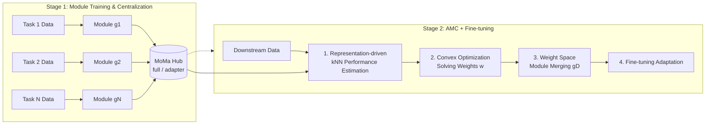

# MoMa: A Simple Modular Learning Framework for Material Property Prediction

**Conference**: ICLR 2026  
**OpenReview**: [https://openreview.net/forum?id=jiSt3M25TP](https://openreview.net/forum?id=jiSt3M25TP)  
**Code**: [https://github.com/GenSI-THUAIR/MoMa](https://github.com/GenSI-THUAIR/MoMa)  
**Area**: Material Property Prediction / Modular Deep Learning / AI for Science  
**Keywords**: Modular Learning, Material Property Prediction, Model Merging, kNN Proxy Error, Convex Optimization, Few-shot Learning  

## TL;DR
MoMa trains each material property task as an independent "module" and stores it in a Hub. For new tasks, it utilizes a training-free, representation-driven algorithm (kNN performance estimation + convex optimization for weights + weight space merging) to adaptively combine the most synergistic modules for fine-tuning. It achieves an average performance gain of 14% over the strongest baseline across 17 material tasks.

## Background & Motivation
- **Background**: Material property prediction (e.g., formation energy, band gap, phonons) is a core component of material discovery. Traditional DFT is accurate but computationally expensive. Recent deep learning methods (CGCNN, various force-field foundation models, JMP, etc.) follow the paradigm of "pre-training on Potential Energy Surface (PES) data → downstream fine-tuning," which has surpassed specialized models trained from scratch on numerous tasks.
- **Limitations of Prior Work**: The authors point out that the current paradigm overlooks two essential characteristics of material tasks—**diversity** and **disparity**. Force-field models are almost exclusively trained on PES-derived properties (force, energy, stress) and are biased toward crystalline materials, making it difficult to generalize to broader systems and properties like organic molecules, thermal, or electronic systems. Furthermore, combining highly disparate tasks into a single model for joint training leads to interference due to **knowledge conflicts** between different physical laws.
- **Key Challenge**: Covering a broad range of tasks requires multi-task training, yet multi-task training triggers inter-task interference. Avoiding interference requires task isolation, but how can dispersed knowledge be reused for new tasks after isolation? Existing module combination methods (search-based or routing-based) rely on the "downstream prediction error of the combined model" as a supervisory signal. In material scenarios, high task heterogeneity makes error signals noisy, and downstream data scarcity makes routing networks difficult to train, while loading all modules incurs explosive costs as scale increases.
- **Goal**: Design a modular framework that respects diversity and avoids heterogeneity interference, with a combination process that is data-driven, efficient, and scalable, without relying on manual priors or expensive exhaustive searches.
- **Core Idea**: **Isolate First, Combine Later**—encapsulate each high-resource task as an independent module to avoid interference (addressing disparity), and adaptively combine synergistic modules to reuse knowledge for downstream tasks (addressing diversity). The key innovation is replacing unstable "error supervision" with a **training-free, representation-driven** combination algorithm named AMC.

## Method

### Overall Architecture
MoMa consists of two stages: **(1) Module Training & Centralization**—training a specialized module for each high-resource material task using a pre-trained backbone (defaulting to JMP) as initialization and storing it in the MoMa Hub. **(2) Adaptive Module Combination (AMC) & Fine-tuning**—given a downstream task, a training-free algorithm estimates the fitness of each module, solves for combination weights, merges customized modules in the weight space, and finally fine-tunes for adaptation.

### Key Designs

**1. Module Training & Centralization: Encapsulating tasks into reusable, privacy-preserving modules.** MoMa uses a pre-trained backbone encoder $f$ as the uniform initialization for each module, making the framework backbone-agnostic and enabling smooth replacement. Two parameterizations are provided: **full module**, which uses the entire network's fine-tuned weights as the module $g_i=\theta^i_f$, offering the best performance; and **adapter module**, which inserts adapter layers between per-layer blocks and updates only the adapters while freezing the backbone $g_i=\Delta^i_f$. The latter trades a small amount of performance for significant VRAM reduction, suitable for compute-limited scenarios. All modules are aggregated into a central repository $H=\{g_1,\dots,g_N\}$, i.e., the MoMa Hub, which currently covers 18 material tasks (thermal/electronic/mechanical properties) from Matminer with >10,000 data points. Since modules store weights rather than raw data, this design naturally **protects proprietary data**, allowing the community to contribute new modules without leaking private data.

**2. Representation-driven Performance Estimation: Avoiding unstable error supervision.** AMC does not rely on the "prediction error of the combined model" (which is noisy and under-supervised in material scenarios due to high heterogeneity). Instead, it first independently evaluates the intrinsic quality of each module's representation space. The intuition is that a good module aligned with the task will map materials with similar properties to adjacent points in the embedding space. Formally, for each module $g_j$, downstream training data is encoded into representations $X^j$, and leave-one-out kNN label propagation is performed to obtain predictions for each sample $\hat{y}^j_i=\sum_{k\in N_i}\frac{f_d(x^j_i,x^j_k)}{Z^j_i}y_k$, where $f_d$ is the exponential cosine similarity. kNN is chosen because it directly probes the local geometry of the representation space without introducing learnable parameters, strictly adhering to the "training-free" principle and resisting overfitting on data-scarce tasks. Experiments show that this kNN proxy error is strongly positively correlated with the true fine-tuned MAE (Pearson $r>0.6$).

**3. Training-free Weight Optimization: Solving for global optima via ensemble proxy error.** After obtaining kNN predictions $\{\hat{y}^j\}$ for each module, the goal is to find weights $w\in\mathbb{R}^N$ to combine the modules. Since directly minimizing the fine-tuned validation error is infeasible due to combinatorial explosion, the "weighted ensemble prediction (pre-fine-tuning)" error is used as a **proxy error**: $E_D(w)=\frac{1}{M}\lVert\sum_j w_j\hat{y}^j-y\rVert_2^2$, with constraints $\sum_j w_j=1,\ w_j\geq0$. Because both the objective and the feasible region are convex, the problem has a global optimal solution that can be reliably found by standard solvers without learnable parameters, gradient updates, or hyperparameter tuning. The authors provide a risk analysis in the appendix proving that minimizing this proxy error bounds the risk of the fine-tuned model.

**4. Weight Space Module Merging: Ensuring validity through linear mode connectivity.** Once the optimal weights $w^*$ are obtained, MoMa merges them directly in the weight space to form a single customized module $g_D=\sum_j w^*_j g_j$ (inspired by model merging / Model Soup). This averaging is effective due to **linear mode connectivity**: since all modules originate from the same pre-trained initialization, they remain compatible in parameter structure despite task-specific divergence. Thus, the merged module serves as a stable, well-conditioned initialization for downstream fine-tuning. Finally, a task-specific head is attached to $g_D$, and it is fine-tuned on downstream data until convergence. The entire AMC process requires only one forward pass for embeddings + lightweight kNN + convex optimization, converging within 30 seconds for the largest datasets.

## Key Experimental Results

### Main Results
On 17 low-data material property prediction tasks (Matminer, 5 splits × 5 seeds), reporting MAE and average rank:

| Method | Average Rank | Description |
|------|------|------|
| CGCNN | 6.88 | Classic without pre-training |
| MoE-(18) | 4.71 | Mixture-of-Experts with CGCNN |
| UMA | 4.53 | Universal Atomistic Foundation Model (Force Field) |
| JMP-MT | 4.53 | 18-task multi-task pre-training + fine-tuning |
| JMP-FT | 3.12 | Direct JMP fine-tuning, strongest non-modular baseline |
| **MoMa (Adapter)** | 2.59 | Parameter-efficient version |
| **MoMa (Full)** | **1.35** | Optimal in 14/17; combined variants optimal in 16/17 |

Compared to JMP-FT, MoMa (Full) performs better on 14 tasks with an average **Gain** of **14.0%**. Compared to JMP-MT, it is superior in 16/17 tasks with an average lead of **24.8%**, validating the value of modular isolation in alleviating task interference. JMP-MT lagging behind JMP-FT further confirms the presence of knowledge conflicts in multi-task training.

### Ablation Study
Breakdown of AMC (based on MoMa-Full) (increase in average test MAE; higher indicates greater importance):

| Ablated Variant | Tasks worse than AMC | Avg. MAE Increase |
|------|------|------|
| Select Average (Uniformly average selected) | 13/17 | +11.0% |
| All Average (Model Soup) | 15/17 | +18.0% |
| Random Selection (Same number of random modules) | 15/17 | +20.2% |

Comparing AMC to other combination paradigms: it outperforms LoRAHub (search-based), JMP-(18) (routing-based), and Softmax Weighting (heuristic) in 15/17, 17/17, and 12/17 tasks respectively, reducing average MAE by **21.8% / 15.5% / 13.7%**.

### Key Findings
- **Greater Advantage in Few-shot**: Under 10-shot / 100-shot / full data, normalized MAEs are 0.5503 / 0.2990 / 0.1871 for MoMa vs. 0.7003 / 0.4076 / 0.2217 for JMP-FT. The lead of MoMa increases as data decreases (margin expanding from 0.03 to 0.15), fitting the label-scarce reality of material science.
- **Scalable Modules**: As the Hub expands from 5→10→18→30 modules, the average normalized MAE across 17 tasks decreases monotonically from 0.2040 to 0.1759 with no signs of saturation; adding 12 QM9 molecular modules further reduces MAE by 1.7% (11.8% for MP Phonons).
- **Cross-architecture Consistency**: When switched to the non-equivariant, simpler Orb-v2 (GNS) backbone, MoMa remains superior in 13/17 tasks with an average improvement of 6.1%, showing that the effect is not tied to a specific backbone.
- **Interpretable AMC Weights**: The optimized weights reveal relationships between material properties, providing scientific insights.

## Highlights & Insights
- **"Isolate then Combine" Paradigm Shift**: It decouples the seemingly contradictory requirements of disparity and diversity—isolated training avoids interference, while adaptive combination enables knowledge reuse.
- **Representation Geometry instead of Error Supervision**: The core insight of AMC is that prediction error signals are unreliable for heterogeneous material tasks; using single-module kNN proxy errors instead is training-free and robust against overfitting, backed by both theoretical risk bounds and strong empirical correlation.
- **Global Optimality via Convex Optimization**: Formulating weight selection as a convex constrained problem avoids the instability and high cost of search-based or routing-based methods, converging in 30 seconds while being naturally scalable.
- **Privacy-preserving Community Vision**: As modules store weights rather than data, proprietary data owners can contribute modules, positioning MoMa as an open platform for the "modular distribution" of material knowledge.

## Limitations & Future Work
- The Hub currently features only 18 (+12 QM9) tasks. While scalability is demonstrated, "broad spectrum coverage" is still distant, and the stability of AMC under massive scales requires further verification.
- Weight space merging relies on the linear mode connectivity assumption (all modules sharing an initialization). If heterogeneous backbones or differently initialized modules are introduced, the effectiveness of merging may be compromised.
- While the correlation between kNN proxy error and fine-tuned performance is strong ($r>0.6$), it is not perfect; individual tasks might misidentify the optimal combination.
- The full module performs best but storage and loading costs grow linearly with the number of modules. The adapter version saves memory but loses performance, requiring further optimization of the storage-performance trade-off for large-scale deployment.
- Evaluations are concentrated on Matminer low-data regression tasks; applicability to classification, generative, or more complex multi-modal material tasks is yet to be explored.

## Related Work & Insights
- **Material Property Prediction**: CGCNN uses crystal graphs; foundation models (MACE, Orb, UMA, etc.) pre-train on massive PES data; JMP excels in cross-domain pre-training across molecules and crystals. MoMa "modularizes" this backbone knowledge for superior combination compared to direct fine-tuning.
- **Modular Deep Learning**: MoE, Adapters, and LoRA achieve specialization and reuse through combined parameter modules. Existing combination methods rely on search-based (LoRAHub, AKiba) or routing-based (Muqeeth, Lu) approaches that depend on downstream prediction errors—MoMa demonstrates their failure in material scenarios and proposes a representation-driven alternative.
- **Model Merging**: Model Soup, Task Arithmetic, and DARE merge models in the weight space based on linear mode connectivity—MoMa applies this specifically to material module combination.
- **Insight**: In any field with "high task heterogeneity + downstream data scarcity" (not limited to materials), using proxy errors of single-module representation quality combined with convex optimization for module selection may be a more stable paradigm than error-based supervision.

## Rating
- **Novelty**: ⭐⭐⭐⭐ Introduces modular learning to material property prediction and replaces mainstream error-supervised combination with a training-free, representation-driven AMC. The logic is clear and theoretically supported; although individual components (kNN, convex optimization, merging) are not new, they are combined effectively.
- **Experimental Thoroughness**: ⭐⭐⭐⭐⭐ 17 tasks × 5 splits × 5 seeds, including main results, fine-grained ablation, paradigm comparisons, cross-architecture, few-shot, Hub expansion, and weight interpretability. High coverage and rigor.
- **Writing Quality**: ⭐⭐⭐⭐ Clear mapping between motivation (diversity/disparity) and methodology. Comprehensive charts and well-explained formulas/intuition.
- **Value**: ⭐⭐⭐⭐ 14% average gain + strong few-shot performance + privacy-preserving community vision provides practical momentum for AI for materials. Open sourcing further lowers the barrier to adoption.

<!-- RELATED:START -->

## Related Papers

- [\[ICLR 2026\] Beyond Structure: Invariant Crystal Property Prediction with Pseudo-Particle Ray Diffraction](beyond_structure_invariant_crystal_property_prediction_with_pseudo-particle_ray_.md)
- [\[ICLR 2026\] Advancing Universal Deep Learning for Electronic-Structure Hamiltonian Prediction of Materials](advancing_universal_deep_learning_for_electronic-structure_hamiltonian_predictio.md)
- [\[ICLR 2026\] OXtal: An All-Atom Diffusion Model for Organic Crystal Structure Prediction](oxtal_an_all-atom_diffusion_model_for_organic_crystal_structure_prediction.md)
- [\[ICLR 2026\] From Cheap Geometry to Expensive Physics: A Physics-agnostic Pretraining Framework for Neural Operators](from_cheap_geometry_to_expensive_physics_a_physics-agnostic_pretraining_framewor.md)
- [\[ICLR 2026\] Stretching Beyond the Obvious: A Gradient-Free Framework to Unveil the Hidden Landscape of Visual Invariance](stretching_beyond_the_obvious_a_gradient-free_framework_to_unveil_the_hidden_lan.md)

<!-- RELATED:END -->
