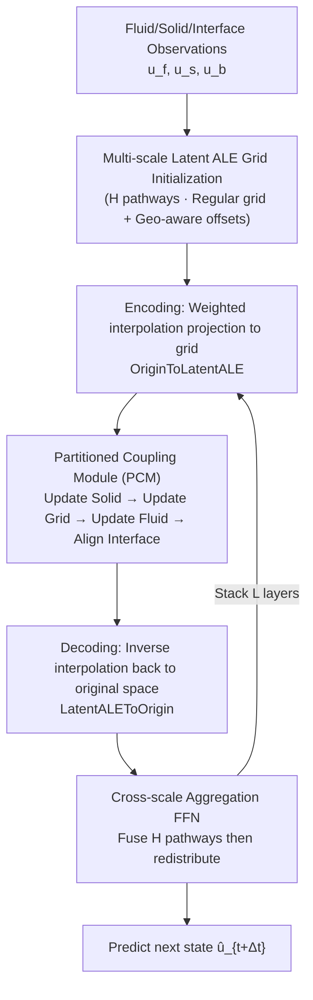

# Neural Latent Arbitrary Lagrangian-Eulerian Grids for Fluid-Solid Interaction

**Conference**: ICLR 2026  
**OpenReview**: [https://openreview.net/forum?id=jKeOsMdMe5](https://openreview.net/forum?id=jKeOsMdMe5)  
**Code**: [https://github.com/therontau0054/Fisale](https://github.com/therontau0054/Fisale)  
**Area**: Scientific Computing / Physics Simulation (AI for Science · Fluid-Solid Interaction)  
**Keywords**: Fluid-Solid Interaction (FSI), Arbitrary Lagrangian-Eulerian, Partitioned Coupling, Neural Operator, Multi-scale Latent Space Grid  

## TL;DR
Fisale integrates the classical numerical ALE (Arbitrary Lagrangian-Eulerian) grids and partitioned coupling algorithms into neural networks. It uses multi-scale "latent ALE grids" to provide a unified geometry-aware representation for fluids, solids, and coupling interfaces. By decomposing the bidirectional FSI into four iterative sub-steps via the Partitioned Coupling Module (PCM)—"update solid → update grid → update fluid → align interface"—it achieves SOTA performance on three realistic 2D/3D bidirectional FSI scenarios.

## Background & Motivation
**Background**: Fluid-Solid Interaction (FSI) describes the strong coupling where solids move/deform under fluid forces while simultaneously altering the fluid pressure and velocity fields. This is ubiquitous in scenarios like heart valves, wing aerodynamics, and civil structures. Traditional numerical solvers discretize the problem using Immersed Boundary Methods (IBM) or ALE methods with monolithic or partitioned iterations, but they are computationally expensive, mesh-dependent, and prone to stability issues. Deep learning as a PDE solver has emerged recently, offering inference speeds much faster than traditional solvers after training.

**Limitations of Prior Work**: Most deep learning FSI methods only handle **unidirectional FSI**, treating the solid as a rigid, stationary internal boundary (e.g., treating a wing as an undeformable fixed wall) and solving only the fluid domain, which greatly simplifies the coupling. Real wings deform significantly under aerodynamic loads, creating dynamic and complex interfaces. Among the few works handling **bidirectional FSI**, GNN-based simulators use "stateless/undifferentiated" message passing, making it hard to distinguish intra-domain from inter-domain information, while local receptive fields lack global modeling. The closely related CoDA-NO splits inputs along physical variable channels and uses codomain attention for global mapping, but this remains a **monolithic perspective** that lacks explicit handling of dynamic interfaces caused by solid deformation.

**Key Challenge**: Existing neural operators generally model using a "monolithic, undifferentiated" approach, failing to simultaneously learn the distinct behaviors of fluid and solid domains along with their complex bidirectional dependencies. Consequently, bidirectional FSI remains under-explored.

**Goal**: To propose a pure data-driven framework capable of characterizing the evolution of solids and fluids separately alongside their complex coupling interactions.

**Core Idea**: **(1) Treat the coupling interface as a first-class citizen**, explicitly modeling it as an independent component alongside solid and fluid domains; **(2) Leverage ALE principles** using a grid decoupled from both material and spatial frames to provide a unified representation for heterogeneous domains, termed the "Latent ALE Grid"; **(3) Borrow from partitioned coupling algorithms** using a Partitioned Coupling Module (PCM) to decompose monolithic non-linear updates into structured sub-steps to iteratively capture non-linear interdependencies.

## Method

### Overall Architecture
Fisale consists of $H$ parallel "latent ALE grid" pathways (corresponding to different spatial scales). Each pathway begins with ALE grid initialization for a unified representation of fluid/solid/interface, followed by $L$ stacked processors. Each processor contains a sequence of three steps: encoding (projecting) raw physical quantities onto the latent ALE grid → executing the Partitioned Coupling Module (PCM) on the grid → decoding back to the original space. After each layer, an aggregation module (FFN) concatenates and fuses features from all pathways to redistribute them, achieving cross-scale communication.

### Key Designs

**1. Explicit Interface Modeling: Elevating the interface to a first-class component.** Instead of treating the fluid-solid interface as an implicit constraint, Fisale defines it as a third explicit component $u_b=[g_b, q_b]$ alongside solids $u_s$ and fluids $u_f$, satisfying $C_f+C_s=C_b$ and $N_f+N_s+N_b=N$. This is the cognitive prerequisite for subsequent designs: because the interface is isolated, the model can specifically allocate capacity to regions with high deformation and dynamic movement. Ablations show overall error increases by 28.68% without explicit interfaces, as they are the focal points of solid-fluid interaction.

**2. Geometry-aware Latent ALE Grid Initialization.** A regular Cartesian grid $a\in\mathbb{R}^{M\times d}$ is uniformly sampled in a normalized $[-3.5,3.5]^d$ interval (covering 99.95% of input points via the $3\sigma$ rule), decoupling spatial topology from specific geometry. Geometry-aware offsets then "pull" these nodes toward regions of interest. For each grid node $a_i$, direction vectors to sampling points in each domain are calculated, passed through a linear layer, and weighted by a normalized radial kernel (assigning higher weights to nearby points). For instance, the fluid's offset contribution is:
$$\Delta_f(a_i)=\sum_{j=1}^{N_f}\frac{\exp(\text{Linear}(-\|a_i-g_{f_j}\|_2))}{\sum_{j}\exp(\text{Linear}(-\|a_i-g_{f_j}\|_2))}(g_{f_j}-a_i)$$
Offsets from the three domains are summed $\Delta(a)=\Delta_s+\Delta_f+\Delta_b$, and the grid is projected via $\hat{g}_a=\text{Linear}(a+\Delta(a))$ with edges built via k-NN $E=\text{kNN}(g_a)$. Spatial decay of the kernel ensures smooth updates in distant regions, maintaining grid quality. It is called an ALE grid because it moves independently during the solution, neither following material points nor fixed in space, representing a middle ground between Lagrangian and Eulerian perspectives. Multi-scale grids are constructed in parallel simply by varying node count $M$.

**3. Attention-based Physical Quantity Encoding/Decoding.** Before coupling, heterogeneous domain quantities must be projected onto a unified grid. Encoding uses attention-like weighted interpolation: using grid $Q=\text{Linear}(g_a)$ as query and quantities $K=\text{Linear}(x_f)$ as key, weights $w_f=QK^T$ yield projection $p_f=\text{Softmax}(w_f)x_f$. Solid and interface features are handled similarly, resulting in grid nodes that **simultaneously carry fluid, solid, and interface features** as tuples $\{g_a,p_s,p_f,p_b\}$. Decoding uses a transposed Softmax $\hat{x}_f=\text{Softmax}(w_f^T)\hat{p}_f$ to ensure weights sum to 1 before cross-scale fusion.

**4. Partitioned Coupling Module (PCM): Decomposing the monolithic update into four sub-steps.** PCM follows the four-step loop of classical partitioned algorithms using sequential attention: **① Update Solid**: Cross-attention uses queries $Q=\text{Linear}(\text{Concat}(p_s+g_a, p_b+g_a))$ restricted to solid+interface, while keys/values cover the whole system. Linear attention $\tilde{Q}(\tilde{K}^TV\cdot D^{-1})$ is used for efficiency, with $g_a$ as positional encoding. **② Update Grid Coordinates**: A velocity-based Laplacian smoothing $\nabla\cdot(\gamma\nabla v_g)=0$ is used, which discretizes to local message passing. $\gamma\in[0,1]$ is learned, and $\hat{g}_a\leftarrow g_a+\Delta t\cdot v_g$ is updated explicitly followed by geometric smoothing. **③ Update Fluid**: Symmetrically to the solid update, fluid and interface features are updated on the new grid $g_a'$. **④ Align Interface**: Self-attention aligns and reconciles inconsistencies between the three domains at the interface. Ablations indicate that **update order has minimal impact on performance** due to cross-layer compensation in the stacked architecture.

## Key Experimental Results

Experiments cover three realistic 2D/3D FSI scenarios comparing against 10+ advanced solvers (GeoFNO, GINO, CoDA-NO, LSM, etc.) with aligned parameters, trained on an RTX 3090.

### Main Results

**Structure Oscillation (FLUSTRUK-A, 2D Single-step Prediction, Relative L2 ↓)**

| Model | Solid | Fluid | Interface | Mean ↓ |
|---|---|---|---|---|
| Geo-FNO | 0.0003 | 0.0387 | 0.0074 | 0.0155 |
| CoDA-NO | 0.0005 | 0.0703 | 0.0075 | 0.0261 |
| Transolver | 0.0004 | 0.0265 | 0.0075 | 0.0115 |
| AMG (Runner-up) | 0.0004 | 0.0211 | 0.0051 | 0.0089 |
| **Fisale** | **0.0003** | **0.0148** | **0.0047** | **0.0066** |

**Venous Valve (2D Autoregressive Simulation, RMSE-all ↓, Selected)**

| Model | Solid-Geo | Solid-Stress | Fluid-Vel(x) | Interface-Geo |
|---|---|---|---|---|
| Transolver | 0.3262 | 3055.56 | 0.0901 | 0.3432 |
| CoDA-NO | 0.6843 | 4385.24 | 0.1713 | 0.7806 |
| **Fisale** | **0.2794** | **2658.59** | **0.0768** | **0.2565** |

**Flexible Wing (3D Steady-state Inference, Relative L2 ↓)**

| Model | Solid | Fluid | Interface | Mean ↓ |
|---|---|---|---|---|
| GNOT | 0.0081 | 0.0558 | 0.0227 | 0.0289 |
| Transolver (Runner-up) | 0.0051 | 0.0200 | 0.0242 | 0.0164 |
| **Fisale** | **0.0042** | **0.0155** | **0.0211** | **0.0136** |

Fisale leads across all domains in all three tasks, with particularly strong advantages in fluid modeling. In OOD tests (training Re ∈ {200, 400, 2000}, testing Re = 4000), Fisale achieves 0.0637 error, outperforming AMG (0.0696).

### Ablation Study (On Flexible Wing task, Mean Relative L2 ↓)

| Setting | Mean ↓ | Gain |
|---|---|---|
| **Fisale (Full)** | **0.0136** | - |
| w/o Explicit Interface Component | 0.0175 | +28.68% |
| PCM replaced with simple Attention | 0.0149 | +9.56% |
| PCM order (6 permutations) | 0.0134~0.0139 | Negligible change |

### Key Findings
- **Explicit interfaces provide the greatest gain**: Dropping them results in a 28.68% degradation, confirming that elevating the interface to a first-class citizen is central.
- **PCM is order-robust**: Performance is consistent across six update permutations, showing the stacked architecture compensates for local ordering, making PCM a flexible framework.
- **Robustness in large-scale scenarios**: In the 3D Flexible Wing task (35k+ nodes), multiple baselines fail (dense fluid nodes overwhelm solid information), whereas Fisale avoids information drowning through domain-separated modeling.
- **Long-term stability**: In the autoregressive Venous Valve task, explicit interfaces and unified representations maintain solid geometric consistency during long rollouts.

## Highlights & Insights
- **Structural Transfer from Numerical Methods**: Instead of vague "inspiration," the work systematically maps ALE grid motion, partitioned coupling steps, and Laplacian discrete forms to learnable modules (Latent ALE / PCM / Message Passing). This "classical algorithm as inductive bias" approach is highly interpretable.
- **Interface as a First-Class Citizen**: By explicitly isolating the interface, the model directly captures the regions with the strongest bidirectional interactions, as validated by ablation data.
- **Unified Latent Nodes with Multi-domain Features**: Each grid node holds fluid, solid, and interface features, building cross-domain interaction directly into the representation level and avoiding the "undifferentiated" message-passing drawbacks of GNNs.
- **Multi-scale via Node Count**: The ability to construct multi-resolution grids simply by changing $M$ within the same mechanism is elegant.

## Limitations & Future Work
- **Domain-Specific Validation**: Evaluations are currently focused on FSI; generalizability to other multiphysics (thermo-fluid-solid, MHD) is not yet verified.
- **Hyperparameter Sensitivity in Grid Initialization**: Parameters like sampling intervals, node count $M$, and k-NN's $k$ require manual tuning; multi-scale pathway design remains empirical.
- **Autoregressive Error Accumulation**: While more stable than baselines, the magnitude of RMSE in stress fields shows cumulative drift during long rollouts, lacking hard physical constraints (e.g., conservation laws).
- **Scalability**: While 35k points were handled, scalability to industrial-grade millions of mesh points or 3D large deformation contact remains to be seen.

## Related Work & Insights
- **Hybrid Solvers vs. Data-driven**: Fisale is purely data-driven, bypassing traditional solvers entirely.
- **ROM and PINNs**: Unlike Reduced Order Models (ROM) relying on low-dimensional manifolds or PINNs enforcing equations in loss, Fisale relies on structural inductive bias.
- **Neural Operators and GNNs**: While CoDA-NO uses codomain attention, it maintains a monolithic view. GNNs like MeshGraphNet use local connectivity. Fisale's insight is that for problems with mature numerical structures (like FSI), explicitly encoding those structures (partitioning, ALE grids) is more effective than using generic operators.

## Rating
- **Novelty**: ⭐⭐⭐⭐ Systematically transfers ALE and partitioned coupling logic into NNs with the first-class interface component; clear design linked to classical theory.
- **Experimental Thoroughness**: ⭐⭐⭐⭐ Covers 2D/3D scenarios, 10+ baselines, OOD tests, and comprehensive ablations. Limited only by being focused purely on FSI.
- **Writing Quality**: ⭐⭐⭐⭐ Clearly explains the mapping from numerical methods to neural modules with good notation and diagrams.
- **Value**: ⭐⭐⭐⭐ Provides a paradigm for data-driven bidirectional FSI modeling; the "algorithm as bias" approach is highly valuable for AI4Science.

<!-- RELATED:START -->

## Related Papers

- [\[ICLR 2026\] $\partial^\infty$-Grid: A Neural Differential Equation Solver with Differentiable Feature Grids](boldsymbolpartialinfty-grid_a_neural_differential_equation_solver_with_different.md)
- [\[ICML 2026\] A Call to Lagrangian Action: Learning Population Mechanics from Temporal Snapshots](../../ICML2026/physics/a_call_to_lagrangian_action_learning_population_mechanics_from_temporal_snapshot.md)
- [\[ICLR 2026\] LD-EnSF: Synergizing Latent Dynamics with Ensemble Score Filters for Fast Data Assimilation with Sparse Observations](ld-ensf_synergizing_latent_dynamics_with_ensemble_score_filters_for_fast_data_as.md)
- [\[NeurIPS 2025\] Simulation-Based Inference for Neutrino Interaction Model Parameter Tuning](../../NeurIPS2025/physics/simulation-based_inference_for_neutrino_interaction_model_parameter_tuning.md)
- [\[ICML 2026\] Quantum latent distributions in deep generative models](../../ICML2026/physics/quantum_latent_distributions_in_deep_generative_models.md)

<!-- RELATED:END -->
