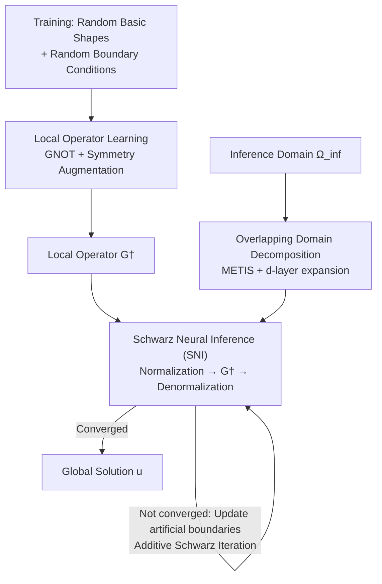

# Operator Learning with Domain Decomposition for Geometry Generalization in PDE Solving

**Conference**: ICLR 2026  
**OpenReview**: [https://openreview.net/forum?id=IxAnL4PRsg](https://openreview.net/forum?id=IxAnL4PRsg)  
**Code**: https://github.com/questionstorer/sni  
**Area**: AI4Science / PDE Solving  
**Keywords**: Neural Operator, Domain Decomposition, Geometry Generalization, Schwarz Method, Data Efficiency

## TL;DR
This paper combines the classical Domain Decomposition Method (DDM) with neural operators to propose a "local-to-global" framework. A local neural operator is trained only on randomly generated basic shapes (simple polygons). During inference, an arbitrary geometric domain is partitioned into small subdomains, solved domain-by-domain, and stitched using additive Schwarz iterations (termed Schwarz Neural Inference, SNI). This reduces the relative error on completely unseen geometries from 20%~167% (direct inference) to single digits.

## Background & Motivation
**Background**: Neural operators (FNO, DeepONet, GNOT, etc.) learn the mapping from input functions to solutions of PDEs as a network. Solving requires only one forward pass, which is significantly faster than traditional FEM/FDM solvers.

**Limitations of Prior Work**: Neural operators are purely data-driven, creating a "chicken and egg" problem: training requires large amounts of data from expensive classical solvers, while neural operators are intended to bypass them. More critically, they suffer from **poor geometric generalization**. The domain shapes seen during training must be similar to those at inference; once a novel geometry deviates from the training distribution, accuracy collapses. Existing methods like coordinate representation only handle "similar-looking" domains, and Lie Point Symmetry Data Augmentation (LPSDA) primarily addresses data volume rather than geometric extrapolation.

**Key Challenge**: The generalization radius of neural operators is strictly limited by the distribution of training geometries, whereas real-world industrial geometries are infinitely varied and impossible to exhaust during training.

**Goal**: To enable a neural operator **trained only on simple basic shapes** to solve PDEs on arbitrary complex geometries without requiring new data or retraining for the novel geometries.

**Key Insight**: The authors adopt the mature domain decomposition concept from numerical analysis: any complex domain can be partitioned into a set of small, simple subdomains. If a neural operator generalizes well on these "basic shapes," the global solution can be approximated by stitching local solutions.

**Core Idea**: Replace "direct global learning on complex geometries" with "local operator learning on basic shapes + classical Schwarz iterative stitching," transforming the geometric generalization challenge into controllable local generalization and convergent iterative stitching.

## Method

### Overall Architecture
The framework consists of two stages. The **training stage** focuses on making the neural operator learn to solve local boundary value problems on various "basic shapes." The authors randomly generate simple polygons, apply random boundary conditions, and calculate local solutions using classical solvers. Combined with symmetry-based data augmentation, a local operator $G^\dagger$ is trained. The **inference stage** handles an arbitrary complex domain $\Omega_{\text{inf}}$: it is first partitioned into overlapping subdomains using graph partitioning, where each subdomain shape is close to the basic shapes used in training. $G^\dagger$ is then called to obtain local solutions, and additive Schwarz iterations update values on artificial boundaries to stitch local solutions into a global one until convergence. This algorithm is named Schwarz Neural Inference (SNI).

### Key Designs

**1. Basic Shape Selection and Data Generation: Compressing "Arbitrary Geometry" into an Enumerable Training Distribution**

Since arbitrary shapes cannot be explicitly enumerated, "basic shapes" are selected as building blocks. These shapes must be **sampling-feasible** and provide **complete coverage** (flexible enough to compose any discrete planar domain). The authors chose the space $P_s(n)$ of simple polygons with up to $n$ vertices. To handle boundary conditions, polygons are randomly split into connected components for Dirichlet and Neumann conditions. Since inference boundary values are arbitrary, training data (boundary values, coefficients, source terms) are normalized to $[0,1]$, with out-of-range cases handled via symmetry during inference.

**2. Local Operator Learning and Symmetry Augmentation: Accurate Local Solutions on Simple Shapes**

The framework is orthogonal to the neural operator architecture. The authors use **GNOT** to learn the local solver $G: P \times H \to U$. To enhance generalization, **Lie Point Symmetry Data Augmentation (LPSDA)** is introduced. By utilizing PDE symmetries (rotation, scaling), new solutions are generated from existing ones. It is crucial to apply these transformations **consistently** to boundary conditions and input functions to maintain solution validity.

**3. Overlapping Domain Decomposition: Automatic Partitioning into Basic Shapes**

The authors follow standard DDM procedures: a triangulation $\mathcal{T}_h(\Omega)$ is performed, transformed into a graph, and partitioned into $K$ non-overlapping subgraphs using **METIS**. Since the Schwarz method requires **overlapping** subdomains for information transfer, each subgraph is iteratively expanded by $d$ layers of neighboring vertices to obtain $\{\Omega_k\}_{k=1}^K$.

**4. Schwarz Neural Inference (SNI): Normalization + Local Inference + Additive Schwarz Iteration**

This is the core algorithm for stitching. It is derived from the classical additive Schwarz-Richardson iteration:

$$u^{n+1} = u^n + \tau \sum_{k=1}^{K}\left(R_k^\top w_k^{n+1} - R_k^\top R_k u^n\right)$$

where $R_k$ maps global functions to subdomain $\Omega_k$, $R_k^\top$ is the zero-padding extension, and $0 < \tau < \frac{1}{K}$ is the step size. In each iteration, local inputs $B_k^n$ consist of fixed true boundary data and updated artificial boundary values from the previous step. SNI replaces the local FEM solver with the learned operator: $\hat w_k^{n+1} = \tilde T_k\big(G^\dagger(T_k(\Omega_k, B_k^n, H_k))\big)$, where $T_k$ transforms inputs back into the training range using PDE symmetries.

**Key Insight**: The authors provide a **theoretical guarantee** (Theorem 1). For self-adjoint, coercive elliptic operators, if the local operator has a consistent error bound $\|\tilde S_k - S_k\| \le c$, SNI converges to a fixed point with a global error $\|\tilde u^* - u^*\| \le \frac{\tau t}{1-\rho}c$. Thus, **global accuracy is linearly controlled by the local operator's generalization error**.

## Key Experimental Results

### Main Results
Tested on 5 PDEs across three complex domains (A, B, C). Metric: $l_2$ relative error (%). Baseline: Direct inference with GNOT after global scaling.

| Equation | Domain | GNOT Direct (%) | SNI (%) |
|------|----|--------------|---------|
| Laplace2d-Dirichlet | A / B / C | 22 / 22 / 28 | 2.2 / 2.1 / 2.1 |
| Laplace2d-Mixed | A / B / C | 10.7 / 10.7 / 38 | 6 / 7 / 6 |
| Darcy2d | A / B / C | 16 / 63 / 167 | 8 / 8 / 5.4 |
| Heat2d (Time-varying) | A / B / C | 11.5 / 30 / 20 | 5.3 / 11 / 5.8 |
| NonlinearLaplace2d | A / B / C | 22 / 26 / 28 | 2.0 / 2.2 / 2.2 |

SNI reduced errors by 34.8%~96.8% across stationary problems. **The more complex the domain, the larger the lead** (e.g., Darcy2d Domain C dropped from 167% to 5.4%).

### Ablation Study

| Augmentation Config | Val Error | Domain A | Domain B | Domain C |
|------|---------|-----|-----|-----|
| No Augment | 3.79 | 4±2 | 3.0±0.6 | 3±1 |
| Rotation Only | 2.50 | 2.2±0.6 | 2.1±0.4 | 2.1±0.9 |
| Rot + Scale [0.2,1] | 5.31 | 4±1 | 3.4±0.5 | 3.4±0.4 |

### Key Findings
- **Data Augmentation**: Rotation is consistently beneficial, but extreme scaling can degrade performance.
- **Hyperparameters**: The number of blocks $K$ and expansion depth $d$ primarily affect convergence speed rather than final accuracy.
- **Data Efficiency**: SNI significantly outperforms direct GNOT at all data volumes; its error on complex domains can even be lower than the validation error on simple shapes.
- **Novelty (Architecture Agnostic)**: Replacing GNOT with Geo-FNO still yields significant gains (9%-13% error vs. failure for direct inference).

## Highlights & Insights
- **Dimensionality Reduction of Geometry Generalization**: Transforming a hard global generalization problem into "local generalization + provable convergence" is a major conceptual contribution.
- **Theoretical/Empirical Closed Loop**: Theorem 1 provides a clean explanation for why local accuracy is sufficient.
- **Symmetry Dual-Use**: Symmetries are used for both training augmentation and inference-time "range recovery" (normalization).

## Limitations & Future Work
- **Theoretical Scope**: Theory currently covers only self-adjoint coercive elliptic PDEs; generalization to hyperbolic or convection-dominated problems remains unproven.
- **Computational Cost**: SNI is iterative (often requiring 1000+ steps), sacrificing inference speed for accuracy compared to one-pass models.
- **3D Scalability**: Implementation is currently focused on 2D; industrial-scale 3D geometry performance is yet to be verified.

## Related Work & Insights
- **vs. Direct Neural Operators**: Existing models fail on out-of-distribution geometries; SNI converts extrapolation into interpolation via domain decomposition.
- **vs. LPSDA**: LPSDA only improves data volume; SNI leverages symmetry alongside DDM to solve geometric generalization directly.
- **vs. DDM-Accelerated Solvers**: Prior work used DDM to speed up classical solvers; this work utilizes DDM to enable **operator generalization on arbitrary geometries**.

## Rating
- Novelty: ⭐⭐⭐⭐⭐ 
- Experimental Thoroughness: ⭐⭐⭐⭐ 
- Writing Quality: ⭐⭐⭐⭐ 
- Value: ⭐⭐⭐⭐⭐ 

<!-- RELATED:START -->

## Related Papers

- [\[ICLR 2026\] Riesz Neural Operator for Solving Partial Differential Equations](riesz_neural_operator_for_solving_partial_differential_equations.md)
- [\[ICML 2026\] Topology-Preserving Neural Operator Learning via Hodge Decomposition](../../ICML2026/physics/topology-preserving_neural_operator_learning_via_hodge_decomposition.md)
- [\[ICLR 2026\] Locally Subspace-Informed Neural Operators for Efficient Multiscale PDE Solving](locally_subspace-informed_neural_operators_for_efficient_multiscale_pde_solving.md)
- [\[ICLR 2026\] From Cheap Geometry to Expensive Physics: A Physics-agnostic Pretraining Framework for Neural Operators](from_cheap_geometry_to_expensive_physics_a_physics-agnostic_pretraining_framewor.md)
- [\[ICLR 2026\] OrthoSolver: A Neural Proper Orthogonal Decomposition Solver For PDEs](orthosolver_a_neural_proper_orthogonal_decomposition_solver_for_pdes.md)

<!-- RELATED:END -->
