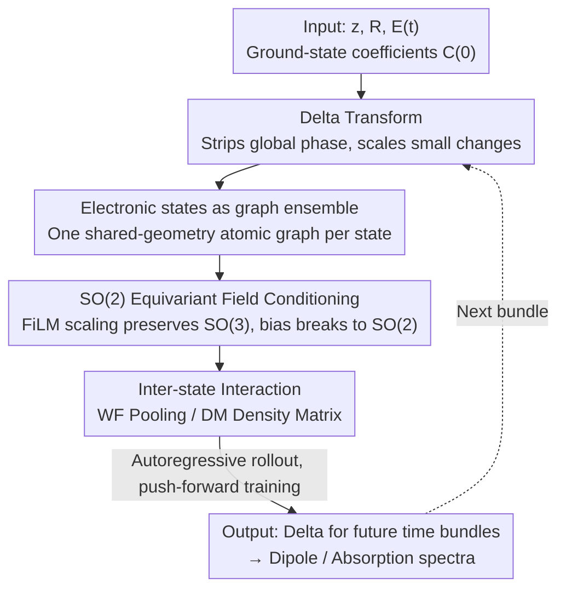

# Orbital Transformers for Predicting Wavefunctions in Time-Dependent Density Functional Theory

**Conference**: ICLR 2026  
**OpenReview**: [https://openreview.net/forum?id=06I7jcrkW2](https://openreview.net/forum?id=06I7jcrkW2)  
**Code**: https://github.com/divelab/AIRS/ (as part of the AIRS library)  
**Area**: AI4Science / Quantum Dynamics / Equivariant Graph Transformer  
**Keywords**: TDDFT, Wavefunction Evolution, SO(2) Equivariance, Density Matrix, Autoregressive Rollout

## TL;DR
This paper proposes OrbEvo—an equivariant graph Transformer that learns the time evolution of Kohn-Sham wavefunctions (represented by coefficients of linear combinations of atomic orbitals) for all occupied states in real-time time-dependent density functional theory (RT-TDDFT). It replaces hours of numerical propagation with approximately 1 second of network inference while generalizing across QM9 and accurately recovering dipole moments and absorption spectra.

## Background & Motivation

**Background**: DFT efficiently solves the stationary many-body Schrödinger equation using the variational principle, dominating the calculation of ground-state properties for molecules and solids. However, phenomena such as excited states and dynamic responses to external fields require the time-dependent version, TDDFT. Real-time RT-TDDFT directly propagates ground-state wavefunctions in the time domain, enabling the calculation of linear and nonlinear properties like light absorption, charge transfer, and electron dynamics.

**Limitations of Prior Work**: RT-TDDFT is extremely time-consuming. It requires fine spatio-temporal discretization and long-time propagation with very small time steps. Each step involves reconstructing the Kohn-Sham Hamiltonian, which depends on the electron density, and the number of wavefunctions grows linearly with the system size. In the paper, a numerical TDDFT solution for a single molecule takes several hours.

**Key Challenge**: The evolution operator $\hat{U}(t,t_0)$ depends on the time-varying Hamiltonian $\hat{H}(t)$, which in turn depends on the electron density formed by the current wavefunctions. This creates a self-consistent iterative loop of "density $\to$ Hamiltonian $\to$ wavefunction $\to$ density" that cannot be skipped. This is the root of the high computational cost and the target operator $ML$ aims to approximate.

**Goal**: To learn a neural network that directly maps the time evolution of wavefunction coefficients $C_n(t) \to C_n(t+1)$, bypassing step-by-step self-consistent iterations while respecting physical symmetries, controlling cumulative autoregressive errors, and handling multiple electronic states that increase with system size.

**Key Insight**: The authors view the problem as an "ML-PDE (Machine Learning Partial Differential Equation) for wavefunction coefficient evolution on atomic graphs." There are two key observations: first, an external uniform electric field specifies a spatial direction, breaking the system's rotational symmetry from $SO(3)$ to $SO(2)$ around the field axis; the model must precisely encode this breaking. Second, individual occupied states are eigenvectors of the initial Hamiltonian and should be treated as a "set" rather than an ordered concatenation of feature channels.

**Core Idea**: Use an equivariant graph Transformer (EquiformerV2 backbone) to autoregressively evolve wavefunction deltas on atomic graphs. This is combined with $SO(2)$ equivariant electric field conditioning, modeling multiple electronic states as a ensemble of graphs sharing geometry (providing two modes of inter-state interaction: wavefunction pooling or density matrix), and using push-forward training to suppress rollout error accumulation.

## Method

### Overall Architecture

OrbEvo receives the molecular atomic types $z$, 3D coordinates $R$, a time-varying uniform external electric field $E(t)$, and ground-state wavefunction coefficients $C(0)$. It autoregressively predicts a sequence of future wavefunction coefficients $\{C(t)\}$, from which dipole moments and absorption spectra are calculated. Each occupied electronic state is represented as an independent atomic graph (sharing the same geometry $z, R$), with wavefunction coefficients as node features on atoms. The network advances multiple steps at once in "time bundles," performing cyclic rollouts until the entire trajectory is covered.

The pipeline consists of four steps: ① Rewrite the target from raw coefficients to scaled **delta wavefunctions** (removing the dominant global phase and keeping only small external field-induced variations); ② Encode each electronic state as equivariant graph node features and pass them into $SO(2)$ equivariant EquiformerV2 blocks; ③ Perform **inter-state interaction** between layers (choosing between wavefunction pooling OrbEvo-WF or density matrix OrbEvo-DM) to let all occupied states jointly determine the evolution; ④ Read out the delta for the next time bundle and use **push-forward training** to make the model robust to its own prediction errors.

### Key Designs

**1. Delta Transformation: Stripping "Global Phase" to force the model to learn actual external field responses**

Since the amplitude of the external electric field is very small, the coefficients $C_n(t)$ at future times differ from the initial $C_n(0)$ almost entirely by a global phase factor. If $C_n(t)$ were learned directly, the model might "cheat" by only learning this uninformative phase rotation. The authors define a global phase $\gamma_n(t)=\frac{C_n(0)^\dagger S C_n(t)}{|C_n(0)^\dagger S C_n(t)|}$ and a scaled delta $\Delta_n(t)=\frac{1}{\beta}\left(\frac{C_n(t)}{\gamma_n(t)}-C_n(0)\right)$ for each electronic state, where $\beta=10^{-3}$ scales the minute changes, such that $C_n(t)=(C_n(0)+\beta\Delta_n(t))\gamma_n(t)$. Without an external field, $\gamma_n(t)=\exp(-i\epsilon_n t/\hbar)$ and $\Delta_n(t)=0$, showing that $\Delta$ cleanly extracts the field-induced part of the wavefunction. The main paper focuses on learning $\Delta(t)$ (learning the phase $\gamma$ is in the appendix). This step is a prerequisite for making the task "learnable."

**2. Electronic States as a Ensemble of Shared-Geometry Graphs: Respecting the physical nature of "Eigenvectors as a Set"**

All occupied states jointly determine the electron density, which in turn determines the evolution operator; thus, evolving one state must account for inter-state interactions. An intuitive approach is to sort states by energy levels $\{\epsilon_n\}$ and concatenate them into a global feature vector—but the authors found this **fails to learn propagation**. The reason is that electronic states are eigenvectors of the initial Hamiltonian and should be treated as a "set." Mixing them as independent feature channels makes learning harder. Thus, each state $n$ is built as an independent graph $\mathcal{G}_n=\{F^{WF}_n, z, R\}$, where node features $F^{WF}_n$ are the wavefunction coefficients of that state, and geometry $z, R$ is shared. Orbital coefficients for each atom are grouped into equivariant features $f^{WF}_{n,i}\in\mathbb{R}^{9\times d_{cond}}$ by rotation order $\ell$ (concatenated up to $\ell \le 2$, with zero-padding for atoms like Hydrogen with fewer orbitals).

**3. Two Inter-state Interactions—WF Pooling vs. Density Matrix: The latter naturally fits the TDDFT mathematical structure**

Above the "graph ensemble," the authors provide two ways for states to communicate. **OrbEvo-WF** performs mean pooling over electronic states after each graph Transformer block, followed by processing with a global block and broadcasting back: $f^{pool}_i=\mathrm{GT}\left(\frac{1}{N_{occ}}\sum_n f_{n,i}\right)$, $f'_{n,i}=f_{n,i}+f^{pool}_i$; it utilizes the full wavefunction features of all states. **OrbEvo-DM** directly constructs density matrix features: the density matrix $D(t)=\sum_n \eta_n C_n(t)\otimes C_n^*(t)$ is sliced into atom-pair blocks $D_{ij}$. Tensor contraction (basis transformation using Clebsch-Gordan coefficients) is used to organize each block into equivariant features $\tilde D_{ij,n}=\mathrm{TC}(C_{n,i}(t)\otimes C_{n,j}^*(t))$ up to order $\ell=4$, which are then aggregated by occupation numbers $\tilde D_{ij}=\sum_n \eta_n\tilde D_{ij,n}$. Diagonal blocks are added to node features, and off-diagonal blocks condition the graph attention $\alpha_{ij},m_{ij}=\mathrm{TP}_\theta([f_i,f_j,\mathrm{linear}(\tilde D_{ij})],r_{ij})$. Since the delta transform makes the density matrix contain linear and quadratic terms, the authors found that keeping quadratic terms was actually harmful (small contribution, sensitive to noise), so only linear terms are kept. DM is superior because the density functional is the core quantity for evaluating the time-dependent Hamiltonian in RT-TDDFT; letting the model see the density matrix directly places the "learning of the evolution operator" on its most natural input. Correspondingly, DM supports **electronic state sampling** (e.g., DM-s8 only supervises 8 random states) to save training costs—because it aggregates all states into the density matrix at the input, sampling doesn't lose interaction information; whereas WF sampling loses information and leads to a significant performance drop.

**4. SO(2) Equivariant Field Conditioning: Precise symmetry breaking via FiLM-style scaling/bias**

The external field specifies the z-axis direction, breaking the system's symmetry from $SO(3)$ to $SO(2)$ around that axis. The model must encode this exactly. The authors insert FiLM-style conditioning after each LayerNorm: $y_\ell=s_\ell\odot\mathrm{LN}(x)_\ell+b_\ell$, where scaling $s_\ell$ and bias $b_\ell$ are calculated from the current and next time bundle electric field strengths via MLP. The key trick is: scaling $s_\ell$ is the same for each $\ell$, **preserving SO(3) equivariance**; bias $b_\ell$ is non-zero only at $m=0$ (corresponding to the spherical harmonic encoding of the field along the z-axis), **breaking the symmetry from SO(3) to SO(2)**. Ablation shows that this "breaking" is necessary to correctly learn the mapping from the ground state to the first step of evolution—it injects the field's directional information into features in an equivariant-compatible way rather than simple concatenation.

### Loss & Training

The training objective is per-atom $\ell_2$-MAE: $\ell_2\text{-MAE}(\Delta^{pred},\Delta^{target})=\frac{1}{N^{batch}_a}\sum_i\|\Delta^{pred}_{\cdot,i}-\Delta^{target}_{\cdot,i}\|_2$, averaged over all steps in the time bundle. To combat distribution shift in autoregressive rollout, **push-forward training** is used (time bundling, $h=f=N_{tb}=8$): the model unrolls once, using noisy predictions as new inputs $\hat\varepsilon=\mathrm{StopGrad}(M(\cdot)-\Delta)$, making the training distribution approximate the error distribution at inference. Clean and push-forward inputs are mixed with equal probability, and a linear warm-up (0 $\to$ 1) is applied to $\hat\varepsilon$ to prevent noise from overwhelming the signal early in training. Additionally, the loss weight for the first bundle $\Delta(1..h)$, which cannot be modeled with push-forward, is doubled to balance utilization.

## Key Experimental Results

Dataset: 5,000 diverse molecules from QM9 (to test generalization), and 1,500 configurations of malonaldehyde (MDA) from MD17 for ablation. Ground-state wavefunctions were obtained using ABACUS for SCF DFT, followed by RT-TDDFT propagation for 5 fs (1,000 steps, step size 0.005 fs) under a uniform time-dependent electric field, downsampled every 10 steps to yield 101-step trajectories. QM9 split 4000/500/500; MDA split 800/200/500. Evaluation focused on three physical quantities: time-dependent wavefunction coefficients, time-dependent dipole moments, and light absorption spectra characterized by dipole oscillator strength (all as dimensionless relative errors).

### Main Results

| Dataset | Model | Wavefunction 1-step $\ell_2$-MAE | Wavefunction rollout $\ell_2$-MAE | Dipole rollout nRMSE | Absorption nRMSE-all |
|---------|-------|-------------------------------|----------------------------------|----------------------|-----------------------|
| MDA     | DM-s8 | 0.0242                        | 0.0947                           | 0.1778               | 0.3008                |
| MDA     | WF-sall| 0.0192                        | 0.0853                           | 0.1585               | 0.3957                |
| QM9     | DM-s8 | 0.0190                        | 0.0797                           | 0.1885               | 0.1946                |
| QM9     | WF-sall| 0.0164                        | 0.0874                           | 0.2071               | 0.6045                |

On QM9, which more closely reflects real test scenarios, **DM-s8 overall outperforms WF-sall in rollout wavefunction, dipole, and absorption** (e.g., absorption nRMSE-all 0.1946 vs. 0.6045). This confirms the advantage of density matrix interaction being consistent with the mathematical structure of TDDFT; although WF has lower 1-step errors, it is inferior to DM in generalization and long-range rollout.

### Ablation Study

| Configuration | Effect Description |
|---------------|-------------------|
| Ordered concatenation of states (instead of graph ensemble) | Fails to learn propagation, verifying the necessity of "states as a set." |
| Removing SO(2) symmetry breaking | Fails to correctly learn the ground-state $\to$ first-step mapping. |
| Keeping quadratic terms in Density Matrix | Performance degrades (small contribution, noise sensitive); only linear terms kept. |
| WF using electronic state sampling | Significant performance drop (loss of information); DM sampling has almost no impact. |

### Key Findings
- **Density Matrix interaction is most physically aligned**: DM aggregates all occupied states into a density matrix at the input. This is not only the core quantity determining the Hamiltonian in TDDFT but also makes training-time state sampling nearly lossless—the root of DM's win-win in generalization and efficiency.
- **Symmetry breaking is indispensable**: Properly breaking $SO(3)$ to $SO(2)$ (scaling preserves equivariance, $m=0$ bias breaks it) is the "switch" for learning responses to external fields; without it, learning fails.
- **Physics emerges under zero supervision**: Training only supervises wavefunction deltas and never explicitly supervises dipole or absorption. Nevertheless, DM-s8 recovers time-dependent dipole moments and accurately locates absorption spectrum peaks with high correlation.
- **Massive Speedup**: Numerical TDDFT solution for a single molecule takes hours, while network inference takes about 1 second.

## Highlights & Insights
- **Delta + Global Phase separation** is clever: re-parameterizing the "nearly phase-only" target into "phase $\gamma$ + scaled delta $\Delta$" allows the model to spend its capacity on the small, physically informative quantity—a key prerequisite for the task to work.
- The observation that **"electronic states are sets, not sequences"** directly determines the success of the architecture: treating each eigenstate as an independent graph with shared geometry and using pooling/density matrices for permutation-invariant interaction avoids the failure mode of "concatenation by energy level." This is transferrable to any physical ML task involving sets of eigenvectors/modes.
- **Implementing precise symmetry breaking via FiLM scaling/bias** is a clean engineering solution—scaling handles "preserving SO(3)" and $m=0$ bias handles "breaking to SO(2)," splitting physical symmetry constraints into two separately controllable knobs.
- Borrowing **time bundling + push-forward** from PDE surrogate models to mitigate autoregressive error accumulation proves that training techniques matured for neural PDE solvers are directly applicable to quantum dynamics rollouts.

## Limitations & Future Work
- The authors acknowledge that limitations of standard TDDFT propagate to the model: it struggles with conical intersections, and accuracy is limited by the approximations of the exchange-correlation functional.
- The experimental systems are relatively small (QM9 molecules + configurations of a single MDA molecule) with uniform single-direction external fields and fixed time steps/durations; extrapolation to larger systems, complex/multi-directional fields, or longer time horizons has not yet been verified.
- The datasets are limited in size (only 5,000 QM9 molecules, single molecule for MDA). Generalization conclusions are mainly drawn from QM9 in-distribution tests; true OOD across chemical space remains to be systematically examined.
- Hyperparameters such as $\beta=10^{-3}$ in delta transform, time bundle $N_{tb}=8$, and push-forward warm-up significantly impact results (warm-up is not always beneficial), requiring tuning in practice.

## Related Work & Insights
- **vs. Classical RT-TDDFT Numerical Solvers**: Traditional methods propagate step-by-step self-consistently—accurate but taking hours per molecule; this work approximates the evolution operator with a single network inference (~1 second), trading controlled relative error for orders of magnitude speedup, positioned as an "accelerator" rather than a replacement for physics.
- **vs. EquiformerV2 (Backbone)**: Directly reuses its $SO(3)$ equivariant graph attention and block structures but switches the task from predicting static properties/forces/Hamiltonians to wavefunction time evolution, adding $SO(2)$ field conditioning and inter-state interaction modules.
- **vs. Neural PDE Surrogate Models (Brandstetter et al.'s time bundling / push-forward)**: Transfers the PDE learning paradigm to "wavefunction coefficient evolution on atomic graphs," proving these training tricks for countering rollout drift are equally effective in quantum dynamics.
- **vs. Naive Baselines concatenating states by energy level**: The paper's experiments prove this baseline fails to learn propagation, highlighting the necessity of treating eigenstates as a set.

## Rating
- Novelty: ⭐⭐⭐⭐⭐ First to model wavefunction time evolution as an $SO(2)$ equivariant ML-PDE on atomic graphs; the synergy between density matrix characterization and TDDFT structure is novel.
- Experimental Thoroughness: ⭐⭐⭐⭐ QM9+MDA dual datasets, three metrics (wavefunction/dipole/absorption), emergence of physics under zero supervision is convincing; however, systems are small and extrapolation validation is limited.
- Writing Quality: ⭐⭐⭐⭐ Physical motivation and method derivation are clear; symmetry breaking and delta transform are well-explained.
- Value: ⭐⭐⭐⭐⭐ Compressing hours of excited-state dynamics simulation to seconds with generalization capability is of real value for accelerating AI4Science and quantum chemistry.

<!-- RELATED:START -->

## Related Papers

- [\[ICLR 2026\] Towards a Transferable Acceleration Method for Density Functional Theory](towards_a_transferable_acceleration_method_for_density_functional_theory.md)
- [\[ICLR 2026\] A Function-Centric Graph Neural Network Approach for Predicting Electron Densities](a_function-centric_graph_neural_network_approach_for_predicting_electron_densiti.md)
- [\[ICLR 2026\] PINFDiT: Energy-Based Physics-Informed Diffusion Transformers for General-purpose Time Series Tasks](pinfdit_energy-based_physics-informed_diffusion_transformers_for_general-purpose.md)
- [\[ICML 2026\] TINNs: Time-Induced Neural Networks for Solving Time-Dependent PDEs](../../ICML2026/physics/tinns_time-induced_neural_networks_for_solving_time-dependent_pdes.md)
- [\[NeurIPS 2025\] High-order Equivariant Flow Matching for Density Functional Theory Hamiltonian Prediction](../../NeurIPS2025/physics/high-order_equivariant_flow_matching_for_density_functional_theory_hamiltonian_p.md)

<!-- RELATED:END -->
