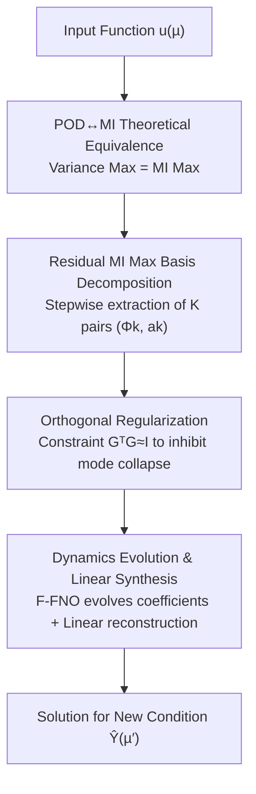

# OrthoSolver: A Neural Proper Orthogonal Decomposition Solver For PDEs

**Conference**: ICLR 2026  
**OpenReview**: [https://openreview.net/forum?id=9OOmlDrEfn](https://openreview.net/forum?id=9OOmlDrEfn)  
**Code**: To be confirmed  
**Area**: Neural PDE Solvers / Reduced Order Modeling  
**Keywords**: Proper Orthogonal Decomposition (POD), Mutual Information Maximization, Neural Operators, Mode Collapse, Reduced Order Models (ROM)

## TL;DR
This paper reinterprets the classical Proper Orthogonal Decomposition (POD) from an information-theoretic perspective, proving that the "energy maximization" criterion is equivalent to "mutual information (MI) maximization" under linear Gaussian assumptions. Based on this, it proposes OrthoSolver—a neural operator framework that generalizes POD to nonlinear domains via MI maximization combined with orthogonal regularization to prevent mode collapse, outperforming existing SOTA models across 7 PDE benchmarks.

## Background & Motivation

**Background**: High-fidelity numerical simulations of physical systems described by PDEs are extremely costly. Consequently, "decomposition" has become a core paradigm for accelerating solvers. Historically, Model Order Reduction (MOR) used POD to project high-dimensional dynamical systems onto a low-dimensional subspace spanned by a set of "energy-optimal" orthogonal bases. In the data-driven era, models have evolved from monolithic operators like FNO and DeepONet to architectures with decomposition/slicing structures such as LSM and Transolver.

**Limitations of Prior Work**: Both routes have inherent weaknesses. POD is limited by its linear assumption—basis functions obtained for specific conditions generalize poorly, and it fails to capture underlying nonlinear couplings in systems like multi-physics fields, often relying on independent decomposition. Data-driven decompositions (e.g., Transolver slicing inputs into learnable slices) are flexible but lack physical priors and mechanisms to enforce independence between components, leading to **mode collapse** in complex scenarios: learned bases become highly redundant and lose discriminative power.

**Key Challenge**: Traditional decomposition (POD) has a solid mathematical foundation, but its variance-based metric incurs large errors for nonlinear systems. Data-driven decompositions offer high expressivity but lack theoretical support and are prone to collapse. The root of the problem is that POD uses "variance maximization" to select dominant bases, whereas variance only captures second-order moments and naturally fails to grasp high-order dependencies in nonlinear systems.

**Key Insight**: The authors note a conclusion from information theory: under linear Gaussian assumptions, maximizing projection variance is equivalent to maximizing the **mutual information (MI)** between the original data and the projection coefficients. Since POD is essentially an MI maximization case "constrained by linear Gaussian" assumptions, replacing variance with a non-linear-limited MI metric allows the core philosophy of POD to be naturally extended to the nonlinear domain.

**Core Idea**: Use "mutual information maximization" instead of "variance maximization" to iteratively extract a set of compact and expressive nonlinear basis modes, while using orthogonal regularization to ensure basis diversity and suppress mode collapse.

## Method

### Overall Architecture
OrthoSolver decomposes the "direct learning of a mapping $F: X \to Y$" into a composition of three operators $F = D \circ S_\theta \circ E_\theta$: the Basis Extraction operator $E_\theta$ maps the input function $u(\mu)$ to $K$ global basis functions $\{\Phi_k\}$ and corresponding coefficients $\{a_k(\mu)\}$; the Solver operator $S_\theta$ evolves those coefficients to new parameter conditions $\mu'$ in the low-dimensional coefficient space; and the Synthesis operator $D$ reconstructs the high-dimensional solution via linear superposition $\hat{Y}(\mu') = \sum_k \hat{a}_k(\mu')\Phi_k$. This pipeline decouples "which subspace to represent in" from "how to evolve within the subspace," inheriting POD’s interpretability while enabling efficient generalization.

The Basis Extraction operator $E_\theta$ follows a **residual-based step-wise extraction process**: at each step, it extracts the "most informative" basis-coefficient pair $(\Phi_k, a_k)$ from the current data field, subtracts it from the residual, and repeats for $K$ iterations—effectively porting POD's sequential greedy decomposition to a nonlinear, information-driven objective.

### Key Designs

**1. Theoretical Equivalence of POD and MI: Rewriting Variance Maximization as Information Theory**

This is the foundation of the method, addressing the contradiction where data-driven decomposition lacks theory while POD is stuck in linearity. The authors formally prove (Theorem 1): When data snapshots $u$ follow a multivariate Gaussian distribution and the projection $a = \langle u, \phi\rangle$ is a linear operation, maximizing the projection variance $\mathrm{Var}(a)$ is equivalent to maximizing the mutual information $I(u;a)$ between original data and projection coefficients. The proof is concise: for a zero-mean Gaussian variable, the differential entropy is $H(a) = \tfrac{1}{2}\log(2\pi e\cdot\mathrm{Var}(a))$. By logarithmic monotonicity, $\arg\max \mathrm{Var}(a) \Leftrightarrow \arg\max H(a)$. Since $a$ is a deterministic function of $u$, $H(a|u)=0$, thus $I(u;a)=H(a)$. This equivalence reveals that POD's variance criterion is just a special case of MI maximization, providing a justification for generalizing to the nonlinear domain using MI as a universal statistical dependency measure.

**2. Residual MI Maximization Basis Decomposition: Replacing Variance with MI in Greedy Extraction**

To capture nonlinear couplings, this module follows the "sequential, residual-based" extraction of POD but replaces the linear variance objective with a nonlinear information objective. Taking $u(\mu)$ as the initial residual $X_1$, each step solves $\max_{\Phi_k,a_k} I(X_k, a_k)$, where the basis is provided by F-FNO $\Phi_k = \mathrm{FNO}(X_k)$ and the coefficient by an MLP $a_k = \mathrm{MLP}(X_k)$. The residual is then updated $X_{k+1} = X_k - a_k\Phi_k$ for $K$ steps. Since direct maximization of $I(X_k,a_k)$ is difficult, it is rewritten as minimizing the information remaining in the residual $\min I(X_k, X_{k+1})$ (Appendix proves "more information captured by mode ⇔ less information left in residual"). The final MI loss is the average $L_{mi} = \tfrac{1}{K}\sum_k I(X_k, X_{k+1})$. MI is estimated using the **CLUB (Contrastive Log-ratio Upper Bound)**: a variational distribution $q(a_k|X_k)$ approximates the true posterior, yielding $I_{\text{CLUB}}(X_k,a_k) = \mathbb{E}_{p(X_k,a_k)}[\log q(a_k|X_k)] - \mathbb{E}_{p(X_k)p(a_k)}[\log q(a_k|X_k)]$, which is optimized end-to-end via batch sampling.

**3. Basis Orthogonal Regularization: Eliminating Mode Collapse via Gram Matrix Constraints**

A common failure in data-driven decomposition is the optimizer converging to redundant features rather than independent components, where learned bases become highly similar ($\phi_i \approx \phi_j$) and the effective rank of the basis matrix $G$ collapses ($\mathrm{rank}(G) < K$). The authors introduce an orthogonal constraint to regularize the Gram matrix of the basis functions towards an identity matrix $G^TG \approx I$, ensuring linear independence and maintaining full rank $\mathrm{rank}(G) \approx K$. The loss uses the Frobenius norm: $L_{ortho} = \|G^TG - I\|_F^2$, where $G = [\Phi_1,\dots,\Phi_K]$ contains flattened basis vectors as columns. This works with the reconstruction constraint $L_{recon} = \|u - \sum_k a_k\Phi_k\|_F^2$ to ensure decomposition is both faithful and orthogonal.

**4. Dynamics Evolution & Linear Synthesis: Efficient Generalization in Low-dimensional Space**

After obtaining $\{\Phi_k\}$ and $\{a_k(\mu)\}$, the solver operator $S_\theta$ evolves the system. For each mode $k$, a dedicated F-FNO solver takes the current coefficient concatenated with its static basis function as input to predict the new coefficient $\hat{a}_k(\mu') = \mathrm{FNO}_k(\mathrm{Concat}(a_k(\mu), \Phi_k))$. Once all coefficients are predicted, the synthesis operator $D$ performs a **parameter-free** linear superposition $\hat{Y}(\mu') = \sum_k \hat{a}_k(\mu')\Phi_k$. Limiting evolution to the coefficient space enables both speed and generalization to new conditions. The prediction loss uses relative L2 error $L_{pred} = \|Y(\mu')-\hat{Y}(\mu')\|_2 / \|Y(\mu')\|_2$.

### Loss & Training
The framework is trained end-to-end with a total loss: $L_{total} = \lambda_{mi}L_{mi} + \lambda_{recon}L_{recon} + \lambda_{ortho}L_{ortho} + \lambda_{pred}L_{pred}$, driving "informative bases / faithful decomposition / diverse modes / accurate prediction." **Dynamic Weight Averaging (DWA)** is used to balance tasks (temperature $T=1.0$). Implementation is based on PyTorch on a single RTX 3090, with $K\in\{1,2,4,6\}$. BasisExtractor and SolutionOperator use 1-layer F-FNOs with Adam optimizer (learning rate $1\text{e}{-3}$).

## Key Experimental Results

### Main Results
Evaluated on 7 fluid dynamics benchmarks from PDEBench (1D/2D Advection, Burgers, Navier-Stokes, Diffusion-Sorption, Diffusion-Reaction), compared against 10 SOTA neural operators using relative L2 error (lower is better).

| Dataset | Ours | Second Best | Note |
|:---|:---|:---|:---|
| 1D Advection | **0.0033** | 0.0036 (Transolver) | Ranked 1st in all 5 1D tasks |
| 1D Burgers | **0.0150** | 0.0166 (FNO) | — |
| 1D NS | **0.0157** | 0.0168 (FNO) | — |
| 2D NS | **0.0055** | 0.0091 (F-FNO) | Error reduced by >39% |
| 2D DiffReac | **0.0172** | 0.0189 (Erwin) | Error reduced by >45% |

Ours achieved SOTA on all 7 datasets, with significant advantages in complex 2D scenarios, confirming that replacing linear variance with nonlinear MI helps find more compact and expressive bases.

### Ablation Study
Full model uses $K=4$. The table below shows relative L2 error (selected) and average degradation after removing individual loss terms.

| Configuration | 2D-NS | 2D-Reac | Avg. Degradation |
|:---|:---|:---|:---|
| Full model (K=4) | 0.0055 | 0.0172 | — |
| w/o $L_{ortho}$ | 0.0159 | 0.0238 | -35.43% |
| w/o $L_{MI}$ | 0.0109 | 0.0262 | -34.71% |
| w/o $L_{recon}$ | 0.0079 | 0.0233 | -23.71% |

Sensitivity to $K$: Performance improves from $K=1$ to $K=4$ but slightly declines at $K=6$, suggesting that the first few modes capture the key physical information and further modes add noise.

### Key Findings
- All three auxiliary constraints are indispensable, with **orthogonal regularization contributing the most** (-35.43%), followed by the MI objective (-34.71%).
- Mode collapse was quantified: in complex NS/Burgers tasks, baselines showed correlation coefficients as high as 0.747/0.810 between modes. OrthoSolver reduced the average correlation from 0.7832 to 0.0631.
- $K$ is not "the larger the better," exhibiting an "information saturation point" consistent with the intuition in ROM where dominant modes carry most energy.

## Highlights & Insights
- **Reinterpreting POD energy as Mutual Information**: The simple Gaussian entropy equivalence ($H(a)=\tfrac12\log(2\pi e\,\mathrm{Var}(a))$) connects variance and MI, transforming the extension of POD to the nonlinear domain from intuition to a theoretically anchored operation.
- **Residual Greedy + MI Upper Bound (CLUB)**: Rewriting $\max I(X_k,a_k)$ as $\min I(X_k,X_{k+1})$ and using CLUB for differentiable estimation provides a blueprint for "information-driven sequential decomposition" in representation learning.
- **Orthogonal Regularization as a Hard Constraint**: $\|G^TG-I\|_F^2$ directly enforces full rank, which is more reliable than relying purely on data-driven independence.

## Limitations & Future Work
- Experiments are restricted to fluid dynamics benchmarks in PDEBench (1D/2D) without verification on higher dimensions or irregular geometries.
- The synthesis operator $D$ remains a parameter-free linear superposition. While interpretable, this linear reconstruction might limit expressivity despite nonlinear extraction.
- The impact of CLUB estimation bias and sensitivity to DWA multi-task weighting could be further explored.
- The number of modes $K$ requires manual setting; a mechanism to adaptively determine $K$ is missing.

## Related Work & Insights
- **vs POD / POD-DeepONet**: Classical POD uses fixed linear bases; POD-DeepONet evolves coefficients on POD bases. Both suffer from linear approximation errors. Ours replaces the variance objective with MI, allowing bases to be learnable and nonlinear.
- **vs Transolver / LSM**: These use learnable slices or spectral bases but lack physical priors and are prone to collapse. OrthoSolver provides a physical objective via POD↔MI equivalence and explicitly prevents collapse.
- **vs Monolithic Operators (FNO/DeepONet)**: These struggle in complex scenes. Ours adopts a decomposition paradigm, splitting fields into interpretable components for better robustness.

## Rating
- Novelty: ⭐⭐⭐⭐⭐ The reinterpretion of POD through MI is theoretically elegant and novel.
- Experimental Thoroughness: ⭐⭐⭐⭐ 7 benchmarks, 10 baselines, plus mode collapse quantification, though limited to fluid scenarios.
- Writing Quality: ⭐⭐⭐⭐⭐ Clear logical flow from theory to experiments; Theorem 1 is concise and powerful.
- Value: ⭐⭐⭐⭐ Provides a reusable paradigm for integrating physical priors with information theory in ROM.

<!-- RELATED:START -->

- **Transolver**: [https://arxiv.org/abs/2310.12196](https://arxiv.org/abs/2310.12196) (A transformer-based solver using slice-based decomposition)
- **F-FNO**: [https://arxiv.org/abs/2211.12761](https://arxiv.org/abs/2211.12761) (The backbone operator used in this work)

<!-- RELATED:END -->

## Related Papers

- [\[ICLR 2026\] Operator Learning with Domain Decomposition for Geometry Generalization in PDE Solving](operator_learning_with_domain_decomposition_for_geometry_generalization_in_pde_s.md)
- [\[ICLR 2026\] $\partial^\infty$-Grid: A Neural Differential Equation Solver with Differentiable Feature Grids](boldsymbolpartialinfty-grid_a_neural_differential_equation_solver_with_different.md)
- [\[ICML 2026\] Topology-Preserving Neural Operator Learning via Hodge Decomposition](../../ICML2026/physics/topology-preserving_neural_operator_learning_via_hodge_decomposition.md)
- [\[ICLR 2026\] (U)NFV: (Un)supervised Neural Finite Volume Methods for Solving Hyperbolic PDEs](unfv_unsupervised_neural_finite_volume_methods_for_solving_hyperbolic_pdes.md)
- [\[ICLR 2026\] DRIFT-Net: A Spectral--Coupled Neural Operator for PDEs Learning](drift-net_a_spectral--coupled_neural_operator_for_pdes_learning.md)

<!-- RELATED:END -->
