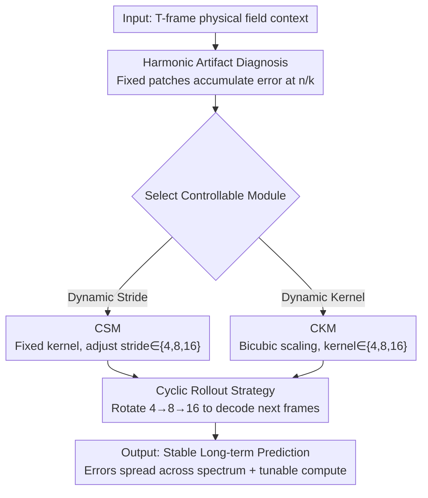

# Overtone: Cyclic Patch Modulation for Clean, Efficient, and Flexible Physics Emulators

**Conference**: ICLR 2026  
**OpenReview**: [https://openreview.net/forum?id=itUo64aUeK](https://openreview.net/forum?id=itUo64aUeK)  
**Code**: https://github.com/payelmuk150/patch-modulator  
**Area**: Neural PDE Surrogates / Scientific Machine Learning / Vision Transformer  
**Keywords**: PDE Surrogate Model, Patching, Autoregressive Rollout, Harmonic Artifacts, Compute-Adaptive

## TL;DR
Addressing two persistent issues in ViT-based PDE surrogate models—harmonic error accumulation due to fixed patch sizes and "locked-in" compute costs post-training—this paper proposes Overtone. By **cyclically switching patch/stride sizes** during autoregressive inference, Overtone disperses error from single harmonic frequencies across the entire spectrum. This reduces long-term rollout error by up to 40% without retraining and allows the same model to freely trade off accuracy and speed during inference.

## Background & Motivation

**Background**: Using deep learning as surrogate models for spatiotemporal PDEs has become mainstream—expensive to train but cheap to infer—and is widely used in weather forecasting, PDE-constrained optimization, and parameter inference. Recent surrogate models have extensively borrowed Vision Transformers (ViT) from computer vision: cutting discretized physical fields into non-overlapping $k\times k$ patches to form tokens. Using non-overlapping patches reduces the token count and the quadratic overhead of attention.

**Limitations of Prior Work**: This approach has two long-ignored flaws. First, the authors observe that **fixed patch sizes systematically accumulate errors at harmonic frequencies during autoregressive rollout**. Artificial patch boundaries inject errors at wavenumbers $n/k$ (where $n$ is an integer). Since the same patch size is used at every step, these errors become "phase-locked" in time, leading to constructive interference. This manifests as sharp peaks in the residual power spectrum and visible grid-like artifacts in the physical field. Second, **compute costs are locked post-training**: different applications in physical modeling have hard thresholds for resolution (to resolve shocks or wave fronts), but smaller patches, while more accurate, cannot be selected after training—one must train a separate model for each patch size.

**Key Challenge**: The trade-off between accuracy and compute, which can be freely adjusted in numerical solvers by configuring resolution, is "welded" into the training phase in fixed-patch ViT surrogates. Simultaneously, fixed patching fixes the error injection points at the same set of harmonic frequencies. These two problems stem from the same root: **a lack of flexibility in inference-time tokenization**.

**Key Insight**: The authors observe that dynamically controlling patch/stride sizes during inference could solve both problems. **Cyclically alternating** between sizes $k_1, k_2, k_3$ (e.g., repeating $4\to 8\to 16$) during autoregressive rollout breaks the phase-locking of errors at single harmonics, spreading them across the spectrum, and simultaneously provides compute-adaptive deployment without retraining.

**Core Idea**: Replace "fixed patching" with "inference-time cyclic patch modulation," solving both error accumulation and compute rigidity—this capability is entirely active at test time and decoupled from training.

## Method

### Overall Architecture
Overtone consists of a pair of **architecture-agnostic** tokenization modules inserted at the encoder/decoder positions of a ViT-like PDE surrogate. The model core is a standard "temporal attention + spatial attention + MLP" transformer processor that predicts the next step from encoded tokens. Overtone does not modify this core; it only takes over how the physical field is sliced into tokens and how tokens are reconstructed back into a field. It provides two controllable tokenization implementations—**CSM** (stride modulation) and **CKM** (kernel/patch size modulation)—and **cyclically switches** their sizes during autoregressive rollout.

During training, the model randomly samples sizes from $\{4, 8, 16\}$ (stride or kernel) during the forward pass so that a single model sees all scales. During inference, starting from the input context $\hat{x}^0=(x_1,\dots,x_T)$, sizes are chosen cyclically as $i \bmod 3$ to encode $\to$ processor $\to$ decode the next frame via transposed convolution. The time window then slides by one step ($\hat{x}^{i+1}_{1:T-1}=\hat{x}^i_{2:T}$) to continue. It is this decoupling of "random training, cyclic inference" that achieves the rollout error dispersion effect.

### Key Designs

**1. Harmonic Artifact Diagnosis: Identifying why fixed patches fail in rollout**

This is the starting point of the paper. The authors provide a heuristic explanation using a **linearized error model**: error evolution is written as $e_{n+1}(\omega)=\lambda(\omega)e_n(\omega)+a_n(\omega)$, where $\lambda$ propagates existing error and $a_n$ injects new error at patch boundaries. When the patch size $k$ is fixed, these injection terms always align at harmonic frequencies $m/k$ and remain phase-locked across time steps, causing rapid constructive accumulation. This results in the sharp spectral peaks seen in Figure 2 and grid distortions in the physical field. The authors emphasize that this is a product of the tokenization mechanism itself and **cannot be eliminated by training** (it appears with vanilla, axial, or Swin attention). This diagnosis was only possible after Overtone provided test-time flexibility.

**2. CSM (Convolutional Stride Modulator): Constant kernel, dynamic stride**

Addressing the diagnosis above, CSM implements controllable tokenization in the most lightweight way: maintaining a fixed base kernel $w_{\text{base}}$ while modulating the convolution stride $s\in\{4,8,16\}$ during each forward pass. In convolutional tokenization, the token count is $N_h\cdot N_w$, where $N_h=\lfloor(H-k)/s\rfloor+1$. While most ViTs set $k=s$, CSM **decouples** them, allowing the same kernel with different strides to flexibly control the token count during inference. The encoding is $x^i_{\text{enc}}=\mathrm{Conv}_{\text{stride}\,s_i}(\hat{x}^i, w_{\text{base}})$. After the processor, a transposed convolution with the same stride decodes the frame, following the cycle $s_i=(4,8,16)_{(i\bmod 3)+1}$. Input edges are padded with "boundary-condition-inspired learnable tokens" to avoid edge artifacts. CSM is compatible with both single-stage and multi-stage encoders/decoders.

**3. CKM (Convolutional Kernel Modulator): Dynamic patch scaling**

CKM takes a different path—dynamically selecting the patch size $k\in\{4,8,16\}$ (powers of 2, fitting common PDE discretizations). The challenge is how a single model can adapt "the same set of weights" to different kernel sizes. The authors borrow **kernel interpolation** (inspired by SiCNN and FlexiViT): using PI-resize to scale the base kernel $w_{\text{base}}\in\mathbb{R}^{k_{\text{base}}\times k_{\text{base}}\times C\times C'}$ to the target size, i.e., $x^i_{\text{enc}}=\mathrm{Conv}_{\text{stride}\,k_i}(\hat{x}^i, B^{T\dagger}_{k_i} w_{\text{base}})$, where $B_{k_i}$ is the bicubic interpolation matrix and $B^{T\dagger}_{k_i}$ is its pseudo-inverse transpose. The same scaled kernel is used at both ends, cycling through $k_i$. The essential difference from existing kernel interpolation work is that while FlexiViT uses it as a "one-off size flexibility tool" for classification, Overtone **brings it into rollout as cyclic modulation**, turning a compute-flexibility tool into a means to mitigate long-term harmonic error accumulation. For vanilla/axial ViTs, a two-stage hMLP-style convolutional encoder/decoder is used, with CKM applied independently at each stage.

**4. Cyclic Rollout Strategy: Turning test-time flexibility into a "scheduling knob"**

While the first three designs provide the "ability to change sizes," this fourth point is the core strategy that converts that ability into gains. Standard autoregressive prediction uses a fixed patch size throughout. Overtone alternates patch/stride sizes between time steps (e.g., $4\to 8\to 16$ repeated), introducing a new **temporal mode** to tokenization. This has two effects: (i) error no longer repeatedly reinforces at a single patch scale, dispersing harmonic artifacts; (ii) periodically using finer patches (4, 8) provides high-fidelity predictions while retaining the efficiency of coarse patches (16). Furthermore, the authors find that the **"sequence" of scheduling is itself a new knob**—even with the same total token budget (i.e., the same multiset of sizes), the $4\to 8\to 16$ order outperforms other permutations, indicating that "when to use high-resolution patches" substantially affects rollout stability. This is a control dimension completely inaccessible to fixed-tokenization models.

## Key Experimental Results

Datasets are from the "The Well" benchmark covering various 2D/3D PDE systems; the metric is VRMSE (Variance-Normalized RMSE, lower is better). The core comparison setup is: under the **same total training budget**, one flexible model (CSM/CKM) is compared against three fixed-patch models (patch=4/8/16 each).

### Main Results (Next-step VRMSE, selected)

| Dataset | Token Count | CSM | CKM | Fixed Patch | Well Baseline |
|---------|-------------|-----|-----|-------------|---------------|
| Shear Flow (Vanilla ViT) | 2048 | 0.00546 | 0.00549 | 0.00677 | 0.1049 |
| Turbulent Radiative Layer 2D | 3072 | 0.146 | 0.133 | 0.143 | 0.2269 |
| Active Matter | 4096 | 0.0171 | 0.0192 | 0.0213 | 0.0330 |
| Rayleigh-Bénard | 4096 | 0.0248 | 0.0250 | 0.143 | 0.2240 |
| Supernova Explosion (3D) | 4096 | 0.287 | 0.267 | 0.272 | 0.3063 |

A single flexible model **matched or exceeded** fixed models trained for each specific patch size across almost all datasets and compute budgets, and significantly outperformed Well baselines like FNO/TFNO/U-Net/CNeXt-U-Net. The compute-accuracy trade-off is intuitive: on Active Matter, reducing patch size from 16 to 4 increases tokens from 256 to 4096, inference time from 0.21s to 0.63s, and compute from 5 to 170 GFLOPs, but reduces error by over 30%.

### Ablation Study (Rollout and Scheduling)

| Experiment | Key Metric | Description |
|------------|------------|-------------|
| 10-step rollout (Active Matter, Axial ViT) | CSM 0.384 vs Fixed 0.640 | Flexible model more stable long-term, Gain +40.0% |
| 10-step rollout (Rayleigh-Bénard, Vanilla) | 0.140 vs 0.2273 | Gain +38.4% |
| Scheduling Order (Shear Flow, CSM) | $4\to8\to16$=0.0375 | Optimal order for same token budget |
| Scheduling Order (vs $8\to4\to16$ / Random) | 0.0442 / 0.0433 | Randomized sequence degrades performance by 15–18% |

### Key Findings
- **Harmonic error dispersion is the primary source of gain**: Fixed-patch models show significant peaks in residual power spectra at $k/p$ and grid artifacts in physical fields. CSM/CKM's cyclic rollout spreads error across the entire frequency range, flattening spectral peaks—without additional training.
- **Temporal order is an independent knob**: With the same total token budget, different sequences can result in a 7–18% performance gap; $4\to8\to16$ (finer to coarser repeated) is most stable. This is a control dimension unique to compute-elastic tokenization.
- **Architecture-agnostic + transferable**: Results hold for Axial ViT (50M) and Vanilla ViT (100M). It also combines with the recent CViT hybrid architecture, where the "flexified" CViT consistently outperforms its fixed-patch version.

## Highlights & Insights
- **Treating "error injection frequency" as an adjustable target**: Previously, patch artifacts were seen as a fixed defect. The paper points out that the true issue is their "phase-locked repetition" across the same harmonics during autoregressive rollout. Using temporal size jittering to decohere the error is a brilliant "frequency-domain × time-domain" perspective.
- **Dual-purpose tool**: Kernel interpolation, originally a flexibility tool in FlexiViT, becomes a long-term error mitigator when placed in a rollout cycle. This shows that the "random training / cyclic inference" decoupling is a rich research area.
- **Inference rollout scheduling is transferable to any autoregressive generation**: Tasks like video generation and world models, which also rely on autoregressive rollout, might theoretically suffer from similar "fixed tokenization $\to$ harmonic accumulation" issues. This cyclic modulation approach is worth exploring there.

## Limitations & Future Work
- **Heuristic theoretical explanation**: The authors clarify that the linearized error model is an "empirical-consistent heuristic explanation" rather than a rigorous proof; the primary evidence is experimental.
- **Discrete and manually selected size sets**: Modulation only cycles through $\{4, 8, 16\}$. The choice of powers of 2 and cycle lengths has not been systematically searched; continuous or learned scheduling might be superior.
- **Trained with teacher forcing, lacks rollout training**: The authors acknowledge that rollout training is a complementary direction that could potentially further improve all models—current comparisons were done under a unified teacher-forced setting.
- **Extra compute for accuracy**: Using finer patches is more accurate but significantly increases inference time/FLOPs (up to 8× in 3D); practical deployment requires picking a working point based on budget.

## Related Work & Insights
- **vs. Fixed-patch ViT surrogates (e.g., McCabe 2023, Morel 2025)**: These fix patches at 16 and require separate models for each size. Ours covers all sizes with one model and additionally solves harmonic accumulation, saving up to 40% error in long-term rollouts.
- **vs. FlexiViT / SiCNN**: These also use bicubic kernel interpolation for size flexibility but target image classification as a one-time tool. Ours brings it into autoregressive rollout for cyclic modulation, upgrading "flexibility" to "error mitigation."
- **vs. Data-driven adaptive patching (Zhang 2024)**: Their patch partitioning is learned from data, whereas Ours is manually controllable based on compute needs, making it more predictable and suitable for budget-aware production environments.

## Rating
- Novelty: ⭐⭐⭐⭐⭐ "Inference-time cyclic patch modulation to mitigate harmonic accumulation" is an angle never previously explored in PDE, video, or vision modeling.
- Experimental Thoroughness: ⭐⭐⭐⭐ Covers multiple 2D/3D systems, two backbones, and rollout/scheduling ablations, though the theory is slightly weaker.
- Writing Quality: ⭐⭐⭐⭐ Clear logic from diagnosis to method to validation; frequency-domain explanations are intuitive.
- Value: ⭐⭐⭐⭐⭐ Provides a practical component for foundation-model-level PDE surrogates: "one model for multiple compute points + more stable long-term rollout."

<!-- RELATED:START -->

## Related Papers

- [\[ICLR 2026\] Learning Data-Efficient and Generalizable Neural Operators via Fundamental Physics Knowledge](learning_data-efficient_and_generalizable_neural_operators_via_fundamental_physi.md)
- [\[ICLR 2026\] DGNet: Discrete Green Networks for Data-Efficient Learning of Spatiotemporal PDEs](dgnet_discrete_green_networks_for_data-efficient_learning_of_spatiotemporal_pdes.md)
- [\[ICLR 2026\] From Cheap Geometry to Expensive Physics: A Physics-agnostic Pretraining Framework for Neural Operators](from_cheap_geometry_to_expensive_physics_a_physics-agnostic_pretraining_framewor.md)
- [\[ICLR 2026\] MatRIS: Toward Reliable and Efficient Pretrained Machine Learning Interatomic Potentials](matris_toward_reliable_and_efficient_pretrained_machine_learning_interatomic_pot.md)
- [\[ICLR 2026\] Physics vs Distributions: Pareto Optimal Flow Matching with Physics Constraints](physics_vs_distributions_pareto_optimal_flow_matching_with_physics_constraints.md)

<!-- RELATED:END -->
