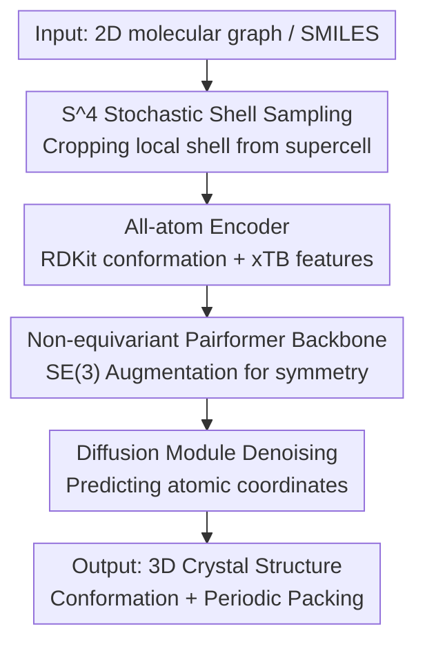

# OXtal: An All-Atom Diffusion Model for Organic Crystal Structure Prediction

**Conference**: ICLR 2026  
**OpenReview**: [https://openreview.net/forum?id=6Jd5aBml0y](https://openreview.net/forum?id=6Jd5aBml0y)  
**Code**: TBD  
**Area**: Diffusion Models / Molecular Crystal Structure Prediction / AI for Science  
**Keywords**: Crystal Structure Prediction, All-atom Diffusion Model, Molecular Crystals, Periodic Packing, Data Augmentation

## TL;DR
OXtal is a 100M-parameter all-atom diffusion Transformer that directly samples experimentally realizable 3D crystal structures (molecular conformations + periodic packing) given only the 2D chemical graph of a molecule. By replacing explicit lattice parameterization and equivariant architectures with an "equilibrium-free" stochastic shell sampling training scheme ($S^4$) and SE(3) data augmentation, it outperforms existing ML methods for CSP by several orders of magnitude after being trained on 600,000 experimental crystals, while being significantly cheaper than traditional DFT-based methods.

## Background & Motivation

**Background**: Crystal Structure Prediction (CSP) is a long-standing open problem in computational chemistry. Given the 2D chemical graph of a molecule, the goal is to predict its 3D periodic crystal packing in an experimental setting. Crystal packing directly dictates the physicochemical properties of organic solids: in pharmaceuticals, it affects solubility, bioavailability, and long-term stability; in materials science, it determines charge transport, porosity, and optical response. Classical CSP methods combine a "search process" (enumeration or evolutionary algorithms) with an "energy/ranking model" (force fields or DFT).

**Limitations of Prior Work**: Classical DFT-based pipelines often generate and optimize 1,000 to 100,000 candidate structures per molecule to find the correct one. Most of these candidates are trapped in unfavorable local energy minima, consuming immense computational resources—roughly 46 million CPU core hours were spent to solve only 8 crystal targets in the 7th CCDC blind test. More importantly, classical methods focus solely on thermodynamics (Gibbs free energy) and fail to characterize the kinetic conditions that determine which energy minimum is actually realized experimentally.

**Key Challenge**: Molecular CSP generalizes both protein folding (AlphaFold3) and inorganic crystal prediction (MatterGen) but is more difficult than both. Proteins rely on strong intramolecular constraints of the backbone and evolutionary information (MSA) priors. Inorganic crystals have fewer atoms ($< 30$), strong covalent/ionic bonds, and no conformational degrees of freedom. In contrast, organic molecular crystals feature diverse chemical scaffolds, highly flexible conformations, and often contain multiple molecular copies $Z$ (where $Z$ is unknown) in a unit cell. There is strong coupling between intramolecular conformation and intermolecular packing, with unit cells often exceeding 100 atoms held together by weak long-range interactions.

**Goal**: To build an all-atom generative model that can be efficiently trained on a scale of 600,000 data points, possesses sufficient expressivity for sampling, and accounts for periodic interactions in the lattice during training without compromising scalability.

**Core Idea**: Abandon explicit equivariant architectures and lattice parameterization in favor of "direct training on Cartesian coordinates + SE(3) data augmentation" to learn symmetries. A "lattice-free" local shell sampling scheme, $S^4$, inspired by the crystallization process, is used to allow the model to learn long-range periodic interactions without parameterizing the lattice, thereby scaling high-capacity Transformers to all-atom resolution.

## Method

### Overall Architecture

OXtal formalizes molecular CSP as a conditional probability inference: given a set of molecular graphs $g$, sample physically distinct crystal configurations $[C]=[(L,B)]$ in the symmetry equivalence class quotient space $M(g)=X(g)/\sim$. Overall, OXtal is an all-atom diffusion model conditioned on 2D molecular graphs, taking SMILES (chemical composition) as input and outputting 3D crystal structures with correct intramolecular conformations and periodic packing.

The core lies in decoupling "what to generate" (conformation + packing) from "how crystals are represented during training" (unit cell, $Z$, etc.). It consists of three main components: first, the $S^4$ training scheme crops a "local shell" centered around a target molecule from a supercell as a training sample (bypassing lattice parameterization); this cropped atomic cluster is fed into an all-atoms encoder to extract physical and structural features; these pass through a Pairformer backbone to propagate information among all atoms, yielding per-atom and atom-pair representations; finally, a diffusion module predicts the denoised coordinates conditioned on these representations.

### Key Designs

**1. Stoichiometric Stochastic Shell Sampling ($S^4$): Bypassing lattice parameterization via local cropping without losing long-range information**

Directly modeling the entire periodic lattice forces explicit parameterization of lattice vectors $L$ and the unknown molecular copy number $Z$, which is the root cause of scalability issues in equivariant CSP models. The starting point of $S^4$ is a chemical observation: crystallization is a "local-to-global" process—once molecules are within contact distance, weak but specific interactions induce recurring packing motifs that propagate periodically. If the model learns to denoise these locally consistent neighborhoods, periodic structures can be recovered at inference.

Specifically, in a supercell $C(U)=(LU, B(U))$, the molecular contact graph is defined using the minimum image intermolecular distance $d_{\min}(m,m')=\min_{x\in X(m), x'\in X(m')}\|x-x'\|_2$. Concentric shells are constructed around a uniformly sampled center molecule $m_c$ with a fixed contact radius $r_{cut}$:

$$S_k(m_c)=\{m_i\in M:\, k\,r_{cut}\le d_{\min}(m_c,m_i)<(k+1)\,r_{cut}\}$$

The number of shells $K$ is sampled $K\sim\text{Uniform}(0,k_{max})$, and the molecular block $V_K=\cup_{j=0}^{K}S_j$ is selected, capped by an atom token budget $T_{max}$. When the outermost shell cannot fit, the frontier shell $S_{K^\star}$ is sub-sampled "stoichiometrically"—if molecule type $i$ appears $N_i^{ASU}$ times in the asymmetric unit and $N_i$ times in the shell, it is sampled with weight $\omega_i\propto N_i^{ASU}/N_i$ to preserve the molecular ratio of the crystal. This "shell cropping" respects anisotropic packing motifs better than centroid-based or kNN cropping. Proposition 1 in the paper ensures that the boundary loss error decays with the cube root of the token count, $\frac{L_\partial(A_{crop})}{T(A_{crop})}=O((1+r_{cut})\,T(A_{crop})^{-1/3})$, theoretically guaranteeing that local cropping retains sufficient long-range information.

**2. Non-equivariant Pairformer Backbone + Data Augmentation: Trading equivariance for scale to achieve all-atom resolution**

Inorganic CSP models typically rely on equivariant architectures to inject symmetry inductive biases, but equivariant layers scale poorly for large molecular crystals (unknown $Z$, hundreds of atoms). OXtal takes the opposite approach: it abandons equivariant representations of lattice vectors and crystal symmetry, training directly on Cartesian coordinates and relying on SE(3) data augmentation to let the model learn global translation/rotation invariance. The backbone draws from AlphaFold3's Pairformer—simplifying residue-level tokenization so that "one token corresponds directly to one atom $a_i$"—and uses a Pairformer stack with triangular self-attention to update single and pair representations. Pairformer itself is not explicitly equivariant, and this "non-equivariance" allows for training on much larger sequences.

**3. All-atom Encoder + Strong Molecular Embeddings: Injecting chemical priors**

Given a SMILES $s$, a 3D conformation is generated using RDKit ETKDG and relaxed with the semi-empirical quantum mechanical method GFN2-xTB. Atomic numbers, coordinates, formal charges, Mulliken partial charges, and bond information are embedded as features. Experiments show that OXtal is relatively insensitive to the initial conformation coordinates (§E), suggesting the model relies on chemical/structural features rather than precise initial geometry. To resolve ambiguity between identical molecular copies, the encoder uses relative position encoding on entity identifiers (following AF3), ensuring equivalent molecules in multi-copy unit cells are distinguished.

**4. Diffusion Module + Composite Loss: Capturing global structure and local chemical environments**

The diffusion module follows the AlphaFold3 design: an atom attention encoder combines token information from the Pairformer with noisy coordinates $x_t$, followed by a 70M-parameter Diffusion Transformer, and an atom attention decoder to predict denoised atomic positions (using the EDM scheme by Karras et al.). The training objective is a composite loss: mean squared error $L_{mse}$ for global structure, smoothed local distance difference test $L_{sLDDT}$ as a proxy for intermolecular interactions within the crop, and a distogram loss $L_{dist}$:

$$L(\theta)=\mathbb{E}_{t,x_t}\big[L_{mse}(\hat x_0, x_0^{align})+L_{sLDDT}(\hat x_0, x_0^{align})\big]+\lambda_{dist}L_{dist}(\hat d, d)$$

where the predicted structure $\hat x_0:=D_\theta(x_t,t)$ is compared against the aligned ground truth $x_0^{align}=\text{align}(x_0,\hat x_0)$.

### Loss & Training
The training data consists of approximately 600,000 experimental crystals from the Cambridge Structural Database (CSD), covering rigid/flexible molecules, co-crystals, and solvates. The diffusion process utilizes the Variance Exploding (VE) SDE family. The denoising network regresses the optimal denoiser $D(x_t,t)=\mathbb{E}[X_0|X_t=x_t]$. During inference, the reverse-time SDE is simulated with the score given by $s_\theta\approx(D_\theta(x_t,t)-x_t)/\sigma_t^2$.

## Key Experimental Results

### Main Results

Comparison of ab initio ML models for rigid and flexible molecules (30 samples per target):

| Dataset | Model | ColS ↓ | PacS ↑ | PacC ↑ | RecC ↑ | SolC ↑ |
|--------|------|--------|--------|--------|--------|--------|
| Rigid | A-Transformer | 0.731 | 0.015 | 0.060 | 0.120 | 0.060 |
| Rigid | AssembleFlow | 0.524 | 1e-3 | 0.040 | 0.760 | 0 |
| Rigid | **Ours** | **0.011** | **0.873** | **1.000** | **0.960** | **0.300** |
| Flexible | A-Transformer | 0.900 | 1e-3 | 0.020 | 0 | 0 |
| Flexible | AssembleFlow | 0.883 | 0 | 0 | 0.140 | 0 |
| Flexible | **Ours** | **0.097** | **0.291** | **0.900** | **0.400** | **0.220** |

OXtal significantly outperforms existing ML methods. Its collision rate (ColS) is near zero for rigid targets. It achieves a 96% intramolecular conformation recovery (RecC) on the rigid set and 40% on the flexible set, making it the only ML model capable of "approximately solving" flexible molecular crystals.

CCDC 5th/6th/7th CSP Blind Tests (Prev. SOTA/DFTavg refers to aggregated DFT submission results):

| Blind Test | Model | nS | ColS ↓ | PacS ↑ | PacC ↑ | SolC ↑ |
|------|------|----|--------|--------|--------|--------|
| CSP5 | DFTavg | 464 | 0.039 | 0.323 | 0.661 | 0.544 |
| CSP5 | **Ours** | 30 | **0.006** | **0.667** | 0.833 | 0.167 |
| CSP6 | DFTavg | 83 | 0.067 | 0.183 | 0.520 | 0.496 |
| CSP6 | **Ours** | 30 | **0.013** | **0.660** | **1.000** | 0.200 |
| CSP7 | DFTavg | 868 | 0.072 | 0.058 | 0.511 | 0.421 |
| CSP7 | **Ours** | 30 | **0.021** | **0.483** | **0.875** | 0.375 |

With only 30 samples, OXtal achieved the best or second-best results across three blind tests, ranking first in packing similarity. While DFT yields a higher SolC (strict solution rate), OXtal matches or exceeds DFT's success rate when given a similar sample budget.

### Ablation Study

| Configuration | Key Conclusion |
|------|---------|
| $S^4$ vs kNN / Centroid Cropping | $S^4$ cropping is significantly superior to kNN or centroid-based cropping (§D.1). |
| Token Scale Extrapolation | $S^4$ training generalizes to long-range periodicity beyond the training token size (§F.1). |
| Condition Conformation | OXtal is insensitive to the coordinates used as feature conditions (§E). |

### Key Findings
- **Log-linear Sample Efficiency**: RMSD15 for packing-similar predictions decreases log-linearly as the number of samples $n$ increases.
- **Computational Dominance**: OXtal approximates results of DFT methods that use millions of CPU hours using only 30 samples, reducing inference costs by orders of magnitude.
- **Chemical Generalization**: OXtal captures diverse interactions and generalizes to polymorphs, co-crystals, and biomolecular interactions.

## Highlights & Insights
- **Trading Equivariance for Data Augmentation is a successful bet**: While the CSP community often prioritizes hard-coded symmetry, OXtal proves that with sufficient data and SE(3) augmentation, a non-equivariant, high-capacity Transformer offers better scalability and performance.
- **$S^4$ translates physical intuition into a trainable mechanism**: Local cropping bypasses lattice parameterization while maintaining long-range information, providing a template for modeling other periodic systems like MOFs.
- **Shift from "Energy Optimization" to "Joint Distribution Learning"**: Instead of searching and ranking, OXtal learns the conditional distribution $p([C]|g)$, implicitly capturing kinetic accessibility and reducing the need for extensive ranking.

## Limitations & Future Work
- **Absolute Success Rate (SolC)**: While efficient, OXtal's strict solution rate (RMSD15 < 2 Å) still trails slightly behind the most intensive DFT-based multi-stage pipelines in terms of absolute precision.
- **Flexible Molecules**: Performance metrics such as PacS and RecC drop significantly compared to rigid molecules, indicating the coupling of internal conformation and packing remains a major challenge.
- **Dependence on Preprocessing**: The pipeline relies on RDKit and GFN2-xTB for initial features, which might introduce bottlenecks for extremely complex molecules.

## Related Work & Insights
- **vs AlphaFold3**: OXtal adopts the Pairformer and diffusion architecture but simplifies residue tokens to atom tokens and omits MSA, as evolution priors are absent in crystals.
- **vs MatterGen**: Unlike inorganic crystals with fewer atoms and no conformational freedom, molecular crystals require the $S^4$ scheme and data augmentation to handle high atom counts and unknown $Z$.
- **vs AssembleFlow / A-Transformer**: These ML baselines either fail to capture periodicity (AssembleFlow) or struggle with conformations (A-Transformer). OXtal's all-atom approach handles both simultaneously.

## Rating
- Novelty: ⭐⭐⭐⭐⭐ (First large-scale all-atom diffusion for CSP; $S^4$ is a significant design.)
- Experimental Thoroughness: ⭐⭐⭐⭐⭐ (Tested against rigid/flexible sets and multiple CCDC blind tests.)
- Writing Quality: ⭐⭐⭐⭐ (Rigorous, though highly technical for non-crystallographers.)
- Value: ⭐⭐⭐⭐⭐ (Moves CSP from expensive DFT searches to efficient generative sampling.)

<!-- RELATED:START -->

## Related Papers

- [\[ICLR 2026\] Beyond Structure: Invariant Crystal Property Prediction with Pseudo-Particle Ray Diffraction](beyond_structure_invariant_crystal_property_prediction_with_pseudo-particle_ray_.md)
- [\[ICLR 2026\] Advancing Universal Deep Learning for Electronic-Structure Hamiltonian Prediction of Materials](advancing_universal_deep_learning_for_electronic-structure_hamiltonian_predictio.md)
- [\[ICLR 2026\] Learning from the Electronic Structure of Molecules across the Periodic Table](learning_from_the_electronic_structure_of_molecules_across_the_periodic_table.md)
- [\[ICLR 2026\] Proximal Diffusion Neural Sampler](proximal_diffusion_neural_sampler.md)
- [\[ICLR 2026\] FM4NPP: A Scaling Foundation Model for Nuclear and Particle Physics](fm4npp_a_scaling_foundation_model_for_nuclear_and_particle_physics.md)

<!-- RELATED:END -->
