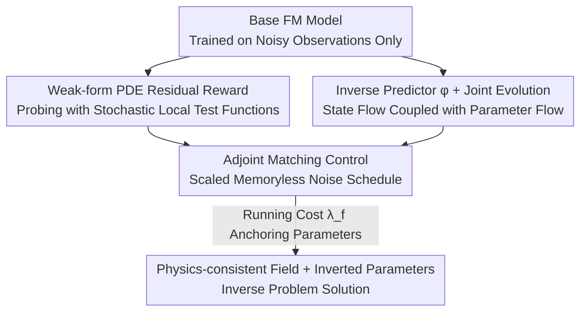

# Physics-Constrained Fine-Tuning of Flow-Matching Models for Generation and Inverse Problems

**Conference**: ICLR 2026  
**OpenReview**: [https://openreview.net/forum?id=khBHJz2wcV](https://openreview.net/forum?id=khBHJz2wcV)  
**Code**: https://github.com/jantauberschmidt/PCFT  
**Area**: Diffusion Models / Scientific Computing / Generative Models  
**Keywords**: Flow Matching, PDE Constraints, Adjoint Matching, Inverse Problems, Post-training Fine-tuning

## TL;DR
This paper proposes a **post-training framework** that fine-tunes a flow-matching generative model, trained solely on observational data, into a "physics-consistent" model. By using weak-form PDE residuals as rewards and leveraging Adjoint Matching to reformulate fine-tuning as a stochastic optimal control problem, the framework introduces an auxiliary "latent parameter" evolution flow. This allows the model to both generate physical fields satisfying PDEs and invert hidden physical parameters (e.g., material coefficients, source terms) even without "solution-parameter" pairs, effectively solving ill-posed inverse problems.

## Background & Motivation
**Background**: Diffusion and flow-matching models have been widely used to build generative models for complex physical systems (atmosphere, ocean, seismic, medical imaging). While these systems exhibit complex dynamics, they are inherently constrained by fundamental principles like conservation laws, symmetries, and boundary conditions. Injecting these physical structures into generative models can simultaneously improve sample fidelity and out-of-distribution generalization.

**Limitations of Prior Work**: Most existing work on "physics-constrained generation" can only handle **simple or global** constraints—such as fixed boundaries or symmetries that hold consistently across the entire distribution. However, real-world PDE residuals are often **parameter-dependent**: the parameter $\alpha$ (permeability, Young's modulus, source term) in the operator $L_\alpha x = 0$ varies per sample, and these parameters are often unobserved.

**Key Challenge**: To naively handle parameter-dependent constraints, one would need to train on the joint distribution of "solutions × parameters." However, parameter labels are often missing, expensive, or high-dimensional, making joint training infeasible. Consequently, inverse problems (inferring unobserved parameters from partial/noisy observations) have not been cleanly solved within data-driven frameworks.

**Goal**: This work decomposes the challenge into two sub-problems: (1) Fine-tuning a pre-trained generator to be PDE-consistent given **only observed states and no parameter labels**; (2) Jointly inverting the latent parameters $\alpha$ during the fine-tuning process.

**Key Insight**: The authors note that the **Adjoint Matching** framework proposed by Domingo-Enrich et al. can strictly reformulate "reward fine-tuning" as a stochastic optimal control problem, where PDE residuals naturally serve as the reward. By coupling a parameter flow in parallel with the state flow, parameter inference for inverse problems can be "welded" into the generation process. This connection between observations and latent parameters is only established during the post-training phase, requiring significantly less data than joint training.

**Core Idea**: Using "weak-form PDE residuals as rewards + Adjoint Matching as control + parallel evolution flow for latent parameters" to transform a standard flow-matching model via **post-training** into a joint generator that is both physics-consistent and capable of parameter inversion.

## Method

### Overall Architecture
Flow Matching (FM) models learn a vector field $v_t(x)$ to transport noise into data via the ODE $\mathrm{d}X_t = v_t(X_t)\,\mathrm{d}t$. This can be rewritten as an SDE that maintains the same marginals by injecting a noise schedule $\sigma(t)$. The goal of this paper is to "tilt" the base model distribution $p(x)$ into $p_r(x)\propto e^{\lambda r(x)}p(x)$ without destroying the learned distribution, where the reward $r$ is defined by PDE residuals.

The pipeline consists of four steps: ① Sample from the base generator and pre-train an **inverse predictor** $\varphi$ to estimate parameters $\alpha_1=\varphi(x_1)$ from the final denoised sample $x_1$ to minimize the weak residual; ② Construct a reward using weak-form PDE residuals; ③ **Parallelize** a parameter flow $v^{ft}_{t,\alpha}$ alongside the state flow $v^{ft}_{t,x}$ in the fine-tuned model, using $\varphi$ to create a "proxy base flow" as an evolution target and regularization anchor for parameters; ④ Formulate the fine-tuning as a stochastic optimal control problem and optimize the control using the consistency loss of Adjoint Matching. The final model samples without noise injection ($\sigma(t)=0$), keeping inference costs identical to the base model.

### Key Designs

**1. Weak-form PDE Residual Reward: Turning Physical Constraints into Differentiable, Low-variance Signals**

Using strong residuals $R_{\text{strong}}(x,\alpha)=\lVert L_\alpha x\rVert^2_{L^2(\Omega)}$ as constraints is problematic: they involve high-order derivatives, making the optimization landscape extremely unstable on noisy or misspecified data. This work adopts **weak-form residuals**—treating the sample $x$ as a discretization of a continuous field $x(\xi)$ and using a set of local polynomial kernel test functions $\psi\in\Psi$ with compact support to probe operator violations:

$$R_{\text{weak}}(x,\alpha)=\frac{1}{N_{\text{test}}}\sum_{i=1}^{N_{\text{test}}}\big\langle L_\alpha x,\;\psi^{(i)}\big\rangle_{L^2(\Omega)}^2.$$

By using integration by parts to transfer derivatives from $x$ to $\psi$, and enforcing $\psi|_{\partial\Omega}=0$ via a mollifier, the method avoids calculating high-order derivatives directly on noisy samples. Each evaluation randomly samples $N_{\text{test}}$ test functions with stochastic centers and scales—these "stochastic local probes" provide low-variance, data-efficient violation signals. Soft penalties for boundary conditions can also be added to the residual. This forms the foundation for stable reward backpropagation.

**2. Parallel Latent Parameter Evolution Flow + Proxy Base Flow: Integrating Inverse Problems into Generation Without Parameter Labels**

The difficulty of fine-tuning lies in the need for **joint** inference of latent parameters. A naive approach would rely solely on the push-forward of $\varphi$ to induce a joint distribution of $(x_1, \alpha_1)$, but the authors argue this is insufficient. This paper allows parameters $\alpha$ to also evolve along a vector field $v^{ft}_{t,\alpha}$ (via an independent head in the architecture), sampled jointly with the state flow $v^{ft}_{t,x}$. Since the base model lacks a ground-truth flow for $\alpha$, an **inverse predictor** is used to create a **proxy base flow**: at state $(x_t, \alpha_t)$, an estimate is first made $\hat x_1=x_t+(1-t)v^{base}_t(x_t)$, $\hat\alpha_1=\varphi(\hat x_1)$, and the direction from current $\alpha_t$ toward the predicted endpoint $\hat\alpha_1$ is defined as the base parameter flow:

$$v^{base}_{t,\alpha}(\alpha_t)=\frac{\hat\alpha_1-\alpha_t}{1-t}.$$

This simulates a "denoising" process for parameters starting from noise $\alpha^{base}_0\sim\mathcal N(0,I)$. Additionally, a regularization flow $v^{reg}_{t,\alpha}(\alpha^{ft}_t)=(\hat\alpha^{base}_1-\alpha^{ft}_t)/(1-t)$ is introduced to pull the parameter trajectory of the fine-tuned model toward the parameter inferred by the base model—preserving sample specificity while justifying joint sampling.

**3. Adjoint Matching + Scaled Memoryless Noise Schedule: Reformulating Fine-Tuning as Low-Variance Stochastic Optimal Control**

By combining state and parameters into an augmented variable $\tilde X_t=(X_t^T,\alpha_t^T)^T$, fine-tuning is strictly formulated as a stochastic optimal control problem:

$$\min_{\tilde u}\;\mathbb E\Big[\int_0^1\big(\tfrac12\lVert\tilde u_t(\tilde X_t)\rVert^2+f(\tilde X_t)\big)\mathrm{d}t+g(\tilde X_1)\Big],\quad \tilde b^{ft}_t=\tilde b^{base}_t+\sigma(t)\tilde u_t.$$

The solution uses **Adjoint Matching**: based on a "reduced adjoint state" $\tilde a_t$, it integrates backward from the terminal $\tilde a_1=\tilde\lambda\nabla_{\tilde x}g(\tilde X_1)$ along the block Jacobian. Control learning is then expressed as a **regression-based consistency loss** $L(\tilde u)=\tfrac12\int_0^1\lVert\tilde u_t+\sigma(t)\tilde a_t\rVert^2\mathrm{d}t$ (gradients pass only through the control $\tilde u$, not the adjoint, saving computation and reducing variance). $\lambda_x, \lambda_\alpha$ adjust the degree of distribution shift.

The authors also introduce a crucial extension: while the original framework uses a unique memoryless noise schedule $\sigma^2(t)=2\eta_t$, this work uses a **scaled version** $\sigma^2(t)=(1-\kappa)\,2\eta_t,\ 0\le\kappa<1$. The authors prove (Lemma 1) that this family of scaled schedules still satisfies the memoryless property, preserving theoretical consistency, but $\kappa$ acts as a numerical stability knob. In PDE models operating directly in pixel space, high-variance noise can push trajectories off the manifold; increasing $\kappa$ suppresses explosions near $t \to 0$ and offers a "control-fidelity" trade-off.

**4. Running Cost Regularization: Preserving Sample-level Details under System Misspecification**

Adjoint Matching tilts the **entire** output distribution toward the reward, but when dealing with observational data or system misspecification, it is often desirable to preserve sample-specific details. The authors found that keeping the inverted coefficients of the fine-tuned model close to those of the base model helps. Thus, a running state cost is added:

$$f(\alpha)=\lambda_f\,\big\lVert v^{ft}_{t,\alpha}(\alpha)-v^{reg}_{t,\alpha}(\alpha)\big\rVert^2,$$

penalizing the deviation of the fine-tuned parameter flow from the direction pointing to the base estimate $\hat\alpha^{base}_1$. $\lambda_f$ provides a smooth trade-off: $\lambda_f=0$ reduces to pure Adjoint Matching (aggressive denoising but erasing base sample details), while larger $\lambda_f$ anchors the final parameter $\alpha_1$ to the base model's value, preserving trajectory-level details. In Darcy experiments, $\lambda_f=1.0$ maintains proximity to base samples while denoising.

### Loss & Training
Training occurs in two stages: first, sampling from the base generator to pre-train the inverse predictor $\varphi$ (minimizing PDE residuals); second, initializing the fine-tuned model from base weights, augmenting $v^{ft}_{t,x}$ to be conditioned on $\alpha_t$, and adding a $v^{ft}_{t,\alpha}$ head. During fine-tuning, trajectories are iteratively sampled using the memoryless noise schedule, adjoint ODEs are solved numerically, and gradient descent is performed on the consistency loss (Eq. 4). All reported results are generated with $\sigma(t)=0$ (no noise injection). The PDE backbone uses U-FNO, and images use a DiT-style latent space FM. Fine-tuning is lightweight: noisy Darcy requires only 20 gradient steps and completes within 15 minutes on a single L40S, with inference costs matching the base model thereafter.

## Key Experimental Results

Evaluations cover five settings: four PDE systems (Elliptic Darcy flow, Linear Elasticity, Helmholtz wave propagation, Incompressible Stokes, involving boundary/system misspecification and observational noise) and one natural image model. All evaluations use 256 samples with shared random seeds; residuals are normalized by reference set means.

### Main Results (Linear Elasticity, Boundary Condition Misspecification)

| Model | BC Error (MSE) ↓ | $R_{\text{weak}}$ (rel) ↓ | $R_{\text{strong}}$ (rel) ↓ | MMD$_x$ ↓ | MMD$_\alpha$ ↓ |
|------|------|------|------|------|------|
| FM (Base) | $6.98\times10^{-5}$ | $1.59\times10^{1}$ | $1.83\times10^{1}$ | 0.24 | 0.05 |
| PBFM | $2.32\times10^{-5}$ | $6.32\times10^{0}$ | $4.22\times10^{0}$ | 0.92 | 0.54 |
| FM+ECI | 0.0 | $1.01\times10^{3}$ | $2.49\times10^{2}$ | 1.16 | 0.36 |
| **Ours** | $\mathbf{1.71\times10^{-6}}$ | $\mathbf{6.15\times10^{0}}$ | $\mathbf{3.79\times10^{0}}$ | $\mathbf{0.15}$ | 0.12 |

Ours achieves the lowest residuals while minimizing distribution drift. PBFM shows low residuals but significant distribution drift (MMD$_x$=0.92). FM+ECI eliminates BC error but results in exploding weak/strong residuals (projection methods introduce discontinuities in local constraints).

### Ablation Study (Helmholtz, Representative Configurations)

| Configuration | $R_{\text{weak}}$ (rel) ↓ | $R_{\text{strong}}$ (rel) ↓ | MMD$_x$ ↓ | Description |
|------|------|------|------|------|
| FM | $1.5\times10^{1}$ | $2.55\times10^{1}$ | 0.18 | Base vs. No loss matching, highest residuals |
| PBFM | $8.33\times10^{0}$ | $1.22\times10^{1}$ | 0.09 | Training-time constraint, lowered residuals |
| Base AM ($\varphi$ frozen) | $4.9\times10^{0}$ | $1.34\times10^{1}$ | 0.15 | Residuals via $\varphi$ only, no parameter flow |
| Base AM + $\varphi$ | $4.99\times10^{0}$ | $1.16\times10^{1}$ | 0.13 | $\varphi$ continued but no joint evolution |
| **AM (Joint)** | $\mathbf{4.3\times10^{0}}$ | $\mathbf{1.05\times10^{1}}$ | $\mathbf{0.06}$ | Joint flow, lowest residual and MMD |

### Key Findings
- **Joint Flow is Crucial**: On Helmholtz, the full joint AM achieved both the lowest residuals and lowest MMD$_x$ (0.06), indicating that parallel parameter flows solve misspecification more thoroughly while preserving distribution fidelity. The two ablations (frozen $\varphi$ or no joint evolution) showed higher residuals and MMD.
- **Dramatic Differences on Stokes**: While all AM variants achieve similar weak residuals ($R_{\text{weak}}\approx4$–15), only the joint model reaches the low MMD$_\alpha$ region (0.07–0.13); the two ablations stagnate at 0.22–0.28. Parameter fidelity is only achievable via joint flows; PBFM diverges here.
- **Controllable Trade-offs**: Increasing $\lambda_x=\lambda_\alpha$ (with $\lambda_f=0$) reduces residuals but decreases inverted parameter diversity. Sweeping $\lambda_f$ with fixed $\lambda$ trades off residuals for distribution fidelity (lower MMD$_x$). Practitioners can select points between "minimum residual" and "distribution fidelity."
- **Cross-domain Transferability**: On a latent space FM pre-trained on ImageNet, treating $\alpha$ as a polynomial color transform outside the latent space and optimizing PickScore with a fixed prompt, the joint fine-tuning produces more vibrant images where background textures and recoloring are adjusted synergistically.

## Highlights & Insights
- **Welding Inverse Problems into Generation**: Traditional approaches either require paired data for training or rely on post-inference projections. This work uses an inverse predictor $\varphi$ to create a proxy base flow and couples it with a parallel parameter evolution flow, enabling joint sampling of $(x_1, \alpha_1)$ even when parameter labels are missing—this is the most ingenious part.
- **Weak Form + Stochastic Test Functions**: Using compact random kernels as "physics violation probes" bypasses instability from high-order derivatives and provides low-variance signals, serving as a practical engineering key for embedding PDE constraints into noisy gradients.
- **Scaled Memoryless Schedule $\kappa$**: A theoretically sound extension that proves a whole family of schedules remains memoryless. This transforms a "unique schedule" into a tunable numerical stability knob, which is particularly important for PDE models operating directly in pixel space.
- **Efficient Post-training**: 20 gradient steps, 15 minutes, and zero extra inference overhead—this "fine-tuning an existing generator for physics consistency" paradigm is highly valuable for adapting existing large models.

## Limitations & Future Work
- The method was validated on a **single PDE family** at a time; future work aims to extend it to coupled PDEs, multi-physics, and stochastic/chaotic dynamics.
- The trade-off between physics fidelity and generative diversity still relies on manual tuning of $(\lambda_x, \lambda_\alpha, \lambda_f)$. Adaptive trade-offs are a future direction.
- Self-identified limitation: The quality of the inverse predictor $\varphi$ acts as a ceiling—in the Darcy example, fragmented $\alpha^{base}$ led to artifacts even with regularization. Inaccurate $\varphi$ can pollute the proxy base flow and parameter inversion.
- Evaluations focused on $[0,1]^2$ regular domains and synthetic reference sets, lacking systematic validation on large-scale real-world scientific datasets and uncertainty quantification (UQ, sensor placement are listed as subsequent directions).

## Related Work & Insights
- **vs. PINNs**: PINNs regress a single solution satisfying the equation and do not build a distribution of solutions; this work is generative, offering multiple feasible samples and handling inverse problems.
- **vs. Bastek et al. (DDPM Physics Residuals) / PBFM**: These embed physics residuals during **pre-training/training time**, requiring full retraining. PBFM often exhibits distribution drift or divergence in this study's experiments. This work is **post-training**, offering better lightweight adaptation and distribution fidelity.
- **vs. Hard Projection Constraints (FM+ECI, Utkarsh et al.)**: These enforce constraints via repeated projections during sampling, but local constraints like boundaries can introduce high residuals or discontinuities (FM+ECI led to strong residual explosions in linear elasticity). This work uses soft constraints + control to smoothly tilt the distribution.
- **vs. Conditional/Guided Diffusion for Inverse Problems**: Traditional methods rely on large amounts of paired data. This work only links observations with latent parameters during post-training, requiring significantly less data and allowing guided sampling of posteriors on sparse observations.

## Rating
- Novelty: ⭐⭐⭐⭐⭐ Seamlessly stitching Adjoint Matching control, weak-form residuals, and parallel latent parameter evolution to solve unpaired inverse problems.
- Experimental Thoroughness: ⭐⭐⭐⭐ Solid results across four PDE families, cross-domain image tests, and multiple ablations, though lacking real-world scientific data and UQ.
- Writing Quality: ⭐⭐⭐⭐ Rigorous derivations and clear diagrams (Fig. 1), though notation-heavy with high mathematical requirements for the reader.
- Value: ⭐⭐⭐⭐⭐ The paradigm of "post-training an existing generator for physics-consistency + parameter inversion" is highly practical and transferable for scientific computing.

<!-- RELATED:START -->

## Related Papers

- [\[ICLR 2026\] Physics vs Distributions: Pareto Optimal Flow Matching with Physics Constraints](physics_vs_distributions_pareto_optimal_flow_matching_with_physics_constraints.md)
- [\[NeurIPS 2025\] Physics-Constrained Flow Matching: Sampling Generative Models with Hard Constraints](../../NeurIPS2025/physics/physics-constrained_flow_matching_sampling_generative_models_with_hard_constrain.md)
- [\[ICLR 2026\] Robust and Interpretable Adaptation of Equivariant Materials Foundation Models via Sparsity-promoting Fine-tuning](robust_and_interpretable_adaptation_of_equivariant_materials_foundation_models_v.md)
- [\[ICLR 2026\] PRO-MOF: Policy Optimization with Universal Atomistic Models for Controllable MOF Generation](pro-mof_policy_optimization_with_universal_atomistic_models_for_controllable_mof.md)
- [\[ICML 2026\] Spectrally Regularized Latent Flow Matching for Turbulence Generation](../../ICML2026/physics/spectrally_regularized_latent_flow_matching_for_turbulence_generation.md)

<!-- RELATED:END -->
