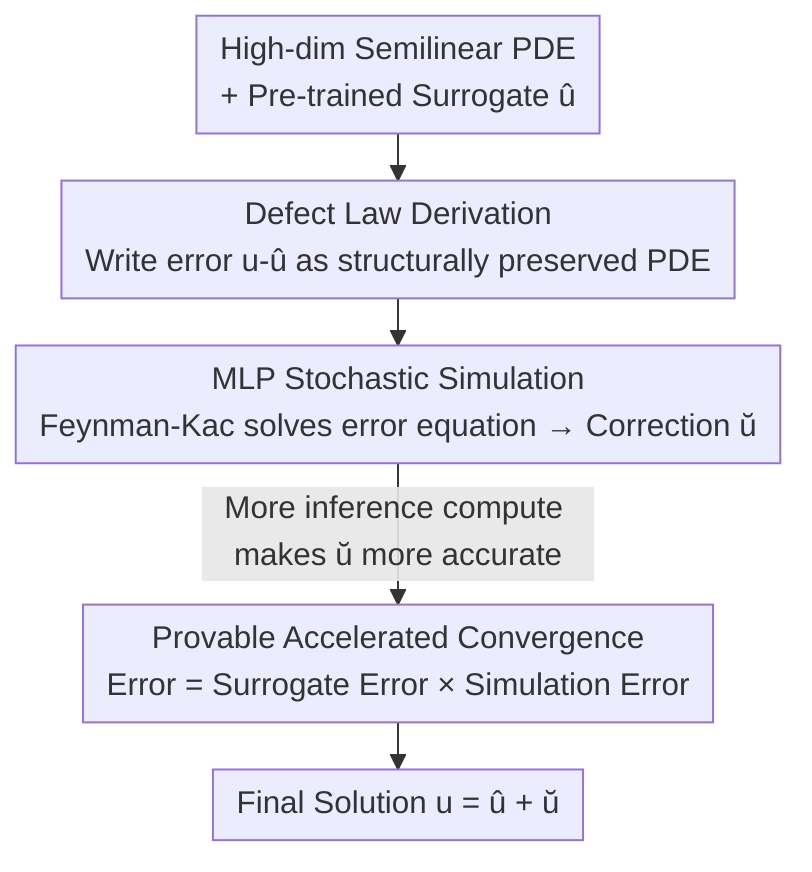

# Physics-Informed Inference Time Scaling for Solving High-Dimensional Partial Differential Equations via Defect Correction

**Conference**: ICLR 2026  
**OpenReview**: [https://openreview.net/forum?id=d2pUyiXwcm](https://openreview.net/forum?id=d2pUyiXwcm)  
**Code**: None  
**Area**: Scientific Computing / Physics-Informed Machine Learning  
**Keywords**: High-dimensional PDEs, Inference-time Scaling, Defect Correction, Multilevel Picard, PINN

## TL;DR
SCaSML reformulates the error of a pre-trained PDE surrogate (e.g., PINN or Gaussian Process) as a structure-preserving semilinear PDE. During inference, this "error equation" is solved via Monte Carlo simulation and added back to the initial solution. Without retraining, this approach reduces solution errors for high-dimensional PDEs (up to 160D) by 20–80%, with a theoretical proof that the final error is the product of "surrogate error × simulation error."

## Background & Motivation
**Background**: High-dimensional semilinear parabolic PDEs (e.g., imaginary-time Schrödinger equations in quantum many-body systems, nonlinear Black–Scholes in finance, HJB equations in optimal control) are central to science and engineering. However, the complexity grows linearly with the number of components, leading to the "curse of dimensionality." Traditional finite element or finite difference methods fail in high dimensions; Scientific Machine Learning (SciML, such as PINNs, neural surrogates, and Gaussian Processes) has become the mainstream alternative for approximating PDE solutions using data-driven models.

**Limitations of Prior Work**: SciML solvers are often "black boxes"—they provide fast approximations but lack **rigorous error guarantees**, potentially introducing hidden biases. For safety-critical applications (e.g., control, pricing), the reliability remains questionable as the magnitude of model error is unknown. Conversely, pure stochastic simulation methods are theoretically sound for high dimensions but suffer from **extreme variance**, often diverging if used in isolation (e.g., the naive MLP in the paper shows a relative error of 5.6 on a 100D LQG problem, making it practically unusable).

**Key Challenge**: There is a gap between the "speed" of machine learning and the "rigorous provability" of numerical simulation. Surrogate models are fast but unproven, while simulations are rigorous but slow and high-variance. These have traditionally been seen as mutually exclusive technical routes.

**Goal**: Can calculation power be systematically and provably spent at **inference time**—similar to Large Language Models—to improve a pre-trained surrogate model by allocating more computation to difficult PDE states and less to simple ones, without any retraining or fine-tuning?

**Key Insight**: The authors draw inspiration from the classical **defect correction** idea in numerical analysis: rather than directly trusting an approximate solution $\hat u$, one should derive and solve a separate equation for its error $\breve u := u - \hat u$. The key observation is that the new PDE satisfied by the error can **inherit the semilinear structure** of the original problem, allowing it to be solved using mature high-dimensional stochastic simulators (based on Feynman–Kac).

**Core Idea**: The "error" itself is modeled as a structure-preserving semilinear PDE (termed the Structural-preserving Law of Defect). During inference, this error is solved via stochastic simulation and added back to the surrogate solution, effectively merging the speed of ML with the rigor of numerical simulation.

## Method

### Overall Architecture
SCaSML (Simulation-Calibrated Scientific Machine Learning) targets a class of semilinear parabolic PDEs:

$$\frac{\partial u}{\partial r} + \mathcal{L}u + F(u, \sigma^\top \nabla u) = 0, \quad u(T,y)=g(y)$$

where $\mathcal{L}u := \langle \mu, \nabla u\rangle + \tfrac{1}{2}\mathrm{Tr}(\sigma^\top \mathrm{Hess}(u)\,\sigma)$ is a second-order linear operator. The pipeline consists of two phases and three steps: First, **train** a standard SciML surrogate $\hat u$ (PINN/GP/Tensor Network) to obtain an initial approximation. At **inference time**, instead of using $\hat u$ directly, a new PDE (Law of Defect) describing the error $\breve u = u - \hat u$ is derived. This error $\breve u$ is solved via Multilevel Picard (MLP) stochastic simulation, leading to the final solution $u_{\text{SCaSML}} = \hat u + \breve u$. This correction is performed only on specific user-requested states, acting as a "targeted patch" rather than a global retrain.

### Key Designs

**1. Structure-Preserving Law of Defect: Treating "Error" as a Structurally Identical PDE**

Classical defect correction is unusable in high dimensions because it relies on mesh refinement hierarchies; neural network errors have neither mesh levels nor polynomial expansions relative to a single resolution parameter. This work utilizes algebraic subtraction. First, define the residual $\epsilon$ by substituting $\hat u$ into the original PDE:

$$\epsilon(r,y) := \frac{\partial \hat u}{\partial r} + \mathcal{L}\hat u + F(\hat u, \sigma^\top \nabla \hat u), \qquad \breve g(y) := g(y) - \hat u(T,y),$$

By subtracting the equation satisfied by $\hat u$ from the original PDE, the equation for the error $\breve u = u - \hat u$ is obtained:

$$\frac{\partial \breve u}{\partial r} + \mathcal{L}\breve u + \breve F(\breve u, \sigma^\top \nabla \breve u) = 0, \quad \breve u(T,y)=\breve g(y),$$

where the modified nonlinearity is $\breve F(\breve u, \sigma^\top\nabla\breve u) := F(\hat u + \breve u, \sigma^\top(\nabla\hat u + \nabla\breve u)) - F(\hat u, \sigma^\top\nabla\hat u) + \epsilon$. Crucially, this error equation remains a **semilinear parabolic PDE** isomorphic to the original—the linear operator $\mathcal{L}$ remains unchanged, while the source term becomes the residual $\epsilon$ and the terminal condition becomes the surrogate's terminal bias $\breve g$. This "structure-preserving" property is the cornerstone of the method, enabling the use of high-dimensional stochastic simulators. To the authors' knowledge, this is the first defect characterization that preserves semilinear structure for high-dimensional Monte Carlo solvers.

**2. Multilevel Picard Stochastic Simulation: Scaling Error Solutions via Inference-Time Compute**

Although the error equation is a PDE, its semilinear parabolic nature allows its solution to be expressed as an expectation via the Feynman–Kac representation—averaging over stochastic process trajectories. In the linear case, $\breve u(s,x) = \mathbb{E}\big[(g(X_T)-\hat u(T,X_T)) + \int_s^T \epsilon(t,X_t)\,dt\big]$, which can be estimated via Monte Carlo. The semilinear case characterizes the solution as a fixed point $\breve u_\infty = \Phi(\breve u_\infty)$ of a Feynman–Kac type backpropagation operator $\Phi$, solved using **Multilevel Picard (MLP)** iteration. MLP uses Multilevel Monte Carlo (MLMC) to write the expectation as a telescoping sum $\mathbb{E}[\breve u_n] = \mathbb{E}[\Phi(\breve u_0)] + \sum_{l=1}^{n-1}\mathbb{E}[\Phi(\breve u_l)-\Phi(\breve u_{l-1})]$. Adjacent levels use the same sample paths (strongly correlated), drastically reducing differential variance. As the level $l$ increases, the iteration converges linearly and variance vanishes linearly. Only a few expensive samples are needed for the finest levels, while most computation is spent on cheap coarse levels. This step is the vehicle for "inference-time scaling": more Monte Carlo samples result in a more accurate correction $\breve u$.

**3. Provable Accelerated Convergence: Final Error = Surrogate Error × Simulation Error**

The theoretical guarantee of this two-step approach is a major highlight. The variance of the MLP simulation depends on the scale of the terminal defect $\breve g$ and the modified nonlinearity $\breve F$, both of which are proportional to the surrogate model's error—the more accurate the surrogate, the "easier" the error equation is to solve. Formally, the global $L^2$ error is bounded by:

$$\sup_{(t,x)} \big\| \breve U_{N,M}(t,x) - \breve u(t,x) \big\|_{L^2} \le E(M,N)\cdot \big(C_F\, e(\hat u)\big),$$

where the final error is the **product** of the MLP simulation error $E(M,N)$ and the surrogate error $e(\hat u)$ ($E(M,N)$ is independent of the surrogate). This product relationship provides superior scaling laws: if the surrogate error decreases as $e(\hat u)\sim m^{-\gamma}$ with $m$ training points, and $m$ additional samples are spent for inference simulation, the variance is $O(m^{-2\gamma})$, and the statistical error after averaging $m$ new paths becomes $\sqrt{m^{-2\gamma}/m} = m^{-\gamma-1/2}$. Under a total budget of $2m$ function evaluations, SCaSML's convergence rate of $m^{-\gamma-1/2}$ outperforms both the pure surrogate ($m^{-\gamma}$) and naive Monte Carlo/MLP ($m^{-1/2}$).

### Loss & Training
The surrogate model follows standard training: PINNs utilize 5 layers with 50 neurons each and tanh activation, trained with Adam (learning rate $7\times10^{-4}$, $\beta_1=0.9$, $\beta_2=0.99$) for $10^4$ steps. Approximately 2500 interior points, 100 boundary points, and 160 terminal points are sampled per step. The inference correction requires no training, only MLP simulation hyperparameters: number of levels $N$ (used $N=2$) and Monte Carlo base $M$ per level (typically $M=10$). Level-wise clipping thresholds (e.g., $0.5(d+1)$) are applied to solutions and gradients to stabilize variance. This "train once, correct as needed" workflow naturally enables **elastic computation**.

## Key Experimental Results

### Main Results
On several high-dimensional semilinear PDEs, the surrogate models (SR: PINN or GP) are compared against naive MLP solvers and SCaSML (full-history). SCaSML achieves the lowest error in nearly all settings.

| Problem | Dimension | SR Rel. $L^2$ | MLP Rel. $L^2$ | SCaSML Rel. $L^2$ | Error Gain |
|------|------|------|------|------|------|
| LCD (Linear Conv-Diff) | 10d | 5.20E-02 | 2.27E-01 | **2.74E-02** | ~47% |
| LCD | 60d | 3.13E-01 | 2.39E-01 | **1.32E-01** | ~58% |
| VB-PINN (Viscous Burgers) | 20d | 1.17E-02 | 8.36E-02 | **4.03E-03** | ~66% |
| VB-GP (Gaussian Process) | 20d | 1.47E-01 | 1.90E-01 | **6.23E-02** | ~58% |
| LQG (HJB-like) | 160d | 1.12E-01 | 5.27E+00 | **9.94E-02** | ~11% |
| DR (Diff-Reaction) | 100d | 1.41E-02 | 8.99E-02 | **1.11E-02** | ~21% |

In the LQG case, naive MLP diverges completely at 100–160 dimensions (errors > 5.0), while the hybrid SCaSML remains stable (0.05–0.10), demonstrating that the fusion of surrogate and simulation provides stability that pure simulation lacks and accuracy that pure surrogates cannot reach.

### Ablation Study
The ablation focuses on comparing SCaSML against its individual components.

| Configuration | Phenomenon | Mechanism |
|------|------|------|
| Surrogate (SR) Only | Moderate error, no guarantees | Black-box surrogate with limited high-dim accuracy. |
| Simulation (Naive MLP) Only | Often diverges in high-dim | High variance, unreliable in isolation. |
| SCaSML (SR + Simulation) | Error reduction 20–80% | Error = Surrogate × Simulation; terms suppress variance mutually. |
| Increasing Inference $M$ | Monotonic accuracy gain | Validates "Inference-time Scaling": compute for accuracy. |

### Key Findings
- **Product Bound is the Core Mechanism**: More accurate surrogates lead to smaller residuals $\epsilon$, making the error equation easier to solve and reducing MLP variance.
- **Small Models + Inference Scaling > Large Models**: Under an equal inference compute budget, a smaller base PINN with targeted correction can outperform a larger PINN, demonstrating "inference-time scaling" in scientific computing.
- **Statistical Significance**: Error reduction is significant ($p \ll 0.001$) across multiple settings and scales with inference samples as $m^{-\gamma-1/2}$.
- **Dimension Robustness**: The gains persist from 10 to 160 dimensions, mitigating the curse of dimensionality.

## Highlights & Insights
- **Solving "Error" as a PDE**: The most elegant aspect is the discovery that the error $u-\hat u$ satisfies a PDE and that it is structure-preserving, allowing the reuse of the same high-dimensional stochastic solver.
- **Closed-form Unbiased One-step Correction**: Unlike Newton-type iterative de-biasing—which causes convergence rates to degrade when nested in Monte Carlo ($O(N^{-1/2})$ to $O(N^{-1/4})$, etc.)—the Law of Defect provides a single-step unbiased correction, avoiding variance explosion.
- **Transferable Product Error Bound**: Any combination of "fast but inaccurate surrogate + rigorous but high-variance solver" can potentially reuse this logic if the surrogate error can be formulated as a structurally similar sub-problem.
- **Training/Inference Separation**: This matches the ML paradigm where a surrogate is trained once to answer globally, while refinement is triggered only for specific states requiring high precision.

## Limitations & Future Work
- **Dependency on Surrogate Accuracy**: Theoretical guarantees rely on the assumption that surrogate residuals are bounded by $e(\hat u)$. If the initial surrogate is extremely poor, the product factor remains large.
- **Theoretical Simplifications**: To maintain conciseness, the main theorem assumes $\mu=0$ and $\sigma=sI_d$. Tightness and constants for general coefficients require further validation.
- **Scope Limited to Semilinear Parabolic PDEs**: The structure-preserving property relies on the original PDE type. It may not hold for fully nonlinear, hyperbolic, or strongly discontinuous problems.
- **Clipping and Variance Control**: Practical implementation requires clipping thresholds for stability. The dependence of results on these engineering heuristics for more difficult problems is not fully explored.

## Related Work & Insights
- **vs. Pure PINN/GP Surrogates**: Surrogates offer fast global approximations but lack guarantees. This work adds a provable inference-time correction without modifying surrogate weights.
- **vs. Naive MLP/Monte Carlo**: Pure simulations suffer from extreme variance in high dimensions. This work uses the surrogate to diminish the source term (residual) first, allowing MLP to solve a significantly "easier" error equation.
- **vs. Classical Defect Correction / Newton De-biasing**: Classical methods require mesh hierarchies (which NNs lack), and Newton iterations in Monte Carlo lead to nested rate degradation. SCaSML bypasses this via the structure-preserving, unbiased defect law.
- **vs. LLM Inference-time Scaling**: This translates the idea of "spending more compute on difficult queries" to scientific computing, enabling a PDE version of inference-time scaling.

## Rating
- Novelty: ⭐⭐⭐⭐⭐ First framework to solve the error itself as a structure-preserving semilinear PDE for provable SciML correction.
- Experimental Thoroughness: ⭐⭐⭐⭐ Covers 4 PDE types up to 160D with PINN/GP surrogates; however, mostly focuses on synthetic PDEs.
- Writing Quality: ⭐⭐⭐⭐ Clear progression from linear warm-ups to semilinear generalizations with a mix of theory and intuition.
- Value: ⭐⭐⭐⭐⭐ Significant for reliability, adding rigorous error bounds and elastic computing to high-dimensional ML solvers.

<!-- RELATED:START -->

## Related Papers

- [\[ICLR 2026\] Riesz Neural Operator for Solving Partial Differential Equations](riesz_neural_operator_for_solving_partial_differential_equations.md)
- [\[ICLR 2026\] Disentangled Representation Learning for Parametric Partial Differential Equations](disentangled_representation_learning_for_parametric_partial_differential_equatio.md)
- [\[AAAI 2026\] Towards a Foundation Model for Partial Differential Equations Across Physics Domains](../../AAAI2026/physics/towards_a_foundation_model_for_partial_differential_equations_across_physics_dom.md)
- [\[ICLR 2026\] $\partial^\infty$-Grid: A Neural Differential Equation Solver with Differentiable Feature Grids](boldsymbolpartialinfty-grid_a_neural_differential_equation_solver_with_different.md)
- [\[ICLR 2026\] Self-Supervised Evolution Operator Learning for High-Dimensional Dynamical Systems](self-supervised_evolution_operator_learning_for_high-dimensional_dynamical_syste.md)

<!-- RELATED:END -->
