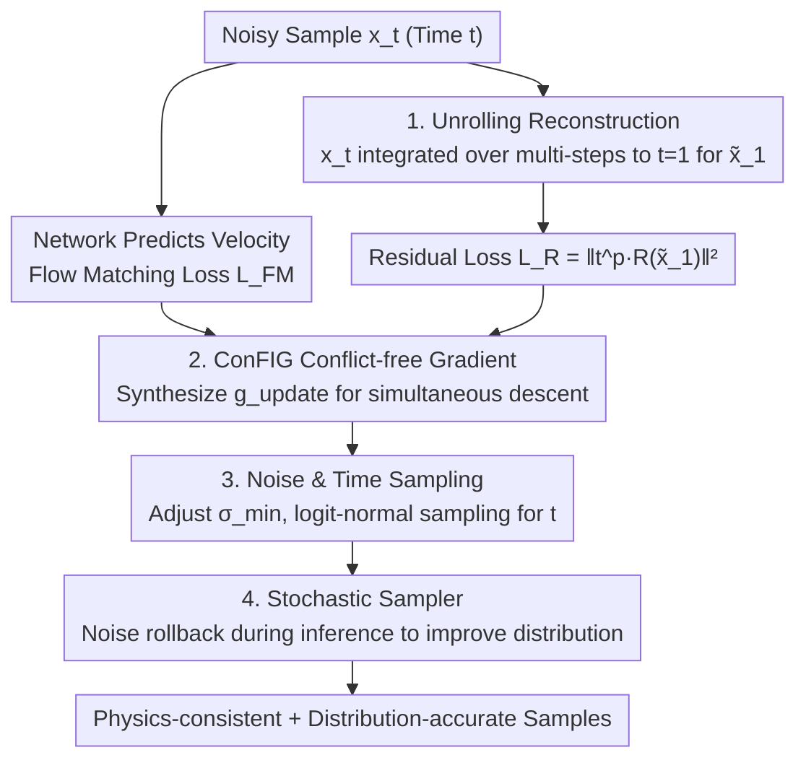

# Physics vs Distributions: Pareto Optimal Flow Matching with Physics Constraints

**Conference**: ICLR 2026  
**OpenReview**: [https://openreview.net/forum?id=tAf1KI3d4X](https://openreview.net/forum?id=tAf1KI3d4X)  
**Code**: https://github.com/tum-pbs/PBFM  
**Area**: Diffusion Models / Scientific Machine Learning / Physics-Constrained Generation  
**Keywords**: Flow Matching, Physics Constraints, Multi-Objective Optimization, Conflict-free Gradients, Jensen Gap

## TL;DR
PBFM incorporates PDE residual constraints as a secondary objective during training. It replaces manual loss weighting with Conflict-free Gradients (ConFIG) and eliminates the Jensen gap by reconstructing clean samples through unrolling. This allows Flow Matching to simultaneously approach physics consistency and distributional accuracy without increasing inference overhead, pushing the Pareto front of "Physics vs. Distribution" forward across three PDE benchmarks.

## Background & Motivation

**Background**: The evolution of physical systems is described by partial differential equations (PDEs), but directly solving high-dimensional, non-linear, or multi-scale problems is computationally expensive. Recently, generative models (DDPM, Flow Matching) have shown strength in capturing complex data distributions. Flow Matching, in particular, has become a powerful tool in scientific machine learning due to its conceptual simplicity and low number of function evaluations. Unlike PINNs, which provide single deterministic solutions, generative models naturally characterize uncertainty, which is crucial for uncertainty quantification in engineering.

**Limitations of Prior Work**: Incorporating physics constraints into generative models is challenging. Optimizing "generation fidelity" and "physics consistency" simultaneously during training often results in **conflicting gradients**—reducing residuals collapses the distribution, while maintaining the distribution spikes the residuals. Existing approaches either perform iterative corrections during inference (e.g., CoCoGen, D-Flow, ECI, PCFM), which are often 10$\times$ to 65$\times$ slower than standard sampling, or add a residual loss term during training (e.g., PIDM), which requires manual tuning of $w_{FM}$ and $w_R$ weights and does not resolve the fundamental conflict.

**Key Challenge**: There exists an **intrinsic Pareto trade-off** between physics accuracy and distributional accuracy—this work is the first to explicitly identify this as a "conflicting objective" problem. Additionally, there is the **Jensen Gap**: physics residuals should ideally be applied to the final clean sample $x_1$, but during training, constraints can only be calculated on the posterior mean of intermediate noisy states $\mathbb{E}[x_1|x_t]$. Since the residual is a non-linear mapping $f$, $\mathbb{E}[f(Z)] \neq f(\mathbb{E}[Z])$, this gap continuously pollutes physics fidelity.

**Goal**: (1) Integrate physics constraints during training to minimize both PDE residuals and distribution loss without manual balancing; (2) Mitigate the Jensen gap without increasing inference costs; (3) Clarify the role of the Gaussian noise scale $\sigma_{min}$ under physics constraints; (4) Systematically compare deterministic and stochastic samplers.

**Core Idea**: Introduce **Conflict-free Gradient (ConFIG)** updates from multi-task optimization into Flow Matching, allowing both generative and physical objectives to descend simultaneously at each step. Use **unrolling** to integrate intermediate states to $t=1$ to obtain more accurate $x_1$ for residual calculation, eliminating the Jensen gap at its source.

## Method

### Overall Architecture

The input to PBFM (Physics-Based Flow Matching) is a noisy sample $x_t$ at time $t$, and the output is a generative model that is both distributionally accurate and satisfies PDE residual constraints. The overall training process involves: the network first predicts the flow matching velocity $u_t^\theta$ and calculates the standard flow matching loss $L_{FM}$; then, $x_t$ is **unrolled** along the ODE to $t=1$ to obtain a reconstructed clean sample $\tilde{x}_1$, on which the physics residual loss $L_R$ is calculated; finally, instead of using a fixed weighted sum, the gradients $g_{FM}$ and $g_R$ from both losses are fed into ConFIG to synthesize an update direction $g_{update}$ that **guarantees simultaneous descent of both objectives**. During inference, a **stochastic sampler** can be used to further enhance distributional fidelity. The entire pipeline is easily embeddable into existing Flow Matching code, and inference overhead remains nearly identical to unconstrained FM-OT.

### Key Designs

**1. Conflict-free Gradient (ConFIG): Replacing manual loss weighting with geometric alignment**

This addresses the pain point where $w_{FM}/w_R$ is difficult to tune manually. Traditional weighted objectives are 
$$L = w_{FM}\|u_t^\theta(x_t,t)-u_t(x_t)\|^2 + w_R\|R(x_1(x_t,t))\|^2,$$
where increasing the residual term harms generation quality and vice-versa. PBFM adopts geometric alignment for the two gradients: let $g_{FM}$ and $g_R$ be the gradients. With the orthogonal operator $O(g_1,g_2)=g_2-\frac{g_1^\top g_2}{|g_1|^2}g_1$ and the unit operator $U(g)=g/|g|$, the synthesized direction is 
$$g_v = U\big[U(O(g_{FM},g_R)) + U(O(g_R,g_{FM}))\big],\quad g_{update}=(g_{FM}^\top g_v + g_R^\top g_v)\,g_v.$$
This construction ensures $g_{update}^\top g_{FM}>0$ and $g_{update}^\top g_R>0$—meaning **both objectives descend** along this direction. It adaptively aligns conflicting gradients, eliminating the need for manual weights and ensuring neither objective collapses the other.

**2. Unrolling for Clean Sample Reconstruction: Mitigating the Jensen Gap**

Physics residuals are only meaningful when applied to the actual clean sample $x_1$. However, intermediate noisy states are provided during training, and single-step extrapolation $\tilde{x}_1 = x_t + dt\cdot u_t^\theta$ introduces significant errors, leading to the Jensen gap. PBFM **unrolls $x_t$ along the ODE**: performing $n$ integration steps with $dt=(1-t)/n$, re-invoking the network $\tilde{u}_t^\theta = \text{model}(\tilde{x}_1,\tilde{t})$ to update $\tilde{x}_1 \leftarrow \tilde{x}_1 + dt\cdot\tilde{u}_t^\theta$ until $\tilde{t}=1$. Multi-step integration better approximates the true trajectory, evaluating residuals on more accurate $x_1$ predictions. This directly reduces residual errors and improves final predictions while **keeping inference costs unchanged** (unrolling only occurs during training). To stabilize training, the number of unrolling steps increases via a curriculum; residuals at $t \approx 0$ are downweighted using a factor $t^p$ ($p_{opt}=1$).

**3. Noise Scale and Time Sampling: Adapting $\sigma_{min}$ for Physics Precision**

In computer vision, Flow Matching typically uses $\sigma_{min}=10^{-3}$. However, under physics constraints, excessive noise perturbs residuals. This paper provides a practical rule: under perfect reconstruction, Gaussian noise of scale $\sigma_{min}$ induces a residual MSE of order $\sigma_{min}^2$. Thus, it is required that $\sigma_{min} \lesssim R_{min}$. For example, dynamic stall scenarios require $\sigma_{min} \lesssim 3\times10^{-4}$. Furthermore, time $t$ is sampled from a **logit-normal distribution** (zero mean, unit variance) instead of a uniform distribution to focus on the $t \approx 0.5$ region where Flow Matching errors are higher.

**4. Stochastic Sampler: Trading Noise Rollback for Distributional Fidelity**

Deterministic ODE sampling collapses all randomness into the initial noise, often under-characterizing the distribution. Inspired by ECI, PBFM introduces stochastic sampling: after evolving from $t$ to $t=1$, a **new noise sample** is used to roll back to $t+dt$. This "temporal backtracking with new noise" increases sampling stochasticity. Whether to roll back is controlled by a threshold $t^*$, where $t^*=0$ is deterministic and $t^*=0.2$ serves as a balanced trade-off point.

### Loss & Training

The total objective consists of the Flow Matching loss $L_{FM}=\|u_t^\theta-u_t\|^2$ and the weighted residual loss $L_R=\|t^p \cdot R(\tilde{x}_1)\|^2$. Notably, these are **not summed**; instead, their individual gradients are synthesized via ConFIG into $g_{update}$ for AdamW updates. Residual types include: Steady-state PDE (e.g., Darcy), Transient conservation laws (e.g., Kolmogorov mass conservation), and Algebraic constraints (e.g., Ideal Gas Law in Dynamic Stall). The backbone is a DiT (Diffusion Transformer).

## Key Experimental Results

Three PDE benchmarks: **Darcy flow** (steady), **Kolmogorov flow** (transient turbulence), and **Dynamic stall** (complex, naca0012, shockwaves). Metrics: Residual Error (RE), Wasserstein Distance (WD), Jensen-Shannon divergence (JS), Number of Function Evaluations (NFE), and Inference Time (IT).

### Main Results

Darcy flow (1024 samples, lower is better):

| Method | RE | WD $\cdot10^2$ | JS $\cdot10^1$ | NFE | IT [s] |
|:---|:---|:---|:---|:---|:---|
| **PBFM (ours)** | 0.838 | 0.138 | 0.256 | 20 | 0.101 |
| FM-OT (Unconstrained) | 4.159 | 0.059 | 0.131 | 20 | 0.100 |
| CoCoGen | 1.320 | 0.249 | 0.360 | 100 | 7.395 |
| PIDM | 0.022 | 3.103 | 3.179 | 100 | 2.050 |
| DiffusionPDE | 3.388 | 0.089 | 0.139 | 20 | 0.590 |
| D-Flow | 2.286 | 0.147 | 0.237 | 20 | 3.126 |
| ECI | 3.045 | 2.892 | 2.818 | 20 | 0.122 |

While PIDM has the lowest residual (0.022), its WD is 3.103, indicating a collapsed distribution. FM-OT has the best distribution but high residuals (4.159). PBFM achieves a superior physics-generation balance (RE=0.838, WD=0.138) with an inference time of 0.101s, successfully pushing the Pareto front.

Kolmogorov flow and Dynamic stall (20 FM steps):

| Dataset | Metric | PBFM | OT-FM | DiffusionPDE | PCFM |
|:---|:---|:---|:---|:---|:---|
| Kolmogorov | RE $\cdot10^1$ | **1.362** | 2.314 | 1.930 | - |
| Kolmogorov | WD $\cdot10^1$ | **1.222** | 2.124 | 3.698 | - |
| Kolmogorov | IT [ms] | 98.97 | 98.75 | 267.8 | - |
| Dynamic Stall | RE $\cdot10^6$ | 0.339 | 11.02 | 12.20 | **0.143** |
| Dynamic Stall | WD $\cdot10^4$ | **1.814** | 2.707 | 2.509 | 4.013 |
| Dynamic Stall | IT [ms] | 60.47 | 59.75 | 171.7 | 3906 |

PBFM leads across almost all metrics for conditional benchmarks. In Dynamic Stall, PCFM achieves a lower residual (0.143) but at the cost of poorer distribution and approximately 65$\times$ slower inference (3906ms vs 60.47ms).

### Ablation Study

| Configuration | Key Finding |
|:---|:---|
| ConFIG only (no unroll) | Limited improvement, proving Jensen Gap is the main bottleneck. |
| + Unrolling 1$\rightarrow$4 steps | Residual MAE continuously decreases; unrolling successfully mitigates the Jensen gap. |
| Stochastic sampler $t^*=0$ | WD $\cdot10^2$=1.470 (poor); deterministic sampling lacks distributional fidelity. |
| Stochastic sampler $t^*=0.2$ | WD $\cdot10^2$=0.138 (optimal); balances low residuals with high fidelity. |

### Key Findings
- **The Jensen Gap is the bottleneck for physics accuracy**: ConFIG alone provides limited improvement; it must be paired with unrolling to suppress residuals without increasing inference costs.
- **Physics vs. Distribution is a genuine trade-off**: Baselines align along a negative slope (lower residual = worse distribution). PBFM pushes the entire front forward rather than just shifting along it.
- **Robustness to NFE**: PBFM achieves high physics accuracy even with few FM steps, making it ideal for compute-constrained scenarios.

## Highlights & Insights
- **Introducing Conflict-free Gradients to physics-constrained generation**: ConFIG's geometric alignment ensures simultaneous descent of both objectives, eliminating the difficulty of manual loss weighting. This approach is transferable to any task involving fidelity-constraint conflicts.
- **Unrolling as a remedy for the Jensen Gap**: The theoretical defect of evaluating residuals on noisy states is resolved by multi-step integration during training. This clean engineering solution has zero overhead at inference.
- **Practical rule for $\sigma_{min}$**: Establishing a quantitative relationship between noise scale and reachable physics precision ($\sigma_{min}^2 \approx$ Residual MSE) provides strong guidance for hyperparameter tuning in scientific ML.

## Limitations & Future Work
- **Increased Training VRAM**: Unrolling requires storing intermediate states for backpropagation. While only backpropagating the last step mitigates this, training remains more expensive than unconstrained models.
- **Differentiable Residual Requirement**: The method relies on efficient calculation of PDE/algebraic residuals. Its applicability to extremely complex or non-differentiable residuals requires further verification.
- **Soft Constraints**: PBFM does not strictly satisfy constraints (soft constraints). Scenarios requiring exact conservation may still require PCFM-like inference corrections.
- The Darcy benchmark lacks conditional inputs, which may not fully reflect real-world application complexity.

## Related Work & Insights
- **vs. PIDM**: PIDM uses fixed weighting and suffers from gradient conflict. PBFM uses ConFIG for adaptive alignment and unrolling for better clean sample reconstruction.
- **vs. PIDDM**: PIDDM requires training two models. PBFM uses a single model with unrolling and ConFIG to resolve the fundamental physics-distribution conflict.
- **vs. Inference-time methods (CoCoGen, PCFM, etc.)**: These methods are 10$\times$--65$\times$ slower due to iterative correction. PBFM moves the constraint processing to the training phase, making inference as fast as standard Flow Matching.

## Rating
- Novelty: ⭐⭐⭐⭐⭐ First to explicitly identify the Pareto trade-off and resolve both conflict and the Jensen gap using ConFIG and unrolling.
- Experimental Thoroughness: ⭐⭐⭐⭐ Covered three residual types and six baselines, though dataset scales are somewhat limited.
- Writing Quality: ⭐⭐⭐⭐ Clear motivation, complete algorithms, and effective methodology positioning.
- Value: ⭐⭐⭐⭐⭐ Easy to integrate, zero extra inference cost, and generalizes across tasks. Scientific ML toolbox addition.

<!-- RELATED:START -->

## Related Papers

- [\[ICLR 2026\] Physics-Constrained Fine-Tuning of Flow-Matching Models for Generation and Inverse Problems](physics-constrained_fine-tuning_of_flow-matching_models_for_generation_and_inver.md)
- [\[NeurIPS 2025\] Physics-Constrained Flow Matching: Sampling Generative Models with Hard Constraints](../../NeurIPS2025/physics/physics-constrained_flow_matching_sampling_generative_models_with_hard_constrain.md)
- [\[ICLR 2026\] From Cheap Geometry to Expensive Physics: A Physics-agnostic Pretraining Framework for Neural Operators](from_cheap_geometry_to_expensive_physics_a_physics-agnostic_pretraining_framewor.md)
- [\[ICLR 2026\] FM4NPP: A Scaling Foundation Model for Nuclear and Particle Physics](fm4npp_a_scaling_foundation_model_for_nuclear_and_particle_physics.md)
- [\[ICLR 2026\] Overtone: Cyclic Patch Modulation for Clean, Efficient, and Flexible Physics Emulators](overtone_cyclic_patch_modulation_for_clean_efficient_and_flexible_physics_emulat.md)

<!-- RELATED:END -->
