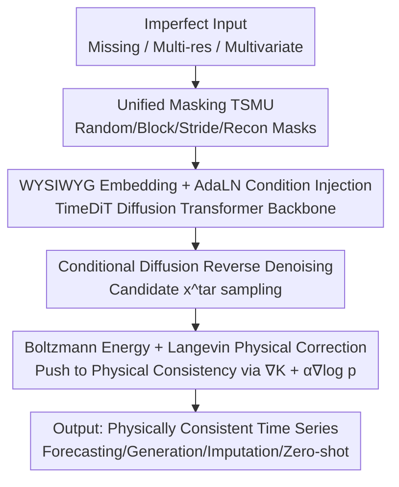

# PINFDiT: Energy-Based Physics-Informed Diffusion Transformers for General-purpose Time Series Tasks

**Conference**: ICLR 2026  
**OpenReview**: [https://openreview.net/forum?id=EphTlUJ4XN](https://openreview.net/forum?id=EphTlUJ4XN)  
**Code**: TBD  
**Area**: Physics-informed Machine Learning / Diffusion Models / Time Series / PDE Solving  
**Keywords**: Diffusion Transformer, Physics Injection, Langevin Correction, Boltzmann Energy, Zero-shot Forecasting

## TL;DR
PINFDiT utilizes a Diffusion Transformer with a unified masking strategy as a "statistical generalist," then inserts a training-free, architecture-agnostic physical correction step during the **inference stage**. By treating PDE residuals as energy terms and employing calibrated Langevin dynamics to pull generated samples toward solutions satisfying physical laws, it achieves state-of-the-art (SOTA) performance across scientific time series tasks including forecasting, generation, imputation, anomaly detection, and zero-shot tasks.

## Background & Motivation
**Background**: Scientific time series analysis (fluids, climate, physiological signals) has long been dominated by specialized models—TCN, LSTM, GNN, and Transformers optimized for forecasting, imputation, anomaly detection, or generation. Recently, time series foundation models (TimesFM, Moirai, Chronos) aim to be generalists, while diffusion methods (CSDI, DiffusionTS, TSDiff) bring capabilities for generation and uncertainty quantification.

**Limitations of Prior Work**: Scientific scenarios expose the "messiness" of reality. First, **imperfect data**—missing values break temporal continuity, multi-resolution sampling leads to inconsistent information density across variables, and irregular intervals break equispaced assumptions. Second, **data scarcity**—data collection in high-energy physics, climate, and biomedicine is extremely expensive. Third, **lack of physical consistency**—black-box predictions fail to obey conservation laws or hard constraints like physiological boundaries, rendering them untrustworthy to scientists. Simple channel-independent methods, while benefiting temporal modeling, lose inter-variable correlations.

**Key Challenge**: To make a model both "flexibly generative like data-driven models" and "constraint-abiding like physical models," traditional approaches involve putting PDE residuals into the training loss (PINN, DeepONet, FNO). However, this requires retraining for every physical system and struggles when data is scarce. Simulation-based inference (SBI) avoids explicit likelihoods but requires massive simulations and differentiable simulators, making it hard to scale to long sequences. The fundamental contradiction is: **exact likelihood $\log p(x^{tar}|x^{con})$ is uncomputable for complex temporal distributions**, while "stuffing" physical knowledge into parameters is too heavy.

**Goal**: To build a unified framework that handles imperfect data (missing/multi-resolution/multivariate) and injects arbitrary PDE physical knowledge without retraining or changing architecture.

**Key Insight**: **Decouple** "learning a good universal generative model" from "refining for specific physics." The former is handled offline by a Diffusion Transformer, while the latter is a lightweight correction during sampling. The authors' key theoretical insight is that the optimal distribution under physical regularization has a **closed-form Boltzmann distribution**, allowing correction to be implemented via step-by-step sampling using Langevin dynamics with convergence guarantees.

**Core Idea**: Treat PDE residuals as an energy term $K(x^{tar};F)$. Prove that the optimal solution of "model distribution × physical energy" is a Boltzmann distribution, and sample from it during inference using calibrated Langevin dynamics to achieve a model-editing-free "generalist to specialist" transition.

## Method

### Overall Architecture
PINFDiT consists of two stages: **offline training of a universal time series Diffusion Transformer (TimeDiT backbone)**, and **insertion of physical correction during inference**. On the training side, raw inputs (with missing values, multi-resolution, and varied shapes) pass through a "Time Series Masking Unit" (TSMU) to be unified into an observation condition $x^{con}_0$ and a generation target $x^{tar}_0$. These are mapped to tokens via a "What You See Is What You Get" (WYSIWYG) embedding layer and fed into TimeDiT Blocks (using AdaLN for condition injection) for conditional diffusion denoising. During inference, the model generates a candidate $x^{tar}$ via a standard DDPM reverse process, followed by $k$ steps of Langevin correction to push the sample toward a physically consistent solution along the gradient of "physical energy + model likelihood."

The pipeline follows a serial structure: "Unified Masking → Diffusion Denoising → Physical Langevin Correction." The framework is shown below:

### Key Designs

**1. Unified Masking Unit TSMU: Handling all imperfect data and tasks with one masking scheme**

Scientific time series are challenging because missing values, multi-resolution, and irregular sampling usually require specialized architectures. TSMU constructs a unified mask $M$ to distinguish observations $x^{con}_0$ and targets $x^{tar}_0$ (shape $\mathbb{R}^{B\times L\times K}$) using four specialized masks: random mask $M_R$, block mask $M_B$, stride mask $M_S$, and reconstruction mask $M_{Rec}$. This leverages the diffusion model's inherent ability to "denoise specific regions under exact conditions"—masking the future for forecasting, missing points for imputation, and reconstructing for anomaly detection. This allows **task switching without architecture changes** on the same model, which is the source of its zero-shot capability. Ablations show that the stride mask is most critical; removing it on Solar data causes MSE to jump from 0.424 to 0.862.

**2. WYSIWYG Embedding + AdaLN Condition Injection: Preserving multivariate correlation and temporal continuity**

Unlike PatchTST's channel-independent patches or vector quantization, PINFDiT uses a "What You See Is What You Get" (WYSIWYG) philosophy: treating $x^{con}_0$ and noisy $x^{tar}_0$ as continuous arrays and **directly** mapping them to embedding vectors without patching or channel independence. This preserves inter-variable correlations. For conditional injection, the diffusion step $t$ is injected into the target noise representation, while observation conditions are injected via Adaptive Layer Normalization (AdaLN) rather than simple concatenation:

$$\text{AdaLN}(h,c)=c_{scale}\,\text{LayerNorm}(h)+c_{shift}$$

where $c_{scale}$ and $c_{shift}$ are derived from $x^{con}_0$. This modulation permeates every layer with "scale + shift" observational information, which is vital for maintaining temporal continuity and evolution trends. In ablations, it outperforms additive (Add) or Cross-Attention (CA) methods.

**3. Boltzmann Energy Closed-form Solution: Writing physical regularization as a samplable distribution**

Physical laws are expressed as PDEs $\frac{\partial x}{\partial\tau}=F(\tau,x,u,\partial x/\partial u_i,\dots)$. Consistency is measured by the squared residual energy $K(x^{tar};F)=-\|\frac{\partial x^{tar}}{\partial\tau}-F(\cdots)\|_2^2$ (maximized at 0 when fully consistent). Treating physical knowledge as explicit regularization, the problem is to solve $q^*=\arg\max_q\big[\mathbb{E}_{x^{tar}\sim q}K(x^{tar};F)-\alpha D_{KL}(q\|p)\big]$. Theorem 3.1 provides the closed-form solution—the optimal $q$ is a Boltzmann distribution defined on the energy $E=K(x^{tar};F)+\alpha\log p(x^{tar}|x^{con})$:

$$q(x^{tar}|x^{con})=\frac{1}{Z}\exp\!\big(K(x^{tar};F)+\alpha\log p(x^{tar}|x^{con})\big)$$

This step is the theoretical fulcrum: it shows that "physics injection" is equivalent to "sampling from an energy distribution" without editing model weights.

**4. Calibrated Langevin Physical Correction: A retraining-free "Generalist-to-Specialist" inference plugin**

The Boltzmann distribution can be sampled using Langevin dynamics, expanding $\nabla\log q$ into model and physical terms:

$$x^{tar}_{j+1}=x^{tar}_j+\epsilon\nabla K(x^{tar}_j;x^{con})+\alpha\epsilon\nabla\log p(x^{tar}_j|x^{con})+\sqrt{2\epsilon}\,\sigma,\quad\sigma\sim\mathcal{N}(0,1)$$

The uncomputable likelihood $\log p$ is approximated by the diffusion denoising objective $\log p(x^{tar}|x^{con})=-\mathbb{E}_{\epsilon,t}[\|\epsilon_\theta(x^{tar},t;x^{con})-\epsilon\|^2]$. Correction thus becomes $k$ steps of gradient updates on the pre-trained model (Algorithm 1). This requires **no architecture changes or retraining**, treating the diffusion model as a statistical generalist and the Langevin correction as a domain specialist. Convergence is guaranteed by Theorem 3.2: $D_{KL}(q_N\|q^*)\le O(d/\sqrt{N}+\varepsilon^2_{score})$. Lemma 3.3 further proves that as KL decreases, the variance of physical residuals $\text{Var}_q[e_r]\le 2L^2 D_{KL}(q\|q^*)+4L^2\delta^2$ also drops—translating statistical convergence directly into physical consistency.

### Loss & Training
The training phase uses a standard conditional diffusion framework aiming to minimize the denoising $\epsilon$-prediction loss. The masking strategy randomly switches between the four mask types during training to achieve self-supervised multi-task unification. Physical correction occurs entirely during inference, controlled by step size $\epsilon$, correction steps $k$, and the balance coefficient $\alpha$.

## Key Experimental Results

### Main Results

Physics-guided prediction (6 PDE simulation systems, comparing foundation/deep/physical models and SBI methods):

| System | Metric | PINFDiT | PINFDiT(w/o Phys) | Best Found. Model Chronos-T5-B | CSDI |
|------|------|---------|-------------------|--------------------------|------|
| Advection | RMSE | **0.0039** | 0.0052 | 0.0414 | 0.0118 |
| Burgers | RMSE | **0.0133** | 0.0136 | 0.0202 | 0.0167 |
| Navier-Stokes | RMSE | **0.0037** | 0.0039 | 0.0081 | 0.0094 |
| Diffusion-Sorption | RMSE | **0.0052** | 0.0057 | 0.0019 (CSDI better) | 0.0012 |

Compared to Chronos-T5-B, Advection RMSE decreased by 88.3%, Burgers by 35.1%, and Navier-Stokes by 54.3%. On real-world ERA5 climate data (2m temperature), PINFDiT(Full) achieved an ACC of 0.987 across all lead times, outperforming ClimODE (0.96).

Forecasting in imperfect scenarios (Win in 19 out of 23 metrics, MAE/MSE):

| Dataset | Metric | PINFDiT | Runner-up | Gain |
|--------|------|---------|------|------|
| Air Quality | MAE | **0.457** | 0.521 (DiffTS) | -12.97% |
| MIMIC-III | MSE | **0.534** | 0.681 (CSDI) | -6.17% |
| PhysioNet(c) | MSE | **0.561** | 0.695 (CSDI) | -19.28% |

### Ablation Study

Component ablation under zero-shot settings (Solar / Electricity, CRPS_sum):

| Configuration | Solar | Electricity | Description |
|------|-------|-------------|------|
| Full PINFDiT | 0.424 | 0.030 | Full model |
| w/o Phys | 0.445 | 0.033 | No physical correction |
| w/o Random Mask RM | 0.465 | 0.035 | |
| w/o Stride Mask SM | **0.862** | **0.101** | Most critical component |
| w/o Block Mask BM | 0.469 | 0.037 | |
| patch token (PT) | 0.874 | 0.145 | Worse than direct embedding |
| Additive (Add) | 0.677 | 0.079 | Worse than AdaLN |
| Cross-Attention (CA) | 0.711 | 0.077 | Worse than AdaLN |

### Key Findings
- **Stride masking is the lifeblood of the unified framework**: Removing it caused Solar MSE to more than double, indicating it is primary for modeling multi-resolution/irregular sampling.
- **Physical correction provides stable marginal gains**: w/o Phys leads to a roughly 5% drop across tasks, but its value lies in "physical consistency" (qualitative change) as a zero-cost inference plugin.
- **WYSIWYG direct embedding significantly outperforms patch tokens**: Patch tokens performed worst in zero-shot settings, confirming the importance of preserving inter-variable correlations.
- **AdaLN is the optimal condition injection method**, superior to concatenation, addition, or cross-attention.

## Highlights & Insights
- **Shifting physics injection from training to inference via Boltzmann solutions**: This decoupling allows the physics component to be model-agnostic and transferable without retraining, requiring only a change in the energy term $K$ for new systems.
- **Bridges statistical convergence and physical consistency**: Lemma 3.3 linking KL convergence to physical residual variance provides a quantifiable basis for "more correction steps = better physical obedience."
- **One mask to rule all tasks**: TSMU's design unifies forecasting, imputation, and anomaly detection into a single self-supervised framework, providing a clean path for time series foundation models.

## Limitations & Future Work
- **Small quantitative physical gains**: While consistency improves, RMSE only drops by ~5% on many tasks. Direct quantitative metrics for conservation law violations were not extensively provided.
- **Reliance on known PDE forms**: $K$ requires physical laws to be written as differentiable PDE residuals, which is not applicable to unknown or empirical constraints.
- **Inference overhead**: Each sample requires $k$ additional Langevin correction steps; sensitivity to $\epsilon$, $k$, and $\alpha$ needs further exploration regarding computational costs.
- Future work: Extending physical terms to soft/empirical constraints and implementing adaptive early stopping for correction steps.

## Related Work & Insights
- **vs PINN / DeepONet / FNO**: These use PDE residuals in training loss; PINFDiT uses them only at inference, making it more flexible and data-efficient.
- **vs SBI**: PINFDiT models the trajectory distribution directly and uses ELBO to approximate likelihood, bypassing the need for simulators.
- **vs Diffusion Methods**: PINFDiT is the first to cover all major time series tasks with a unified Transformer and post-hoc physical correction.
- **vs TSFM (TimesFM / Moirai)**: Foundation models are generalists lacking physical constraints; PINFDiT adds a "specialist" refinement layer.

## Rating
- Novelty: ⭐⭐⭐⭐⭐ Proving the optimal distribution as a Boltzmann closed-form and creating a training-free inference plugin is innovative and theoretically grounded.
- Experimental Thoroughness: ⭐⭐⭐⭐ Broad coverage of tasks and datasets, though individual quantitative value of the physical term could be more distinct.
- Writing Quality: ⭐⭐⭐⭐ Clear theory and methodology, though some minor notation inconsistencies exist.
- Value: ⭐⭐⭐⭐⭐ Provides a clean, reusable paradigm for "Foundation Model + Physics Constraints."

<!-- RELATED:START -->

## Related Papers

- [\[ICLR 2026\] Orbital Transformers for Predicting Wavefunctions in Time-Dependent Density Functional Theory](orbital_transformers_for_predicting_wavefunctions_in_time-dependent_density_func.md)
- [\[ICLR 2026\] Physics-Informed Inference Time Scaling for Solving High-Dimensional Partial Differential Equations via Defect Correction](physics-informed_inference_time_scaling_for_solving_high-dimensional_partial_dif.md)
- [\[ICLR 2026\] Learning Escorted Protocols For Multistate Free-Energy Estimation](learning_escorted_protocols_for_multistate_free-energy_estimation.md)
- [\[ICLR 2026\] Fast training of accurate physics-informed neural networks without gradient descent](fast_training_of_accurate_physics-informed_neural_networks_without_gradient_desc.md)
- [\[ICLR 2026\] Proximal Diffusion Neural Sampler](proximal_diffusion_neural_sampler.md)

<!-- RELATED:END -->
