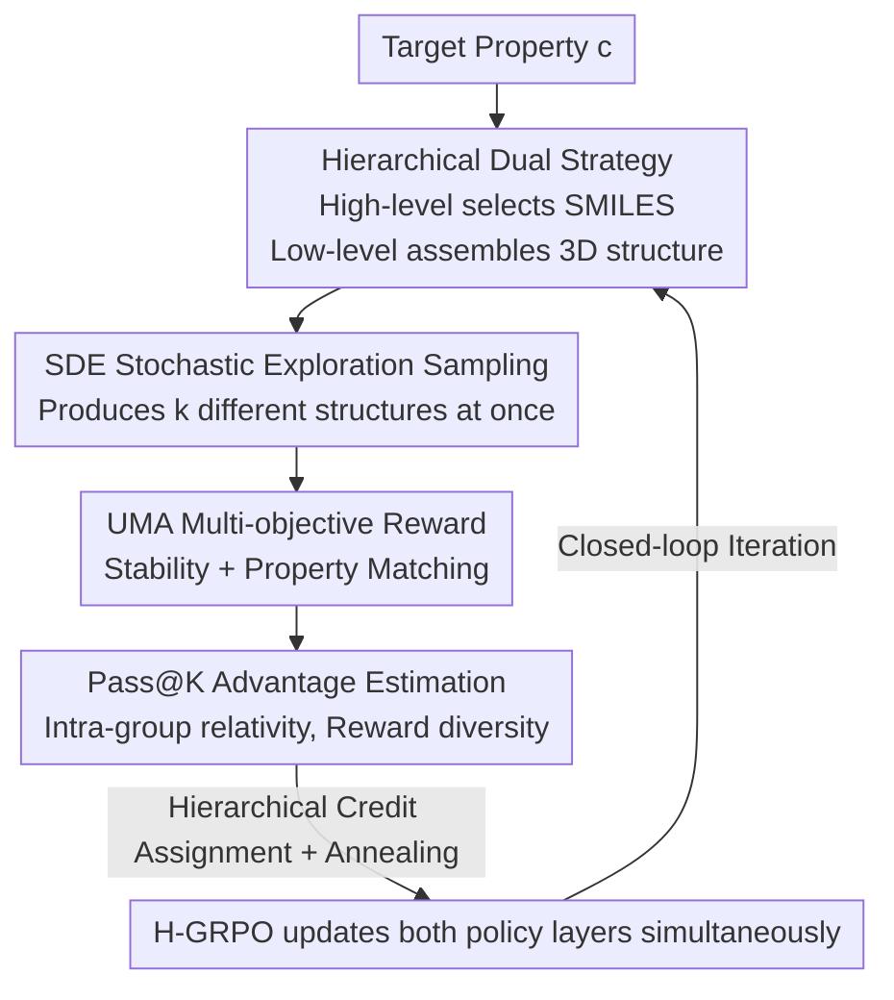

# PRO-MOF: Policy Optimization with Universal Atomistic Models for Controllable MOF Generation

**Conference**: ICLR 2026  
**OpenReview**: [https://openreview.net/forum?id=BIzrFlp0hv](https://openreview.net/forum?id=BIzrFlp0hv)  
**Code**: None  
**Area**: AI for Science / Material Generation / Reinforcement Learning  
**Keywords**: Metal-Organic Frameworks, Hierarchical Reinforcement Learning, Flow Matching, Universal Atomistic Potentials, Pass@K

## TL;DR
PRO-MOF decomposes the inverse design of Metal-Organic Frameworks (MOFs) into a two-layer strategy: "selecting chemical building blocks first, then assembling 3D structures." It employs a pre-trained Universal Atomistic Model (UMA) as a high-fidelity physical environment to provide rewards. By rewriting the deterministic Flow Matching generator into a Stochastic Differential Equation (SDE) to support exploration and utilizing a Pass@K version of GRPO to suppress diversity collapse, the method significantly outperforms diffusion models and genetic algorithms in success rates and optimal material quality across three inverse design tasks: $CO_2$ adsorption, pore size targeting, and minimum energy discovery.

## Background & Motivation
**Background**: Due to their massive internal surface areas and tunable pore environments, MOFs are star materials for carbon capture, gas storage, and catalysis. However, the combinatorial space of building blocks and topologies is astronomically large, making exhaustive searching infeasible. Recent generative methods (e.g., DiffCSP, MOFDiff using coarse-grained diffusion, and MOFFlow-2 using a flexible assembly framework) can learn the statistical distribution of atomic arrangements and connectivity to generate geometrically plausible new structures.

**Limitations of Prior Work**: Geometric plausibility masks a fatal flaw: the lack of intrinsic physical feasibility. By evaluating thousands of generated structures with the universal machine learning interatomic potential UMA, the authors found that the energy distribution of generated MOFs is significantly higher and wider than that of real synthesizable materials. This represents an "Energy Gap," where many structures that appear complete are actually physically unstable.

**Key Challenge**: Integrating physical realism directly into the training loop (using UMA as a reward for RL) seems natural but introduces a more subtle pitfall. Standard policy optimization rewards "individual successful samples" (Pass@1 reward), naturally favoring exploitation over exploration. Generators quickly learn to shrink into "safe zones" in chemical space that reliably yield stability, ceasing to explore new topologies and leading to severe mode collapse. For a task aimed at "discovering new materials," converging to a local optimum is a fundamental failure.

**Goal**: Simultaneously address the physical reality gap and diversity collapse to achieve controllable, de novo MOF inverse design, ensuring generated structures are stable, meet user-defined performance targets, and remain diverse.

**Key Insight**: MOF design is naturally hierarchical—the discrete chemical composition space and the high-dimensional continuous geometric assembly space have vastly different properties. Forcing them into a single policy makes optimization and credit assignment difficult. The generation is explicitly split into two specialized policies: "high-level component selection + low-level structural assembly," with a closed loop back-propagating physical rewards to both layers.

**Core Idea**: Combining Hierarchical Reinforcement Learning, high-fidelity physical environments (UMA), and Pass@K rewards. This tripartite approach uses two-layer policies to co-design chemistry and geometry, employs UMA to provide physical rewards to bridge the energy gap, and uses Pass@K intra-group diversity rewards to combat collapse.

## Method

### Overall Architecture
PRO-MOF models de novo MOF generation as a two-stage hierarchical policy optimization problem, optimizing "what components to select" and "how to assemble them" in a closed loop. In one iteration: the high-level policy ("The Chemist") autoregressively outputs a sequence of MOF building blocks for a target property $c$. The low-level policy ("The Structural Engineer") takes these components and uses a stochastic sampler to explore $k$ different 3D assembly schemes simultaneously. The Universal Atomistic Model (UMA) evaluates these $k$ structures individually to provide physical rewards. An H-GRPO module calculates relative intra-group advantages and back-propagates updates to both policy layers, closing the loop. The final structure $S = f(a^{chem}, a^{geom})$ is a deterministic function of the two-layer actions.

### Key Designs

**1. Hierarchical Dual Strategy Decoupling Chemistry and Geometry: High-level "Chemist" + Low-level "Structural Engineer"**

To address the distinct search challenges of discrete chemical space and continuous geometric space, PRO-MOF splits generation into two layers. The high-level policy $\pi^{chem}_\theta$ is an autoregressive Transformer where the action $a^{chem}$ generates a normalized SMILES sequence of building blocks: `<BOS> m1.m2... <SEP> o1.o2... <EOS>`, where metal clusters $m_i$ precede organic linkers $o_j$, sorted by molecular weight, yielding a set of 2D chemical components $B_{2D}$. The low-level policy $\pi^{geom}_\phi$ is a conditional Flow Matching model. It first initializes components as 3D blocks $B_{3D}$ using a predefined metal cluster library and RDKit. Its action $a^{geom}$ determines the optimal assembly—generating continuous parameters for rigid body translation $\tau$, rotation $q$, linker flexible torsion $\phi$, and global lattice $\ell$. The network is a non-equivariant Transformer that learns a time-varying velocity field $v_\phi$ to transport noise to the correct structural parameters. Training these layers separately with maximum likelihood would repeat the issues of physical gaps and collapse; therefore, they must be trained jointly using RL.

**2. Rewriting Deterministic Flow Matching as an SDE to Support Stochastic Exploration**

The low-level Flow Matching generator inherently solves a deterministic ODE $\mathrm{d}x_t = v_t(x_t)\,\mathrm{d}t$. While efficient, its determinism prevents the stochasticity required for online RL exploration—the same components would always assemble into the same structure. Following the "Flow-GRPO" logic, the authors rewrite the probability flow ODE into an equivalent time-reverse SDE. For rectified flow (where $p_t$ is an interpolation between $p_0$ and $p_1$), the score term $\nabla\log p_t(x_t)$ can be expressed via the velocity field $v_t$, yielding a tractable SDE:

$$\mathrm{d}x_t = \left[v_\phi(x_t,t) + \frac{\sigma_t^2}{2t}\big(x_t + (1-t)v_\phi(x_t,t)\big)\right]\mathrm{d}t + \sigma_t\,\mathrm{d}w,$$

where $\sigma_t$ is a time-varying diffusion coefficient controlling randomness intensity and $\mathrm{d}w$ is a standard Wiener process. This transforms the low-level policy into a Gaussian policy $\pi_\phi(x_{t-1}\mid x_t, c)$, allowing multiple distinct 3D structures to be sampled from the same set of components, which is the prerequisite for GRPO intra-group contrast and effective exploration.

**3. UMA Multi-objective Physical Reward: Managing Stability and Property Matching**

To bridge the energy gap, reward signals must come from high-fidelity physical evaluations. PRO-MOF defines a multi-objective reward using UMA (a SOTA universal machine learning interatomic potential acting as a fast proxy for DFT). For a structure $S$ under target $c$:

$$R_{total}(S,c) = w_{stability}R_{stability}(S) + w_{property}R_{property}(S,c).$$

The stability reward is derived from the relaxed potential energy $E_{UMA}(S)$ calculated by UMA, set as $R_{stability} = -\log(E_{UMA}(S) - E_{min})$, encouraging low-energy, physically feasible configurations. The property matching reward $R_{property}$ measures how well the UMA-predicted structural properties (e.g., $CO_2$ adsorption capacity, pore diameter) align with the target condition $c$. Explicitly embedding physical stability into the reward is the fundamental difference from generators that only learn geometric distributions.

**4. Pass@K Advantage Estimation + Hierarchical Credit Assignment to Combat Collapse**

To address the collapse problem where Pass@1 pushes the policy toward repeatedly producing a single high-reward structure, the low-level geometric policy adopts a Pass@K version of GRPO. For a set of components $a^{chem}$, $k$ candidates $\{S_1,\dots,S_k\}$ are generated. Updates are performed using the relative intra-group advantage:

$$\hat A_l = \frac{R_l - \mu_R}{\sigma_R + \epsilon}$$

(where $\mu_R, \sigma_R$ are the mean and standard deviation of rewards within the group). Since advantages are relative, a single high-scoring sample does not suppress the learning signals of other promising candidates, thus intrinsically incentivizing the policy to explore "diverse but successful" geometric configurations. The key hierarchical credit assignment is as follows: the rewards of these $k$ structures directly update the low-level policy; the reward for the high-level (chemical) action $a^{chem}$ is defined as the best result achievable by that set of components, $R_{chem} = \max(R_1,\dots,R_k)$. This tells the high-level layer "what the potential of this component set is," and updates the discrete-action high-level policy using a clipped policy gradient objective. Both layers use KL regularization $-\beta D_{KL}(\pi\|\pi_{ref})$ to prevent excessive deviation from the pre-trained distribution. Additionally, **reward annealing** is introduced: early in training, the low-level policy might produce non-physical outliers unseen by UMA, leading to noisy rewards. A weight $w_{anneal}(i) = \min(1, i/I_{warmup})$ that grows with iterations modulates the total reward $R_{effective}(i) = w_{anneal}(i)\cdot R_{total}(S,c)$, providing gentle signals early on and gradually enabling exploration to ensure stable convergence.

### Training Strategy
Both policy layers are initialized from pre-trained MLE models (from MOFFlow-2), with reference policies locked to initial weights. Each training iteration samples a batch of target properties $\{c_1,\dots,c_B\}$. For each $c_j$, the SDE sampler generates $k$ structures, which are evaluated by UMA and annealed. The $\max$ reward is used for the high-level layer. Subsequently, the high-level and low-level policies are updated separately using clipped and KL-regularized objectives. The computational budget is unified at 10,000 UMA evaluations.

## Key Experimental Results

### Main Results
Three types of inverse design tasks: maximizing $CO_2$ working capacity, targeting pore sizes (PLD falling within a narrow range like $6.0\pm0.2$ Å), and purely exploratory searching for ultra-stable new topologies with minimum formation energy. Metrics are success rate (stable and target-compliant) and Top-1 best property value, under a fixed compute budget.

| Method | $CO_2$ Success Rate | $CO_2$ Top-1 | Pore Success Rate | Pore Top-1 | Min Energy Success | Energy Top-1 |
|------|-----------|-----------|-----------|-----------|------------|-----------|
| MOFDiff (Latent Opt.) | 2.1% | 4.9 | 0.8% | 6.5 Å | 1.5% | -0.95 eV |
| MOFFlow-2 (S&F) | 3.5% | 5.1 | 1.2% | 5.9 Å | 2.8% | -1.02 eV |
| MOFFlow-2 (Release) | 4.0% | 5.2 | 2.2% | 5.9 Å | 3.6% | -1.05 eV |
| GA+UMA | 6.2% | 5.4 | 2.5% | 6.1 Å | 5.5% | -1.15 eV |
| PRO-MOF (Pass@1) | 8.1% | 5.6 | 3.1% | 6.0 Å | 7.2% | -1.21 eV |
| **PRO-MOF (Pass@3)** | **10.3%** | **5.9** | **7.8%** | **6.0 Å** | **12.4%** | **-1.35 eV** |

PRO-MOF (Pass@3) leads across all tasks: compared to GA+UMA, success rates improved from 2.5% to 7.8% for pore targeting and from 5.5% to 12.4% for minimum energy discovery.

### Ablation Study
Decomposing components on the pore size targeting task (target 6.0 Å):

| Configuration | Success Rate ↑ | Top-1 (Closer to 6.0 Å is better) | Diversity ↑ | Description |
|------|---------|--------------------------|---------|------|
| PRO-MOF (Full) | 7.8% | 6.0 Å | 0.65 | Full model |
| w/o Pass@K (Fallback to Pass@1) | 3.1% | 6.0 Å | 0.31 | Diversity nearly halved; success rate dropped by 4.7 points |
| w/o UMA (Using weaker proxy) | 1.9% | 6.4 Å | 0.45 | Lost high-fidelity physics; lowest success rate and property deviation |

### Key Findings
- **Both main components are indispensable**: Removing Pass@K caused diversity to plummet from 0.65 to 0.31 and success rates to nearly halve, confirming that Pass@1 induces collapse. Removing UMA dropped the success rate to 1.9% and shifted Top-1 to 6.4 Å, demonstrating that the high-fidelity physical environment is crucial for hitting target properties.
- **Pass@K is a qualitative leap, not just fine-tuning**: Moving from Pass@1 to Pass@3 more than doubled the pore success rate (3.1% $\rightarrow$ 7.8%) and nearly doubled the min-energy success rate (7.2% $\rightarrow$ 12.4%). Training curves show Pass@K achieves higher rewards while maintaining high diversity, whereas Pass@1 rewards increase at the expense of diversity.
- **Bridging the Energy Gap**: Optimized MOFs show a clear leftward shift in formation energy distribution, moving from high-energy regions in the original MOFFlow-2 to overlap with real MOF distributions. On the Pareto front, PRO-MOF achieves both lower energy and higher $CO_2$ adsorption, discovering new topologies not present in the training set.

## Highlights & Insights
- **Resolving Flow Matching's determinism for RL via SDE**: Deterministic ODEs cannot explore. Converting them to equivalent SDEs allows a single component set to assemble into various structures—a trick transferable to any generative task using Flow Matching for online RL.
- **Porting Pass@K from LLM inference to material discovery**: Introducing a reward based on "at least one success in a batch" to the materials domain encodes the "discovery" goal into the reward. As long as there is a highlight in the group, other explorations are not penalized, naturally countering collapse.
- **The "max" design in hierarchical credit assignment is clever**: Using the intra-group maximum $\max(R_1,\dots,R_k)$ as the high-level reward accurately reflects "how high the upper bound of this component set is," rather than an average (which would be dragged down by poor assemblies). This allows the chemical layer to learn potential.
- **Non-equivariant Transformers can learn potential surfaces**: Following trends like AlphaFold3 and Orb, PRO-MOF effectively assembles MOFs without enforcing SE(3) equivariance constraints, suggesting that strict equivariance might not be mandatory.

## Limitations & Future Work
- **Reward dependence on UMA accuracy and coverage**: Blind spots in the UMA potential surface might be exploited by the RL agent to generate "pseudo-stable" structures—a risk of reward hacking.
- **Not yet fully end-to-end**: Currently, only the "assembly of pre-generated components" is optimized. Exploration of chemical space (generating the SMILES themselves) is not yet in the RL loop. True end-to-end requires incorporating SMILES generation into the optimization.
- **Caution in horizontal task comparison**: The three tasks vary in difficulty and objectives; absolute success rates are not directly comparable. Evaluation relies on simulated data (e.g., $CO_2$ follows the Fu et al. simulation pipeline), which still has gaps with experimental reality.
- **Lack of code and large-scale validation**: The code is not open-source, and the method has not been verified on a wider range of targets or larger component libraries.

## Related Work & Insights
- **vs MOFDiff / MOFFlow-2**: These use diffusion or rigid-body assembly to learn structural distributions, excelling at geometric realism but lacking physical stability guarantees or optimization for specific properties. PRO-MOF integrates UMA physical rewards and property targets into the RL loop, upgrading from "distribution replication" to "goal-oriented inverse design."
- **vs GA+UMA**: Genetic algorithms also use UMA as a fitness function but rely on blind population evolution, which is limited in efficiency and diversity. PRO-MOF uses a learnable hierarchical policy + Pass@K to guide exploration, yielding superior success rates and Top-1 values.
- **vs Flow-GRPO**: Borrows the ODE $\rightarrow$ SDE randomization idea but applies it to hierarchical material generation, overlaying Pass@K and hierarchical credit assignment to solve domain-specific collapse and credit issues.

## Rating
- Novelty: ⭐⭐⭐⭐⭐ First to apply online RL + Universal Atomistic Potentials + Pass@K for controllable de novo MOF design. The SDE rewrite and hierarchical max credit assignment are solid.
- Experimental Thoroughness: ⭐⭐⭐⭐ Complete three-task evaluation + ablation + training dynamics + Pareto analysis, though lacking physical synthesis and open code.
- Writing Quality: ⭐⭐⭐⭐⭐ Motivation (two motivation figures) is clear, methodology is logically layered, and equations/pseudocode are comprehensive.
- Value: ⭐⭐⭐⭐⭐ Provides a reusable paradigm of "High-fidelity physical environment + Hierarchical RL" for computational material discovery, effectively bridging the energy gap.

<!-- RELATED:START -->

## Related Papers

- [\[ICLR 2026\] Physics-Constrained Fine-Tuning of Flow-Matching Models for Generation and Inverse Problems](physics-constrained_fine-tuning_of_flow-matching_models_for_generation_and_inver.md)
- [\[ICLR 2026\] Accelerating Eigenvalue Dataset Generation via Chebyshev Subspace Filter](accelerating_eigenvalue_dataset_generation_via_chebyshev_subspace_filter.md)
- [\[ICLR 2026\] VisionLaw: Inferring Interpretable Intrinsic Dynamics from Visual Observations via Bilevel Optimization](visionlaw_inferring_interpretable_intrinsic_dynamics_from_visual_observations_vi.md)
- [\[ICML 2025\] The Dark Side of the Forces: Assessing Non-Conservative Force Models for Atomistic Machine Learning](../../ICML2025/physics/the_dark_side_of_the_forces_assessing_non-conservative_force_models_for_atomisti.md)
- [\[ICLR 2026\] Advancing Universal Deep Learning for Electronic-Structure Hamiltonian Prediction of Materials](advancing_universal_deep_learning_for_electronic-structure_hamiltonian_predictio.md)

<!-- RELATED:END -->
