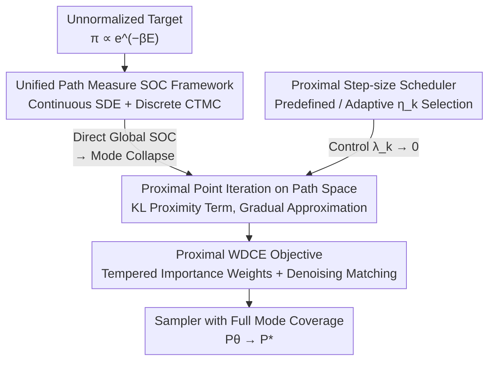

# Proximal Diffusion Neural Sampler

**Conference**: ICLR 2026  
**OpenReview**: [https://openreview.net/forum?id=XTHQqS7ObC](https://openreview.net/forum?id=XTHQqS7ObC)  
**Code**: https://github.com/AlexandreGUO2001/PDNS  
**Area**: Diffusion Models / Neural Samplers / Statistical Physics  
**Keywords**: Boltzmann Sampling, Stochastic Optimal Control, Proximal Point Method, Mode Collapse, Path Measure

## TL;DR
This paper proposes PDNS (Proximal Diffusion Neural Sampler), which models "sampling from unnormalized target distributions" as a stochastic optimal control problem in path measure space. It utilizes the **Proximal Point Method** to decompose a one-shot global optimization into a sequence of sub-problems with KL proximity constraints. This allows the sampler to gradually approach the target along a geometric interpolation path between $\pi$ and a reference distribution, alleviating mode collapse in strongly multi-modal tasks (Molecular Dynamics, Ising/Potts, etc.) and achieving SOTA on multiple continuous and discrete benchmarks.

## Background & Motivation
**Background**: Sampling from unnormalized Boltzmann distributions of the form $\pi(x)\propto e^{-\beta E(x)}$ is a fundamental task in computational statistics, Bayesian inference, and statistical mechanics. Classical MCMC suffers from slow mixing in high-dimensional or strongly multi-modal spaces. Consequently, "neural samplers" based on score-based diffusion or normalizing flows have emerged, which "transport" a simple reference distribution to the target $\pi$. These diffusion samplers are commonly formulated as a **Stochastic Optimal Control (SOC)** problem: parameterizing a control term $u^\theta_t$ of a controlled diffusion process such that its terminal marginal distribution matches $\pi$.

**Limitations of Prior Work**: Although SOC-based samplers are theoretically grounded, they are highly susceptible to **mode collapse** during early training when $P_\theta$ is far from the target $P^*$. This occurs because training can only estimate the target using trajectories rolled out by the current model $P_\theta$. When the distribution mismatch is large, only a few trajectories carry meaningful signals (high likelihood/importance weights), causing the loss to be dominated by these few paths and leading to unstable updates. Simultaneously, due to a lack of exploration, the model repeatedly reinforces already discovered modes while ignoring others. The paper demonstrates this with a $24\times24$ low-temperature Ising model ($\beta=0.6$, with two ferromagnetic states separated by a high energy barrier): the WDCE sampler quickly collapses into a single mode and reinforces it through self-generated samples.

**Key Challenge**: There is a fundamental conflict between "one-shot global minimization" of SOC objectives and "maintaining mode coverage" in strongly multi-modal landscapes with large barriers. Global losses naturally reward "concentrating mass on already discovered modes."

**Core Idea**: Replace one-shot global minimization with a sequence of **progressive and constrained** local optimization steps. Specifically, the **Proximal Point Method** is applied to the path measure space: each step improves the control under the constraint of "not moving too far from the previous solution," allowing the terminal marginal to approach $\pi$ slowly while preserving coverage.

## Method

### Overall Architecture
PDNS addresses how to train a diffusion neural sampler to approximate $\pi$ without losing modes. The framework consists of three layers: first, it **unifies** continuous (SDE) and discrete (CTMC) samplers into the same SOC problem on path measures. Second, instead of solving this difficult global problem directly, it uses **proximal point iteration** to split it into sub-problems with KL proximity terms. The optimal solution for each sub-problem is precisely a **geometric interpolation** between the reference measure $P_{ref}$ and the optimal measure $P^*$, allowing the sampler to converge along a refined path. Finally, each proximal sub-problem is implemented as a computationally efficient **proximal WDCE loss** with a **step-size scheduler** $\{\eta_k\}$ controlling the progress.

Let $P_{ref}$ be the reference path measure (satisfying the Markov property $P^{ref}_{0,T}=\mu\cdot\nu$), $\nu$ the terminal marginal, $\pi$ the target, and $r:=-\beta E-\log\nu$. The optimal solution to the unified SOC problem is $P^*\propto P_{ref}\,e^{r(X_T)}$, whose terminal distribution is $\pi$.

### Key Designs

**1. Unified Path Measure SOC Framework: Consolidating Continuous and Discrete Samplers**

Previously, continuous diffusion samplers (PIS, DDS, AS, etc.) and discrete masked diffusion samplers operated under different theoretical frameworks. This paper uses the unified language of **path measures** to formulate both as the same variational problem: under the constraint that $P_\theta$ starts at $\mu$,
$$P^* = \arg\min_{P_\theta}\Big[-\mathbb{E}_{P_\theta}\,r(X_T) + \mathrm{KL}(P_\theta\,\|\,P_{ref})\Big],\qquad P^*\propto P_{ref}\,e^{r(X_T)}.$$
In the continuous case, $P_\theta$ is induced by a controlled SDE $dX_t=(b_t+\sigma_t u^\theta_t)dt+\sigma_t dW_t$. Using Girsanov's theorem, the above simplifies to an SOC problem for the control $u^\theta$: $\min_\theta \mathbb{E}_{P_\theta}[\int_0^T \tfrac12\|u^\theta_t\|^2dt - r(X_T)]$. In the discrete case, the state space is expanded to $\{1,\dots,N,\mathsf{M}\}^d$ with a mask symbol $\mathsf{M}$, parameterized by the generator $Q^\theta$ of a Continuous-Time Markov Chain (CTMC), yielding a structurally identical objective. The value of this unified framework is that the subsequent proximal point iteration only needs to be derived once at the path measure level to adapt to both implementations.

**2. Proximal Point Iteration on Path Space: Decomposing Global Optimization via KL Proximity**

This is the core of PDNS, directly addressing the "one-shot global optimization → mode collapse" issue. Instead of solving the hard global SOC directly (equivalent to an infinite step size), a KL proximity term relative to the previous iteration $P_{\theta_{k-1}}$ is added at each step, with step size $\eta_k\in(0,\infty]$:
$$P_{\theta^*_k} = \arg\min_{P_\theta}\Big[-\mathbb{E}_{P_\theta}\,r(X_T) + \mathrm{KL}(P_\theta\,\|\,P_{ref}) + \tfrac{1}{\eta_k}\mathrm{KL}(P_\theta\,\|\,P_{\theta_{k-1}})\Big].$$
This proximity term forces each solution to remain near the previous one, making updates more stable and optimization easier (as the regularization term dominates). The paper proves (Prop. 3.1) that the optimal solution to the sub-problem is a geometric interpolation between the previous solution and $P^*$. When $P_{\theta_0}\leftarrow P_{ref}$, the sequence follows:
$$P_k \propto (P_{ref})^{\lambda_k}(P^*)^{1-\lambda_k},\qquad \lambda_k:=\prod_{i=1}^{k}\frac{1}{\eta_i+1},$$
where the terminal distribution $P_k^T\propto \pi^{\,1-\lambda_k}\nu^{\,\lambda_k}$ is the geometric interpolation between $\nu$ and $\pi$. As long as $\lambda_k\to 0$, the sequence converges to $P^*$. Intuitively, the proximal term **tempers** the importance weights—softening the potentially explosive weight $\tfrac{dP^*}{dP_{\theta_{k-1}}}$ (often dominated by a single mode) into:
$$\frac{dP_{\theta^*_k}}{dP_{\theta_{k-1}}}\propto\Big(\frac{dP^*}{dP_{\theta_{k-1}}}\Big)^{\frac{\eta_k}{\eta_k+1}},$$
where the exponent $\tfrac{\eta_k}{\eta_k+1}<1$ reduces the dominance of high-weight paths, thereby preserving mode coverage.

**3. Proximal WDCE Objective: Practical Denoising Matching for Sub-problems**

While the proximal sub-problem is elegant, training directly using relative entropy or Cross-Entropy (CE) requires storing entire trajectories, which is memory-intensive. This paper first reverses the KL direction in the proximal objective to obtain **Proximal CE**, which simplifies to "Weighted Negative Log-Likelihood (NLL) under the previous detached measure $\bar P_{\theta_{k-1}}$ with tempered weights." Following the WDCE approach, NLL is replaced by (denoising/bridge) score matching to yield **Proximal WDCE**. In the continuous case, using Diffusion Schrödinger Bridge Matching, it is written as:
$$\mathrm{KL}(P_{k^*}\|P_\theta)=\mathbb{E}_{t\sim\mathrm{Unif}(0,T),\,X\sim \bar P_{\theta_{k-1}}}\Big[\tfrac{dP_{k^*}}{d\bar P_{\theta_{k-1}}}(X)\cdot\tfrac12\big\|u^\theta_t(X_t)-\sigma_t\nabla\log P^{ref}_{T|t}(X_T|X_t)\big\|^2\Big].$$
A key advantage is that **only the terminal samples $X_T$ and an online accumulated scalar weight $w(X)$** (computed via a Girsanov closed-form in Eq. 15) are required. Storing $(X_T,w)$ in a buffer enables training without full trajectory storage. The discrete case similarly uses masked denoising cross-entropy with the CTMC Girsanov weight (Eq. 16) and the same tempered weights (Eq. 15). Thus, the proximal framework provides a memory-friendly, fast-converging loss for both continuous and discrete domains.

**4. Proximal Step-size Scheduler: Balancing Convergence and Coverage**

The step size $\eta_k$ is a critical hyperparameter in PDNS, determining the relative strength of KL regularization: small $\eta_k$ → stronger regularization, more conservative updates, better coverage but slower convergence; large $\eta_k$ → weaker regularization, faster convergence but higher risk of mode collapse. The paper proposes two schedulers: a **predefined** scheduler that sets a sequence for $\eta_k$ or $\lambda_k$ such that $\lambda_k\to0$, monitoring sample fit to the local target; and an **adaptive** scheduler that automatically selects $\eta_k$ based on the model's state, ensuring the next target $P_{k^*}$ is not too far from $P_{\theta_{k-1}}$ (e.g., constraining $\widehat{\mathrm{KL}}(P_{\theta_{k-1}}\|P_{k^*})\le\epsilon$).

### Loss & Training
The overall training follows a double-loop structure (Alg. 1): the outer loop $k=1,2,\dots$ sets the current sub-problem target $P_{k^*}\in\{P_{\theta^*_k},P_k\}$; the inner loop updates $\theta$ by minimizing the proximal WDCE loss $F(P_\theta;P_{k^*})$ using samples from $P_{\theta_{k-1}}$, setting $P_{\theta_k}\leftarrow P_\theta$ after several steps. The **Proximal WDCE variant** is preferred as it avoids full trajectory storage and leverages efficient (discrete) score matching.

## Key Experimental Results

### Main Results
On continuous synthetic energy functions (Sinkhorn ↓ / MMD ↓) and particle potentials ($W_2$ ↓ / Energy $W_2$ ↓), PDNS achieved the best results in 5 out of 7 benchmarks, with Funnel and DW-4 being competitive with SOTA baselines.

| Task | Metric | PDNS | Strongest Baseline | Description |
|------|------|------|----------|------|
| GMM40 (d=50) | Sinkhorn ↓ | **327.83** | 496.48 (NAAS) | 50D, 40-component GMM |
| MoS (d=50) | Sinkhorn ↓ | **353.05** | 394.55 (NAAS) | Heavy-tailed Student-t mixture |
| MW54 (d=5) | Sinkhorn ↓ | **0.08** | 0.10 (NAAS) | Multi-well potential |
| LJ-13 (d=39) | Energy $W_2$ ↓ | **1.01** | 1.28 (ASBS) | Lennard-Jones 13 particles |
| LJ-55 (d=165) | Energy $W_2$ ↓ | **21.97** | 27.69 (ASBS) | High-dimensional rough surface |

In discrete statistical physics (Ising / Potts, Magnetization error Mag.↓, 2-point correlation Corr.↓, ESS↑), PDNS significantly outperformed LEAPS; the original WDCE failed to learn the correct distribution due to mode collapse and was excluded.

| Distribution | Temperature | Metric | PDNS | LEAPS | MH |
|------|------|------|------|-------|-----|
| Ising L=24 | $\beta_{low}=0.6$ | Mag. ↓ | **9.0e−3** | 3.0e−2 | 1.6e−3 |
| Potts L=16,q=4 | $\beta_{low}=1.3$ | Mag. ↓ | **8.4e−4** | 3.6e−1 | 7.6e−1 |
| Potts L=16,q=4 | $\beta_{crit}=1.0986$ | ESS ↑ | **0.948** | 0.112 | / |

Furthermore, on the Alanine Dipeptide molecule (60D internal coordinates), the 1D marginal KL of 5 torsion angles matched the SOTA ASBS (e.g., $\gamma_1$: PDNS 0.03 vs ASBS 0.03), and energy histograms successfully reproduced major conformational structures. In combinatorial optimization (Max-Cut), PDNS achieved solutions comparable to Gurobi ground truth.

### Ablation Study

| Configuration | Observation | Explanation |
|------|------|------|
| Full PDNS | Maintains mode coverage | Proximal term tempers weights, gradual exploration |
| w/o Proximal Term | Mode collapse | Degenerates to original WDCE, collapses quickly (Fig. 1) |
| Large $\eta_k$ | Fast but unstable | Weak regularization, large distributional gap |
| Small $\eta_k$ | Stable but slow | Strong regularization, conservative updates |

### Key Findings
- Removing the proximal term is the direct cause of mode collapse, consistent with the failure observed on low-temperature Ising (Sec. 3.1), verifying the "proximal constraint → mode coverage" causality.
- PDNS shows the most significant advantage on **harder** targets: heavy-tailed MoS and rough energy surfaces like LJ-13/LJ-55, where mode collapse is frequent. This suggests tempered weights + local movement are effective for "hard sampling."
- The step size $\eta_k$ represents a clear trade-off between convergence speed and mode coverage; adaptive scheduling balances this by constraining the KL distance between adjacent sub-problems.

## Highlights & Insights
- **Reformulating Sampling as Proximal Point Optimization**: The proximal point method, a classic tool in convex optimization, is elegantly extended to infinite-dimensional path measure spaces. The proof that each solution is a geometric interpolation provides both convergence guarantees and a way to monitor training.
- **"Tempered Importance Weights" as a Key to Mode Collapse**: Softening $\tfrac{dP^*}{dP_{\theta_{k-1}}}$ into $(\cdot)^{\eta_k/(\eta_k+1)}$ via exponential compression is a versatile idea transferable to any scenario trained using self-generated samples and importance weighting (e.g., RL or GFlowNets).
- **Unified Continuous and Discrete Theory**: Unifying SDEs and CTMCs using path measures avoids reinventing the wheel for the discrete domain, providing a refined "abstract unification followed by instantiation" paradigm.

## Limitations & Future Work
- The paper primarily focuses on the Proximal WDCE instantiation; other variants (Proximal CE, Proximal RE) are mentioned theoretically but not systematically compared.
- Additional hyperparameter schedulers for $\eta_k/\lambda_k$ are introduced. While adaptive schemes are provided, the robustness of these schedulers across tasks and the selection of the threshold $\epsilon$ remain empirical.
- Convergence proofs assume sub-problems are solved to optimality, whereas practical implementation uses finite inner steps, creating a gap between theory and reality.
- Multi-step proximal iteration introduces a sequential outer loop, which may lead to higher computational/time costs compared to one-shot optimization.

## Related Work & Insights
- **vs. Original WDCE / CE Samplers**: These minimize global reverse-KL in one shot, leading to rapid mode collapse at low temperatures. PDNS decomposes the objective into a proximal sequence using tempered weights to maintain coverage.
- **vs. DDS / PIS / AS Samplers**: These solve Eq. 3 or equivalents, corresponding to $\eta_k=\infty$ in the proximal framework. PDNS generalizes these while trading step size for stability and coverage.
- **vs. ASBS (Liu 2025)**: A strong baseline for particle/molecular systems. PDNS outperforms it on LJ-13/LJ-55 energy $W_2$ and matches it on Alanine Dipeptide. PDNS gains from proximal regularization rather than network engineering.
- **vs. LEAPS / MH**: MH performs decently on simple Ising but degrades significantly on Potts; LEAPS has lower overall accuracy. PDNS maintains high ESS and low error across both.

## Rating
- Novelty: ⭐⭐⭐⭐⭐ Systematically applying proximal point methods to path measure sampling with geometric interpolation proofs is novel and theoretically sound.
- Experimental Thoroughness: ⭐⭐⭐⭐ Covers continuous/discrete, synthetic/molecular/physics/combinatorial tasks, though missing a cross-comparison with other proximal instances and comprehensive overhead analysis.
- Writing Quality: ⭐⭐⭐⭐ The derivation chain from unified framework to practical losses is clear, though formula-heavy.
- Value: ⭐⭐⭐⭐⭐ Mode collapse is a core bottleneck for neural samplers; tempered weights and proximal iteration offer a general and transferable solution.

<!-- RELATED:START -->

## Related Papers

- [\[ICLR 2026\] Incomplete Data, Complete Dynamics: A Diffusion Approach](incomplete_data_complete_dynamics_a_diffusion_approach.md)
- [\[ICML 2026\] Generative Neural Operators Through Diffusion Last Layer](../../ICML2026/physics/generative_neural_operators_through_diffusion_last_layer.md)
- [\[CVPR 2025\] DiffFNO: Diffusion Fourier Neural Operator](../../CVPR2025/physics/difffno_diffusion_fourier_neural_operator.md)
- [\[ICLR 2026\] OXtal: An All-Atom Diffusion Model for Organic Crystal Structure Prediction](oxtal_an_all-atom_diffusion_model_for_organic_crystal_structure_prediction.md)
- [\[CVPR 2026\] Spatial-Spectral Residuals Informed Diffusion Neural Operator for Pan-sharpening](../../CVPR2026/physics/spatial-spectral_residuals_informed_diffusion_neural_operator_for_pan-sharpening.md)

<!-- RELATED:END -->
