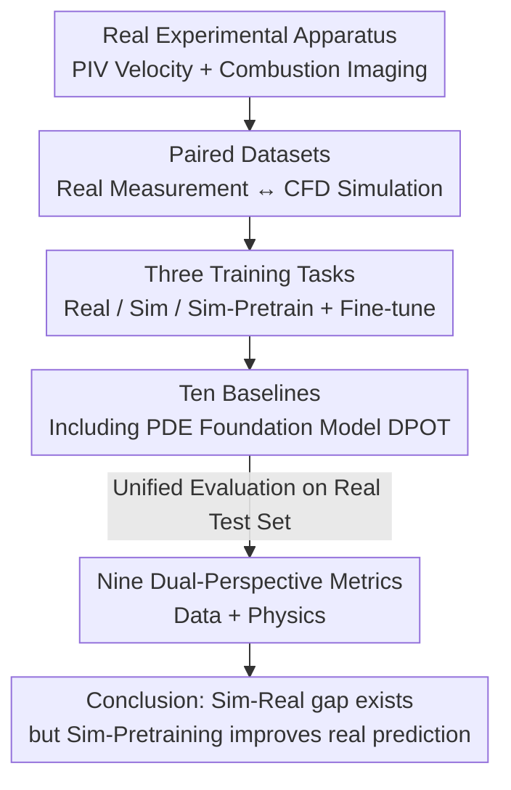

# RealPDEBench: A Benchmark for Complex Physical Systems with Real-World Data

**Conference**: ICLR 2026  
**OpenReview**: [https://openreview.net/forum?id=y3oHMcoItR](https://openreview.net/forum?id=y3oHMcoItR)  
**Code**: https://realpdebench.github.io/  
**Area**: Scientific Machine Learning / PDE Surrogate Models / Benchmark  
**Keywords**: Real-world data, sim-to-real, PDE solving, fluid dynamics, combustion

## TL;DR
RealPDEBench is the first scientific machine learning benchmark that packages **real-world experimental measurement data alongside paired numerical simulation data**. Covering 5 complex physical systems, 3 task categories, 9 metrics, and 10 baselines, it systematically reveals the significant gap between simulation and real-world data and demonstrates that "pre-training on simulation followed by fine-tuning on real data" consistently improves both accuracy and convergence speed.

## Background & Motivation
**Background**: Predicting the evolution of complex physical systems (fluids, combustion, plasma, etc.) using neural networks is one of the most active directions in Scientific ML. Common approaches utilize neural operators (FNO, DeepONet), U-Net architectures, or even large-scale pre-trained PDE foundation models (e.g., DPOT) to learn spatio-temporal dynamics from data or governing equations, offering much higher efficiency compared to traditional numerical solvers (FVM, IBM).

**Limitations of Prior Work**: Almost all existing models are **trained and validated exclusively on numerical simulation data**. However, a massive chasm exists between simulation and real-world measurement data. Simulations contain numerical errors (from LES modeling, second-order discretization simplifications, etc.), while real data involves measurement noise, non-uniform inflow, camera artifacts, and typically fewer observable physical modalities than simulations. Consequently, it remains unknown how these SOTA models actually perform in the real world compared to traditional numerical methods.

**Key Challenge**: Real-world data is "accurate but expensive, noisy, and offers few observable variables," whereas simulation data is "cheap, provides full modalities, and is parameter-dense but prone to systematic numerical errors." Each has its own strengths and weaknesses. The high cost of acquiring real data (requiring experimental rigs and rich measurement expertise) has led to a long-term scarcity of real physical datasets for ML, hindering critical tasks such as sim-to-real transfer and learning from noisy data.

**Goal**: To construct a benchmark with **paired** real measurements and numerical simulations, allowing researchers to (1) quantify the gap between the two data types, (2) fairly evaluate the capabilities of various ML models on real data, and (3) investigate how to transfer the advantages of simulation to real-world prediction.

**Key Insight**: The authors manually constructed experimental apparatuses, such as circulating water tanks (PIV velocity measurement) and swirl burners (OH* chemiluminescence imaging), to collect real data and corresponding CFD simulation data for the **same set of physical parameters** simultaneously. This makes "real vs. simulation" comparable on a parameter-by-parameter basis for the first time.

**Core Idea**: By using a benchmark composed of "paired real + simulation data + three training tasks + data/physics dual-perspective metrics," the sim-to-real gap is transformed into a measurable and optimizable research object.

## Method

### Overall Architecture
RealPDEBench is not a single model but a benchmark suite consisting of four components: **Data (5 paired datasets) → Tasks (3 training paradigms) → Metrics (9 data/physics dual-perspective measures) → Baselines (10 representative models)**. The core constraint is that "evaluation is strictly performed on real-world data," as the ultimate goal of Scientific ML is to model real systems. The training side allows for multiple paradigms to turn "whether simulation is useful" into a controlled comparative experiment. The pipeline logic involves quantifying the sim-real gap via paired data, testing paradigms (Real-only / Sim-only / Sim-Pretrain + Real-Fine-tune), and characterizing performance through local pixel errors and global physical features.

### Key Designs

**1. Paired Real-Simulation Datasets: Enabling Parameter-by-Parameter Comparability**

The fundamental contribution is the manual collection of real data from 5 complex physical systems and the generation of paired simulation data under **identical physical parameters**. This includes 736 trajectories, each exceeding 2000 frames. The 5 scenarios range in physical difficulty: Cylinder (flow past a cylinder), Controlled Cylinder (active control via periodic sine waves), FSI (Fluid-Structure Interaction), Foil (airfoil sections with 3D effects), and Combustion ($NH_3/CH_4/Air$ swirl flame, multi-physics/multi-scale coupling). Real fluid data was processed into velocity fields via PIVLab using water tanks and high-speed cameras; combustion data utilized OH* chemiluminescence. Simulations used Lilypad (2D), Waterlily (3D GPU-based), and LES with the EDC model for combustion. All data is standardized as HDF5 files containing NumPy arrays of shape $(T, X, Y)$ with $C$ channels and system parameters ($Re$, frequency, equivalence ratio, etc.).

**2. Three Training Tasks: Sim-to-Real as a Controlled Experiment**

To determine the value of simulation data, the prediction problem (learning the mapping $F: \mathcal{A}\times\Gamma\to\mathcal{U}$) is split into three paradigms: **(i) Real training**—trained only on $n$ real samples; **(ii) Simulation training**—trained on all $N$ simulation samples; **(iii) Simulation pre-training + Real fine-tuning**—pre-trained on $N$ sim samples and fine-tuned on $n$ real samples. Crucially, **all three tasks share the same fixed real-world validation/test set**, ensuring consistent evaluation. To make sim-training more realistic, the authors added noise to simulation data and randomly masked modalities that are unobservable in real measurements.

**3. Data + Physics Dual-Perspective Metrics: Beyond RMSE**

The authors highlight that pixel-level errors miss global physical features, leading to a 9-metric system. **Data perspective**: RMSE, MAE, Relative L2 error, coefficient of determination $R^2 = 1 - \frac{\sum_k (y_k-\hat y_k)^2}{\sum_k (y_k-\bar y)^2}$, and the **Update Ratio** (the ratio of update steps $N_1/N_2$ required for fine-tuning vs. training from scratch to reach the same RMSE). **Physics perspective**: fRMSE (error by frequency band via 3D FFT), FE (frequency error via 1D FFT on integrated signals), KE (kinetic energy error $\mathrm{KE}=|e-\hat e|$), and MVPE (mean velocity profile error for long-term wake decay). This methodology prevents models that are "locally accurate but physically unrealistic" from appearing superior.

### Loss & Training
The benchmark does not introduce new losses, instead using the standard objectives of the baselines (mostly MSE-based data-driven losses). Data splits are performed at the **parameter level** to prevent leakage within trajectories of the same parameters. Evaluation includes both standard single-step prediction and **autoregressive evaluation** (unrolling $N$ rounds of $T$-step predictions) to observe error accumulation over 1, 2, 3, 5, and 10 rounds.

## Key Experimental Results

### Main Results
The 10 baselines were compared on the real test set across three tasks. Key findings center on the "Sim vs. Real training" gap and the "Pre-training gain." The table below shows the average ML Relative L2 (lower is better):

| Dataset | Sim Training Rel L2 | Real Training Rel L2 | Real Fine-tune Rel L2 | Avg. Update Ratio |
|---|---|---|---|---|
| Cylinder | 0.2356 | 0.1106 | 0.0997 | 0.567 |
| Controlled Cylinder | 0.1947 | 0.0910 | 0.0875 | 0.650 |
| FSI | 0.2434 | 0.1036 | 0.0999 | 0.496 |
| Foil | 0.0505 | 0.0261 | 0.0213 | 0.557 |
| Combustion | 0.8408 | 0.6169 | 0.6063 | 0.756 |

Observations: (1) **Sim-training error is significantly higher than Real-training**, with Real-training showing a 9.39%~78.91% improvement in Rel L2, indicating that sim-only models struggle to generalize to the real world even with identical parameters. (2) **Real Fine-tune consistently outperforms Real Training**, and the Update Ratio is mostly < 1, proving that simulation pre-training improves both accuracy and convergence. (3) The Combustion dataset has the highest error, reflecting the difficulty of modeling multi-physics combustion.

### Ablation Study

| Configuration / Analysis | Key Finding | Description |
|---|---|---|
| Sim vs. Real Training | Significantly higher FE | Simulations fail to perfectly replicate the periodicity of real systems. |
| Real Fine-tuning Convergence | Faster RMSE decline | Fine-tuning on Combustion is much faster than training from scratch. |
| RMSE–FE Trade-off | DPOT-L-FT is closest to origin | Large-scale PDE pre-training + high parameters yields the best balance. |
| Convolutional (U-Net/CNO) | Lower RMSE, weaker physics | Good at local features due to image-processing-like architecture. |
| MWT | Superior periodic learning | Multi-wavelet transforms naturally capture periodicity. |
| CNO Autoregressive | Faster error growth | Good at single-step, but long-term error accumulation is severe. |
| CNO High-freq fRMSE | Advantage grows with freq | Relates to its anti-aliasing design principles. |

### Key Findings
- **Simulation pre-training almost always provides a positive gain**: It improves accuracy on real data and speeds up convergence (Update Ratio < 1) by utilizing the larger volume and additional modalities in simulation data.
- **No universal model**: Models strong in the data perspective (low local RMSE) are not necessarily strong in the physics perspective (weak periodicity capture); architectures must be chosen based on the task goal.
- **The large foundation model DPOT-L-FT is the best overall**, but trade-offs between single-step vs. long-term and local vs. global performance are prevalent.

## Highlights & Insights
- **"Matched Parameter Paired Real + Sim" is the most hardcore contribution**: Building water tanks and burners to measure 736 real trajectories turns "sim-to-real" into a quantitative, aligned study.
- **The dual-perspective metric system is directly transferable**: Any physical field prediction task can benefit from fRMSE, FE, and MVPE to avoid the illusion of "low RMSE but incorrect physics."
- **The Update Ratio is a clever design**: It quantifies the engineering benefit of pre-training as the ratio of steps needed to achieve the same accuracy.
- **The Combustion dataset is particularly valuable**: Multi-scale multi-physics makes CFD inherently inaccurate, highlighting the irreplaceable nature of real data.

## Limitations & Future Work
- The 5 scenarios are concentrated in fluids and combustion, excluding plasma or solid mechanics.
- Real data is limited by measurement technology (e.g., only velocity or intensity); masking simulation modalities mitigates but does not fully solve this asymmetry.
- While the dataset is large (736 trajectories), parameter coverage is still finite, and it primarily focuses on 2D sections.
- Future work could involve specialized sim-to-real domain adaptation and training paradigms that better fuse the advantages of both data types.

## Related Work & Insights
- **vs. PDEBench / The Well**: These provide massive high-resolution **simulation-only** data. This work differs by **introducing paired real measurements** and evaluating strictly on real data.
- **vs. Traditional Fluid/Combustion Experimental Datasets**: Those were **not designed for ML**, having sparse data and conditions. RealPDEBench scales data acquisition and standardizes it into ML-friendly HDF5 formats.
- **vs. REALM**: While REALM evaluates neural surrogates for reactive flows, RealPDEBench covers a broader range of systems (5 systems, 700+ experiments) and emphasizes sim-to-real transfer.

## Rating
- Novelty: ⭐⭐⭐⭐⭐ First paired real+sim benchmark; fills a critical gap.
- Experimental Thoroughness: ⭐⭐⭐⭐⭐ Comprehensive analysis across datasets, tasks, and metrics.
- Writing Quality: ⭐⭐⭐⭐ Clear structure and strong motivation.
- Value: ⭐⭐⭐⭐⭐ Transforms the sim-to-real gap into a measurable research object for Scientific ML.

<!-- RELATED:START -->

<!-- RELATED:END -->

## Related Papers

- [\[ICLR 2026\] ComPhy: Composing Physical Models with end-to-end Alignment](comphy_composing_physical_models_with_end-to-end_alignment.md)
- [\[ICLR 2026\] Spectral-Guided Physical Dynamics Distillation](spectral-guided_physical_dynamics_distillation.md)
- [\[ICML 2025\] Erwin: A Tree-based Hierarchical Transformer for Large-scale Physical Systems](../../ICML2025/physics/erwin_a_tree-based_hierarchical_transformer_for_large-scale_physical_systems.md)
- [\[ICLR 2026\] DGNet: Discrete Green Networks for Data-Efficient Learning of Spatiotemporal PDEs](dgnet_discrete_green_networks_for_data-efficient_learning_of_spatiotemporal_pdes.md)
- [\[ICLR 2026\] Self-Supervised Evolution Operator Learning for High-Dimensional Dynamical Systems](self-supervised_evolution_operator_learning_for_high-dimensional_dynamical_syste.md)

<!-- RELATED:END -->
