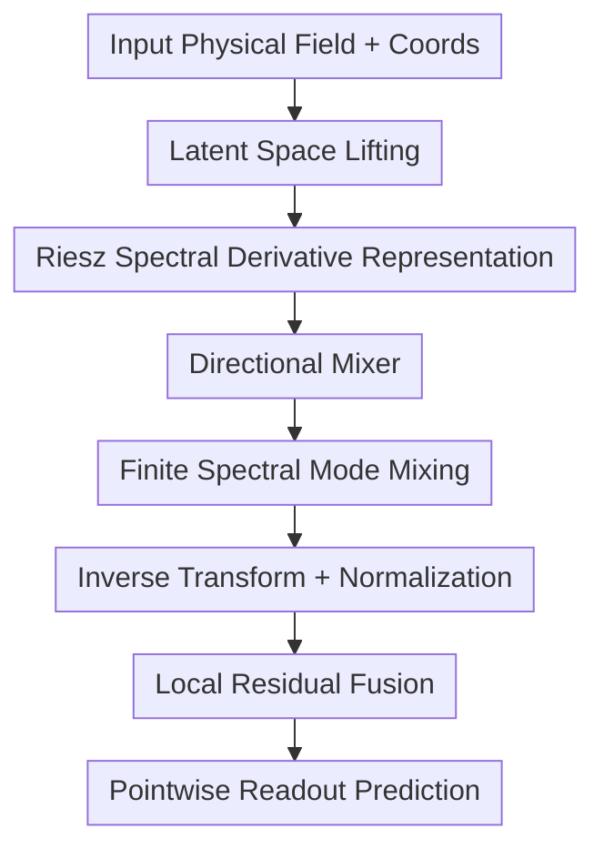

# Riesz Neural Operator for Solving Partial Differential Equations

**Conference**: ICLR 2026  
**OpenReview**: [https://openreview.net/forum?id=Vjw7q1quNt](https://openreview.net/forum?id=Vjw7q1quNt)  
**Code**: Not disclosed  
**Area**: Neural Operator / PDE Solving / Scientific Machine Learning  
**Keywords**: Riesz Transform, Neural Operator, PDE Solving, Local Derivative, Spectral Modeling  

## TL;DR
RNO introduces the Riesz transform into neural operators, utilizing directional derivative channels in the frequency domain to compensate for the inability of FNO/LNO to model local non-stationary details. It simultaneously improves accuracy, robustness, and efficiency across various PDEs, Navier-Stokes, and ERA5 weather data.

## Background & Motivation
**Background**: The goal of neural operators is to directly learn the mapping from input functions to solution functions. Common approaches include the branch-trunk structure of DeepONet, Fourier frequency domain convolutions of FNO, or Laplace domain representations of LNO to approximate PDE solution operators. Their shared advantage is generalizing training from discrete grids to function-space predictions, making them suitable fast surrogates for traditional numerical solvers in fluids, materials, and weather forecasting.

**Limitations of Prior Work**: These operators excel at capturing global, smooth, low-frequency structures, but many challenges in PDEs manifest at local variations. For instance, high Reynolds number Navier-Stokes flow generates vortices, shear layers, and filamentary structures; reaction-diffusion systems exhibit local pattern mutations; and weather fields contain local circulations and high-frequency anomalies. Using only global Fourier/Laplace modes causes this local non-stationary information to be compressed into low-frequency approximations. Even adding extra CNNs or local modules often treats local features as external patches, undermining the original continuous operator perspective and resolution-invariance benefits of neural operators.

**Key Challenge**: PDEs themselves constrain physical fields through local derivatives, e.g., $F(x,u,\partial_{x_1}u,\ldots,\partial_{x_n}u)=0$. Thus, critical information governing system evolution includes not only the function values but also directional rates of change, phase directions, and high-frequency perturbations. While classical neural operators are efficient at modeling integral operators with global basis functions, they struggle to achieve global stability, local sensitivity, and physical interpretability simultaneously without explicit directional derivative representations.

**Goal**: The authors aim to design a method that retains the continuous integral structure of neural operators while allowing the model to directly perceive local directional derivatives. Specifically, it must resolve three sub-problems: first, how to stably represent spatial derivatives in the frequency domain; second, how to fuse global spectral modes with directional derivative channels rather than simply stacking modules; third, how to demonstrate that this design yields benefits in complex nonlinear PDEs, real-world weather fields, and noisy inputs.

**Key Insight**: The paper views local variations through Taylor expansion. If a signal has a small displacement $\gamma(t)$ near $x$, then $I(x,t)\approx f(x)+\gamma(t)f'(x)$, where the first-order derivative term is the source of local dynamics and detail changes. The Riesz transform, which can be viewed as a multi-dimensional Hilbert transform, extracts derivatives and phase directions in the frequency domain using normalized directional multipliers. Thus, it is naturally suited for embedding the local derivative structure of PDEs into neural operators.

**Core Idea**: Use the Riesz transform to construct directional derivative channels in spectral space, then use a lightweight directional mixer to combine these local derivatives with global neural operator modes, allowing the operator to retain both global integral modeling capabilities and local anisotropic details.

## Method
### Overall Architecture
The Riesz Neural Operator (RNO) follows the basic skeleton of neural operators: input physical fields are first lifted to a high-dimensional latent space, then passed through a spectral operator layer, and finally restored to the target physical field via a pointwise readout layer. Unlike FNO which only learns global modes in Fourier space, RNO constructs Riesz derivative components for each spatial direction within the spectral domain. It uses a directional mixer to synthesize global spectral representations, local directional derivatives, and linear residuals before transforming back to coordinate space via an inverse transform.

In terms of operator composition, the overall mapping is denoted as $F_\theta=F_{\theta,\mathrm{RieszToCoord}}\circ (\prod_i F_{\theta_i^R})\circ F_{\theta,\mathrm{CoordToRiesz}}$. The coordinate-to-Riesz mapping extracts spectral directional info, intermediate Riesz layers learn direction-dependent nonlinear mappings, and the result is returned to the original physical field. Implementation-wise, each layer performs an FFT on latent features, multiplies by the Riesz directional multiplier $R_i(\xi)$, and applies learnable scales and complex weights for mode mixing.

In this framework, the lifting, readout, and residual components belong to the neural operator scaffolding; the core contributions are the Riesz spectral derivative representation, the directional mixer, and how they combine with finite spectral modes to form a continuous, lightweight integral operator.

### Key Designs
**1. Riesz Spectral Derivative Representation: Writing Local Derivatives as Frequency Channels**

Standard Fourier transforms isolate global frequency modes but do not explicitly inform the model about local directional changes. RNO first converts PDE derivative constraints into directional features in the spectral domain: for a $d$-dimensional signal, the $i$-th directional Riesz transform uses the multiplier $-j\xi_i/\|\xi\|$. This represents a scale-normalized first-order directional derivative, maintaining high efficiency in frequency-domain computation while explicitly exposing local directional variations.

The paper links this to Taylor expansion: smooth backgrounds are expressed by low-order, low-frequency components, while details like displacements, mutations, and vortex boundaries enter via $f'(x)$ or higher-order derivatives. The Riesz transform does not arbitrarily amplify high-frequency amplitudes like a standard high-pass filter because its multipliers satisfy energy conservation, essentially redistributing spectral energy by direction. The model thus gains information on "what is changing in which direction" rather than noisily boosting all high frequencies.

**2. Directional Mixer: Fusing Global Modes and Local Anisotropy with Learnable Weights**

Simply computing Riesz features is insufficient, as PDE solution operators depend on both global coupling and local derivatives. RNO constructs a lightweight directional mixer in Riesz space, formulated as $\mathrm{Mixer}=R_{\mathrm{global}}+w_iR_i+w_jR_j$, naturally extending to $d$ directions. Here, $R_{\mathrm{global}}$ handles stable global spectral statistics, $R_i$ manages local variations in the $i$-th direction, and $w_i$ are learnable directional weights.

The key to this design is not just "adding branches" but allowing local derivatives from different directions to enter the same operator layer in an approximately orthogonal manner. During training, the gradient of the loss with respect to directional weights acts as a projection of prediction residuals onto corresponding Riesz channels; if vortices or boundary structures in a specific direction contribute more to the error, their weights are amplified. The paper also constrains directional scaling factors with theoretical upper bounds to avoid artifacts from excessive local perturbations.

**3. Continuous Operator Structure: Adding Local Details Without Degrading to FNO + CNN**

Many "global + local" neural operators append CNNs or local convolution branches after FNO. While this adds spatial detail, convolution kernels are typically defined on pixel grids, causing the effective continuous kernel to change across resolutions and weakening resolution invariance. RNO’s locality stems from Riesz multipliers in the frequency domain rather than fixed-pixel convolutions; thus, it remains a Green's function-style integral operator.

The appendix demonstrates that if the original neural operator corresponds to a learned kernel $\kappa_\theta(x,y)$, adding the Riesz term results in a new integral kernel $\tilde G_\theta(x,z)$. In the frequency domain, this simply modifies the original multiplier $M_\theta(\xi)$ to $M_\theta(\xi)(1+\sum_i w_im_i(\xi))$. Crucially, RNO is not a local network patched onto an operator; it reweights directional derivatives within the same spectral-integral framework, preserving physical interpretability and mesh-independence with fewer parameters.

**4. Orthogonal Direction Selection: Matching Data Dimensions**

Increasing the number of directions in RNO is not always better. The paper defaults the number of directions to the data dimensionality: two orthogonal directions for 2D data, and three for 3D data. This is because Riesz components are approximately orthogonal on isotropic content; splitting along natural coordinate axes maximizes non-redundant information. Too few directions miss local variations, while too many introduce non-orthogonal redundancy, increasing mixing difficulty without necessarily improving representation.

### Mechanism
Taking 2D Navier-Stokes prediction as an example, the input is a sequence of velocity or vorticity field snapshots. A standard FNO transforms this field to Fourier space, uses a finite number of low-frequency modes to learn global evolution, and transforms back. When the Reynolds number increases to $Re=5000$, many thin vortex filaments and shear layers fall into high-wavenumber, highly directional local structures, which low-frequency dominant representations blur or result in ringing artifacts.

RNO first transforms latent features to the frequency domain and computes Riesz channels for both $x$ and $y$ directions. If a local vortex boundary changes primarily along $x$, the $R_x$ channel captures a strong response. If a shear layer expands diagonally, the two orthogonal channels jointly represent that direction with different weights. The directional mixer then combines these responses with global spectral modes for synthesis. Ultimately, the model restores high-frequency vortex structures more accurately.

### Loss & Training
Standard supervised learning is used. Relative $\ell_2$ error is the primary metric for PDE benchmarks and ERA5, while Navier-Stokes uses MSE. The optimizer is Adam. For fair comparison, baselines were rerun with aligned modes, width, and training epochs.

RNO implementations include a spectral layer where inputs/coordinates are lifted to a latent space of width $C$ before a $d$-dimensional FFT. Riesz multipliers $R_i(\xi)=i\xi_i/\|\xi\|^2$ are used (zero at zero frequency). $\alpha_0, \alpha_1, \ldots, \alpha_d$ mix the identity and directional channels, followed by complex weight multiplication on low-frequency modes, inverse transform, normalization, and $1\times\cdots\times1$ local residuals. The readout layer is a pointwise MLP.

## Key Experimental Results

### Main Results
Three experimental groups: five standard PDE benchmarks, 2D Navier-Stokes at varied Reynolds numbers, and real-world ERA5 atmospheric data.

| Task | Metric | Ours (RNO) | Prev. SOTA / Strong Baseline | Gain/Observations |
|------|------|-----|------------------|------------|
| Duffing | relative $\ell_2$ | 0.1663 | LSM 0.1699 | 2.1% improvement over 2nd |
| Beam | relative $\ell_2$ | 0.0219 | LNO 0.0452 | 51.6% improvement over 2nd |
| Diffusion | relative $\ell_2$ | 0.0079 | LNO 0.0081 | Slight edge over LNO |
| Reaction-Diffusion | relative $\ell_2$ | 0.0899 | ONO 0.0989 | 10.3% improvement over 2nd |
| Brusselator | relative $\ell_2$ | 0.1317 | ONO 0.1545 | 14.7% improvement over 2nd |

| Dataset | Metric | Ours (RNO) | Baseline | Key Finding |
|--------|------|-----|----------|----------|
| Navier-Stokes $Re=40$ | MSE | 0.0049 | LNO 0.0060 | Consistent lead in low complexity |
| Navier-Stokes $Re=500$ | MSE | 0.4861 | WNO 0.9388 | Advantage grows with nonlinearity |
| Navier-Stokes $Re=5000$ | MSE | 0.9121 | LNO 2.3139 | Retains details under high turbulence |
| ERA5 | relative $\ell_2$ | 0.0022 | LNO 0.0062 | Significant gain on real weather fields |

### Ablation Study
Analysis focused on global/local branches, number of directions, efficiency, and robustness.

| Config | Duffing relative $\ell_2$ | Reaction-Diffusion relative $\ell_2$ | Note |
|------|--------------------------|--------------------------------------|------|
| global-only, no mixer | 0.2098 | 0.0953 | Insufficient local dynamics |
| local-only, no mixer | 0.2262 | 0.1189 | Insufficient global coupling |
| global + local, no mixer | 0.1801 | 0.0903 | Significant improvement via fusion |
| global + local, with mixer | 0.1663 | 0.0899 | Optimal results with mixer |

### Key Findings
- **Gains not from scaling**: In Reaction-Diffusion, RNO uses ~172k parameters, performing better and faster than FNO (311k parameters) and LNO (64k parameters but slow), indicating Riesz channels provide efficient structural bias.
- **Global-Local Synergy**: Both global-only and local-only configurations performed worse than the full model.
- **High Complexity Advantage**: At $Re=5000$, RNO achieved an MSE of 0.9121 compared to LNO’s 2.3139, proving directional derivatives are crucial for vortices and high-wavenumber structures.
- **Noise Robustness**: RNO showed minimal degradation under 0.2 SNR noise, likely due to the energy conservation of Riesz multipliers and learnable mixer gating.

## Highlights & Insights
- RNO embeds the principle that "PDEs are governed by local derivatives" directly into the operator architecture. Instead of adding a PDE residual loss, it enables the model to perceive directional derivatives representationally.
- The choice of Riesz transform is elegant. It computes in the frequency domain like a spectral operator but expresses local directional derivatives, bridging the gap between global spectral operators (FNO) and local neighborhood operations (CNN).
- The noise robustness results are noteworthy. Unlike many high-frequency enhancement methods that amplify noise, RNO acts as a "directional redistributor," which is vital for real-world sensor data.

## Limitations & Future Work
- **Higher-order derivatives**: Currently, RNO uses first-order Riesz channels. Many PDEs involve higher-order structures (e.g., fourth-order in Beam equations or $\Delta u$ in Navier-Stokes).
- **Mixer Resolution**: The directional mixer control is somewhat coarse. Future work could explore spatially adaptive or frequency-band adaptive directional weights.
- **Grid Assumptions**: Experiments primarily used spectral implementations on regular grids. The convenience of RNO for unstructured grids or complex boundaries needs further verification.
- **ERA5 Long-term Evaluation**: While RNO shows lower error on weather data, further evaluation of extreme events and physical conservation laws is required.

## Related Work & Insights
- **vs FNO**: FNO learns global modes but underestimates local high-frequency and directional changes; RNO supplements this with Riesz channels.
- **vs LNO**: LNO improves non-periodicity and stability via the Laplace transform but often sacrifices detail; RNO excels in detail-sensitive tasks.
- **vs FNO + CNN**: CNN branches are grid-dependent; RNO’s local representation remains in the spectral domain, maintaining the continuous operator framework.

## Rating
- Novelty: ⭐⭐⭐⭐⭐ 
- Experimental Thoroughness: ⭐⭐⭐⭐⭐ 
- Writing Quality: ⭐⭐⭐⭐ 
- Value: ⭐⭐⭐⭐⭐ 

<!-- RELATED:START -->

## Related Papers

- [\[ICLR 2026\] Disentangled Representation Learning for Parametric Partial Differential Equations](disentangled_representation_learning_for_parametric_partial_differential_equatio.md)
- [\[ICLR 2026\] Physics-Informed Inference Time Scaling for Solving High-Dimensional Partial Differential Equations via Defect Correction](physics-informed_inference_time_scaling_for_solving_high-dimensional_partial_dif.md)
- [\[AAAI 2026\] Towards a Foundation Model for Partial Differential Equations Across Physics Domains](../../AAAI2026/physics/towards_a_foundation_model_for_partial_differential_equations_across_physics_dom.md)
- [\[ICLR 2026\] Operator Learning with Domain Decomposition for Geometry Generalization in PDE Solving](operator_learning_with_domain_decomposition_for_geometry_generalization_in_pde_s.md)
- [\[ICLR 2026\] $\partial^\infty$-Grid: A Neural Differential Equation Solver with Differentiable Feature Grids](boldsymbolpartialinfty-grid_a_neural_differential_equation_solver_with_different.md)

<!-- RELATED:END -->
