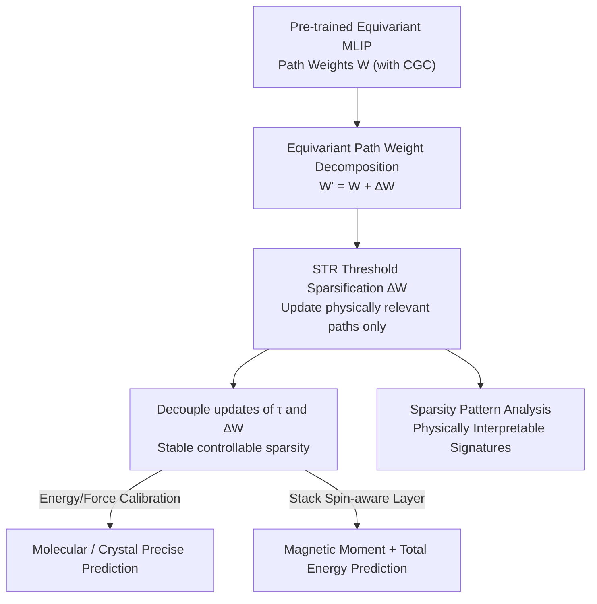

# Robust and Interpretable Adaptation of Equivariant Materials Foundation Models via Sparsity-promoting Fine-tuning

**Conference**: ICLR 2026  
**OpenReview**: [https://openreview.net/forum?id=moBqB1CUym](https://openreview.net/forum?id=moBqB1CUym)  
**Code**: Available in Supplementary Materials  
**Area**: Materials Foundation Models / Equivariant Graph Neural Networks / Parameter-Efficient Fine-Tuning / Interpretability  
**Keywords**: Machine Learning Interatomic Potentials, E(3) Equivariance, Sparse Fine-tuning, STR, Magnetic Prediction

## TL;DR
This paper proposes a **sparsity-promoting fine-tuning** method that, while strictly maintaining equivariance, updates only approximately 0.5–3% of path weight parameters in Materials Foundation Models (MLIPs). It achieves or exceeds the energy/force prediction accuracy of full fine-tuning and ELoRA on molecular, crystal, and magnetic systems, while the resulting sparse update patterns provide physical interpretability (e.g., d-orbital channels are specifically modified in transition metal systems).

## Background & Motivation

**Background**: Machine Learning Interatomic Potentials (MLIPs) use neural networks to fit the Potential Energy Surface (PES), serving as efficient surrogates for Density Functional Theory (DFT). Recently, following the foundation model paradigm in CV/NLP, "Materials Foundation Models" (MACE-MP-0, CHGNet, SevenNet, etc.) pre-trained on large-scale DFT data have emerged. Most are based on E(3)-equivariant Graph Neural Networks (GNNs), which model many-body interactions while strictly preserving translation, rotation, and inversion symmetries.

**Limitations of Prior Work**: Material systems are extremely diverse. Even large pre-training sets cannot cover all elements, crystal structures, and physicochemical conditions (pressure, temperature). Furthermore, downstream applications often use different theoretical levels or exchange-correlation functionals than the pre-training data, introducing systematic biases. Therefore, directly applying pre-trained models to new scenarios often fails, necessitating domain-specific fine-tuning (calibration). However, full fine-tuning is prone to overfitting in "small data + massive configuration/chemical spaces" and incurs high computational and memory costs. Existing parameter-efficient methods (GeoAda, ELoRA) redesign Adapters/LoRA for equivariant structures, but they focus on "**how to parameterize updates**" (low-rank, restricted magnitude).

**Key Challenge**: Low-rank approaches result in **dense updates** for $\Delta W$, where every interaction path is more or less perturbed. This is neither conducive to targeted calibration (many paths should remain unchanged) nor aligned with the interpretability goals of scientific ML. A complementary but unexplored perspective is: instead of constraining "how to update," directly control "**which parameters to update**," allowing the model to modify only a few paths most relevant to the target domain while keeping others frozen.

**Goal**: To implement a fine-tuning method on equivariant MLIPs that maintains symmetry, selectively updates a minimal number of parameters, and ensures the sparsity pattern itself carries physical meaning.

**Key Insight**: Internal weights of equivariant networks are naturally attached to physically meaningful basis functions (spherical harmonics, Clebsch–Gordan tensor product paths). Imposing sparsity constraints on these "path weights" allows for precise identification of which channels were modified and which remained constant. This aligns "sparsity = reduced redundant degrees of freedom = interpretability" (echoing SINDy and Occam’s Razor) with the physical structure of MLIPs.

**Core Idea**: Decompose the fine-tunable path weights into "frozen component + sparse increment $\Delta W$." Use the STR thresholding mechanism to dynamically prune $\Delta W$ during training, retaining only a small number of physically relevant path updates. This achieves equivariant, accurate, and interpretable domain adaptation with ~0.5–3% of parameters.

## Method

### Overall Architecture

The method is built upon Equivariant Graph Neural Networks (EGNNs). EGNNs represent node/edge features as irreducible representations (irreps) of the rotation group, indexed by order $\ell$ ($\ell=0$ for scalars, $\ell=1$ for vectors, $\ell=2$ for $2^{nd}$-order tensors). When two sets of irreps couple, the output order must satisfy $|\ell_{in1}-\ell_{in2}|\le\ell_{out}\le\ell_{in1}+\ell_{in2}$. These "symmetry-allowed interaction paths" are implemented by predefined, non-trainable Clebsch–Gordan coefficients (CGC). **Equivariance is guaranteed entirely by CGC**, while the model's learning capacity resides in the **learnable scalar weight tensors $W$** that modulate the strength of each path.

A key observation follows: **the only parameters that should be moved during fine-tuning—and can be moved without breaking equivariance—are these path weight tensors**. This work decomposes the weights to be fine-tuned into a frozen component and a sparse increment $W' = W + \Delta W$, then applies the STR thresholding mechanism during training to force $\Delta W$ toward sparsity. During inference, $\Delta W$ is merged back into $W$, resulting in identical speed and memory usage as the original model. Additionally, to extend the method to magnetic tasks, the framework can stack a "spin-aware layer" (trained from scratch) atop the foundation model to predict non-collinear magnetic moments and spin-exchange energy corrections for each atom.

### Key Designs

**1. Equivariant Path Weight Decomposition: Restricting fine-tuning to the only safe knobs**

Existing equivariant fine-tuning (e.g., ELoRA) maintains symmetry but expresses $\Delta W$ as the product of two low-rank matrices $\Delta W=AB$, causing every interaction path to be perturbed (dense update). This paper identifies "what can move" in an equivariant network: CGCs are predefined constants that enforce equivariance, while the only learnable parts are the scalar weights $W$ modulating path strengths. Thus, the natural point for fine-tuning is the path weight tensor, decomposed as $W' = W + \Delta W$ (where $W$ is frozen and $\Delta W$ carries adaptation). From this perspective, fine-tuning is essentially "re-weighting the relative contributions of interaction paths" to adapt to target chemical compositions, pressure/temperature ranges, or DFT theory levels. Since $\Delta W$ only multiplies the CGC of a single tensor path, symmetry constraints are naturally preserved; meanwhile, injecting $\Delta W$ directly into the path weight tensor introduces almost no additional computational overhead. Note that sparsity here is **not** to save training computation ($W$ remains dense) but to induce "selective, physically meaningful" updates.

**2. STR Threshold Sparsification: Letting the model decide which paths to modify**

To achieve "updating only the most critical paths," the authors adopt Soft Threshold Weight Reparameterization (STR) from computer vision. A **layer-wise learnable scalar $\tau$** controls the pruning threshold $\delta = g(\tau)$ (where $g$ is sigmoid). Before each forward pass during training, a soft-thresholding operator is applied to $\Delta W$, pruning terms with magnitudes below the threshold:

$$\Delta W_t \leftarrow S(\Delta W_t, \delta_t) := \mathrm{sign}(\Delta W_t)\odot \mathrm{ReLU}(|\Delta W_t| - \delta_t)$$

where $\odot$ denotes the element-wise Hadamard product. $\Delta W$ cannot be initialized to 0 (otherwise the threshold mechanism causes vanishing gradients); instead, it is initialized from a narrow Gaussian $\mathcal{N}(0,\sigma^2 I)$ (with $\sigma=0.01$). Consequently, only a few weights corresponding to specific interaction paths are updated, highlighting physically relevant interactions while suppressing symmetry-trivial paths. Typically, only about 0.5–3% of parameters are modified for a given dataset.

**3. Decoupled $\tau$ and $\Delta W$ Updates: Stabilizing naive STR**

The authors found that directly applying naive STR to equivariant MLIPs causes instability during fine-tuning because $\tau$ and $\Delta W$ **share weight decay**. This work decouples their updates, using separate learning rates and weight decays for each. The update for $\Delta W$ allows gradients to flow only through non-pruned elements:

$$\Delta W_{t+1} \leftarrow (1-\eta_t\lambda_\Delta)\Delta W_t - \eta_t\nabla_{\Delta W_t}L_{total}\odot \mathrm{Mask}\{|\Delta W_t|>0\}$$

The threshold parameter $\tau$ is updated independently with its own learning rate $\eta_{\tau,t}$ and weight decay $\lambda_\tau$:

$$\tau_{t+1} \leftarrow (1-\eta_{\tau,t}\lambda_\tau)\tau_t - \eta_{\tau,t}\nabla_{\tau_t}L_{total}$$

Here, $\lambda_\tau$ becomes the core knob for controlling final sparsity: $\lambda_\tau=0.01$ yields a "low sparsity/high performance" configuration (denoted L), while $\lambda_\tau=0.3$ yields a "high sparsity/stable" configuration (denoted H). With decoupling, fine-tuning becomes stable and allows fine-grained control over sparsity.

**4. Spin-Aware Extension: Pushing foundation models to magnetic tasks**

To demonstrate that the method can do more than just energy/force calibration, the authors stack a spin-aware layer (trained from scratch, +8.6% parameters) on top of MACE-MP-0b3. It takes final node/edge embeddings to predict vector non-collinear magnetic moments $\hat\mu_i$ and edge energy corrections $\epsilon_{ij}$ from spin exchange. Total energy equals the foundation model energy plus the spin contribution. Sparsity-promoting fine-tuning **only acts on the original foundation model parameters**, while the spin layer is trained normally. The total loss is a weighted sum of four terms:

$$L_{total} = \alpha_E L_E + \alpha_F L_F + \alpha_V L_V + \alpha_\mu L_\mu$$

All terms use Huber loss. For magnetic systems, the weights for energy/force/stress/magnetic moment are set to 1:1:1:1. This design allows a "non-magnetic foundation model + few sparse updates + spin layer" to capture magnetic energy differences on the order of 10 meV/atom, reusing pre-trained knowledge and avoiding training from scratch.

### Loss & Training
The schedule-free AdamW optimizer is used uniformly with a batch size of 64 and weight decay of $1\times10^{-8}$. Training is conducted on a single GPU, with results averaged over three random seeds. Initial learning rates are grid-searched by dataset: $1\times10^{-2}$ for rMD17, $1\times10^{-3}$ for LAM, and $5\times10^{-3}$ for MP-mag. Initial $\sigma=0.01$ for $\Delta W$ and initial threshold $\delta=0.001$. Loss weights for energy/force follow the MACE foundation model defaults except in magnetic systems.

## Key Experimental Results

### Main Results

Evaluated on four benchmarks: rMD17 (10 organic molecules, MACE-OFF23), LAM (9 inorganic crystal subsets, MACE-MP-0b3), self-constructed TM-O-Spin (transition metals and oxides with magnetic order), and MP-mag (Materials Project magnetic subset). Baselines include Zero-shot, Scratch training, Full fine-tuning, and ELoRA. Metrics are Energy MAE (meV/atom), Force MAE (meV/Å), and Total Sparsity Sp. (%).

| Dataset | System | Full | ELoRA | Ours (L) | Ours (H) | Ours Sparsity |
|--------|------|------|-------|----------|----------|-------------|
| rMD17 Aspirin | E | 0.19 | 0.21 | **0.17** | 0.20 | 96.84% (H) |
| rMD17 Aspirin | F | 8.09 | 8.52 | **7.56** | 8.22 | — |
| LAM Cu | E | 32.74 | 9.33 | **2.18** | 2.49 | 99.58% (H) |
| LAM Cu | F | 25.82 | 32.46 | **23.92** | 25.39 | — |
| LAM Ag∪Au | E | 11.67 | 4.98 | **3.67** | 4.84 | 99.41% (H) |

- Under the standard configuration (L) for rMD17, the proposed method outperforms Full and ELoRA on 8 out of 10 molecules. The high sparsity configuration (H) outperforms ELoRA on all 10 molecules.
- On inorganic crystals, the advantage is particularly pronounced for systems with large zero-shot errors and strong distribution shifts (e.g., Sn, H2O-PD, Cu), achieved by modifying only ~3% (L) or even 0.5–0.7% (H) of parameters.
- Similar or superior accuracy is maintained when switching to the NequIP-OAM-L architecture, proving the method is not architecture-bound.

### Magnetic Systems (TM-O-Spin)

| Metric | Scratch | Full | ELoRA | Ours (L) | Ours (H) |
|------|---------|------|-------|----------|----------|
| Energy (meV/atom) | 27.28 | 11.58 | 12.44 | **9.50** | 10.57 |
| Force (meV/Å) | 174.70 | 96.89 | 116.31 | **70.46** | 74.15 |
| Mag. Moment (µ) | 0.035 | 0.029 | 0.038 | **0.028** | 0.030 |
| Total Sparsity (%) | — | — | — | 90.21 | 91.83 |

Ours (L) leads across energy, force, and magnetic moment metrics while updating only ~10% of parameters.

### Ablation Study

| Configuration | Key Finding | Description |
|------|---------|------|
| Linear layers only | Nearly identical to "All" | Adaptation capability is primarily carried by linear layers |
| FCTP layers only | Consistently worst | FCTP paths contribute little to adaptation |
| Linear vs All Sparsity | "All" sparsity jumps at small $\lambda_\tau$ | Linear parameters are more critical; the model "refuses" to prune them |
| $\lambda_\tau$ Regimes | L ($\lambda_\tau{=}0.01$) High Perf / H ($\lambda_\tau{=}0.3$) High Sparsity | Energy curves reveal two effective adaptation regimes |

### Key Findings
- **Sparse updates are more accurate**: Selectively updating physically relevant paths outperforms dense full fine-tuning and ELoRA in most systems, especially those with significant distribution shifts.
- **Linear layers are the main adaptation drivers**: FCTP layers contribute less, and the model prioritizes retaining linear layer parameters during sparsification.
- **Dense updates become competitive as data grows**: On the large-scale MP-mag dataset, the gap between methods narrows, with Full fine-tuning performing best for force prediction, suggesting a trade-off between data scale and fine-tuning strategy.

## Highlights & Insights
- **"Which parameters to change" as a first-class citizen**: Current equivariant PEFT methods modify "how to parameterize updates." This work shifts to constraining "which paths to update," making the physical basis functions inherent in equivariant structures directly readable as sparse signatures.
- **Natural coupling of sparsity and interpretability**: Since $\Delta W$ is applied to spherical harmonic/CGC paths, non-zero terms naturally correspond to physical orbital channels. Interpretability is a byproduct of the method rather than an added probe.
- **The decoupling of $\tau$ and $\Delta W$ is highly transferable**: Naive STR is unstable in equivariant MLIPs; decoupling the decay of the threshold and weights stabilizes the process. This technique is applicable to other "threshold pruning + fine-tuning" scenarios.
- **Expanding foundation models to new physics**: The combination of spin-aware layers and sparse fine-tuning demonstrates that MLIP foundation models can be extended beyond energy/force (to magnetic moments, total magnetism), providing a paradigm for "one model, multiple physical properties."

## Limitations & Future Work
- **No training speedup**: As the authors note, since $W$ remains dense and sparsity only exists in $\Delta W$, the method **does not** provide the training acceleration common in sparse networks. This is an inherent limitation of the fine-tuning paradigm. Future work suggests "structurally sparse pre-training" for actual hardware acceleration.
- **Diminishing returns at scale**: On larger datasets like MP-mag, dense updates become more competitive, indicating that the relative gain of this method depends on the scale and diversity of in-domain data.
- **Qualitative Interpretability**: Physical signature analysis (orbital channels, $1-R^2$ heatmaps) provides persuasive qualitative evidence but lacks quantitative interpretability metrics or downstream validation.
- **Spin layer trained from scratch**: The magnetic expansion introduces +8.6% parameters trained from scratch. If target domain magnetic data is scarce, the spin layer itself might become a new point of overfitting.

## Related Work & Insights
- **vs ELoRA / GeoAda (Equivariant PEFT)**: These use low-rank or restricted-magnitude parameterization of $\Delta W$, resulting in dense, diffused updates. The proposed method uses sparse thresholds to obtain selective, interpretable updates with comparable or better accuracy.
- **vs Full Fine-tuning**: Full fine-tuning modifies all parameters, is prone to overfitting, and is computationally expensive. This method modifies only 0.5–3% of parameters to match or beat Full fine-tuning, especially in small-data or high-shift scenarios.
- **vs STR (Sparsity in CV)**: Direct application of STR is unstable in equivariant MLIPs; this work makes it suitable for equivariant fine-tuning by decoupling $\tau$ and $\Delta W$ decay, representing a non-trivial adaptation of STR to Scientific ML.
- **vs SINDy / Sparse Scientific ML**: Shared belief in Occam’s Razor—that few core variables dominate physical phenomena. This work applies sparsity to equivariant path weights within foundation models, focusing on "interpretable domain adaptation" rather than equation discovery.

## Rating
- Novelty: ⭐⭐⭐⭐⭐ First introduction of "which parameters to update" via sparsity to equivariant MLIP fine-tuning, enabling physical interpretability.
- Experimental Thoroughness: ⭐⭐⭐⭐ Covers 4 benchmarks (molecule/crystal/magnetic), two architectures, plus ablation and cost analysis.
- Writing Quality: ⭐⭐⭐⭐⭐ Clear motivation and derivations; the coupling of equivariant structure with sparsity is well-explained.
- Value: ⭐⭐⭐⭐⭐ Provides an efficient, robust, and interpretable solution for domain adaptation of Materials Foundation Models.

## Related Papers

- [\[ICLR 2026\] Physics-Constrained Fine-Tuning of Flow-Matching Models for Generation and Inverse Problems](physics-constrained_fine-tuning_of_flow-matching_models_for_generation_and_inver.md)
- [\[ICML 2026\] Interpretable Equivariant Marks for Contrastive Cosmological Inference](../../ICML2026/physics/interpretable_neural_marked_statistics_for_cosmological_inference.md)
- [\[ICLR 2026\] Advancing Universal Deep Learning for Electronic-Structure Hamiltonian Prediction of Materials](advancing_universal_deep_learning_for_electronic-structure_hamiltonian_predictio.md)
- [\[ICLR 2026\] VisionLaw: Inferring Interpretable Intrinsic Dynamics from Visual Observations via Bilevel Optimization](visionlaw_inferring_interpretable_intrinsic_dynamics_from_visual_observations_vi.md)
- [\[ICML 2026\] Foundation Inference Models for Ordinary Differential Equations](../../ICML2026/physics/foundation_inference_models_for_ordinary_differential_equations.md)

<!-- RELATED:END -->

<!-- RELATED:START -->

## Related Papers

- [\[ICLR 2026\] Physics-Constrained Fine-Tuning of Flow-Matching Models for Generation and Inverse Problems](physics-constrained_fine-tuning_of_flow-matching_models_for_generation_and_inver.md)
- [\[ICLR 2026\] VisionLaw: Inferring Interpretable Intrinsic Dynamics from Visual Observations via Bilevel Optimization](visionlaw_inferring_interpretable_intrinsic_dynamics_from_visual_observations_vi.md)
- [\[ICML 2026\] Interpretable Equivariant Marks for Contrastive Cosmological Inference](../../ICML2026/physics/interpretable_neural_marked_statistics_for_cosmological_inference.md)
- [\[ICLR 2026\] Advancing Universal Deep Learning for Electronic-Structure Hamiltonian Prediction of Materials](advancing_universal_deep_learning_for_electronic-structure_hamiltonian_predictio.md)
- [\[ICLR 2026\] AQER: A Scalable and Efficient Data Loader for Digital Quantum Computers](aqer_a_scalable_and_efficient_data_loader_for_digital_quantum_computers.md)

<!-- RELATED:END -->
