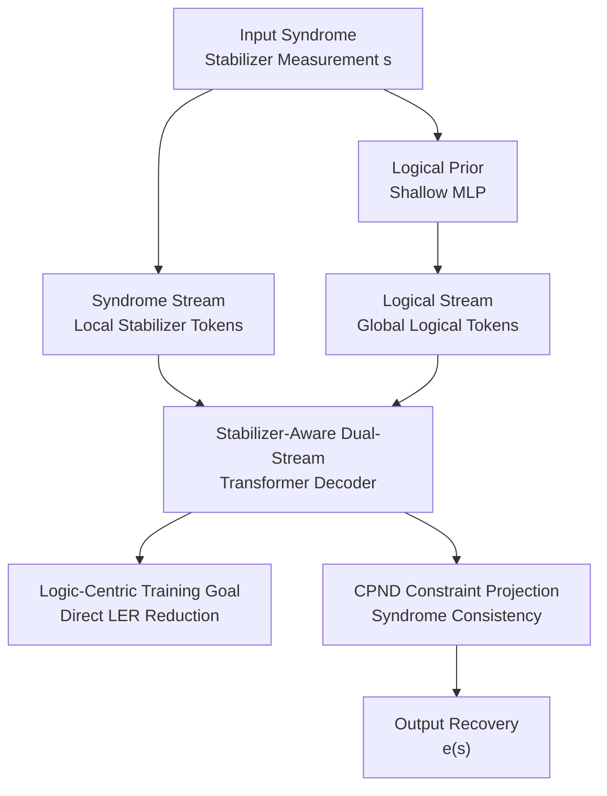

# SAQ: Stabilizer-Aware Quantum Error Correction Decoder

**Conference**: ICLR2026  
**OpenReview**: [https://openreview.net/forum?id=ySp8faVj6k](https://openreview.net/forum?id=ySp8faVj6k)  
**Code**: https://github.com/DavidZenati/SAQ-Decoder/tree/main  
**Area**: Quantum Error Correction / Physics  
**Keywords**: Quantum Error Correction, Stabilizer Codes, Neural Decoder, Transformer, Logical Error Rate

## TL;DR
SAQ-Decoder utilizes a stabilizer-aware dual-stream Transformer to learn the mapping from syndromes to logical error classes and physical correction operations. By incorporating Constraint-Projected Nullspace Descent (CPND) post-processing to ensure syndrome consistency, it pushes the thresholds for independent and depolarizing noise on toric codes to 10.99% and 18.6%, respectively, approaching the maximum likelihood decoding upper bound.

## Background & Motivation
**Background**: The core task of Quantum Error Correction (QEC) is to infer the errors occurring on physical qubits from syndromes obtained through stabilizer measurements and provide a recovery operation that preserves the encoded logical quantum state. Classic methods like Minimum Weight Perfect Matching (MWPM) serve as strong baselines for surface/toric codes, while BP-OSD is representative for sparse parity-check matrices. Tensor network decoders achieve high accuracy but at a significant computational cost. Recently, neural decoders have emerged, attempting to use CNNs, Transformers, or recurrent models to learn the mapping from syndrome to recovery.

**Limitations of Prior Work**: The primary difficulty in QEC decoding is not just predicting physical qubit flips, but predicting the correct logical equivalence class under quantum degeneracy. Multiple distinct physical errors can produce the same syndrome; some are logically equivalent (differing only by a stabilizer), while others lead to logical qubit flips and failure. Thus, neural decoders optimizing only bit error rates may perform well at the physical error level but fail to directly minimize the Logical Error Rate (LER). Furthermore, pure neural network outputs typically do not guarantee syndrome consistency, such as $He=s$ over GF(2), requiring correction via post-processing.

**Key Challenge**: High-precision classical decoders often require high polynomial complexity, and near-ML tensor network decoders are computationally heavy. Conversely, fast neural decoders, while computationally inexpensive during inference, struggle to reach near-ML logical accuracy if they do not explicitly respect the local geometry of stabilizer codes, logical operator constraints, and syndrome consistency. This paper addresses the contradiction between "linear/near-linear complexity required for real-time decoding" and "near-ML logical accuracy required for fault-tolerant quantum computing."

**Goal**: The authors aim to construct a scalable learned decoder: taking syndromes as input and outputting a recovery operator that satisfies stabilizer constraints; focusing training objectives directly on logical errors rather than physical bit flips; maintaining linear inference complexity relative to syndrome length; and generalizing across different stabilizer code families (toric, rotated surface, color, repetition codes) and noise models.

**Key Insight**: A key observation is that stabilizer code syndromes possess distinct local geometric structures, and the interaction between syndromes can be derived from the parity-check matrix $H$. However, logical error classes are global properties requiring the integration of long-range syndrome information. Consequently, the authors decouple the problem into two information streams: a syndrome stream for local stabilizer correlations and a logical stream for global logical class inference, allowing interaction via asymmetric attention.

**Core Idea**: Use a topological stabilizer mask to restrict syndrome attention, a logical stream to aggregate global information, and integrate a logic-centric loss with CPND constraint projection to transform neural predictions into syndrome-consistent recovery operations.

## Method

### Overall Architecture
The input to SAQ-Decoder is the syndrome $s$ from stabilizer measurements, and the output is a recovery operator $e(s)$ that must be probabilistically close to the true error and satisfy constraints involving the given syndrome and predicted logical class. The process consists of four steps: estimating a logical class prior using a shallow MLP; converting syndromes and logical priors into two token streams; performing joint local-global inference via the Syndrome-Logical Transformer Decoder (SLTD); and finally projecting neural soft predictions into a feasible GF(2) solution space using Constraint-Projected Nullspace Descent (CPND).

The innovation lies in aligning the network architecture with the algebraic structure of QEC. Syndrome tokens only interact within neighborhoods defined by $HH^T$, respecting the stabilizers that share physical qubits. Logical tokens perform cross-attention across global syndrome representations, as logical error classes are global quantities. During training, the model is supervised by initial logical priors, final logical classes, and differentiable logical parity constraints. During inference, CPND performs exact projection to ensure the output is a syndrome-consistent recovery.

### Key Designs
**1. Dual-Stream Representation: Decoupling Local Stabilizer Constraints and Global Logical Classes**

Traditional neural decoders treat syndromes as a flat input to predict physical errors, mixing two distinct problems: local stabilizer violations (where the error might be) and logical equivalence classes (whether the error destroys encoded information). SAQ uses a shallow MLP $b_\phi(s)$ to obtain initial logical class logits $\tilde{\ell}\in\mathbb{R}^{4k}$, where $4k$ corresponds to the number of logical equivalence classes for $k$ logical qubits. This provides a global prior for the logical stream.

The syndrome stream encodes the geometry of stabilizer measurements: each syndrome component $s_i\in\{-1,+1\}$ is multiplied by a learnable position vector $w_i^S$ to form tokens, including a global token $g$ to summarize long-range information. The logical stream multiplies $\tilde{\ell}_j$ by class-specific vectors $w_j^L$. This explicitly acknowledges the different semantics of "local error patterns" and "logical coset identification" from the input layer.

**2. Stabilizer-Aware Asymmetric Attention: Local Syndrome Propagation and Global Logical Aggregation**

The Syndrome-Logical Transformer Decoder uses a weight-sharing multi-layer Transformer with a non-standard attention pattern. Syndrome self-attention incorporates a mask $M_S$ allowing only three types of connections: a syndrome with itself, pairs of syndromes sharing a physical qubit, and connections between all syndromes and the global token. Using the parity-check matrix: $M_S[i,j]=0$ if $(HH^T+I_m)_{i,j}>0$ or if it involves a global token; otherwise, $M_S[i,j]=-\infty$. This embeds the stabilizer code topology directly into the attention graph.

The logical stream utilizes unrestricted cross-attention over the updated syndrome representations. This design mirrors the causal structure of QEC: physical errors leave local syndrome traces, but logical errors depend on global patterns across the code distance. Ablations show asymmetric flow outperforms bidirectional cross-attention by preventing logical and syndrome tokens from over-mixing, keeping the syndrome side locally constrained.

**3. Logic-Centric Loss: Direct Optimization of Logical Errors**

To prioritize logical information preservation, SAQ's training objective consists of three terms: cross-entropy for the MLP's logical prior $L_{LP}=CE(\tilde{\ell},y_{class})$, cross-entropy for the Transformer's logical class output $L_{LC}=CE(\hat{\ell},y_{class})$, and a logic minimum entropy loss $L_{Entropy}$.

Successful decoding requires the residual $r=e_{true}\oplus e_{pred}$ to satisfy $Lr=0$ over GF(2). Since hard decisions are non-differentiable, the error probability of each residual bit is defined as $q_i=\sigma((1-2e_i^{true})\hat e_i)$. The probability that the $i$-th logical operator is violated is estimated using the Bernoulli parity closed-form:

$$
Pr(L_i\cdot r=1)=\frac{1}{2}\left[1-\prod_{j\in\chi_i}(1-2q_j)\right].
$$

The loss is minimized as:

$$
L_{Entropy}=-\frac{1}{2k}\sum_{i=1}^{2k}\log(1-Pr(L_i\cdot r=1)).
$$

This encourages the network to avoid equivalence classes that produce logical flips, directly addressing training misalignments caused by quantum degeneracy.

**4. CPND Post-Processing: Projecting Neural Predictions to Feasible Solutions**

Even with high-quality probabilities, a thresholded $e_{pred}$ may not satisfy $He=s$ or the predicted logical class. CPND stacks the parity-check matrix and logical operator matrix into an augmented matrix $\hat H=[H;L]$ and defines the constraint as $\hat H e=b$, where $b=[s;\ell]$. By pre-calculating a left-inverse $B$, a residual $y=b\oplus \hat H e_{pred}$ is used to obtain $e'=e_{pred}\oplus By$.

To further optimize, SAQ performs greedy descent in the nullspace of $\hat H$. Using nullspace basis vectors $v_j$ and flip probabilities $p_q=\sigma(\hat e_q)$ to construct log-likelihood ratio weights $w_q=-\log(p_q/(1-p_q))$, the algorithm accepts flips along $v_j$ that reduce the weighted Hamming cost. This maintains $\hat H e=b$ while approaching a low-weight solution similar to OSD-0 but with $O(m)$ online complexity.

### Loss & Training
The total loss is $L=\lambda_{LP}L_{LP}+\lambda_{LC}L_{LC}+\lambda_{Entropy}L_{Entropy}$, with typical weights $\lambda_{LP}=0.2$, $\lambda_{LC}=1.0$, and $\lambda_{Entropy}=1.0$. The model uses 6 to 8 Transformer layers (embedding dimension 128, 16 attention heads). Training involves random sampling of noise within the target physical error range to enhance generalization.

The Adam optimizer is used with batch sizes between 128 and 512 over 200 to 600 epochs. Each run processes approximately $2.56\times 10^6$ error samples. Learning rates start at $3\times 10^{-4}$ or $1\times 10^{-4}$ and decay using cosine annealing to $1\times 10^{-6}$.

## Key Experimental Results

### Main Results
SAQ-Decoder outperforms MWPM, BPOSD-2, and QECCT on toric and rotated surface codes. Even the version without CPND often exceeds these baselines.

| Code Family / Noise Model | Metric | SAQ-Decoder | Representative Baseline | Interpretation |
|--------|------|------|----------|------|
| Toric / independent | threshold | 10.99% | MWPM 10.3%, BPOSD-2 10.8%, ML ~11.0% | Close to ML threshold |
| Toric / depolarizing | threshold | 18.6% | QECCT 17.8%, MWPM/BPOSD-2 ~16%, ML 18.9% | Approaches theoretical ML upper bound |
| Rotated surface / independent | threshold | 10.7% | QECCT 10.3%, BPOSD-2 10.2%, MWPM 10.6% | Consistently exceeds strong baselines |
| Rotated surface / depolarizing | threshold | 18.3% | QECCT 17.2%, BPOSD-2 14.1%, MWPM 14.0% | Significant advantage in depolarizing noise |

In LER comparisons, SAQ maintains a lead over recent neural decoders. For instance, with toric code $L_{code}=6$ and $p=0.09$, SAQ achieves an LER of 0.0363 compared to QuantumSMoE's 0.0492 and MWPM's 0.1238.

### Ablation Study
| Configuration | Key Metric | Description |
|------|---------|------|
| Full loss $(0.2,1.0,1.0)$ | final average LER $1.972\times 10^{-1}$ | All three loss terms included |
| w/o logical classification | $2.113\times 10^{-1}$ | LER increases by 7.2% (most critical term) |
| w/o logical prior | $2.055\times 10^{-1}$ | LER increases by 4.2% |
| w/o entropy regularization | $2.047\times 10^{-1}$ | LER increases by 3.8% |
| Mask + global token | ~0.19 average LER | Fastest convergence and lowest LER |
| Mask only | ~0.21 average LER | Local topology mask is effective but lacks aggregation |

### Key Findings
- The dual-stream structure is essential. Neither stream alone matches the full model, and asymmetric attention is superior to bidirectional flow, matching the causal structure of QEC.
- CPND combines learned priors with exact constraints, ensuring $He=s$ and valid logical class predictions.
- SAQ is parameter-efficient and computationally efficient compared to QECCT, with linear scaling in inference complexity.

## Highlights & Insights
- SAQ connects QEC algebraic constraints with neural architectures by deriving masks from $HH^T$ and losses from logical equivalence.
- The logic-centric loss highlights that in structured prediction with equivalence classes, the objective should align with the ultimate failure event (logical flip) rather than element-wise accuracy.
- CPND represents a practical hybrid design, providing an interpretable algebraic projection to guarantee legality while utilizing neural probabilistic priors.

## Limitations & Future Work
- Evaluation is primarily on toric, surface, color, and repetition codes; performance on large-scale QLDPC codes and complex hardware noise (leakage, correlated noise) requires further verification.
- CPND uses a greedy descent which does not guarantee the global minimum weight recovery, potentially limiting LER in complex noise distributions.
- Training costs remain high, requiring significant GPU resources and time to generate data and converge.

## Related Work & Insights
- **vs MWPM**: SAQ shows significant LER reductions in depolarizing noise and scales linearly with code distance.
- **vs BP-OSD**: SAQ manages quantum degeneracy more effectively through Transformer representation learning and uses lighter post-processing than heavy OSD.
- **vs QECCT**: By directly optimizing LER and ensuring syndrome consistency, SAQ improves upon qubit-level flip prediction.

## Rating
- Novelty: ⭐⭐⭐⭐⭐ 
- Experimental Thoroughness: ⭐⭐⭐⭐⭐ 
- Writing Quality: ⭐⭐⭐⭐ 
- Value: ⭐⭐⭐⭐⭐ 

<!-- RELATED:START -->

## Related Papers

- [\[ICML 2026\] Rethink the Role of Neural Decoders in Quantum Error Correction](../../ICML2026/physics/rethink_the_role_of_neural_decoders_in_quantum_error_correction.md)
- [\[ICML 2026\] Score-Based Error Correcting Code Decoder](../../ICML2026/physics/score_based_error_correcting_code_decoder.md)
- [\[ICLR 2026\] Uncertainty-Aware Diagnostics for Physics-Informed Machine Learning](uncertainty-aware_diagnostics_for_physics-informed_machine_learning.md)
- [\[ICLR 2026\] Sublinear Time Quantum Algorithm for Attention Approximation](sublinear_time_quantum_algorithm_for_attention_approximation.md)
- [\[ICLR 2026\] Feedback-driven Recurrent Quantum Neural Network Universality](feedback-driven_recurrent_quantum_neural_network_universality.md)

<!-- RELATED:END -->
