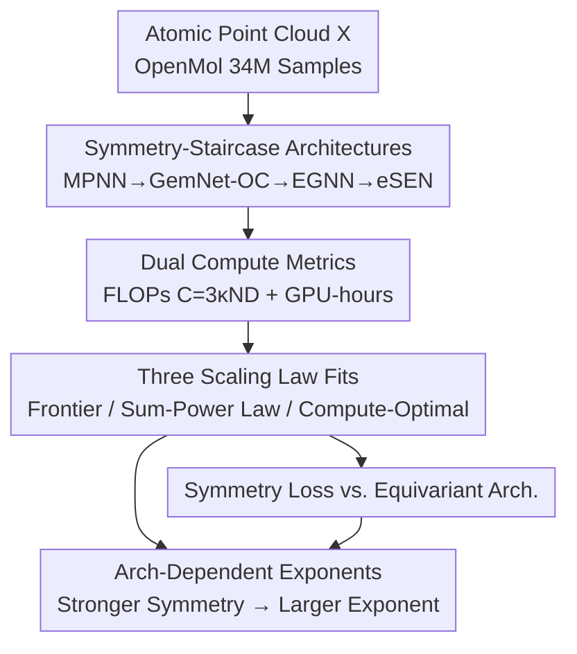

# Scaling Laws and Symmetry, Evidence from Neural Force Fields

**Conference**: ICLR 2026  
**OpenReview**: [https://openreview.net/forum?id=qyjaVda7t2](https://openreview.net/forum?id=qyjaVda7t2)  
**Code**: https://github.com/nnkhang19/scaling-laws-and-symmetry  
**Area**: Neural Network Force Fields / Scaling Laws / Geometric Deep Learning  
**Keywords**: Scaling Laws, Equivariance, Symmetry, Interatomic Potentials, Compute-optimal

## TL;DR
This paper conducts systematic scaling law experiments on geometric tasks for "Neural Network Interatomic Potentials (NNIP)". It finds that power-law exponents are **architecture-dependent**: architectures with stronger rotation/permutation symmetry and higher tensor orders exhibit larger scaling exponents with respect to data, parameters, and compute. Consequently, performance gaps **widen** rather than narrow at scale, providing counter-evidence to the popular view that equivariance should be abandoned in favor of large-scale models learning symmetries themselves.

## Background & Motivation
**Background**: Neural scaling laws have been widely verified in language and vision, where validation error follows a power-law decay relative to training data $D$, parameters $N$, and compute $C$. A mainstream belief, supported by both theory and empirical evidence, is that scaling behavior is consistent across different (sufficiently expressive) architectures for a given task. Architecture choice is thought to only scale the loss by a **constant factor** across scales without altering the power-law slope (exponent). This is further reinforced by Sutton's "Bitter Lesson": explicitly encoded inductive biases (like symmetry) are useful in the short term but eventually outperformed by "scale + learning."

**Limitations of Prior Work**: In geometric tasks like molecular force fields, equivariant networks are known for superior generalization and out-of-distribution robustness. However, they rely on specialized operators like tensor products, spherical harmonics, and high-order message passing, which are computationally expensive and poorly optimized for GPUs, leading to the perception that they are "hard to scale." Meanwhile, evidence in protein folding, conformation generation, and NNIP suggests that non-equivariant networks with data augmentation can match equivariant performance, pushing the field toward abandoning equivariance for simpler, scalable models.

**Key Challenge**: The assertion that "architecture only changes the constant factor, not the exponent" comes almost exclusively from language and vision and has never been rigorously tested on geometric tasks where **symmetry is the intrinsic structure** of the task. If symmetry fundamentally changes the **internal difficulty** of the task, it should alter the **exponent itself** rather than just the constant factor—this is the critical ignored aspect.

**Goal**: Under unified and fair experimental conditions, measure the scaling exponents of several mainstream scalable NNIP architectures (with varying levels of symmetry encoding) across the $C$, $D$, and $N$ axes to answer two sub-questions: (1) Do architectures with different symmetry strengths have different power-law exponents? (2) If so, does the performance gap widen or narrow as scale increases?

**Key Insight**: Treat the NNIP task as a clean "symmetry-controlled" laboratory: keeping the dataset, hardware, and fitting protocol constant, while varying only the degree of symmetry encoding in the architecture (from unconstrained to low-order to high-order), and observe how the exponent changes.

**Core Idea**: Symmetry is not an optional feature replaceable by scale, but a fundamental inductive bias that **changes task intrinsic difficulty and thus the scaling exponent**. It should be explicitly encoded more at larger scales, not left for the model to rediscover.

## Method

### Overall Architecture
This paper is an **empirical scaling law study** rather than a proposal for a new model. The framework consists of four steps: establishing a "symmetry-staircase" of architectures as the independent variable, fitting three types of power laws (compute frontier, sum-power law for parameters and data, and compute-optimal allocation) under a unified protocol, and finally conducting a "symmetry loss vs. equivariant architecture" comparison to determine if loss terms can cheaply replace equivariant structures. The task involves mapping atomic clouds $X=\{(z_i,x_i)\}$ (atomic numbers + 3D coordinates) to potential energy (invariant scalar) and forces (equivariant vector). Training uses dense force signals; the loss is a weighted sum of per-atom energy MAE and force MSE:

$$L(\phi_\theta, X) = \frac{\lambda_e}{n}\big\|e_\theta(X)-e(X)\big\|_1 + \frac{\lambda_f}{n}\sum_{i=1}^{n}\big\|f_{\theta,i}(X)-f_i(X)\big\|_2,\quad \lambda_e=\lambda_f.$$

### Key Designs

**1. Hierarchy of Architectures with Increasing Symmetry**

To prove that "exponents change with symmetry," a "staircase" of architectures with continuously adjustable symmetry levels is required. The authors chose message-passing architectures covering different **body orders** ($\nu$, the number of nodes determining a message, related to $S_n$ permutation representations) and **tensor orders** ($\ell$, the order of geometric tensor embeddings, related to $SO(3)$ rotation representations): ① **unconstrained MPNN**—processes relative position vectors directly without symmetry constraints ($\ell=0$); ② **GemNet-OC**—uses invariants like distances and angles ($\ell=0$) but is classified as **four-body** due to dihedral information and approximates equivariant functions from invariant edge features; ③ **EGNN** (extended as Multi-Channel MC-EGNN)—uses Cartesian vectors ($\ell=1$); ④ **eSEN**—uses high-order irreducible representations of spherical tensors ($\ell\ge2$, up to 4) and frame alignment to sparsify tensor products for scalability. This hierarchy isolates "symmetry expressivity" as the primary variable.

**2. Dual Compute Metrics + Comparable Training Protocol**

Theoretical FLOPs are hardware-agnostic, but equivariant networks often have low GPU utilization, which can lead to **underestimating** their actual cost if only FLOPs are considered. The authors thus fit scaling laws using two metrics: theoretical FLOPs $C\approx 3\kappa N D$ (where $\kappa$ is an architecture-specific constant; empirically found to be $\approx2.33$ for MPNN, $\approx28.09$ for EGNN, $\approx35.18$ for GemNet-OC, and $\approx74.36$ for eSEN) and **wall-clock training time** (GPU-hours) on identical hardware. To ensure robustness and avoid learning rate schedule interference, they use a scheduler-free AdamW-like optimizer. This captures training dynamics within a single run and allows fitting laws directly to training time. Using maximal update parameterization ($\mu$P), the optimal learning rate tuned at $\approx$1M parameters is transferred across widths.

**3. Three Mutually Consistent Power-Law Fittings**

The authors fit three types of power laws to ensure self-consistency. First, the **compute frontier power law**: the Pareto frontier of minimum validation loss for each compute budget is fitted as $L(C)=L_\infty+F_c C^{-\gamma_c}$ and $L(H)=L_\infty+F_h H^{-\gamma_h}$ (with $L_\infty\approx0$ as there is no clear theoretical baseline). Second, the **parameter-data sum-power law**: $L(N,D)=L_\infty+A N^{-\alpha}+B D^{-\beta}$ is fitted to the $(N,D,L)$ triplets, yielding data exponent $\beta$ and parameter exponent $\alpha$. Third, **compute-optimal allocation**: minimizing $L(N,D)$ under the constraint $3\kappa ND=C$ yields $N^*(C)\propto C^{a}$ and $D^*(C)\propto C^{b}$, where $a=\tfrac{\beta}{\alpha+\beta}$ and $b=\tfrac{\alpha}{\alpha+\beta}$, leading to a derived $\gamma_c=\tfrac{\alpha\beta}{\alpha+\beta}$. The high agreement between the directly fitted $\gamma_c$ and the derived value (see Main Results) confirms that architecture-dependent exponents are not artifacts of the fitting method.

**4. Symmetry Loss vs. Equivariant Architecture**

A natural alternative is to add a penalty term for symmetry deviation $L_{sym}=\tfrac{1}{M}\sum_{i=1}^{M} L\big(\phi_\theta(\rho_{in}(g_i)x),\,\rho_{out}(g_i)y\big)$ (where $g_i$ is sampled from the Haar measure) to an unconstrained model. The authors find that such symmetry loss only **slightly** improves the data exponent $\beta$ ($0.31\to0.40$) while **decreasing** the parameter exponent $\alpha$ ($0.28\to0.25$). Consequently, the overall compute exponent $\gamma_c$ remains nearly **constant** ($\approx0.14$). Furthermore, this sampling-based regularization acts like data augmentation, increasing training FLOPs by $(M{+}1)$ times and shifting the compute-optimal frontier to the right. The conclusion is that approximate symmetry via loss terms **cannot** replace the exponential scaling advantages of equivariant architectures.

### Loss & Training
The objective is the weighted sum of energy MAE and force MSE ($\lambda_e=\lambda_f$). Data is sourced from the OpenMol neutral molecule subset (34M training samples, 27K validation, $D\approx9.2\times10^8$ tokens). The experiments follow the **single-epoch** training protocol typical of LLM scaling studies to avoid confusion from repeated data. Optimization utilizes scheduler-free AdamW, fitting validation loss from intermediate checkpoints after discarding the first 1%–10% of steps.

## Key Experimental Results

### Main Results
Scaling exponents for four architectures across compute (FLOPs $\gamma_c$, GPU-hours $\gamma_h$), data ($\beta$), and parameters ($\alpha$) axes increase monotonically with symmetry strength:

| Architecture | Symmetry | $\gamma_c$ (FLOPs) | $\gamma_h$ (GPU-h) | $\beta$ (Data) | $\alpha$ (Param) |
|------|--------|------|------|------|------|
| Unconstrained MPNN | Unconstrained, $\ell=0$ | 0.14 | 0.21 | 0.31 | 0.28 |
| EGNN (MC-EGNN) | Cartesian vectors, $\ell=1$ | 0.17 | 0.27 | 0.39 | 0.39 |
| GemNet-OC | Invariants, 4-body | 0.25 | 0.33 | 0.50 | 0.52 |
| eSEN | High-order tensors, $\ell\ge2$ | 0.40 | 0.45 | 0.75 | 0.82 |

Consistency check of compute exponents derived from independent fitting paths:

| Architecture | $\gamma_c$ (Direct fit eq.4) | $\gamma_c$ (Derived from $\alpha,\beta$ eq.7) |
|------|------|------|
| MPNN | 0.142 | 0.146 |
| MC-EGNN | 0.173 | 0.195 |
| GemNet-OC | 0.255 | 0.256 |
| eSEN | 0.403 | 0.392 |

### Ablation Study
| Configuration | Key Metric | Description |
|------|---------|------|
| eSEN $\ell_{max}=2$ | $\gamma_c=0.35$ | Lowering tensor order within the same architecture |
| eSEN $\ell_{max}=4$ | $\gamma_c=0.40$ | **Increasing tensor order** within the same architecture raises the exponent |
| Unconstrained + Sym Loss | $\beta:0.31\to0.40,\ \alpha:0.28\to0.25,\ \gamma_c\approx0.14$ | Opposing changes in data/param exponents; compute exponent unchanged |
| Compute-optimal allocation | $a\approx b\approx0.5$ | $N$ and $D$ should scale proportionally (Chinchilla-like) |
| 1% Data × 100 Epochs | $\gamma_c\approx0.14,\ F_c\approx0.96$ | Multi-epoch with augmentation recovers single-epoch scaling |

### Key Findings
- **Architecture-dependent exponents are the core conclusion**: Stronger symmetry expressivity leads to larger exponents across all three axes, implying the performance advantage of equivariant models **expands** with scale.
- **Benefits of high-order representations grow with scale**: Within **eSEN**, raising $\ell_{max}$ from 2 to 4 increases $\gamma_c$ from 0.35 to 0.40, suggesting larger models benefit more from higher-order representations.
- **Compute-optimal allocation is architecture-independent**: All architectures satisfy $a\approx b\approx0.5$, meaning parameters and data should scale proportionally, consistent with Chinchilla findings in language.
- **Symmetry loss is not a substitute for equivariance**: It leads to counteracting shifts in $\beta$ and $\alpha$ while consuming $M+1$ times more compute, proving inefficient for compute-optimal scaling.
- **Robustness of multi-epoch training**: Even with only 1% of data repeated for 100 epochs, overfitting is negligible at large scales. Non-equivariant models require augmentation to stabilize their curves, but the gap with equivariant models still widens as compute increases.

## Highlights & Insights
- **Symmetry as a controllable variable for exponents**: While most scaling studies measure exponents within a fixed architecture, this work uses a "symmetry-staircase" to cleanly isolate symmetry as the cause of exponent variation.
- **Dual compute metrics debunk the FLOPs illusion**: Reporting GPU-hours ensures that the specialized nature of equivariant operations (poor GPU utilization) is accounted for. eSEN maintains the highest exponent even in wall-clock time.
- **Correction of "Exponent vs. Constant Factor" intuition**: The paper demonstrates that symmetry changes the **slope** rather than just the intercept of the power law. The magnitude of this effect suggests symmetry does more than just reduce degrees of freedom.

## Limitations & Future Work
- **Limitations acknowledged by authors**: (1) Analysis is limited to single-epoch, academic-scale settings; (2) Only one simple form of symmetry loss was tested; (3) Architecture-agnostic equivariance methods (e.g., frame averaging) were not covered; (4) Impact of denoising pre-training was not evaluated.
- **Potential improvements**: Developing a theory to explain why the 3D rotation group causes such massive changes in scaling exponents; extending the hierarchy to industrial-scale foundation models with denoising objectives.

## Related Work & Insights
- **vs. Brehmer et al. (2025)**: Brehmer reported that non-equivariant models have larger parameter exponents $\alpha$ and might catch up to equivariant models; this paper finds the opposite. The discrepancy likely stems from task differences and how "scaling" is defined.
- **vs. Kaplan / Hoffmann (Language Scaling)**: This work recovers the Chinchilla-style $N \propto D$ scaling but breaks the empirical precedent that architectures share the same exponent.
- **vs. Batzner et al. (2022)**: Previous work observed architecture-dependent scaling only in the data dimension; this paper provides a complete picture across $C, D,$ and $N$ with dual compute metrics.

## Rating
- Novelty: ⭐⭐⭐⭐⭐ Challenges the "scale replaces symmetry" narrative with clean experimental evidence.
- Experimental Thoroughness: ⭐⭐⭐⭐⭐ Four architectures, three axes, dual compute metrics, plus several detailed ablations.
- Writing Quality: ⭐⭐⭐⭐ Clear logic and rich tables, though requires familiarity with scaling law fitting to grasp fully.
- Value: ⭐⭐⭐⭐⭐ Provides empirical recipes and evidence for explicit symmetry encoding in large-scale geometric AI.

<!-- RELATED:START -->

## Related Papers

- [\[NeurIPS 2025\] Scaling Laws and Pathologies of Single-Layer PINNs: Network Width and PDE Nonlinearity](../../NeurIPS2025/physics/scaling_laws_and_pathologies_of_single-layer_pinns_network_width_and_pde_nonline.md)
- [\[ICLR 2026\] FM4NPP: A Scaling Foundation Model for Nuclear and Particle Physics](fm4npp_a_scaling_foundation_model_for_nuclear_and_particle_physics.md)
- [\[NeurIPS 2025\] Symbolic Regression Is All You Need: From Simulations to Scaling Laws in Binary Neutron Star Mergers](../../NeurIPS2025/physics/symbolic_regression_is_all_you_need_from_simulations_to_scaling_laws_in_binary_n.md)
- [\[ICLR 2026\] Physics-Informed Inference Time Scaling for Solving High-Dimensional Partial Differential Equations via Defect Correction](physics-informed_inference_time_scaling_for_solving_high-dimensional_partial_dif.md)
- [\[CVPR 2025\] Accurate Differential Operators for Hybrid Neural Fields](../../CVPR2025/physics/accurate_differential_operators_for_hybrid_neural_fields.md)

<!-- RELATED:END -->
