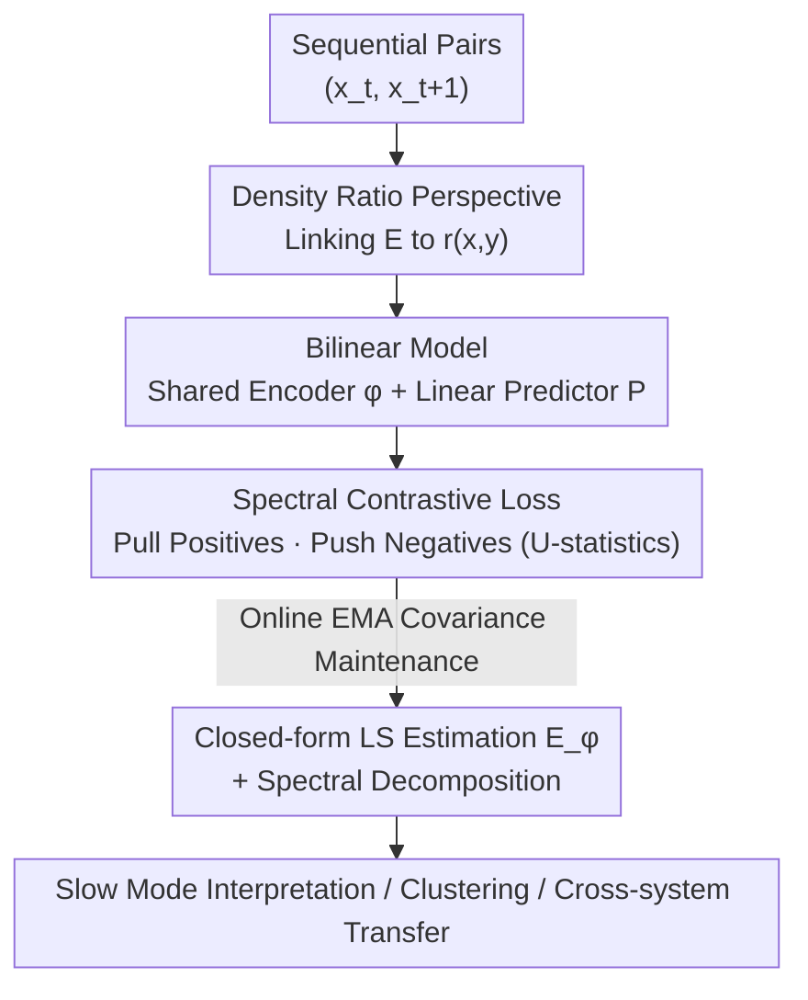

# Self-Supervised Evolution Operator Learning for High-Dimensional Dynamical Systems

**Conference**: ICLR 2026  
**OpenReview**: [https://openreview.net/forum?id=Ku3kLJle7Q](https://openreview.net/forum?id=Ku3kLJle7Q)  
**Code**: https://github.com/pietronvll/encoderops  
**Area**: Dynamical Systems / Operator Learning / Self-Supervised Representation Learning  
**Keywords**: Evolution operator, Koopman/Transfer operator, Spectral decomposition, Contrastive learning, Transferable representation

## TL;DR
This paper reformulates "learning evolution operators for high-dimensional dynamical systems" as an **encoder-only self-supervised contrastive learning problem**. By using bilinear similarity $\langle\phi(x_t), P\phi(x_{t+1})\rangle$ to model the density ratio of state transitions, the authors prove it is equivalent to least-squares operator estimation and negative VAMP-2 scores under an optimal predictor. The method automatically extracts interpretable slow modes across three large-scale scientific systems—protein folding, molecular binding, and global climate (ENSO)—enabling cross-system representation transfer.

## Background & Motivation
**Background**: In the scientific study of complex dynamical systems (protein folding, molecular binding, climate), traditional approaches involve deriving differential equations from first principles. However, as systems scale, these equations become computationally intractable and difficult to interpret. As TB-level meteorological data and million-step molecular dynamics simulations become commonplace, data-driven methods have become mainstream. Among these, the **evolution operator** paradigm (Koopman operators for deterministic systems, Transfer operators for stochastic ones) is particularly suitable for "interpretability": it **linearizes** nonlinear dynamics into a linear operator $E$ that maps functions to functions. Through **spectral decomposition**, complex dynamics are decomposed into a set of coherent spatio-temporal modes with decay rates $\rho_i$ and oscillation frequencies $\omega_i$, where each mode corresponds to an intrinsic slow or fast process of the system.

**Limitations of Prior Work**: Existing methods for learning $E$ have specific drawbacks. Kernel methods (Kernel/DMD families) possess statistical guarantees but struggle to scale to high-dimensional, structured data. In deep learning, **encoder-decoder** schemes minimize prediction and reconstruction errors simultaneously; however, recent work in reinforcement learning and representation learning suggests that reconstruction loss biases features toward "near-future prediction," which is **detrimental** to long-range behavior and transferability. Conversely, encoder schemes that directly maximize VAMP scores (e.g., VAMPNets) require **matrix inversion** within the loss function, which is numerically unstable and prone to gradient explosion during backpropagation in large-scale scenarios.

**Key Challenge**: The field requires an operator learning framework that is simultaneously scalable to high-dimensional structured systems, numerically stable, and transferable across systems. Existing solutions consistently sacrifice one of these three properties due to the form of their loss functions (reconstruction terms or matrix inversion).

**Goal**: To provide an end-to-end, GPU-trainable protocol that approximates $E$ and its spectral decomposition without requiring decoders or matrix inversion, while allowing the learned encoder to transfer to related systems.

**Key Insight**: The authors identify a profound connection between evolution operator learning and **self-supervised contrastive representation learning**. By rewriting the conditional expectation using importance sampling, $E$ is directly linked to the **density ratio** of state transitions $r(x_t,x_{t+1})=p(x_{t+1}|x_t)/p(x_{t+1})$, which can be estimated using the bilinear similarity commonly found in contrastive learning.

**Core Idea**: A bilinear model consisting of a **shared encoder and a linear predictor** $\langle\phi(x_t), P\phi(x_{t+1})\rangle$ is used to fit the density ratio. This model is trained via the spectral contrastive loss proposed by HaoChen et al. Theoretically, this is proved to be equivalent to least-squares operator estimation and the negative VAMP-2 score, thereby aligning the frameworks of operator learning and self-supervised learning.

## Method

### Overall Architecture
The method addresses the following: given a series of sequential observations $\{(x_i,y_i)\}$ from a dynamical system (where $y_i\sim p(\cdot|x_i)$ is the subsequent step of $x_i$), learn an encoder $\phi$ and a linear predictor $P$ such that $\langle\phi(x),P\phi(y)\rangle$ approximates the transition structure under the evolution operator. After training, $E$ is estimated in the finite-dimensional space spanned by $\phi$ using a closed-form formula, and spectral modes are obtained via eigen-decomposition. The overall process is a "dynamical systems version" of a standard self-supervised pipeline: positive pairs are **temporally adjacent observations**, while negative pairs are randomly paired observations. The learned feature space naturally aligns with the principal singular subspace of $E$.

The pipeline flows as follows: raw high-dimensional states → graph/convolutional encoder $\phi$ + simplicial normalization → bilinear similarity $\langle z_i, q_j\rangle$ (where $z=\phi(x)$, $q=P\phi(y)$) → spectral contrastive U-statistics loss → online covariance buffer maintenance during training → final closed-form least-squares estimation of $E_\phi$ → spectral decomposition for modes → downstream interpretation, clustering, or transfer.

### Key Designs

**1. Density Ratio Reformulation: Connecting Evolution Operators to Contrastive Learning**

The challenge lies in the fact that the evolution operator $E$ is defined by conditional expectations over arbitrary functions, making direct learning abstract. The authors rewrite the conditional expectation using importance sampling relative to the future distribution $P(X_{t+1})$:

$$(Ef)(x_t)=\mathbb{E}_{y\sim X_{t+1}}\!\left[\frac{p(y|x_t)}{p(y)}f(y)\right],$$

This step explicitly couples $E$ with the density ratio $r(x_t,x_{t+1})=p(x_{t+1}|x_t)/p(x_{t+1})$. The density ratio represents how much more likely state $x_{t+1}$ is to occur given $x_t$ compared to a random future state—effectively the relative weight of "positive" vs. "negative" pairs. Thus, operator learning is translated into "density ratio estimation," which is a fundamental task in contrastive learning.

**2. Shared Encoder + Linear Predictor Bilinear Parameterization: $P$ as the Operator Restriction**

The density ratio is modeled as a bilinear form $r(x,y)\approx\langle\phi(x),P\phi(y)\rangle$. Minimizing the L2 error and using U-statistics to estimate the squared term yields the empirical loss:

$$\hat\varepsilon(\phi,P)=\frac{1}{N(N-1)}\sum_{i\ne j}\langle\phi(x_i),P\phi(y_j)\rangle^2-\frac{2}{N}\sum_{i=1}^N\langle\phi(x_i),P\phi(y_i)\rangle.$$

The first term penalizes similarity for random pairs (negatives), while the second term encourages similarity for adjacent pairs (positives)—mirroring the spectral contrastive loss of HaoChen et al. The authors intentionally use a **shared encoder** $\phi$ for both inputs and maintain a **linear predictor** $P$. These choices are principled: the authors prove that $P$ exactly represents the restriction of $E$ onto the finite-dimensional function space spanned by $\phi$, specifically $(Ef)(x_t)=\langle\phi(x),PC_Yw\rangle$ (where $C_Y$ is the covariance of future states). Consequently, $P$ is not just an auxiliary trick; it **is** the learned operator matrix.

**3. Equivalence to Least Squares / VAMP-2: Theoretical Guarantees and Stability**

Three lemmas bridge this loss to operator learning theory. Lemma 1: When $E$ is a Hilbert-Schmidt operator, the loss is equivalent to operator regression loss $\varepsilon(\phi,P)=\|E-\sum_{i,j}\phi_i\otimes P_{ij}\phi_j\|_{HS}^2$. Lemma 2: For a fixed $\phi$, the optimal predictor has a closed form $P^*=C_X^{-1}C_{XY}C_Y^{-1}$, leading to the operator estimate $E_\phi=P^*C_Y=C_X^{-1}C_{XY}$, which is the $\lambda\to0$ least-squares estimate. Lemma 3: Under $P^*$, $\varepsilon(\phi,P^*)=-\|C_X^{-1/2}C_{XY}C_Y^{-1/2}\|_{HS}^2=-\text{VAMP2}(\phi)$. The critical difference is that while VAMPNets maximize VAMP directly using matrix inversion $C^{-1/2}$ (causing instability), this loss (Eq. 8) involves only simple matrix multiplications, making it inherently suitable for GPU optimization.

### Loss & Training
Training follows a standard SSL loop: each step samples a batch of adjacent pairs, passes them through the encoder to get $z_i=\phi(x_i)$ and $q_i=P\phi(y_i)$, calculates the similarity matrix $r_{ij}=\langle z_i,q_j\rangle$, and updates $\phi,P$ via gradients of the loss $\frac{1}{B(B-1)}\sum_{i\ne j}r_{ij}^2-\frac{2}{B}\sum_i r_{ii}$. Implementation details: encoder outputs use **simplicial normalization**; no additional projection heads are used; $P$ remains linear. To estimate $E_\phi$ without a full dataset forward pass after training, the authors use **Exponential Moving Averages (EMA) to maintain covariance buffers $C_X, C_{XY}$ online**. After training, the closed-form estimate is calculated directly from these buffers.

## Key Experimental Results

Experiments span molecular dynamics and climate science, focusing on the ability to decompose complex dynamics and generalize representations.

### Main Results

| Experiment | System / Data | Encoder | Key Results |
|:---:|:---:|:---:|:---|
| Protein Folding | Trp-Cage (Full 144 heavy atoms) | SchNet GNN | Principal eigenfunction $\Psi_1$ strongly correlates with RMSD, clearly separating folded/unfolded states; implied timescales exceed LoRA/VAMP/DPNets baselines. |
| Molecular Binding | Calixarene Host-Guest, ligands G1/G2/G3 | SchNet | $\Psi_1$ captures partial vs. full binding; $\Psi_2$ captures unbound vs. bound; identified "water occupancy" as a dynamical bottleneck, consistent with literature. |
| Global Climate | SST* Sea Surface Temp (ORAS5/ChaosBench 540 frames + CESM sim 12,598 frames) | CNN | The second principal mode automatically recovers ENSO; the right eigenfunction correlates with the ONI index at $r=0.82\,(p<.001)$; successfully detected the 2023 El Niño. |

### Ablation Study

| Configuration | Key Metric | Description |
|:---:|:---:|:---|
| Binding Transfer | Frozen Encoder (Train G1+G3) → Eval G2 | Recovered key modes for entering the cavity in G2 despite never seeing the ligand; transfer features match from-scratch training. |
| Climate-Direct Training | ENSO Eigenfunction vs. ONI $r=0.71$ | Direct training on real data (540 frames) is weaker than the transfer approach. |
| Climate vs. Baselines | Comparison with VAMPNets / DPNets | Ours shows stronger correlation in capturing ENSO modes (Appendix B.4). |
| Online Cov. vs. Recalc | Spectral estimation results | Online EMA buffers converge accurately, matching or slightly exceeding post-training recalculation results. |

### Key Findings
- **Removing the decoder is beneficial**: An encoder-only setup with spectral contrastive loss focuses on the principal singular subspace of $E$, proving better for long-range structures and transferability than encoder-decoder schemes—echoing observations in RL that "reconstruction features do not transfer."
- **Transfer learning saves sparse data**: In climate data where only 540 frames are available, direct training performs poorly ($r=0.71$). Pre-training on 12,598 simulation frames and transferring to real data improves correlation to $r=0.82$.
- **High-dimensional representations provide finer physics**: Moving from 20 Cα atoms to all 144 heavy atoms in Trp-Cage and applying sparse LASSO regression to $\Psi_1$ allowed for the identification of side-chain hydrogen-bond networks invisible to coarse-grained models.

## Highlights & Insights
- **Linking two worlds**: Rewriting the evolution operator's conditional expectation as a density ratio allows the leverage of mature SSL engineering (GPU-friendly, inversion-free).
- **$P$ as the protagonist**: Keeping $P$ linear and proving it is the restriction of $E$ makes contrastive training and operator derivation the same task.
- **Matrix-inversion-free VAMP-2**: Obtaining the VAMP-2 objective through simple matrix multiplication is a trick transferable to any scenario requiring linear operator SVD.
- **Online EMA Covariance**: A practical engineering detail that enables closed-form estimation for large datasets without a second forward pass.

## Limitations & Future Work
- The evaluation remains **qualitative**: There is a lack of standard benchmarks for spectral decomposition accuracy, making quantitative cross-comparison difficult.
- Transfer results assume the source and target systems have similar dynamics; wider transferability has not been tested.
- The method assumes Markovian dynamics; non-Markovian cases require constructing context states from history windows, which was not explored.
- Control and RL applications are planned for future work, as spectral decomposition is highly valuable for reduced-order modeling.

## Related Work & Insights
- **vs. Koopman Autoencoders** (Lusch et al. / Azencot et al.): These rely on reconstruction loss and bias toward near-future prediction; **Ours** approximates the singular subspace for better long-range structure.
- **vs. VAMPNets** (Mardt et al. 2018): Both target VAMP scores, but VAMPNets suffer from numerical instability due to matrix inversion; **Ours** is GPU-friendly.
- **vs. LoRA Operator Methods** (Jeong et al. 2025): These use non-shared encoders for $x_t, x_{t+1}$; **Ours** uses a shared encoder + linear predictor, yielding higher implied timescales.
- **vs. DPNets** (Kostic et al. 2024b): **Ours** showed stronger correlation in capturing ENSO modes in climate experiments.

## Rating
- Novelty: ⭐⭐⭐⭐⭐ Rigorous equivalence between operator learning and SSL via density ratios is a win for both theory and engineering.
- Experimental Thoroughness: ⭐⭐⭐⭐ Covered three domains and transferability, though quantitative spectral benchmarks are missing.
- Writing Quality: ⭐⭐⭐⭐⭐ Clear progression from motivation to bridging lemmas.
- Value: ⭐⭐⭐⭐⭐ Provides a stable, scalable, and transferable tool for interpretable data-driven analysis of scientific systems.

<!-- RELATED:START -->

## Related Papers

- [\[ICLR 2026\] Physics-Informed Inference Time Scaling for Solving High-Dimensional Partial Differential Equations via Defect Correction](physics-informed_inference_time_scaling_for_solving_high-dimensional_partial_dif.md)
- [\[ICML 2026\] Unbiased and Second-Order-Free Training for High-Dimensional PDEs](../../ICML2026/physics/unbiased_and_second-order-free_training_for_high-dimensional_pdes.md)
- [\[AAAI 2026\] Just Few States are Enough: Randomized Sparse Feedback for Stability of Dynamical Systems](../../AAAI2026/physics/just_few_states_are_enough_randomized_sparse_feedback_for_stability_of_dynamical.md)
- [\[NeurIPS 2025\] AstroCo: Self-Supervised Conformer-Style Transformers for Light-Curve Embeddings](../../NeurIPS2025/physics/astroco_self-supervised_conformer-style_transformers_for_light-curve_embeddings.md)
- [\[ICLR 2026\] Operator Learning with Domain Decomposition for Geometry Generalization in PDE Solving](operator_learning_with_domain_decomposition_for_geometry_generalization_in_pde_s.md)

<!-- RELATED:END -->
