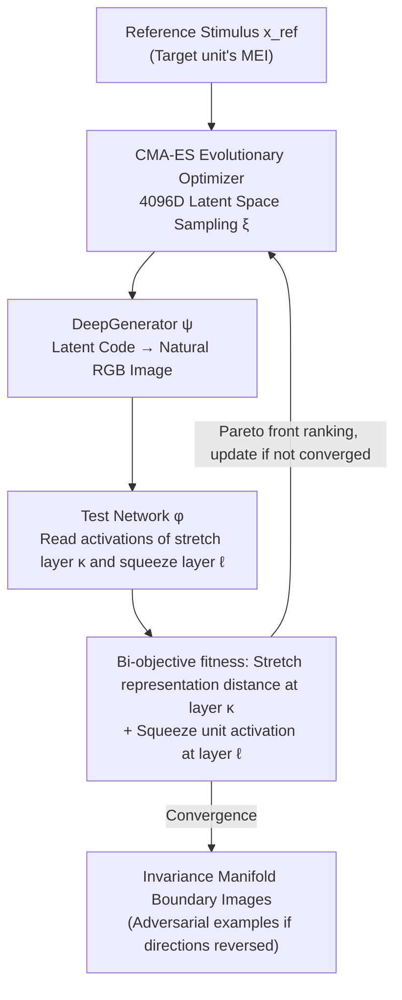

# Stretching Beyond the Obvious: A Gradient-Free Framework to Unveil the Hidden Landscape of Visual Invariance

**Conference**: ICLR 2026  
**arXiv**: [2506.17040](https://arxiv.org/abs/2506.17040)  
**Code**: [GitHub](https://github.com/zoccolan-lab/SnS)  
**Area**: Interpretability  
**Keywords**: visual invariance, gradient-free optimization, adversarial examples, feature visualization, CNN interpretability, robust models

## TL;DR

Proposes the Stretch-and-Squeeze (SnS) algorithm, a gradient-free, model-agnostic bi-objective optimization framework that systematically probes the invariance manifold of visual systems by "stretching" representations at different processing levels while "squeezing" target unit activations, revealing hierarchical differences in invariance interpretability between standard and robust CNNs.

## Background & Motivation

Understanding which feature combinations are encoded by visual processing units (whether biological neurons or CNN units) is a core problem in vision science and deep learning. Limitations of existing methods include:

1.  **Maximum Excitation Image (MEI)** methods only find a few strongly activating stimuli, failing to reveal transformations under which a unit remains invariant—yet invariance is crucial for generalization.
2.  **Metamers** (representation matching) approach strictly matches representations at a given layer, exploring only a narrow neighborhood around the target image.
3.  **Predefined transformation tests** (rotation, translation, scaling, etc.) cannot discover the actual invariance axes learned by the units.
4.  **Gradient-based methods** cannot be applied to "black-box" systems (such as biological neurons).

The core innovation of SnS is systematically sampling the boundaries of the invariance manifold by **maximizing** stimulus distance at a representation layer while **maintaining** target unit activation.

## Method

### Overall Architecture

SnS reformulates "probing invariance" as a bi-objective search problem: given a fixed reference stimulus (usually the target unit's MEI), the search simultaneously pushes the representation distance at a specific layer while constraining target unit activation. The resulting solutions lie on the boundary of the invariance manifold. The entire pipeline is a closed-loop system operating in the 4096-dimensional latent space of a pretrained DeepGenerator $\psi$: the CMA-ES evolutionary optimizer samples codes $\xi$ in the latent space, $\psi$ maps each code to a natural RGB image, and the investigated visual system $\phi$ provides activations for the stretch layer $\kappa$ and squeeze layer $\ell$. Bi-objective fitness is scored based on these activations, the optimizer ranks candidates by the Pareto front and generates the next batch, iterating until convergence. The process does not use gradients of $\phi$, making it applicable to black-box systems like biological neurons; by reversing the objective directions, the same framework can generate adversarial examples.

### Key Designs

**1. Bi-objective "Stretch-and-Squeeze": Turning invariance into adversarial goals**

A single objective to "keep activation invariant" would likely stay near the reference point, failing to reveal the extent of the invariance. SnS defines opposing goals for two layers: in the stretch layer $\kappa$, $\mathcal{L}_{\text{stretch}}^{\kappa}=-\|\mathbf{a}^{\kappa}-\mathbf{a}_{\text{ref}}^{\kappa}\|_2$ pushes the representation away, while in the squeeze layer $\ell$, $|a_u^{\ell}-a_{\text{ref}}^{\ell}|$ pins the target unit activation. Invariance search is the Pareto optimization of these objectives:

$$\Xi_{\text{inv}} = \arg\min_{\mathbf{x}} \left[\mathcal{L}_{\text{stretch}}^{\kappa}\bigl(\Gamma(\mathbf{x}, \phi^{\kappa}), \Gamma(\mathbf{x}^{\star}, \phi^{\kappa})\bigr), \; |a_u^{\ell} - a_{\text{ref}}^{\ell}|\right]$$

This produces invariant images that look very different but elicit nearly identical unit firing. Reversing the directions—minimizing $\kappa$-layer distance while maximizing $\ell$-layer activation change—instantly transforms the search into an adversarial attack. Invariance and adversariality, two seemingly opposing phenomena, are captured in different corners of the same optimization framework.

**2. Selecting Stretch Layer $\kappa$: The layer chosen determines the type of invariance observed**

Invariance is not monolithic; it varies by abstraction level. SnS treats the "stretch layer $\kappa$" as a tunable knob: $\kappa=0$ stretches directly in pixel space, finding low-level changes like brightness or contrast; intermediate convolutional layers yield changes in texture and color; deep layers reveal high-level invariance such as viewpoint and pose. Probing the same unit with different $\kappa$ reveals its entire invariance spectrum, which serves as the basis for using PCA+SVM to distinguish invariance at different levels.

**3. Gradient-Free + Generative Prior: Black-box compatibility without noise degradation**

CMA-ES and the DeepGenerator $\psi$ are the components that allow SnS to be model-agnostic without collapsing into noise. Searching within the 4096D latent space of the DeepGenerator provides a natural image prior as regularization, ensuring solutions stay on the "photorealistic" manifold. This allows SnS to maintain model agnosticism while producing invariant images with observable semantics for both humans and networks.

## Key Experimental Results

### Main Results

**Effectiveness Verification of SnS** (77 $L_2$-robust ResNet50 readout units):

| Metric | Adversarial Images | Invariant Images |
|------|---------|---------|
| Activation Drop (Relative to MEI) | 111% ± 7% | 34% ± 11% |
| $L_2$ Pixel Distance | 72 ± 12 | 271 ± 32 |
| Vs. Affine Transformations | — | Significantly exceeds rotation/translation/scaling |

Invariant images found by SnS are more "extreme" (larger pixel distance) than affine transformations while having less impact on target unit activation.

**Discriminability of Hierarchical Invariance**:

Using PCA + SVM classifiers to distinguish invariant images produced by different stretch layers:
- Standard ResNet50: Near-perfect classification with a few dozen PCs.
- Robust ResNet50: Achieves 80%+ accuracy.

### Ablation Study

**Interpretability Assessment by Human and Observer Networks** (12-AFC classification task):

| Condition | Robust ResNet50 Invariant Images | Standard ResNet50 Invariant Images |
|------|----------------------|----------------------|
| Pixel Space Stretch | Human recognizable (highest) | Human unrecognizable (lowest) |
| Mid-layer Stretch | Human recognizable (medium) | Human recognizable (medium) |
| Deep-layer Stretch | Human recognizable (lowest) | Human recognizable (highest) |

**Key Finding**: Interpretability trends for robust and standard networks are **diametrically opposed**!

- Robust networks: Deeper stretching leads to lower interpretability.
- Standard networks: Deeper stretching leads to higher interpretability.

### Key Findings

1.  **$L_2$ adversarial training fails to increase the interpretability of high-level invariance**: While MEIs and pixel-level invariant images have high human recognition, the interpretability gap for deep invariant images narrows.
2.  **$L_{\infty}$ robustification differs**: Invariant images maintain stable or increasing interpretability with depth across observer networks.
3.  **ViT invariance presents a different pattern**: Mid-layer and deep-layer invariant images are highly similar and interpretable, consistent with the view that ViTs learn more global features.
4.  **Robustness to representation subsampling**: SnS produces effective invariant images even when using only a small subset of neurons from intermediate layers (analogous to sparse recording in neuroscience).
5.  **Intrinsic dimension of the invariance manifold**: Lowest at low levels, highest at mid-levels, and intermediate at deep levels, matching known CNN representation dimension trends.

## Highlights & Insights

1.  **Unified Framework**: Invariance and adversarial attacks are implemented in the same bi-objective optimization by swapping stretch/squeeze directions, which is conceptually elegant.
2.  **Gradient-Free = True Model Agnosticism**: Can be directly applied to biological neurons, a capability lacking in other methods.
3.  **Beyond Metamers**: SnS pushes to the boundaries of the invariance manifold, whereas metamers only explore the vicinity of the target image; the two are complementary.
4.  **Hierarchical Invariance Reveals System Essence**: The progression from brightness to texture to pose invariance is essentially two sides of the same process of feature selectivity and invariance.
5.  **The divergence between $L_2$ and $L_{\infty}$ robustification** provides new perspectives on the nature of adversarial training.

## Limitations & Future Work

1.  Dependence on the expressive power of the pretrained generative model—the prior limits the searchable image space.
2.  High computational cost of evolutionary algorithms, requiring many iterations per unit.
3.  Evaluated only on ResNet50/18, VGG16, and ViT; larger models (e.g., DINO, ViT-22B) remain unexplored.
4.  Lack of closed-loop verification on real biological neurons.
5.  Invariant images produced are often visually complex, making them difficult to summarize with short text descriptions.

## Related Work & Insights

- Shares evolutionary optimization concepts with XDREAM (Ponce et al., 2019) but extends to invariance probing.
- Complementary to the metamers work of Feather et al. (2023): metamers explore at short distances, while SnS explores at long distances.
- The alignment between robustified CNNs and human vision is strong at the MEI level but diverges at the deep invariance level—this suggests new optimization targets for future alignment methods.
- Insight: "Good" and "bad" invariant images generated by SnS could be used to improve training data, encouraging networks to learn more human-like invariance.

## Rating

- **Novelty**: ⭐⭐⭐⭐⭐ — First systematic gradient-free invariance probing framework; elegant bi-objective design.
- **Experimental Thoroughness**: ⭐⭐⭐⭐ — Comprehensive analysis covering standard/robust CNNs, ViTs, and human experiments.
- **Value**: ⭐⭐⭐⭐ — Direct value for computational neuroscience and high heuristic value for AI interpretability.
- **Writing Quality**: ⭐⭐⭐⭐ — Clear methodology and high-quality visualizations.
- **Overall**: ⭐⭐⭐⭐ (4/5)

<!-- RELATED:START -->

## Related Papers

- [\[ICML 2026\] Loss Landscape Diagnosis for Gradient-Based Gray-Scott System Inversion: Disentangling the Roles of PINN Components](../../ICML2026/physics/loss_landscape_diagnosis_for_gradient-based_gray-scott_system_inversion_disentan.md)
- [\[ICLR 2026\] VisionLaw: Inferring Interpretable Intrinsic Dynamics from Visual Observations via Bilevel Optimization](visionlaw_inferring_interpretable_intrinsic_dynamics_from_visual_observations_vi.md)
- [\[ICLR 2026\] Learning Escorted Protocols For Multistate Free-Energy Estimation](learning_escorted_protocols_for_multistate_free-energy_estimation.md)
- [\[ICLR 2026\] Fast training of accurate physics-informed neural networks without gradient descent](fast_training_of_accurate_physics-informed_neural_networks_without_gradient_desc.md)
- [\[ICLR 2026\] MoMa: A Simple Modular Learning Framework for Material Property Prediction](moma_a_simple_modular_learning_framework_for_material_property_prediction.md)

<!-- RELATED:END -->
