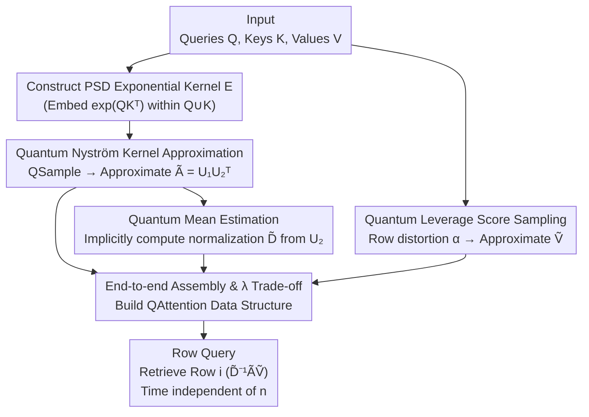

# Sublinear Time Quantum Algorithm for Attention Approximation

**Conference**: ICLR2026  
**arXiv**: [2602.00874](https://arxiv.org/abs/2602.00874)  
**Code**: None  
**Area**: Physics  
**Keywords**: Quantum Computing, Attention Approximation, Sublinear Algorithm, Nyström Approximation, Quantum Sampling  
**Authors**: Zhao Song (UC Berkeley/Simons), Jianfei Xue (NYU), Jiahao Zhang, Lichen Zhang (MIT)

## TL;DR

Propose the first quantum data structure with **sublinear** time complexity relative to sequence length $n$ for approximating row queries of the Transformer attention matrix. The preprocessing time is $\widetilde{O}(\epsilon^{-1} n^{0.5} \cdot \text{poly}(d, s_\lambda, \alpha))$, and each row query takes $\widetilde{O}(s_\lambda^2 + s_\lambda d)$, achieving a quadratic speedup over classical algorithms regarding $n$.

## Background & Motivation

**Quadratic Bottleneck of Attention**: The core of Transformer is the attention module $\text{Att}(Q,K,V) = D^{-1}AV$, where $A = \exp(QK^\top / \sqrt{d}) \in \mathbb{R}^{n \times n}$ and $D = \text{diag}(A \mathbf{1}_n)$. Explicitly constructing the softmax matrix $D^{-1}A$ requires $\Omega(n^2)$ time, which becomes a severe bottleneck during long-sequence LLM inference.

**Limits of Classical Approximation**: Substantial prior work has accelerated attention computation to $\widetilde{O}(nd)$ (e.g., sparse attention, linearized kernel methods, KDE). However, on classical computers, $\widetilde{O}(nd)$ is already optimal because the output matrix itself is of size $n \times d$.

**Breakthrough via Row Query Model**: During the inference stage, it is often sufficient to query a **specific row** of $\text{Att}(Q,K,V)$ rather than the full matrix. This "row query model" bypasses the $\Omega(nd)$ output lower bound. Nevertheless, since each row is a convex combination of the rows of $V$, classical algorithms still struggle to achieve sublinearity with respect to $n$.

**Possibility of Quantum Acceleration**: Quantum primitives such as Grover search provide quadratic speedups for sampling problems. The core insight of this work is to decompose the attention approximation into three sub-problems (approximating $A$, approximating $D$, and approximating $V$), each of which can leverage quantum techniques to obtain a $\sqrt{n}$ speedup.

**Limitations of Prior Quantum Methods**: Previous quantum attention methods [Gao et al.] required structural assumptions (e.g., a limited number $k$ of highly relevant keys per query), providing no speedup when $k=n$. This paper makes no such structural assumptions.

**Theoretical Significance**: This is the first quantum attention approximation algorithm to achieve sublinearity in $n$ under the row query model, filling the theoretical gap between quantum computing and efficient Transformer inference.

## Method

### Overall Architecture

The algorithm decomposes the attention mechanism $\text{Att}(Q,K,V)=D^{-1}AV$ into three components that can be approximated separately—the exponential kernel matrix $A$, the normalization factor $D$, and the value matrix $V$—applying a $\sqrt{n}$ quantum speedup to each. The outputs are assembled into a quantum data structure named `QAttention`: a compressed representation is built during preprocessing, after which any attention row can be queried in time independent of $n$.

### Key Designs

**1. Quantum Nyström Kernel Approximation: Spectral Compression for Asymmetric Kernels**

Directly applying Nyström approximation to $A=\exp(QK^\top)$ is unfeasible as it is neither symmetric nor positive semi-definite (PSD), lacking a spectral low-rank structure. This work combines queries and keys into an augmented dataset $X=\{q_1,\dots,q_n,k_1,\dots,k_n\}$ to construct a $2n\times 2n$ exponential kernel matrix $E=\begin{bmatrix}\exp(QQ^\top)&\exp(QK^\top)\\\exp(KQ^\top)&\exp(KK^\top)\end{bmatrix}$. Since $E$ is PSD, it allows for Nyström spectral approximation, and its upper-right block is exactly $A$. Thus, the approximation of $A$ is achieved via $E$. The speedup stems from sampling: while classical recursive ridge leverage score sampling requires $O(ns_\lambda)$ kernel evaluations, the `QSample` quantum sampler based on Grover search reduces this to $\widetilde{O}(n^{0.5}s^{0.5})$ oracle calls. The preprocessing time is $\widetilde{O}(n^{0.5}s^{1.5}(d+s)+s^\omega)$, where $s=O(s_\lambda\log(s_\lambda/\delta))$, $s_\lambda(E):=\text{tr}[E(E+\lambda I)^{-1}]$ is the $\lambda$-statistical dimension, and $\omega\approx 2.37$. The resulting $\widetilde{E}$ satisfies $E\preceq\widetilde{E}\preceq E+\lambda I$, yielding a spectral error $\|A-\widetilde{A}\|\le\lambda$ and a Frobenius error $\|A-\widetilde{A}\|_F\le\lambda\sqrt{n}$.

**2. Quantum Mean Estimation: Implicit Normalization without Materializing $\widetilde{E}$**

While calculating the normalization factor $D=\text{diag}(A\mathbf{1}_n)$ seems to be a simple summation, explicitly writing $\widetilde{E}$ would require $\Omega(n)$ space and time, nullifying prior speedups. The algorithm blocks $\widetilde{E}=UU^\top$ as $U=[U_1;U_2]$, making $\widetilde{A}=U_1U_2^\top$. The normalization vector bottleneck $\widetilde{A}\mathbf{1}_n=U_1(U_2^\top\mathbf{1}_n)$ lies in $U_2^\top\mathbf{1}_n$. By treating this as a multivariate mean estimation problem for the rows of $U_2$, Quantum Multi-variate Mean Estimation (Lemma 2.6) satisfies the Mahalanobis norm error $\|\widetilde{\mu}-U_2^\top\mathbf{1}_n\|_{(U_2^\top U_2)^{-1}}\le\epsilon$ with only $\widetilde{O}(\epsilon^{-1}n^{0.5}s^{0.5})$ row queries to $U_2$. Thus, the normalization factor is never fully materialized, and any row $i$ is computed in $O(s(s+d))$ time.

**3. Quantum Leverage Score Sampling: Approximating $V$ via Row Distortion**

The final step compresses $V$ in $\widetilde{A}\widetilde{V}$. Classical joint row-norm sampling requires scanning all entries of $V$ to estimate the Frobenius norm, an $\Omega(n)$ operation. This work utilizes Quantum Leverage Score Sampling and introduces **row distortion** $\alpha(V):=\frac{d}{\|V\|_F^2}\cdot\max_{i\in[n]}\frac{\|v_i\|_2^2}{\tau_i}$, where $\tau_i$ is the leverage score of row $i$ in $V$. This measures the "unvevenness" of row importance and satisfies $\alpha\le d/\text{srank}(V)$. Sampling $\widetilde{O}(\epsilon^{-2}\alpha)$ rows according to leverage scores provides an approximate matrix multiplication guarantee under the Frobenius norm, implemented in $\widetilde{O}(\epsilon^{-1}n^{0.5}\alpha^{0.5}d)$. This $\alpha$ generalizes the strict "orthogonality" requirement in classical sketches, allowing efficient sampling for non-orthogonal $V$.

**4. End-to-End Assembly & $\lambda$ Trade-off: Unified Error Guarantee**

By assembling the three parts (Main Theorem 3.1 / 9.2), the total error is $\|\widetilde{D}^{-1}\widetilde{A}\widetilde{V}-\text{Att}(Q,K,V)\|_F\le\epsilon\cdot(\beta\cdot\|D^{-1}\|)\cdot(\|A\|_F+\lambda\sqrt{n})\cdot\|V\|_F$, where $\beta=\frac{1}{1-(\epsilon\|A\|+\lambda\sqrt{n})\|D^{-1}\|}$ is the amplification factor of normalization perturbations. Preprocessing is sublinear in $n$ at $\widetilde{O}(\epsilon^{-1}n^{0.5}(s_\lambda^{2.5}+s_\lambda^{1.5}d+\alpha^{0.5}d))$, while row queries are decoupled from $n$ at $\widetilde{O}(s_\lambda^2+s_\lambda d)$. The parameter $\lambda$ manages a trade-off: increasing $\lambda$ reduces the statistical dimension $s_\lambda$ (faster) but tightens the $\|D^{-1}\|$ constraint margin and increases $\beta$ (less stable precision).

| Phase | Time Complexity |
|------|-----------|
| Preprocessing | $\widetilde{O}(\epsilon^{-1} n^{0.5}(s_\lambda^{2.5} + s_\lambda^{1.5}d + \alpha^{0.5}d))$ |
| Row Query | $\widetilde{O}(s_\lambda^2 + s_\lambda d)$ |

| $\lambda$ Change | $s_\lambda$ | $\|D^{-1}\|$ Margin | $\beta$ |
|:-:|:-:|:-:|:-:|
| $\uparrow$ | $\downarrow$ | $\downarrow$ | $\uparrow$ |
| $\downarrow$ | $\uparrow$ | $\uparrow$ | $\downarrow$ |

## Key Experimental Results

Experiments verify the theoretical assumptions regarding key parameters on real models using OLMo2-1B and OLMo2-7B pre-trained checkpoints.

### Main Results: Parameter Verification

| Parameter | OLMo2-1B | OLMo2-7B |
|------|----------|----------|
| Seq Length $n$ | 4096 | 4096 |
| Value Dim $d$ | 128 | 128 |
| Layers $L$ | 16 | 32 |
| Heads $H$ | 16 | 32 |

| Metric | OLMo2-1B | OLMo2-7B | Theoretical Worst-case | Implicit Meaning |
|------|----------|----------|------------|---------|
| $\epsilon_{\max}$ | 0.1708 | 0.1685 | — | Max $\epsilon$ s.t. $\|D^{-1}\| \leq \frac{1}{\epsilon\|A\|}$ |
| $\|A\|_F / \|A\|$ | 1.3769 | 1.3586 | $\sqrt{n} = 64$ | Ratio of Frobenius to Spectral norm |
| $\|V\|_F / \|V\|$ | 11.3137 | 11.3137 | $\sqrt{d} \approx 11.3$ | Stable rank related for $V$ |
| $d / \text{srank}(V)$ | 1.7126 | 2.1345 | $d = 128$ | Upper bound for row distortion $\alpha$ |
| $\|A\|_\infty / \|A\|$ | 2.7439 | 2.7439 | $\sqrt{n} = 64$ | Ratio of Infinity to Spectral norm |

### Key Findings

1. **$\epsilon_{\max} \approx 0.17$**: This is significantly larger than the common $\epsilon \approx 0.1$, indicating that the $\|D^{-1}\|$ condition is easily satisfied in practice with sufficient tuning space.
2. **$\|A\|_F / \|A\| \approx 1.4$**: Far smaller than the worst-case $\sqrt{n} = 64$. This implies Frobenius norm error guarantees are close to spectral norm guarantees, showing better empirical accuracy than theoretical predictions.
3. **$d / \text{srank}(V) \approx 1.7\text{-}2.1$**: Much smaller than the bound $d = 128$, suggesting $\alpha = O(1)$. The "row distortion" of the value matrix is mild and does not cause runtime explosion.
4. **$\|A\|_\infty / \|A\| \approx 2.7$**: Far smaller than $\sqrt{n} = 64$, meaning the $\lambda\sqrt{n}$ additive error term is actually $O(\lambda)$ in practice, greatly expanding the selection range for $\lambda$.
5. **Bit Complexity**: $\log(\kappa(V))$ is on average less than 4 and at most 20, which is manageable in the QRAM model.

## Highlights & Insights

- **First Sublinear Quantum Attention**: Achievement of $O(n^{0.5})$ preprocessing for the row query model—a quadratic speedup over classical $O(n)$—representing a pioneering effort in this field.
- **No Structural Assumptions**: Does not require restrictions such as sparsity or low-rank on $Q, K, V$, ensuring strong generalizability.
- **Elegant Kernel Construction**: Embedding asymmetric $\exp(QK^\top)$ into a symmetric PSD kernel $E$ enables the application of Nyström approximation theory.
- **Validation of Theory via Experiment**: Empirical results show that theoretical worst-case bounds are loose in practice, suggesting real-world performance may exceed theoretical guarantees.
- **Introduction of Row Distortion $\alpha$**: Generalizes the requirement for orthogonal columns in matrix multiplication sketches, allowing efficient sampling of non-orthogonal $V$.

## Limitations & Future Work

1. **Frobenius Norm Error**: Currently only provides a Frobenius norm guarantee (sum of squared errors across rows) rather than a per-row worst-case spectral norm guarantee.
2. **$\lambda\sqrt{n}$ Additive Term**: Theoretical scaling uses a $\sqrt{n}$ factor for the infinity norm, forcing a smaller $\lambda$ choice in theory, though experiments show this is pessimistic.
3. **Lack of Causal Mask Support**: Nyström approximation implicitly assumes all-to-all connectivity, which does not directly handle causal masks in autoregressive decoding.
4. **QRAM Model Dependency**: The algorithm relies on Quantum Random Access Memory (QRAM), which is not yet supported by current quantum hardware, making short-term deployment difficult.
5. **Incomplete Bit Complexity Analysis**: Only preliminary analysis is provided; systematic research into bit complexity for numerical linear algebra in QRAM is still needed.

## Related Work & Insights

| Direction | Representative Methods | Relation to Ours |
|------|---------|-----------|
| Sparse Attention | Sliding window, BigBird, ETC | Classical $O(n)$, uses structural priors, no quantum speedup |
| Linear Attention | Random feature map, Performer | Classical $O(nd)$, limited approximation accuracy |
| Data Structure Attention | KDE [Alman & Song], Hashing [Chen et al.] | Classical optimal $\widetilde{O}(nd)$, this work breaks through via quantum computing |
| Nyströmformer | [Xiong et al.] | Uses Nyström but converges only with landmark rows; this work uses spectral approximation |
| Quantum Attention | [Gao et al.] | Requires $k$-sparse assumption; no speedup if $k=n$. This work is assumption-free |
| General Quantum ML | Grover search, QMatVec | Basic quantum primitives used in this work |

## Rating

- **Novelty**: ⭐⭐⭐⭐⭐ — First assumption-free sublinear algorithm; elegant kernel embedding approach.
- **Theoretical Depth**: ⭐⭐⭐⭐⭐ — Rigorous analysis from Nyström spectral approximation to mean estimation.
- **Experimental Thoroughness**: ⭐⭐⭐ — Focused on parameter verification (OLMo2); lacks end-to-end speedup/accuracy comparisons.
- **Writing Quality**: ⭐⭐⭐⭐ — Clear technical overview, detailed proofs, and well-organized roadmap.
- **Value**: ⭐⭐ — Dependent on QRAM; theoretical contribution outweighs practical utility in the near term.
- **Overall**: ⭐⭐⭐⭐ — High-quality theoretical work at the intersection of Quantum Computing and Transformers.

<!-- RELATED:START -->

## Related Papers

- [\[ICLR 2026\] Accelerating Inference for Multilayer Neural Networks with Quantum Computers](accelerating_inference_for_multilayer_neural_networks_with_quantum_computers.md)
- [\[ICML 2026\] TINNs: Time-Induced Neural Networks for Solving Time-Dependent PDEs](../../ICML2026/physics/tinns_time-induced_neural_networks_for_solving_time-dependent_pdes.md)
- [\[ICLR 2026\] CFO: Learning Continuous-Time PDE Dynamics via Flow-Matched Neural Operators](cfo_learning_continuous-time_pde_dynamics_via_flow-matched_neural_operators.md)
- [\[ICLR 2026\] Tucker-FNO: Tensor Tucker-Fourier Neural Operator and its Universal Approximation Theory](tucker-fno_tensor_tucker-fourier_neural_operator_and_its_universal_approximation.md)
- [\[ICLR 2026\] SAQ: Stabilizer-Aware Quantum Error Correction Decoder](saq_stabilizer-aware_quantum_error_correction_decoder.md)

<!-- RELATED:END -->
