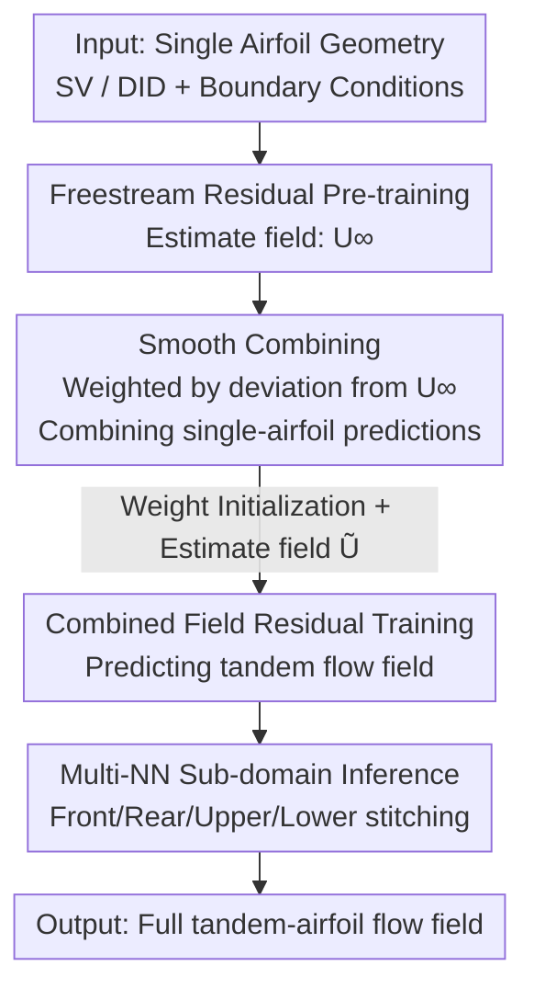

# TandemFoilSet: Datasets for Flow Field Prediction of Tandem-Airfoil Through the Reuse of Single Airfoils

**Conference**: ICLR 2026  
**OpenReview**: [https://openreview.net/forum?id=4Z0P4Nbosn](https://openreview.net/forum?id=4Z0P4Nbosn)  
**Area**: AI for Science / CFD Flow Field Prediction / Datasets  
**Keywords**: Tandem-airfoil, Flow field prediction, Curriculum learning, Residual training, Graph Neural Network

## TL;DR
This paper introduces the first **tandem-airfoil flow field prediction dataset, TandemFoilSet** (consisting of 8104 CFD cases, with 4152 tandem configurations paired with corresponding single-airfoil data). It provides a curriculum learning benchmark centered on "reusing single-airfoil data"—utilizing freestream as a physical prior for residual pre-training, performing smooth-combining of single-airfoil predictions as estimate fields, and employing multi-network (multi-NN) sub-domain inference, reducing GNN baseline prediction errors by approximately 65%.

## Background & Motivation
**Background**: Accelerating CFD flow field prediction using neural networks (especially Graph Neural Networks, GNNs) is a mature field. Architectures like Encoder-Processor-Decoder and multi-scale graph convolutions have been repeatedly validated. However, these works focus almost exclusively on **single-object** scenarios (single airfoil, single hydrofoil) and rely on massive simulation data.

**Limitations of Prior Work**: Complex geometries in real engineering (high-lift wing slats, wind farm wakes, compressor blades, racing car wings) are mostly **tandem assemblies** of multiple simple shapes—where the flow fields of the fore and aft airfoils interact strongly. Network prediction for tandem configurations is largely unexplored, and more critically, **no public datasets exist**: existing public data either contain only single-body flows or, if multi-geometry, **lack paired single-body cases**, making it impossible to "reuse existing single-body data to accelerate multi-body prediction."

**Key Challenge**: Industry has accumulated vast amounts of single-airfoil/single-hydrofoil simulation data; these are existing assets. However, high-fidelity simulation of multi-body tandem configurations (requiring higher grid resolution and larger domains) is extremely expensive. How to **migrate cheap single-body data to leverage expensive multi-body predictions** lacks both data support and methodological paradigms.

**Goal**: (1) Create the first tandem-airfoil dataset with **paired single-body and tandem cases** to make "reusing single-body data" researchable; (2) Provide a benchmark pipeline that effectively utilizes single-body data and physical priors.

**Key Insight**: The authors leverage a fundamental decomposition in fluid mechanics—any velocity field can be written as $U = U^\infty + U'$, i.e., "freestream $U^\infty$ + disturbance caused by the object $U'$." This implies that **freestream is an almost free yet good estimate** for most flow fields, and single-airfoil predictions can be combined to approximate tandem flow fields.

**Core Idea**: First, conduct single-airfoil residual pre-training using the freestream as the estimate field. Then, weight and merge single-airfoil predictions via **smooth-combining based on the degree of deviation from the freestream** to form a low-cost estimate of the tandem flow field. Finally, use this estimate for residual training and multi-network sub-domain inference, transferring single-body knowledge to tandem prediction in stages.

## Method

### Overall Architecture
The benchmark is a "single-airfoil → tandem-airfoil" curriculum learning pipeline that transfers single-body knowledge to expensive multi-body prediction in four steps:

1.  **Single-airfoil Residual Pre-training**: A GNN is trained to predict single-airfoil flow fields from geometric representations (SV/DID) and boundary conditions, using the freestream $U^\infty$ as the estimate field for residual training.
2.  **Smooth-combining**: The pre-trained network predicts flow fields for two single airfoils separately, which are then fused via weighting based on their "deviation from the freestream" to obtain a preliminary estimate $\tilde{U}$ for the tandem field.
3.  **Weight Transfer**: Weights from the single-geometry model are used to initialize the multi-geometry (tandem) model.
4.  **Combined Field Residual Training + Multi-NN Inference**: Using the fused field $\tilde{U}$ as the estimate field, residual training is performed on the tandem model; during inference, the computational domain is decomposed into front/rear/upper/lower sub-domains, each predicted by a specialized NN, with overlaps covered by the latest predictions.

Geometric inputs extend SV (shortest vector) and DID (directional integrated distance) representations—marking the **first** application of DID to multi-object scenarios.

### Key Designs

**1. Smooth-combining: Stacking single-airfoil fields into a tandem estimate**

To transform single-body predictions into a low-cost multi-body estimate, naive averaging would erase the true influence of each airfoil in its dominant region. The authors implement node-wise weighting for $L$ fields: $\tilde{y}(i) = \sum_l \gamma_l(i)\, y_l(i)$, where weights are normalized by the absolute deviation of each field from a reference field $y_0$: $\gamma_l(i) = \frac{|y_0(i) - y_l(i)|}{\sum_k |y_0(i) - y_k(i)|}$. For flow fields, $y_0 = U^\infty$ (freestream without internal geometry), so the weights become $\gamma_l(i) = \frac{|U'_l(i)|}{\sum_k |U'_k(i)|}$, meaning **the greater the disturbance to the freestream at a node, the higher the weight of that prediction**.

This design echoes the $U = U^\infty + U'$ decomposition: nodes near the fore airfoil are primarily disturbed by it, thus favoring fore-airfoil predictions; in the far field where both approach freestream, weights converge to $1/L$ and the fused field returns to $U^\infty$. It incurs zero extra cost yet preserves the influence of both airfoils.

**2. Freestream Residual Pre-training: Using "free physical priors" as residual baselines**

Residual training (from image super-resolution) allows networks to learn only the residual between the ground truth and an estimate field. The loss is $\tilde{L} = \alpha\, L(U^{gt}, \hat{U} + \tilde{U}^{est})|_{\text{boundary}} + L(U^{gt}, \hat{U} + \tilde{U}^{est})|_{\text{internal}}$, where $\alpha$ weights boundary cells. Previous CFD residual learning used **low-resolution simulations** as $\tilde{U}^{est}$, which still require physical solvers.

This paper innovatively sets $\tilde{U}^{est} = U^\infty$. Since $U = U^\infty + U'$, the freestream is a reliable approximation for most far-field regions, and the network only needs to learn the disturbance $U'$ near objects. Freestream requires no simulation. This pre-training generates single-airfoil predictions for combining, and its weights initialize the tandem model.

**3. Multi-NN Sub-domain Inference: Ensuring NNs face at most "one airfoil"**

Predicting tandem flow with a network that has only seen single airfoils is difficult (out-of-distribution, two-body coupling). Borrowing from CFD domain decomposition, the authors split the computational domain into **front, rear, upper, and lower** overlapping sub-domains, training a specialized NN for each. It predicts the front field first (using inlet values as node features), then uses predictions in overlap regions as input features for the rear field, and so on.

Each NN only processes a local field with at most one airfoil, mitigating the single-to-multi body transition difficulty and saving memory. Information transfer via overlapping regions ensures consistency similar to domain decomposition.

**4. Multi-object DID: Approximating directional distance via "max deviation"**

DID encodes directional distances to geometry into node features, but its exact calculation becomes complex as the number of objects increases. The authors reuse the smooth-combining weighting logic to approximate multi-object DID: setting the reference field $y_0 = d_{max}$ (upper distance bound) and weighting single-object DID fields $y_l$ by their deviation from $d_{max}$, obtaining the multi-geometry DID representation efficiently.

### Loss & Training
The core loss is the aforementioned residual loss $\tilde{L}$, with $\alpha$ weighting boundary cells. Two stages of residual training use different estimate fields: $U^\infty$ for the single-airfoil stage and $\tilde{U}$ for the tandem stage. Neither relies on low-resolution simulations. The dataset is split 8:1:1 for training/validation/testing.

## Key Experimental Results
Evaluation utilized 5 datasets from TandemFoilSet with two GNN architectures: MeshGraphNet (MGN) and invariant edge-GCNN (IVE).

### Main Results (Ablation, MSE ×10⁻², Gain relative to baseline)

| Model / Dataset | Cruise AOA=0° | Cruise AOA=5° | Takeoff | Average Gain |
|--------------|--------------|--------------|---------|---------|
| MGN (baseline) | 1.03 | 1.34 | 3.74 | - |
| MGN + PRE (Pre-training only) | 1.04 | 1.21 | 3.69 | 3.6% |
| MGN + PRE-FREE + COMB | 0.42 | 0.74 | 1.31 | 56.3% |
| MGN + RES-FREE + RES-COMB | 0.49 | 0.68 | 1.24 | 55.9% |
| MGN + PRE-RES-FREE + RES-COMB (Ours) | 0.45 | 0.67 | 1.12 | **58.5%** |
| IVE (baseline) | 0.85 | 1.05 | 2.53 | - |
| IVE + PRE-RES-FREE + RES-COMB (Ours) | 0.52 | 0.63 | 0.83 | 48.8% |

### Other Key Experimental Results

| Experiment | Setup | Key Finding |
|------|------|---------|
| Exp1: DID Effectiveness | MGN ± DID, Cruise AOA=0° | DID reduced MSE by **91.1%** (1.03 vs 11.51) |
| Exp3: Multi-NN Inference | Single NN vs Multi-NN | Multi-NN reduced error by **70%** (0.45 vs 1.51) |
| Exp4: Generalization | Cruise Random / Race Car | MSE reduced by up to **94%** and **65%** |
| Tab4: Aerodynamic Forces | Cl/Cd/Boundary MSE | Full model reduced error by nearly **80%**; max gain in complex Takeoff flow |

### Key Findings
- **Smooth-combining is the primary driver of gain**: Schemes using COMB/RES-COMB significantly outperformed PRE alone; weight initialization (PRE) provided negligible improvement (MGN +3.6%, IVE -7.9%).
- **Joint residual training is the most stable**: Freestream and combined-field residuals are independently effective, but the combination (PRE-RES-FREE + RES-COMB) yielded the most consistent performance.
- **MGN benefits more from this scheme** (Avg Gain >55%), leading subsequent experiments to focus on MGN.
- **Complexity increases benefits**: The greatest improvements were seen in Takeoff (with ground effect) and high-Reynolds number varying conditions, indicating the method's value in difficult coupled flows.

## Highlights & Insights
- **Leveraging physical decomposition $U = U^\infty + U'$ for three purposes**: The freestream serves as the residual estimate field (eliminating low-res simulation), the reference for smooth-combining (determining weights), and the basis for dataset design.
- **Standardizing "reusing single-body data"**: By providing paired single/tandem data and smooth-combining, the paper establishes the first benchmarkable path for migrating single-object simulation assets to multi-object prediction, applicable to hydrofoils or wind wakes.
- **Reusing the "deviation-weighted" trick**: The same weighted fusion operator is applied to both flow fields (deviation from $U^\infty$) and DID (deviation from $d_{max}$), proving its versatility as a low-cost combination operator.

## Limitations & Future Work
- **Limited to two-body tandem 2D**: The dataset and method currently focus on 2D configurations; extension to 3D and more than two bodies remains unverified.
- **Domain decomposition depends on geometric priors**: The sub-domain split is tied to specific geometric layouts; changing the arrangement might require redesigning the splitting strategy.
- **Error increase under varying flow conditions**: MSE for Cruise Random / Race Car was notably higher than fixed low-Re scenarios, suggesting generalization to high-Re turbulence needs further improvement.
- **Future Directions**: Extending to 3D and multi-body systems, exploring adaptive domain decomposition, and scaling models/data to bridge the performance gap in complex flow conditions.

## Related Work & Insights
- **vs. Conventional CFD Residual Learning (Jessica et al. 2024)**: Previous works use low-resolution simulations as estimates, requiring solvers; this work uses analytical freestream at zero cost.
- **vs. Public Single-body Datasets (Bonnet et al. 2022)**: Existing data lacks paired single-tandem cases; TandemFoilSet enables research into knowledge transfer.
- **vs. Physics-Informed Priors (PINNs / Raissi et al. 2019)**: PINNs embed equations into loss functions; this work incorporates physics as estimate fields and geometric encodings, directly addressing two-body coupling.

## Rating
- Novelty: ⭐⭐⭐⭐⭐ First paired tandem-airfoil dataset + First use of freestream as residual estimate and multi-object DID.
- Experimental Thoroughness: ⭐⭐⭐⭐ Covers DID, training schemes, multi-NN, and varying conditions across two GNNs, though limited to 2D.
- Writing Quality: ⭐⭐⭐⭐ Strong physical motivation and clear pipeline.
- Value: ⭐⭐⭐⭐⭐ Provides datasets and benchmarks for reusing single-body data to accelerate multi-body CFD prediction.

<!-- RELATED:START -->

## Related Papers

- [\[NeurIPS 2025\] High-order Equivariant Flow Matching for Density Functional Theory Hamiltonian Prediction](../../NeurIPS2025/physics/high-order_equivariant_flow_matching_for_density_functional_theory_hamiltonian_p.md)
- [\[ICLR 2026\] MoMa: A Simple Modular Learning Framework for Material Property Prediction](moma_a_simple_modular_learning_framework_for_material_property_prediction.md)
- [\[ICLR 2026\] Physics vs Distributions: Pareto Optimal Flow Matching with Physics Constraints](physics_vs_distributions_pareto_optimal_flow_matching_with_physics_constraints.md)
- [\[ICLR 2026\] OXtal: An All-Atom Diffusion Model for Organic Crystal Structure Prediction](oxtal_an_all-atom_diffusion_model_for_organic_crystal_structure_prediction.md)
- [\[ICLR 2026\] Advancing Universal Deep Learning for Electronic-Structure Hamiltonian Prediction of Materials](advancing_universal_deep_learning_for_electronic-structure_hamiltonian_predictio.md)

<!-- RELATED:END -->
