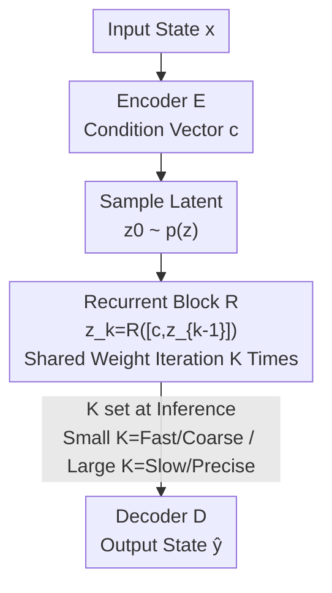

# Test-Time Accuracy-Cost Control in Neural Simulators via Recurrent-Depth

**Conference**: ICLR 2026  
**OpenReview**: [https://openreview.net/forum?id=U2j9ZNgHqw](https://openreview.net/forum?id=U2j9ZNgHqw)  
**Code**: None (Open-source promised, no link provided at publication)  
**Area**: AI for Science / Neural PDE Simulators  
**Keywords**: Neural simulators, accuracy-cost trade-off, recurrent-depth, adaptive computation, fixed point

## TL;DR
This paper proposes RecurrSim (Recurrent-Depth Simulator)—a model-agnostic "Encoder + Recurrent Block + Decoder" framework. It enables a trained neural PDE simulator to **slide between accuracy and computational cost during inference using a single knob $K$ (iteration count)** without retraining or architectural changes. On multiple fluid dynamics benchmarks, it achieves or exceeds larger baselines and diffusion-based adaptive methods with fewer parameters and lower VRAM.

## Background & Motivation
**Background**: In scientific computing, "trading cost for accuracy" is fundamental. Classical numerical methods improve accuracy by refining grids, increasing order, or lowering tolerances, albeit at higher costs. Heuristic methods like genetic algorithms or simulated annealing also adjust this trade-off by expanding the search space. Neural simulators (approximating the PDE evolution operator $G$ with $G_\theta$) have recently shown the potential for "equivalent accuracy with lower cost" in weather forecasting and aerodynamics.

**Limitations of Prior Work**: Neural simulators are typically "locked" into a specific accuracy-cost tier during training. Once trained, every forward pass delivers the same expected accuracy at the same cost; users lack a **test-time knob**. Obtaining a fast draft or a high-precision simulation often requires training separate models.

**Key Challenge**: While many knobs exist during training (data size, model capacity, steps), these are fixed post-deployment. Existing test-time adaptive routes have flaws: Deep Equilibrium (DEQ) models often encounter **oscillations near fixed points** rather than convergence, failing to improve with more iterations; diffusion-based models (ACDM, PDE-Refiner) **plateau early**, generalize poorly to iteration counts outside the training distribution, and suffer from high parameter/VRAM overhead, making them impractical for high-dimensional problems.

**Goal**: Develop a neural simulator framework that (1) offers explicit, continuous test-time accuracy-cost control, (2) is plug-and-play across backbones, and (3) remains VRAM-efficient for high-dimensional, large-scale problems.

**Key Insight**: Traditional numerical solvers (fixed-point iteration, Newton’s method) exhibit a property where **initial corrections are largest, with subsequent steps providing diminishing but beneficial refinements**. If a neural simulator operates by "gradually converging to a fixed point," the iteration count $K$ naturally becomes an accuracy-cost knob with an inductive bias suited for scientific computing.

**Core Idea**: Shift depth from a fixed training parameter to an **optional test-time iteration count $K$**. Use a weight-shared recurrent block to iteratively refine latent variables, exposing it to various $K$ values during training so users can select $K$ to balance accuracy and cost during inference.

## Method

### Overall Architecture
RecurrSim decomposes a neural simulator into a triplet: **Encoder $E$, Recurrent Depth Block $R$, and Decoder $D$**. Given a physical state $x$, the encoder compresses it into a conditioning vector $c = E(x, \theta_E)$. An initial latent variable $z_0$ is sampled from a fixed distribution $p(z)$ (default $\mathcal{N}(0, I)$). The recurrent block then **iterates $K$ times** to refine the latent variable conditioned on $c$:

$$z_k = R([c, z_{k-1}], \theta_R),\quad k = 1,\dots,K.$$

After iterations, the decoder maps the final $z_K$ back to the physical state $\hat{y} = D(z_K, \theta_D)$. This is a standard end-to-end supervised model without custom losses or complex schedulers. The key is that **weights of $R$ are shared across all $K$ steps**, meaning $K$ does not change parameter count, only computational depth. Users can set $K$ low for fast drafts or high for precision.

### Key Designs

**1. Recurrent Block + Inference Knob $K$: Returning Control to Users**
By using a **weight-shared recurrent block $R$** to repeatedly process the latent variable ($z_k = R([c, z_{k-1}], \theta_R)$), depth becomes a flexible parameter. Unlike standard networks with fixed layers, increasing $K$ increases depth without increasing parameters. Unlike DEQ which mandates convergence, RecurrSim treats any intermediate step $z_k$ as a valid "anytime" output, providing the flexibility DEQ lacks.

**2. Random Sampling of Iterations $K$ during Training: Enforcing Fixed-Point Bias**
To prevent the model from failing outside a fixed depth, each training sample uses a $K$ sampled from a Poisson log-normal distribution:

$$\upsilon \sim \mathcal{N}\!\left(\log\bar{K} - \tfrac{1}{2}\sigma^2,\ \sigma\right),\qquad K \sim \mathrm{Poisson}(e^{\upsilon}) + 1,$$

where $\bar{K}+1$ is the expected iterations. This distribution ensures the block remains stable across both shallow and deep unrollings. The trained block naturally contracts toward a fixed point—initial steps provide coarse solutions while deeper steps refine them. Experimentally, performance saturates around $\bar{K}=32$. This allows RecurrSim to generalize to OOD (Out-of-Distribution) values of $K$ where methods like PDE-Refiner typically degrade.

**3. Truncated Backpropagation-through-depth (Window $B$): Decoupling VRAM from $K$**
Naive unrolling for $K$ steps stores activations for every step, causing VRAM to explode in high-dimensional 3D problems. RecurrSim uses **truncated backpropagation-through-depth**, computing gradients only for the last $B$ steps while treating earlier iterations as constants. VRAM usage is fixed at $O(B)$, **independent of $K$**. Empirically, $B=4$ is sufficient. This allows an 0.8B parameter RecurrFNO to outperform a 1.6B baseline on a 3D compressible Navier-Stokes problem with less VRAM (64GB vs 73GB).

**4. Architecture Agnostic + Condition Fusion: Plug-and-Play**
The framework is implementation-independent. $E$, $R$, and $D$ can use primitives best suited for the problem (CNNs for grids, GNNs for point clouds, Fourier layers for regular domains, or Transformers). The paper demonstrates RecurrFNO, RecurrViT, and RecurrUPT. For fusing condition $c$ with $z_k$, **element-wise weighted summation** ($z'_k = \alpha\odot c + \beta\odot z_k$) was found to be the most balanced approach.

### Loss & Training
The model uses standard end-to-end supervision with a step loss $l_i = \lVert y_i - \hat{y}_i\rVert$. For each sample: encode to get $c$ $\rightarrow$ sample $z_0$ $\rightarrow$ sample $K$ $\rightarrow$ unroll $K$ steps $\rightarrow$ decode $\rightarrow$ compute loss $\rightarrow$ backpropagate through window $B$. Default settings are $\bar{K}=32, B=4$.

## Key Experimental Results

### Main Results
On fluid benchmarks (Burgers, KdV, KS), RecurrFNO trajectory error decreases steadily as $K$ increases before plateauing (around $K=16$ for Burgers, $K=8$ for KdV). Compared to other **test-time adaptive** simulators, RecurrFNO achieves the best accuracy-cost curves with fewer parameters:

| Task | Baselines | Param Comparison | Key Observations |
|------|---------|---------|---------|
| Burgers | FNO-DEQ / ACDM / PDE-Refiner | RecurrFNO uses 50% parameters of diffusion methods | Opponents plateau at $K\approx4$; Ours improves until $K\approx16$ |
| Long-range KdV | Same as above | Same as above | FNO-DEQ oscillates; PDE-Refiner degrades after $K=11$ (OOD); Ours has lowest error |
| KS (Chaotic) | Same as above (7x params) | RecurrFNO uses 1/7 parameters | ACDM plateaus early; PDE-Refiner shows high variance in worst-case time-horizons |

High-dimensional and cross-architecture results:

| Dataset | Model | Parameters | Key Metric | Comparison |
|--------|------|------|---------|------|
| 3D Comp. NS | RecurrFNO ($\bar K=8$) | 0.8B / 64GB | Density MSE 7.57e-2 | Beats 1.6B FNO (7.61e-2) with 13.5% less VRAM |
| Active Matter | RecurrViT | 75M (58% of ViT) | Steps 0:12 MSE 5.68e-2 | ViT (130M) is 43.16e-2; ~87% reduction in error |
| ShapeNet-Car | RecurrUPT | 92M (56% of UPT) | MSE 2.19e-2 | Superior to UPT (164M) at 2.31e-2 |

### Ablation Study

| Config | Key Finding | Description |
|------|---------|------|
| Window $B$ | Saturates at $B=4$ | Decouples memory from $K$ without sacrificing accuracy |
| Expected $\bar K$ | Saturates at $\bar K=32, \sigma=0.5$ | Wide training spectrum is necessary for OOD $K$ generalization |
| Fusion Method | Element-wise weighted sum | Best trade-off between param efficiency and performance |
| EncDec | RecurrFNO w/ EncDec is better | Adding Fourier layers to $E$ and $D$ consistently lowers error |

### Key Findings
- **Fixed-point inductive bias is crucial**: Emulating numerical methods where initial steps do the heavy lifting ensures that even small $K$ values yield physically faithful solutions.
- **Truncated backprop is the key to efficiency**: Keeping VRAM at $O(B)$ allowed the 0.8B model to scale to 3D Navier-Stokes.
- **Avoids common pitfalls**: RecurrSim circumvents the early plateauing and OOD degradation seen in diffusion models, and the oscillation issues in DEQ.

## Highlights & Insights
- **Test-time iteration as a knob**: Moving fixed depth to a user-selectable parameter caters to scientific workflows requiring "coarse-to-fine" simulation.
- **Memory-Depth Decoupling**: The truncated backprop trick can be applied to any iterative refinement model to control VRAM.
- **Architecture Agnostic**: The framework functions as an "ability plugin" that is orthogonal to the choice of backbone (FNO, ViT, UPT).

## Limitations & Future Work
- The optimal $K$ must still be determined manually or via scanning; there is no mechanism for **input-adaptive $K$ selection** (similar to difficulty-based compute allocation in LLMs).
- While experimental results are strong, there is no formal **theoretical guarantee** for fixed-point convergence.
- The plateau position $K$ varies across tasks, making it difficult to predict the required budget without prior testing.

## Related Work & Insights
- **vs. Deep Equilibrium (FNO-DEQ)**: DEQ solves for fixed points but often oscillates or fails to improve with more iterations. RecurrSim is stable and allows "anytime" extraction of intermediate results.
- **vs. Diffusion (ACDM / PDE-Refiner)**: Diffusion methods plateau early and have massive memory footprints. RecurrSim is more parameter/VRAM efficient and scales better to high iterations.
- **Inspiration**: Inherits the "recurrent-depth" concept from LLM research but specializes it for PDE simulation with truncated backprop and fixed-point biases.

## Rating
- Novelty: ⭐⭐⭐⭐ Clean application of recurrent depth as a test-time knob with an appropriate inductive bias for PDEs.
- Experimental Thoroughness: ⭐⭐⭐⭐ Extensive benchmarks across 5 datasets and 3 backbones with strong baseline comparisons.
- Writing Quality: ⭐⭐⭐⭐ Clear framework with comprehensive pseudo-code and well-explained motivations.
- Value: ⭐⭐⭐⭐ Highly practical for AI for Science, offering VRAM efficiency and flexible deployment.

<!-- RELATED:START -->

## Related Papers

- [\[ICLR 2026\] Feedback-driven Recurrent Quantum Neural Network Universality](feedback-driven_recurrent_quantum_neural_network_universality.md)
- [\[ICML 2026\] TINNs: Time-Induced Neural Networks for Solving Time-Dependent PDEs](../../ICML2026/physics/tinns_time-induced_neural_networks_for_solving_time-dependent_pdes.md)
- [\[ICLR 2026\] CFO: Learning Continuous-Time PDE Dynamics via Flow-Matched Neural Operators](cfo_learning_continuous-time_pde_dynamics_via_flow-matched_neural_operators.md)
- [\[ICLR 2026\] Orbital Transformers for Predicting Wavefunctions in Time-Dependent Density Functional Theory](orbital_transformers_for_predicting_wavefunctions_in_time-dependent_density_func.md)
- [\[ICLR 2026\] Sublinear Time Quantum Algorithm for Attention Approximation](sublinear_time_quantum_algorithm_for_attention_approximation.md)

<!-- RELATED:END -->
