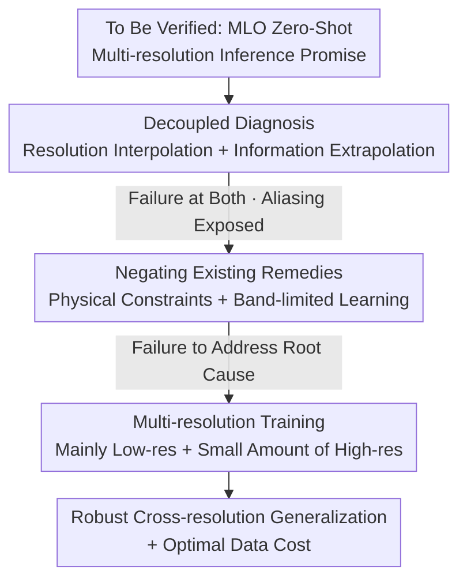

# The False Promise of Zero-Shot Super-Resolution in Machine-Learned Operators

**Conference**: ICLR 2026  
**OpenReview**: [https://openreview.net/forum?id=hkF7ZM7fEp](https://openreview.net/forum?id=hkF7ZM7fEp)  
**Code**: https://github.com/msakarvadia/operator_aliasing  
**Area**: Scientific Machine Learning / Neural Operators / PDE Modeling  
**Keywords**: Fourier Neural Operator, Zero-Shot Super-Resolution, Aliasing, Multi-resolution Inference, PDE Solver Operators

## TL;DR
This paper systematically refutes the promise of "zero-shot super-resolution" for Machine-Learned Operators (MLOs) such as the Fourier Neural Operator (FNO). By decomposing multi-resolution inference into two sub-capabilities—"resolution interpolation" and "frequency information extrapolation"—the authors find that FNO fails at both and exhibits severe aliasing. Neither physical constraints nor band-limited learning effectively addresses this issue. Finally, a simple yet effective multi-resolution training protocol is proposed, achieving robust cross-resolution generalization using a minimal amount of high-resolution data.

## Background & Motivation

**Background**: The core challenge in scientific computing is modeling physical systems (e.g., fluids or diffusion described by PDEs) that are inherently continuous using discrete sampling. MLOs (e.g., FNO, DeepONet) have been proposed as data-driven alternatives that parameterize PDE solution operators $S_2 = M(S_1)$ and claim to perform inference at **any resolution**. In particular, FNO has been repeatedly claimed to possess "zero-shot super-resolution" capabilities: the ability to be trained at resolution $m$ and infer accurately at a higher resolution $n > m$ without additional high-resolution data.

**Limitations of Prior Work**: The promise of "zero-shot super-resolution" is highly attractive because generating and training on high-resolution data is extremely expensive. However, the authors argue that the architectural ability to **run** on any discretization does not equate to the ability to **infer accurately**. Previous research has conflated "architectural continuity" with "actual generalization," lacking a systematic and decoupled validation of this promise.

**Key Challenge**: The fundamental issue is that all machine learning models (including MLOs) typically fail to generalize outside the training data distribution. Changing the test resolution is essentially creating an Out-of-Distribution (OOD) input. Since models are trained at a fixed resolution and never see wide frequency bands or different sampling rates, they cannot correctly infer unseen frequencies—resulting in **aliasing**, where high-frequency information is incorrectly projected onto low-frequency basis functions.

**Goal**: To decompose the ambiguous concept of "multi-resolution inference" into two independently verifiable sub-problems: (1) **Resolution Interpolation**: whether the model can generalize when frequency information remains constant but the sampling rate changes; (2) **Information Extrapolation**: whether the model can extrapolate to unseen frequencies when the sampling rate remains constant but frequency components change.

**Key Insight**: Grounded in signal processing and the Whittaker–Nyquist–Shannon sampling theorem, a sampling rate $r$ can only resolve frequencies up to $r/2$. Frequencies higher than $r/2$ are inherently OOD tasks. Using energy spectra and normalized residual spectra as diagnostic tools, the authors quantitatively observe where models fail across different resolutions and frequencies.

**Core Idea**: The paper first refutes the "false promise" of zero-shot super-resolution through diagnostic experiments, then negates two seemingly plausible remedies (physical constraints and band-limited learning), and finally returns to a straightforward data-driven approach: **since test resolution is OOD, include it in the training set**. By mixing large amounts of cheap low-resolution data with very little expensive high-resolution data, robust multi-resolution generalization is achieved at minimal cost.

## Method

### Overall Architecture

The paper does not propose a new model but rather a research methodology consisting of "diagnosis, negation of remedies, and solution." The process follows three steps: **First**, decompose multi-resolution inference into resolution interpolation and information extrapolation, using controlled experiments (low-pass filtering + subsampling) to prove that FNO fails both due to aliasing. **Second**, evaluate existing "alias-free" remedies (physics-informed constraints and band-limited learning), proving they do not address the root cause. **Third**, propose multi-resolution training and characterize the Pareto frontier of "data cost vs. test loss" to find the most cost-effective mixture ratio.

### Key Designs

**1. Decoupled Diagnosis: Splitting "multi-resolution inference" into interpolation and extrapolation**

To refute an ambiguous capability, it must be decomposed into verifiable sub-capabilities. Based on signal processing, the authors define two orthogonal sub-tasks: **Resolution Interpolation**—keeping frequency information constant (by applying a fixed low-pass filter, e.g., $8f$, where $f = 2\pi/N$) and varying only the sampling rate/resolution (e.g., 16→32→64→128) to see if the model can resample a "fully resolved signal"; **Information Extrapolation**—keeping the sampling rate constant (e.g., 128) and varying only the low-pass filter cutoff (e.g., $8f \to 16f \to 32f \to 64f$) to see if the model can predict higher frequency components unseen during training.

This decoupling identifies the mechanism of failure: true spatial super-resolution requires **both** interpolation and extrapolation to hold. Diagnostic results across Darcy, Burgers, and Navier-Stokes datasets show that when the test resolution deviates from the training resolution, residual energy spectra spike at either high frequencies (extrapolation) or low frequencies (interpolation). Notably, **the model stubbornly injects erroneous energy into high frequencies regardless of whether the test data actually contains high-frequency information**. Conclusion: changing test resolution $\approx$ OOD inference; FNO cannot reliably interpolate or extrapolate in a zero-shot manner.

**2. Negating Remedies: Physical constraints and band-limited learning fail to address the root cause**

The community has proposed two types of remedies, which the authors prove ineffective. **Physics-informed constraints** use a dual-objective loss $L(\theta) = (1-w)\,\ell_{\text{data}}(\theta) + w\,\ell_{\text{phys}}(\theta)$ to force predictions to satisfy governing equations. However, sweeping $w \in \{0, 0.1, 0.25, 0.5\}$ shows that pure data-driven training ($w=0$) consistently performs best. Higher physical weights lead to poorer performance as the constraints make the model harder to optimize, even failing to fit the training resolution. **Band-limited learning** (e.g., CNO, CROP+FNO) claims to be alias-free. While CNO learns a band-limited representation where spectra drop cleanly after $8f$ without aliasing, it **cannot predict any components higher than the training frequencies**. CROP can fit low frequencies but fails at cross-resolution high frequencies.

These cases reveal a deep insight: band-limited models achieve "alias-free" properties by **sacrificing high-frequency prediction**, whereas the goal of multi-resolution inference is to accurately model broad frequency bands. Thus, band-limited learning is fundamentally at odds with the objective. Both remedies bypass the root problem (OOD generalization) and ultimately fail.

**3. Multi-resolution Training: Turning OOD into ID with cost-effective ratios**

Since the root cause is that the test resolution is OOD, the direct solution is to include multiple resolutions in the training set. The authors mix training data according to ratios $\{r_1, \dots, r_n\}$ ($n=4$). Initial **dual-resolution training** shows that models only improve on the **two specific resolutions included in training**, while other resolutions show no consistent gain—confirming models perform best only on what they have seen.

The true solution is to **include all resolutions**. Evenly sampling all resolutions improves test loss across the board. To optimize cost, the authors construct skewed ratios (e.g., $(0.7, 0.1, 0.1, 0.1)$) because low-resolution data is cheaper to generate and train. Results show that even with significantly reduced high-resolution data, the model remains competitive across all test resolutions. This "All Res." hybrid dataset forms a Pareto frontier on the "average data scale vs. cross-resolution loss" plot, representing a robust and computationally efficient training protocol.

### Loss & Training

The primary loss remains the standard data-driven MSE loss $\ell_{\text{data}}$. Physics-informed experiments introduce $\ell_{\text{phys}}$ to form $(1-w)\ell_{\text{data}} + w\ell_{\text{phys}}$ (though results suggest removing it is better). Multi-resolution training does not change the loss function but modifies the **resolution distribution of training data** by mixed sampling of four resolutions. Hyperparameters for FNO were optimized via grid search. The core strategy: replace single-resolution sets with low-res-weighted hybrid datasets.

## Key Experimental Results

Datasets: Darcy (steady-state diffusion), Burgers (1D wave), Navier-Stokes (time-dependent fluid). Diagnostic metrics include normalized residual energy spectra and cross-resolution test loss.

### Main Results: Zero-Shot Multi-resolution Inference Failure

| Phenomenon | Observation | Implications |
| :--- | :--- | :--- |
| Resolution Interpolation (Fixed freq, variable sampling) | Residual spectra spike at low frequencies for all training resolutions | FNO cannot interpolate to new resolutions zero-shot |
| Information Extrapolation (Fixed sampling, variable freq) | Residual spectra spike at high frequencies; erroneous energy injected regardless of input | FNO cannot extrapolate to unseen frequencies zero-shot |
| Spatial Super-Resolution (Both variable) | High-frequency aliasing artifacts appear; artifacts accumulate over time in time-dependent PDEs | Zero-shot super/sub-resolution is unreliable |
| Cross-resolution Loss Fluctuation | Fluctuations of $\sim 1\times$ / $2\times$ / $10\times$ for Darcy / Burgers / Navier-Stokes | Failure worsens as system complexity increases |

### Comparison of Remedies and Multi-resolution Training

| Approach | Multi-resolution Gen? | Key Findings |
| :--- | :--- | :--- |
| Pure Data-driven FNO (Baseline) | No | Severe zero-shot aliasing |
| + Physical Constraints | No | Performance drops as $w$ increases; even training res fit is worse |
| Band-limited Learning (CNO) | No | Alias-free but cannot predict frequencies above training limit |
| Band-limited Learning (CROP+FNO) | No | Fits low-res well, but poor high-res cross-resolution performance |
| **Multi-resolution Training (All Res.)** | **Yes** | Loss drops consistently across all res; forms Pareto frontier |

### Key Findings
- **Multi-resolution Inference = OOD Inference**: This is the unifying explanation. FNO's failure is not due to architectural flaws but because it follows the standard ML limitation: failing to generalize outside the training distribution.
- **Dual-resolution training only benefits participating resolutions**: Confirms that models are only accurate at the resolutions they have encountered.
- **Low-res-heavy mixtures are almost a "free lunch"**: Reducing high-res data to 10%–20% maintains multi-resolution performance while drastically lowering training and data generation costs.
- **Physical constraints are counterproductive**: In multi-resolution scenarios, physics-based losses are harder to optimize and degrade performance; lower weights are preferred.

## Highlights & Insights
- **The decoupled diagnostic framework is a reusable methodology**: Breaking an ambiguous claim into strictly defined orthogonal sub-capabilities (interpolation/extrapolation) and using controlled variables (low-pass filtering + subsampling) is a rigorous way to refute "zero-shot" claims.
- **Using energy/residual spectra as a "microscope"**: Moving beyond scalar MSE to analyze errors at specific frequencies allows the localization of "super-resolution failure" to the specific mechanism of aliasing.
- **Insight: "Alias-free" via band-limiting is a trade-off**: CNO avoids aliasing only by discarding the ability to predict higher frequencies, revealing a tension between alias-free properties and multi-resolution modeling goals.
- **Simple solutions are most effective**: Rather than complex architectural inductive biases or physical constraints, simply covering the test distribution in the training set—and optimizing the cost ratio—proves most effective.

## Limitations & Future Work
- **Ratio Optimization**: Finding the most optimal cross-resolution ratio remains an open problem; only a few skewed ratios were tested.
- **Requirement for High-res Data**: While efficient, the method is not truly "zero-shot" and still requires a small amount of expensive high-resolution samples.
- **Scope**: The focus is primarily on FNO and regular grid PDEs; the extrapolation capabilities of DeepONet, Transformer-based operators, or non-structured grids require further validation.
- **Future Directions**: Automating ratio optimization (e.g., via active learning) or designing inductive biases that truly extrapolate frequency rather than relying on data coverage.

## Related Work & Insights
- **vs. Original FNO Claim**: FNO claimed architectural continuity $\Rightarrow$ zero-shot super-resolution. Ours refutes this, showing architectural capability $\neq$ accuracy.
- **vs. Physical Constraints (Li et al. 2024b)**: Unlike previous attempts to use PDE residuals for super-resolution, Ours finds such losses harmful in multi-resolution contexts due to optimization issues.
- **vs. Band-limited Learning (Raonic et al. 2023; Gao et al. 2025)**: Unlike CNO/CROP which aim for "alias-free" representations, Ours notes these models sacrifice high-frequency modeling necessary for true multi-resolution tasks.
- **vs. Dual-resolution Active Learning (Li et al. 2024a)**: Ours extends findings from two resolutions to a general multi-resolution training protocol and Pareto cost optimization.

## Rating
- Novelty: ⭐⭐⭐⭐ Systematically refutes a widely accepted claim and provides a simple, effective solution.
- Experimental Thoroughness: ⭐⭐⭐⭐⭐ Rigorous control variables across multiple datasets and detailed spectral diagnostics.
- Writing Quality: ⭐⭐⭐⭐ Clear decoupling framework and a cohesive OOD perspective.
- Value: ⭐⭐⭐⭐⭐ Corrects over-optimism regarding zero-shot capabilities and provides a practical, cost-saving training protocol.

<!-- RELATED:START -->

## Related Papers

- [\[ICML 2025\] Maximal Update Parametrization and Zero-Shot Hyperparameter Transfer for Fourier Neural Operators](../../ICML2025/physics/maximal_update_parametrization_and_zero-shot_hyperparameter_transfer_for_fourier.md)
- [\[ICLR 2026\] From Cheap Geometry to Expensive Physics: A Physics-agnostic Pretraining Framework for Neural Operators](from_cheap_geometry_to_expensive_physics_a_physics-agnostic_pretraining_framewor.md)
- [\[ICLR 2026\] Learning Data-Efficient and Generalizable Neural Operators via Fundamental Physics Knowledge](learning_data-efficient_and_generalizable_neural_operators_via_fundamental_physi.md)
- [\[ICLR 2026\] Tucker-FNO: Tensor Tucker-Fourier Neural Operator and its Universal Approximation Theory](tucker-fno_tensor_tucker-fourier_neural_operator_and_its_universal_approximation.md)
- [\[ICLR 2026\] Adaptive Mamba Neural Operators](adaptive_mamba_neural_operators.md)

<!-- RELATED:END -->
