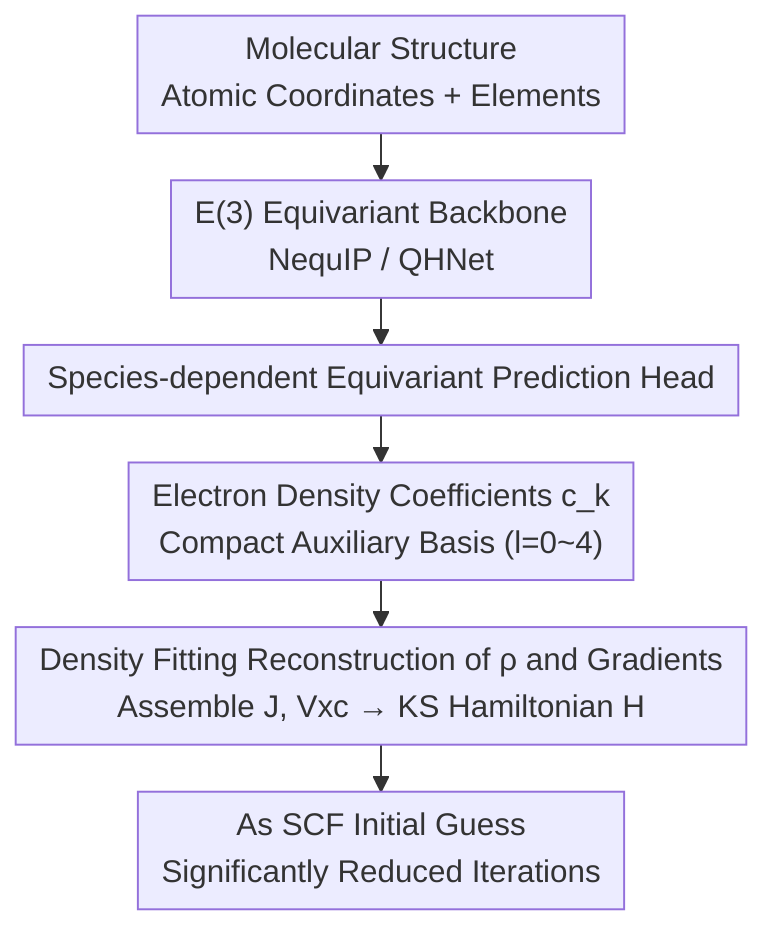

# Towards a Transferable Acceleration Method for Density Functional Theory

**Conference**: ICLR 2026  
**OpenReview**: [https://openreview.net/forum?id=JNuk3yGDKE](https://openreview.net/forum?id=JNuk3yGDKE)  
**Code**: [SCFbench Dataset](https://huggingface.co/datasets/ByteDance-Seed/SCFbench) (including accompanying code)  
**Area**: AI for Science / Computational Chemistry / Equivariant Neural Networks  
**Keywords**: DFT Acceleration, SCF Initial Guess, Electron Density, Auxiliary Basis, E(3) Equivariant Network

## TL;DR
Addressing the bottleneck of slow Self-Consistent Field (SCF) iterations in Density Functional Theory (DFT), this work departs from the mainstream approach of predicting the Hamiltonian matrix. Instead, it utilizes an E(3) equivariant network to predict the **expansion coefficients of the electron density under a compact auxiliary basis** and provides a complete pipeline to transform this density into an SCF initial guess. Trained only on small molecules with fewer than 20 atoms, the model directly reduces the SCF iterations of 60-atom molecules by 33.3% on average and can accelerate polymer/peptide systems with up to 900 atoms without retraining, whereas Hamiltonian-based baselines often fail to converge on large molecules.

## Background & Motivation

**Background**: DFT is the cornerstone of electronic structure prediction in computational chemistry. It is solved using the SCF method—starting with an initial density matrix guess and iteratively performing $D \to H \to C' \to D'$ until self-consistency is reached. SCF iterations are computationally expensive, becoming a major bottleneck as molecular size increases. A natural acceleration strategy is to use machine learning to provide high-quality initial guesses to reduce the number of SCF steps. The mainstream approach involves training neural networks to directly predict the Kohn-Sham **Hamiltonian matrix** $H$ (e.g., QHNet, SPHNet, WALoss).

**Limitations of Prior Work**: Hamiltonian prediction tends to fail on large molecules where acceleration is most needed, for two reasons. First, numerical instability: small prediction errors in individual matrix elements can be amplified into physically unreasonable global errors. Second, and more critically—**lack of transferability**: models typically collapse once the molecular size exceeds what was seen during training. In the experiments, the Hamiltonian baseline achieved an RIC of 63% on in-distribution small molecules, but this jumped to 179% for out-of-distribution large molecules (80% slower than the default guess), with over 2.5% of molecules failing to converge entirely. Alternatively, predicting the **density matrix** also strongly depends on the choice of basis set; when diffuse functions are introduced, the range of matrix element values explodes, making it equally difficult to transfer.

**Key Challenge**: Each element of the Hamiltonian matrix $H$ couples **any pair of atoms** in the molecule (regardless of distance), making it sensitive to global molecular structure. It is essentially a non-local quantity that scales quadratically with system size, rendering it inherently unsuitable for extrapolation to larger chemical environments. In contrast, the core assumption of Kohn-Sham DFT is that a system of interacting electrons can be represented by a fictitious non-interacting system that shares the **exact same electron density**. In other words, the electron density $\rho(r)$ is the fundamental physical observable, characterized by strong **locality** and **transferability**—the density corresponding to a specific chemical environment remains largely invariant to the rest of the molecule.

**Goal**: To find a truly transferable and scalable prediction target for generating SCF initial guesses, enabling "training on small molecules $\to$ direct application to large molecules," and to bridge the missing link: how to transform a predicted density into a functional guess capable of driving the SCF process.

**Key Insight**: Since the density is the most fundamental and local quantity, it should be predicted directly. However, previous attempts to predict density on real-space grids (e.g., Brockherde et al.) faced two hurdles: grid representations are redundant and expensive, and more importantly, most DFT functionals require both the density and its **gradient**. Grid predictions cannot provide accurate gradients, which has prevented the practical use of predicted densities to accelerate DFT.

**Core Idea**: Use an equivariant network to predict the expansion coefficients $\{c_k\}$ of the electron density under a **compact auxiliary basis** (rather than grid values). This allows both the density and its gradient to be calculated analytically, enabling the direct assembly of the complete Kohn-Sham Hamiltonian as an SCF initial guess. This successfully implements the "predict density" paradigm, which is theoretically sound but was previously difficult to realize.

## Method

### Overall Architecture
This work addresses the problem of "how to provide a transferable and high-quality initial guess for SCF." The overall approach is to feed the molecular structure into an E(3) equivariant backbone network (reusing existing architectures like NequIP or QHNet) with a **species-dependent equivariant prediction head**. This head outputs the **expansion coefficients of the electron density under atom-centered auxiliary bases** $\{c_k\}$. Density fitting is then used to analytically reconstruct the electron density and its gradient from these coefficients. From there, the Coulomb term $J$ and the exchange-correlation term $V_{xc}$ are assembled to form the Kohn-Sham Hamiltonian $H$, which serves as the initial guess for SCF iterations. Because density is a local, transferable quantity and the number of auxiliary basis coefficients grows **linearly** with system size (whereas Hamiltonian/density matrices grow quadratically), this workflow is both transferable to large molecules and computationally efficient.

### Key Designs

**1. Species-dependent Equivariant Prediction Head: Direct Output of Density Coefficients**

To avoid reinventing the wheel, the authors do not design a new architecture but rather replace the **prediction heads** of two classic E(3)/SE(3) equivariant networks: NequIP and QHNet. The original NequIP head only processes scalar ($l=0$) features to predict atomic energy, while the QHNet head uses a massive multi-stage Tensor Expansion module to assemble the Hamiltonian matrix. This work replaces them with a **single-layer, species-dependent equivariant linear layer**. It maps the node features from the backbone directly to density coefficients $h^i_{\text{out}}$, including irreducible representations from $l=0$ to $l=4$. The weights of this layer are conditioned on the atomic **element type**, allowing each element to learn its own unique final mapping. This approach ensures the density transforms correctly under rotation, translation, and reflection according to Wigner D-matrices, utilizing physical symmetry as an inductive bias to improve data efficiency. Furthermore, the symmetry order $L$ of the density can be lower than that of the Hamiltonian, which is crucial for equivariant networks as the computational complexity of tensor products scales as $O(L^6)$. This adds almost no parameters to NequIP and significantly reduces QHNet's parameters by removing its complex original head (20.5M $\to$ 5.9M).

**2. Electron Density Coefficients in a Compact Auxiliary Basis: A Transferable, Linear-Scaling Target**

This is the central paradigm shift of the paper. The authors use a density fitting approximation to expand the electron density into a set of atom-centered auxiliary basis functions $\{\chi_k(r)\}$:

$$\rho(r) \approx \tilde{\rho}(r) = \sum_k c_k \chi_k(r)$$

The model predicts these coefficients $c_k$. Choosing this over the Hamiltonian or density matrix provides three key advantages: first, **local transferability**—the density in a specific chemical environment is largely independent of the global molecular structure, allowing patterns learned from small molecules to extrapolate to large ones; second, **linear scaling**—the number of auxiliary coefficients grows linearly with system size, whereas the Hamiltonian/density matrix grows quadratically with orbital pairs. Predicting density coefficients is a **node-wise** task, while predicting the Hamiltonian is an **edge-wise** task requiring the construction of $N \times N$ matrices, which is the root cause of memory issues in large systems; third, **data efficiency**, as locality means accurate patterns can be learned from smaller datasets. Typical auxiliary bases used include def2-universal-jfit or even-tempered bases (ETB, controlled by a parameter $\beta$; smaller $\beta$ results in larger bases with higher expressive power and higher theoretical acceleration limits).

**3. Assembling SCF Guess from Predicted Density: Bridging the "Density $\to$ Initial Guess" Gap**

A key contribution of this work is implementing the step that previous density-based methods lacked: "using the predicted density to drive the SCF." With the auxiliary basis expansion, the electron density **and its gradient** can be evaluated analytically. Thus, the exchange-correlation matrix $V_{xc}$ required for Generalized Gradient Approximation (GGA) functionals can be computed efficiently. Although the Coulomb matrix $J$ formally depends on the density matrix $D$, it can also be calculated directly from the coefficients $\{c_k\}$ using density fitting. This allows for the assembly of the entire Kohn-Sham Hamiltonian $H = H_{\text{core}} + J + V_{xc}$ using only predicted density coefficients. Compared to computing $H$ exactly from the full density matrix, this introduces approximations in $J$ and $V_{xc}$, but the error can be systematically reduced by **increasing the number of auxiliary basis functions**. This also explains why the GGA framework is the most compatible: it allows for the direct assembly of the Hamiltonian from density coefficients. Meta-GGA (requiring kinetic energy density) and hybrid functionals (requiring HF exchange) necessitate further approximations.

### Loss & Training
The density coefficient models are trained using a **per-atom** composite loss, which is the sum of the Mean Absolute Error (MAE) and Root Mean Square Error (RMSE) of the coefficients:

$$L = \left(\frac{1}{A}\sum_{a=1}^{A}\frac{1}{N_a}\sum_{i=1}^{N_a}|\hat{c}_{a,i}-c_{a,i}|\right) + \sqrt{\frac{1}{A}\sum_{a=1}^{A}\frac{1}{N_a}\sum_{i=1}^{N_a}(\hat{c}_{a,i}-c_{a,i})^2}$$

where $A$ is the total number of atoms and $N_a$ is the number of coefficients for atom $a$. The ground truth $c_{a,i}$ is derived from the converged electron density of a DFT calculation. Training only uses small molecules from SCFbench with fewer than 20 atoms (PBE functional, def2-SVP basis).

## Key Experimental Results

The primary evaluation metric is the **Relative Iteration Count (RIC)**: the number of SCF steps to converge using the ML guess divided by the steps using the default SAD (minao) guess (lower is better). The **convergence rate** within 50 steps is also reported. The SCFbench dataset contains 43,862 small molecules (ID test) and an OOD test set (1,050 molecules with 26–60 atoms, 30 samples per size).

### Main Results: Comparison of Prediction Targets on ID and OOD

| Target | Model | Params | ID RIC ↓ | OOD RIC ↓ | OOD Conv. Rate ↑ |
|----------|------|--------|----------|-----------|--------------|
| Hamiltonian H | QHNet | 20.5M | 63.20% | **179.47%** | 97.43% |
| Density Matrix D | QHNet | 20.5M | 70.45% | 91.69% | 99.71% |
| Density Coeffs (jfit) | QHNet | 5.9M | 66.90% | 73.26% | 100% |
| Density Coeffs (jfit) | **NequIP-L** | 50.0M | **63.78%** | **66.68%** | **100%** |

The Hamiltonian model performs well on small molecules (63% RIC) but collapses to 179% on large molecules (slower than no acceleration), with >2.5% failing to converge. The density matrix is slightly better but still degrades to 91.69% with size. The proposed density-based NequIP-L maintains a nearly constant RIC (63.78% $\to$ 66.68%) across ID/OOD with 100% convergence. Notably, when the same QHNet architecture is switched to predict density, its OOD RIC drops from 179% to 73.26%—proving that **choosing a transferable physical target is more critical than the model architecture**.

### Scalability to Large Systems (QMugs 100–200 atoms)

| System Size | Density Coeff RIC ↓ | Density Coeff Conv. | Hamiltonian Conv. | Density Matrix Conv. |
|----------|----------------|--------------|------------|--------------|
| 100 atoms | 75.36% | 100% | 20% | 50% |
| 130 atoms | 78.10% | 100% | 0% | 10% |
| 200 atoms | 77.34% | 100% | 0% | 0% |

The density method maintains a stable RIC of 0.73–0.82 and 100% convergence for systems of 100–200 atoms. Hamiltonian and density matrix methods see convergence rates drop nearly to 0 for systems >120 atoms. In massive cases: the Glycine-100 peptide (703 atoms) converged in 10 steps (vs. 17 for minao), and a Polypropylene chain (905 atoms) converged in 8 steps (vs. 12 for minao). Hamiltonian/density matrix methods failed due to OMM (Out of Memory) as they require constructing $N \times N$ matrices.

### Transferability Across Functionals and Basis Sets (NequIP-L, trained on PBE/def2-SVP)

| Transfer Setting | OOD RIC ↓ |
|----------|-----------|
| PBE / def2-SVP (In-distribution) | 66.68% |
| BLYP / def2-SVP | 71.22% |
| SCAN (meta-GGA) | 86.45% |
| B3LYP5 (Hybrid) | 83.72% |
| PBE / def2-TZVP (Larger Basis) | 75.24% |
| B3LYP5 / def2-TZVP | 85.47% |

### Key Findings
- **Target choice dominates architecture choice**: By switching from Hamiltonian to density, even the original QHNet improved from 179% to 73% RIC, demonstrating that transferability stems from "what to predict" rather than "what network to use."
- **Node-wise vs. Edge-wise is the divide for large systems**: Density coefficients scale linearly and run on 900 atoms; Hamiltonian/density matrices scale quadratically, leading to OOM or divergence at a few hundred atoms.
- **Auxiliary basis expressivity defines the acceleration ceiling**: The theoretical RIC limit for def2-universal-jfit is ~60%, while a larger ETB ($\beta=1.5$) can reach ~40%. ML models are nearing the limit on compact bases but still have room to improve on larger ones.

## Highlights & Insights
- **First principles of a "correct physical target"**: Derived from Kohn-Sham assumptions, the paper argues density is the proper observable/transferable quantity and uses engineering (auxiliary basis + density fitting + $H$ assembly) to realize it—a prime example of "physical intuition guiding ML design."
- **Backbone reuse**: Proves the paradigm's efficacy does not rely on a specific network, making it easily extendable to any equivariant backbone in an engineering context.
- **Extrapolation of scaling logic**: In any structural prediction task requiring extrapolation to larger systems or longer sequences, prioritizing local, linear-scaling targets is a universally applicable lesson.
- **Drop-in Accelerator**: A model trained on single small molecules can serve as a "plug-and-play" accelerator for various systems, functionals, and basis sets, offering high practical value for computational chemistry workflows.

## Limitations & Future Work
- For more expressive large auxiliary bases (e.g., ETB $\beta=1.5$), there is still a noticeable gap between ML performance and the theoretical acceleration ceiling, suggesting a need for stronger architectures.
- Current data and methods focus on GGA (PBE). Meta-GGA and hybrid functionals require additional approximations for kinetic energy density and HF exchange, leading to an RIC degradation to 83–86%.
- SCFbench currently covers only seven elements (H, C, N, O, F, P, S) in drug-like fragments. Expanding to the broader periodic table and periodic (solid-state) systems is a key direction for achieving "true universality."

## Related Work & Insights
- **vs. Hamiltonian Prediction (QHNet / SPHNet / WALoss)**: These predict $H$ directly, which is numerically unstable, non-local, and scales quadratically, leading to non-convergence or OOM on large molecules. This work predicts local, linear-scaling density coefficients, offering better transferability and scalability while completing the "density-to-guess" pipeline.
- **vs. Density Matrix Prediction (Shao/Hazra/Febrer et al.)**: Density matrices strongly depend on basis sets and exhibit exploding value ranges with diffuse functions, limiting transferability. Density, as a physical observable, is naturally more stable.
- **vs. Real-Space Grid Density Prediction (Brockherde / SCDP-Fu et al.)**: Grid representations are redundant and cannot provide gradients, preventing them from directly driving SCF. This work uses a compact auxiliary basis to make density and gradients analytically accessible, for the first time enabling predicted density to accelerate DFT in practice.

## Rating
- Novelty: ⭐⭐⭐⭐⭐ Shifting the DFT acceleration target from Hamiltonian to electron density and completing the resulting pipeline is a paradigm-level shift.
- Experimental Thoroughness: ⭐⭐⭐⭐⭐ Systematic verification across ID/OOD, massive systems (up to 905 atoms), and cross-functional/basis settings, combined with the open-sourcing of SCFbench.
- Writing Quality: ⭐⭐⭐⭐⭐ Clear physical motivation and thorough explanation from theory to engineering implementation.
- Value: ⭐⭐⭐⭐⭐ The first robust and transferable candidate for DFT acceleration with direct practical utility for computational chemistry workflows.

<!-- RELATED:START -->

## Related Papers

- [\[ICLR 2026\] Orbital Transformers for Predicting Wavefunctions in Time-Dependent Density Functional Theory](orbital_transformers_for_predicting_wavefunctions_in_time-dependent_density_func.md)
- [\[NeurIPS 2025\] High-order Equivariant Flow Matching for Density Functional Theory Hamiltonian Prediction](../../NeurIPS2025/physics/high-order_equivariant_flow_matching_for_density_functional_theory_hamiltonian_p.md)
- [\[ICLR 2026\] Tucker-FNO: Tensor Tucker-Fourier Neural Operator and its Universal Approximation Theory](tucker-fno_tensor_tucker-fourier_neural_operator_and_its_universal_approximation.md)
- [\[ICML 2026\] TriForces: Augmenting Atomistic GNNs for Transferable Representations](../../ICML2026/physics/triforces_augmenting_atomistic_gnns_for_transferable_representations.md)
- [\[ICML 2026\] Mesh Field Theory: Port–Hamiltonian Formulation of Mesh-Based Physics](../../ICML2026/physics/mesh_field_theory_port-hamiltonian_formulation_of_mesh-based_physics.md)

<!-- RELATED:END -->
