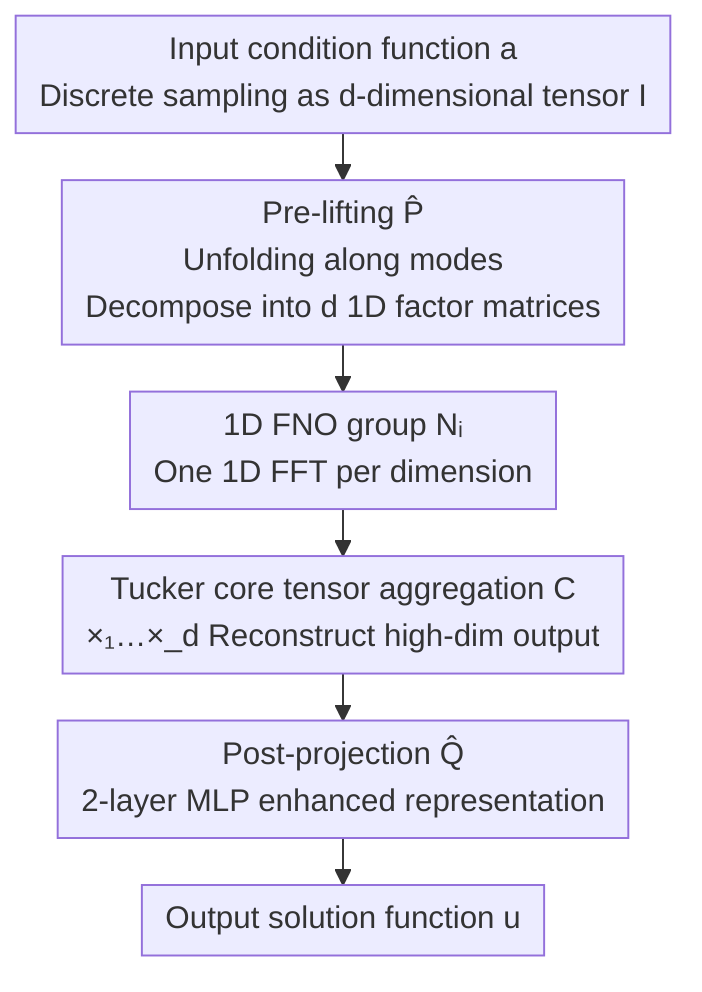

# Tucker-FNO: Tensor Tucker-Fourier Neural Operator and its Universal Approximation Theory

**Conference**: ICLR 2026  
**OpenReview**: [https://openreview.net/forum?id=UJvkXnuozY](https://openreview.net/forum?id=UJvkXnuozY)  
**Code**: https://github.com/GuanchengZhou/Tucker-FNO  
**Area**: Neural Operators / Scientific Computing / PDE Solving / Tensor Decomposition  
**Keywords**: Fourier Neural Operator, Tucker Decomposition, Universal Approximation Theorem, High-dimensional PDEs, Implicit Neural Representation

## TL;DR
This paper employs Tucker tensor decomposition to decompose high-dimensional Fourier Neural Operators (FNO) into a set of 1D FNOs, replacing $d$-dimensional FFTs with $d$ one-dimensional FFTs. This reduces the FFT complexity for 3D PDEs from $O(d_v n^3 \log n^3)$ to $O(3 d_v n \log n)$. This work provides the first proof that such tensor-decomposed FNOs still satisfy the Universal Approximation Theorem and achieves both faster and more accurate results in high-dimensional PDEs (Navier-Stokes / Plasticity / Burgers) and image/video signal recovery.

## Background & Motivation

**Background**: Neural Operators (NO) learn mappings from function space to function space, rather than signal-to-signal mappings investigated by traditional neural networks. They are naturally suited for solving PDEs—given a new condition function $a$, the solution function $u$ can be output through a single forward pass, which is significantly faster than numerical solvers like finite element or finite difference methods. Among these, the FNO, which implements non-local integral operators in Fourier space via FFT, is the most efficient representative of this approach.

**Limitations of Prior Work**: The bottleneck of FNO lies in the FFT. For 3D PDEs on an $n\times n\times n$ grid, the complexity of a single Fourier transform reaches $O(d_v n^3 \log n^3)$, becoming computationally prohibitive in higher dimensions. Simultaneously, the high-dimensional convolution weights $R\in\mathbb{C}^{k^d\times d_v\times d_v}$ explode exponentially with dimension, causing FNO to suffer from the curse of dimensionality in high-dimensional PDEs and visual signals (such as INR representations of images/volumetric data).

**Key Challenge**: Existing tensorized FNOs follow two distinct paths with specific trade-offs. T-FNO only decomposes the network weights $R$ to save parameters; however, the FFT remains slow, and weight reconstruction introduces additional computation. D-FNO recognizes that "FFT dominates computation" and decomposes it for speed, but this decomposition breaks the FNO's expressive power (specifically the universal approximation property), leading to decreased accuracy. Thus, a trade-off exists between "reducing FFT complexity" and "maintaining expressive power (universal approximation)."

**Goal**: (1) Truly reduce the complexity of FFT-related computations rather than just saving parameters; (2) Maintain the universal approximation capability of FNO after decomposition and provide a rigorous proof.

**Key Insight**: The authors elevate the recent "functional Tucker decomposition" from the function level to the operator level. Since a continuous multivariate function can be arbitrarily approximated by a Tucker form (core tensor $\mathcal{C}$ $\times$ 1D factor functions for each dimension), the target function $u$ in operator learning can also be decomposed. Consequently, estimating a "high-dimensional operator" is transformed into estimating a "set of 1D operators."

**Core Idea**: Use Tucker decomposition to replace one $d$-dimensional FNO with "$d$ 1D FNOs + one core tensor aggregation." This replaces expensive high-dimensional FFTs with multiple low-cost 1D FFTs. The Stone-Weierstrass theorem is used to extend the universal approximation property from 1D FNOs to the Tucker-FNO.

## Method

### Overall Architecture

Tucker-FNO addresses the issue of "high-dimensional FNOs being too slow." The core logic is: instead of performing a massive high-dimensional FNO on a $d$-dimensional input, the input tensor is decomposed along each mode into $d$ 1D "factor inputs." Each factor is processed by an individual 1D FNO, and finally, a Tucker core tensor aggregates these 1D outputs to reconstruct the high-dimensional solution. Formally, the operator $\mathcal{N}: a\mapsto u$ is defined as:

$$\mathcal{N}(a)(x) := \mathcal{C} \times_1 \mathcal{N}_1(a)(x_{(1)}) \times_2 \cdots \times_d \mathcal{N}_d(a)(x_{(d)})$$

where $\mathcal{C}\in\mathbb{R}^{r_1\times\cdots\times r_d}$ is the core tensor, $(r_1,\dots,r_d)$ are the Tucker ranks, and $\mathcal{N}_i$ is the 1D FNO for the $i$-th dimension. The pipeline is: input function sampling → pre-lifting (extracting $d$ 1D factor matrices) → parallel 1D FNO processing → Tucker core tensor aggregation → post-projection MLP for enhanced representation.

The three contribution points of the method are the pre-lifting, the 1D FNO group + Tucker aggregation, and the proof of universal approximation for this architecture. Sampling before pre-lifting and the final post-projection serve as architectural supports (post-projection is proved not to affect universal approximation).

### Key Designs

**1. Operator-level Tucker decomposition: Replacing one $d$-dim FNO with $d$ 1D FNOs**

This step directly targets the bottleneck of "expensive high-dim FFTs." The starting point is a function approximation theorem (Theorem 1): for any continuous function $f$ defined on a compact set $\Omega=[s_1,t_1]\times\cdots\times[s_d,t_d]$ and any $\epsilon>0$, there exists a core tensor $\mathcal{C}$ and 1D continuous functions $g_i$ for each dimension such that:

$$\sup_{x\in\Omega}\left|f(x) - \mathcal{C}\times_1 g_1(x_{(1)})\times_2\cdots\times_d g_d(x_{(d)})\right| < \epsilon$$

In other words, the target solution $u(x)\approx \mathcal{C}\times_1 g_1(x_{(1)})\times_2\cdots\times_d g_d(x_{(d)})$. Thus, "estimating an operator on $u$" becomes "estimating operators on each dimension factor $g_i$." Implementing each $g_i$ with a 1D FNO $\mathcal{N}_i$ (the standard FNO layer in Eq. (5)) decomposes the high-dimensional FNO. The key benefit is that the complexity of a $d$-dim FFT $O(d_v d n^d\log n)$ is reduced to $d$ 1D FFTs, with total complexity $O(d_v d n\log n)$—dropping from $n^3\log n^3$ to $n\log n$ for 3D PDEs. This fundamentally differs from T-FNO: T-FNO decomposes network weights $R$ (saving parameters but not speeding up FFT), whereas Tucker-FNO decomposes the operator itself (directly cutting FFT computation).

**2. Pre-lifting module: Linearly decomposing high-dim input into 1D factor matrices**

To feed the $d$ 1D FNOs, the $d$-dimensional input tensor $I\in\mathbb{R}^{n_1\times\cdots\times n_d}$ must be decomposed into $d$ 1D factors. Borrowing from D-FNO, the authors use a linear pre-lifting operator $\hat{P}$:

$$\hat{P}(I) := (I_1,\dots,I_d),\quad I_i := \mathrm{unfold}_i(I)\,W_i$$

where $\mathrm{unfold}_i(\cdot)$ flattens the tensor along the $i$-th mode into a matrix, and $W_i\in\mathbb{R}^{\prod_{j\neq i}n_j\times d_v}$ are pre-lifting weights, with $d_v$ as the latent dimension, resulting in $I_i\in\mathbb{R}^{n_i\times d_v}$. Each factor matrix $I_i$ carries partial information of function $a$ along the $i$-th dimension. In discrete implementation, the operator is expressed as $O=\hat{Q}(\mathcal{C}\times_1\mathcal{N}_1(I_1)\times_2\cdots\times_d\mathcal{N}_d(I_d))$, where $\hat{Q}$ is a post-projection MLP. In signal recovery tasks, pre-lifting can be omitted since the input uses decomposable sinusoidal positional encoding.

**3. Universal Approximation Theorem for Tucker-FNO: Theoretical guarantee for expressive power**

Given that D-FNO's decomposition harmed universal approximation, the core contribution is proving that Tucker-FNO remains a universal approximator. The proof proceeds in three levels: first, Theorem 1 at the function level (Stone-Weierstrass theorem indicating high-order polynomials can approximate functions and construct Tucker forms); second, Theorem 2 at the operator level for compact analytic function sets $H$, proving there exist ranks $(r_1,\dots,r_d)$, continuous factor operators $\mathcal{U}_i$, and a core tensor $\mathcal{C}$ such that:

$$\sup_{h\in H}\left\|h(\cdot) - \mathcal{C}\times_1 \mathcal{U}_1 h(\cdot_1)\times_2\cdots\times_d \mathcal{U}_d h(\cdot_d)\right\|_{H^s}\le\epsilon$$

Finally, Theorem 3: approximating the factor operators $\mathcal{U}_i$ with 1D FNOs (using the classic FNO universal approximation Lemma 2) proves that for any continuous operator $\mathcal{G}$, there exists a Tucker-FNO $\mathcal{N}$ such that $\sup_{f\in F}\|\mathcal{G}(f)-\mathcal{N}(f)\|_{H^s}\le\epsilon$. This is the first universal approximation result for tensor-decomposed neural operators.

### Loss & Training
For PDE tasks: 500 epochs, batch size 20, Adam optimizer (lr=0.001), latent dimension $d_v=32$, Tucker rank equal to $d_v$, Fourier frequency cutoff $k_{\max}=(12,12,\dots)$, depth of 4 for NO-type methods, and a 2-layer MLP for post-projection $\hat{Q}$. In signal recovery: each 1D factor mapping uses a DNN (1 sine-activated lifting layer + 2 FNO layers + linear projection), input is sinusoidal positional encoding with $S=10$, and ranks set to $(r_1,r_2,r_3)=(n_1,n_2,\lfloor n_3/2\rfloor)$.

## Key Experimental Results

### Main Results

PDE approximation tasks (NMSE↓ / VCE↓, lower is better); Tucker-FNO leads across all four configurations:

| Dataset | Metric | FNO | T-FNO | D-FNO | Tucker-FNO |
|--------|------|------|-------|-------|------------|
| Navier-Stokes (T=20) | NMSE | 0.0034 | 0.0035 | 0.0063 | **0.0028** |
| Navier-Stokes (T=30) | NMSE | 0.0072 | 0.0065 | 0.0132 | **0.0061** |
| Plasticity | NMSE | 0.0080 | 0.0079 | 0.0097 | **0.0073** |
| Burger | VCE | 4.45e-5 | 2.97e-5 | 2.86e-5 | **2.01e-5** |

Efficiency comparison (256×256 data): Compared to FNO, Tucker-FNO reduces parameters by ~50% and time per iteration by 48.6%. T-FNO is slower due to weight reconstruction despite saving parameters, while D-FNO is fast but significantly less accurate.

| Method | Parameters | Time/iter (s) |
|------|--------|---------------|
| FNO | 593.7 K | 0.0685 |
| T-FNO | 232.6 K | 0.0746 |
| D-FNO | 307.8 K | 0.0382 |
| Tucker-FNO | 293.5 K | **0.0352** |

Signal recovery (hyperspectral image/video inpainting, PSNR↑): Tucker-FNO significantly outperforms OINR, OINR-FNO, and other models:

| Sampling Rate | Metric | LRTFR | OINR | OINR-FNO | Tucker-FNO |
|--------|------|-------|------|----------|------------|
| 0.1 | PSNR | 26.96 | 23.32 | 24.53 | **28.09** |
| 0.15 | PSNR | 28.75 | 24.04 | 25.02 | **29.57** |
| 0.2 | PSNR | 30.22 | 25.17 | 26.27 | **31.17** |

On a 1024×1024×31 task, Tucker-FNO reduced parameters from 1.06M to 553K and time/iter from 0.2322 to 0.0963 (~2.4× speedup) vs. OINR-FNO.

### Ablation Study

Investigation of latent dimension $d_v$, frequency cut-off $k$, and Tucker rank on the Plasticity equation (NMSE↓):

| Config | Key Metric | Note |
|------|---------|------|
| $d_v=16$ | NMSE 0.0092 | Small $d_v$, insufficient expression |
| $d_v=32$ | NMSE 0.0073~0.0074 | Default config, high cost-performance |
| $d_v=64$ | NMSE 0.0062~0.0068 | Further increases yield minor gains |
| Rank 16 → 32 → 64 | NMSE Decreasing | Higher rank improves accuracy with diminishing returns |

### Key Findings
- In regions with sharp numerical changes (e.g., vortices in Navier-Stokes, shock waves in Burgers), Tucker-FNO's error maps are cleaner, indicating that 1D decomposition does not lose the ability to capture high-frequency/rapid structures.
- Increasing $d_v$ and rank improves accuracy; however, $d_v=32$ and rank=$d_v$ represents the efficiency sweet spot. Excessively large ranks cause aggregation overhead $O(\hat{r}d_v n^d)$ to dominate.
- The fact that "decomposition improves accuracy" is counter-intuitive: whereas D-FNO lost accuracy, Tucker-FNO's 1D structure acts as an implicit regularizer, making it more accurate than the original FNO in most cases.

## Highlights & Insights
- **Elevating tensor decomposition from "weight decomposition" to "operator decomposition"**: This is the fundamental difference from T-FNO. Decomposing weights only saves parameters without speeding up FFT; decomposing operators targets the actual FFT bottleneck.
- **Three-level universal approximation proof**: Transitioning from function level (Stone-Weierstrass) → operator level (Tucker operator decomposition) → FNO level (leveraging classic FNO results) provides a clean theoretical guarantee.
- **Seamless migration to INR signal recovery**: Because sinusoidal positional encoding is naturally separable, Tucker-FNO eliminates pre-lifting in recovery tasks, generalizing to image/video/volumetric data with zero modifications.

## Limitations & Future Work
- The universal approximation theorem requires the target function set to be analytic on $\mathbb{T}^d$ with $s>d/2$. Theoretical guarantees for non-smooth or strongly discontinuous solutions (e.g., PDEs with sharp discontinuities) are not fully discussed.
- Aggregation complexity $O(\hat{r}d_v n^d)$ can exceed FFT savings if the rank is very high, implying a narrow window for optimal Tucker rank selection.
- Experiments focused on structured grids and regular domains; the applicability to arbitrary geometries/unstructured grids (like Geo-FNO) using mode-unfolding pre-lifting needs further validation.

## Related Work & Insights
- **vs FNO**: FNO uses $d$-dim FFT ($O(d_v n^d\log n)$); Tucker-FNO uses $d$ 1D FFTs ($O(d_v d n\log n)$), halving parameters and time while slightly increasing accuracy.
- **vs T-FNO**: T-FNO decomposes weights $R$ to save parameters, but is slower due to unchanged FFT and weight reconstruction overhead.
- **vs D-FNO**: Both target FFT costs, but D-FNO breaks universal approximation. Tucker-FNO maintains it, providing higher speed and accuracy.
- **vs OINR / OINR-FNO**: For NO-based INR, Tucker-FNO is both faster and more accurate via compact Tucker decomposition (~2.4× speedup on large signals).

## Rating
- Novelty: ⭐⭐⭐⭐⭐ First elevation of functional tensor decomposition to the operator level and first proof of universal approximation for tensor-decomposed NOs.
- Experimental Thoroughness: ⭐⭐⭐⭐ Covers 3 PDEs + multiple signal recovery tasks with efficiency/accuracy comparisons and complete ablations; however, mostly limited to regular grids.
- Writing Quality: ⭐⭐⭐⭐ Clear theoretical derivation with well-defined motivation against T-FNO/D-FNO.
- Value: ⭐⭐⭐⭐⭐ Provides a fast, theoretically guaranteed paradigm for high-dimensional FNOs that transfers easily to INR.

<!-- RELATED:START -->

## Related Papers

- [\[ICLR 2026\] KANO: Kolmogorov–Arnold Neural Operator](kano_kolmogorov-arnold_neural_operator.md)
- [\[CVPR 2025\] DiffFNO: Diffusion Fourier Neural Operator](../../CVPR2025/physics/difffno_diffusion_fourier_neural_operator.md)
- [\[ICLR 2026\] Towards a Transferable Acceleration Method for Density Functional Theory](towards_a_transferable_acceleration_method_for_density_functional_theory.md)
- [\[ICLR 2026\] DRIFT-Net: A Spectral--Coupled Neural Operator for PDEs Learning](drift-net_a_spectral--coupled_neural_operator_for_pdes_learning.md)
- [\[ICLR 2026\] Orbital Transformers for Predicting Wavefunctions in Time-Dependent Density Functional Theory](orbital_transformers_for_predicting_wavefunctions_in_time-dependent_density_func.md)

<!-- RELATED:END -->
