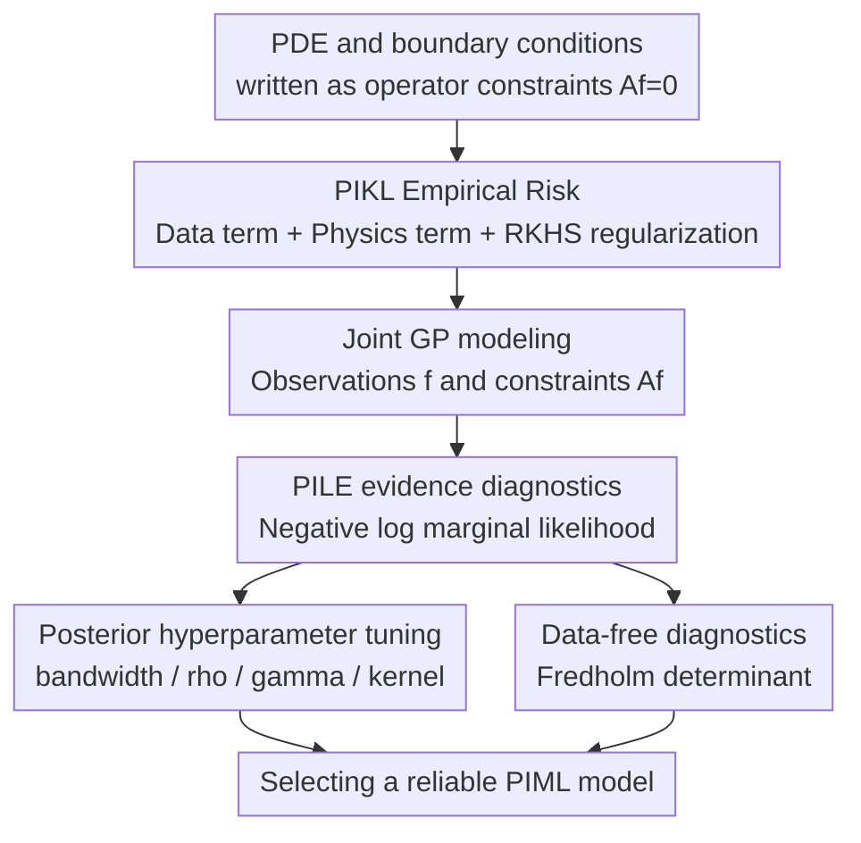

# Uncertainty-Aware Diagnostics for Physics-Informed Machine Learning

**Conference**: ICLR2026  
**OpenReview**: [https://openreview.net/forum?id=7PORoDlSS4](https://openreview.net/forum?id=7PORoDlSS4)  
**Code**: None  
**Area**: Physics-Informed Machine Learning / Uncertainty Quantification  
**Keywords**: Physics-Informed Machine Learning, Gaussian Process, Model Diagnostics, PILE, PDE Solving  

## TL;DR
This paper proposes Physics-Informed Log Evidence (PILE) within the Gaussian Process framework of physics-informed kernel learning. It uses a marginal likelihood index with an uncertainty interpretation to uniformly diagnose data fitting, physical constraints, and kernel/regularization hyperparameter selection, avoiding the multi-objective tuning ambiguity common in PIML.

## Background & Motivation
**Background**: The core goal of physics-informed machine learning (PIML) is to incorporate both observational data and physical equation constraints into model training. PINNs, Neural ODEs, Neural Operators, and physics-informed kernel learning fall into this category: the model must both fit observation points and minimize PDE residuals, boundary conditions, or conservation law violations.

**Limitations of Prior Work**: While intuitive, the training objective is inherently multi-objective. Data error, physical residual, and RKHS/network regularization terms typically have individual weights. A model might perform well on test data while distorting physical constraints, or over-smooth to minimize PDE residuals, failing to recover the true solution. In scientific computing, validation data is often scarce, making it difficult to judge model reliability solely by test loss or residual loss.

**Key Challenge**: The root problem is that "model quality" in PIML cannot be described by a single error metric. Physical constraints can be treated as regularizers, but there is no natural answer for their weights. When equations, boundary conditions, or model families are mismatched, observing data loss or physics loss in isolation can yield misleading signals. The authors argue this ambiguity arises because epistemic uncertainty is not included in diagnostics: if a model is unsuitable for certain solutions or PDE constraints, it should be penalized at the evidence level, rather than just compared at a posterior point estimate.

**Goal**: The paper restricts the problem to the analytical setting of Physics-Informed Kernel Learning (PIKL) to study a unified model selection principle for PIML. Specifically, the authors want this principle to select kernel bandwidth, data/physics regularization weights, and even determine if a kernel is suitable for a given PDE before data is collected.

**Key Insight**: Gaussian Process (GP) inherently provides marginal likelihood and posterior variance, making it natural to integrate fitting quality and uncertainty into a single probabilistic model. The authors re-interpret the kernel ridge regression objective of PIKL as a GP posterior mean and use the marginal likelihood encompassing both data and physical observations as a diagnostic metric.

**Core Idea**: Replace manually balanced data/physics losses with the negative log marginal likelihood of a physics-informed GP (PILE), converting PIML model selection into a single-index "higher evidence is better" problem.

## Method

### Overall Architecture
The method targets linear PDEs or physics-informed learning tasks with linear boundary conditions. The authors first write PDE constraints in a unified operator form $Af=0$, then model function value observations $f(x_i)$ and physical constraint observations $Af(z_j)$ simultaneously within an RKHS/GP framework. Finally, the PILE score is defined using the negative log marginal likelihood of this joint GP. In practice, researchers do not need to manually select Pareto points between data and physics errors; instead, they minimize PILE directly over kernel, bandwidth, and regularization weights.

Specifically, the paper considers general linear differential operators $D$ and boundary operators $B_i$. Dirichlet, Neumann, Robin, and Cauchy boundary conditions can be merged into a single operator $A$, with physical error expressed as $\|Af\|^2_{L^2}$. This integral is then approximated using a set of quadrature points $z_j$, converting continuous PDE residuals into finite-dimensional physical observations.

Post finite-dimensional approximation, the physics-informed kernel ridge regression objective consists of three parts: observational data error, physical constraint error, and RKHS regularization. Three temperature/regularization parameters $\gamma,\rho,\eta$ control data noise, physics noise, and the function prior scale, respectively. The key transition is that this optimization problem can be solved via the representer theorem and interpreted as a GP posterior mean; thus, model selection shifts from "minimizing losses" to "finding the GP prior with the highest evidence for observations and physical constraints."

### Key Designs
**1. GP interpretation of PIKL: Treating physical residuals as noisy observations**

Traditional PIML usually treats PDE residuals as a soft penalty term, making the physics weight an empirical tuning parameter. This work reframes this as a probabilistic model: let $(f,g)$ follow a joint GP derived from the kernel and operator $A$, where $g=Af$. Data points satisfy $y_i\mid f(x_i)\sim N(f(x_i), 1/(2\gamma))$, and physical/boundary constraint points satisfy $r_j\mid g(z_j)\sim N(g(z_j), 1/(2\rho w_j))$. To enforce $Af=0$, $r_j=0$ is set; if noisy boundary or forcing function observations exist, $r_j$ can be non-zero.

The advantage of this design is that it does not hard-code "physical constraints" as an uninterpretable regularization term, but explains them as another class of observations. Data noise, physical constraint noise, and prior scale are controlled by $\gamma,\rho,\eta$. The posterior mean corresponds to the PIKL kernel ridge regression solution, and the posterior covariance provides epistemic uncertainty. Thus, the same framework handles prediction and assesses whether the model has sufficient evidence for the current PDE and observation pattern.

**2. PILE score: Unifying data fitting and physical consistency via marginal likelihood**

PILE is defined from the Bayes free energy of this physics-informed GP. Let $\tilde{Y}=(y_1,\ldots,y_n,r_1,\ldots,r_m)^\top$ and let $\Sigma_{m,n}$ be the joint covariance matrix. The paper defines:

$$
P_{m,n}=\frac{1}{m+n}\tilde{Y}^\top\Sigma_{m,n}^{-1}\tilde{Y}+\frac{1}{m+n}\log\det\Sigma_{m,n}+\log(2\pi\eta).
$$

A lower score is better. The first term measures how easily observations and constraints can be explained under the current model, while the second term penalizes overly complex models or unsuitable uncertainty structures via $\log\det$. It is not a simple weighted sum of data and physics losses; it considers fitting error, model complexity, and uncertainty calibration simultaneously. Parameters $\rho$ or $\gamma$ that are too small cause the model to over-rely on noisy observations, causing PILE to diverge; bandwidths that are too large cause over-smoothing, decreasing evidence.

This explains why PILE serves as a hyperparameter selection criterion. When performing grid search or optimization on bandwidth, kernel family, $\rho$, $\gamma$, and $\eta$, minimizing PILE is equivalent to empirical Bayes. It provides an actionable single-value selection principle compared to manually inspecting the Pareto front.

**3. Data-free PILE: Judging kernel-PDE suitability via Fredholm determinant before sampling**

The most interesting part is the data-free scenario. If no function observations exist and only $Af=0$ with $r_j=0$ is considered, the quadratic term in PILE disappears, leaving only the covariance determinant. As the number of quadrature points $m\to\infty$, the normalized PILE converges to a Fredholm determinant:

$$
P_0=\log\det(I+G),
$$

where $G$ is the integral operator induced by $(A\otimes A)k$. Intuitively, this measures "how difficult it is for the RKHS of the current kernel to satisfy the PDE constraint." If the isotropy, smoothness, or directionality of a kernel does not match the geometry of the PDE solution, the model might fail to balance physical and data errors even after data is collected. Data-free PILE exposes this mismatch before sampling.

**4. Failure diagnostics rather than just reporting the optimum: PILE can indicate model family mismatch**

Many model selection metrics only select a relative optimum among candidates. However, the real risk in PIML is that all candidates are unreliable. This work emphasizes PILE's diagnostic properties. For instance, in advection equation experiments, isotropic RBF kernels require small bandwidths for data error, but physical errors explode in the same region. No bandwidth satisfies both. PILE's selection of an over-smoothed, near-zero solution in this case is not "finding a good model" but indicating at the evidence level that the kernel family is unsuitable.

## Loss & Training
In terms of training, this work does not propose new neural network training algorithms but focuses on the analytical solution of PIKL/KRR and GP evidence evaluation. The finite-dimensional empirical risk is:

$$
L_{m,n}(f)=\frac{1}{\gamma n}\sum_{i=1}^n(f(x_i)-y_i)^2+\frac{1}{\rho}\sum_{j=1}^m w_j(Af(z_j))^2+\frac{1}{\eta}\|f\|_{H}^{2}.
$$

Assuming kernel differentiability and bounded operator coefficients, the representer theorem ensures the optimal solution lies in the finite-dimensional space spanned by $\{k(\cdot,x_i)\}$ and $\{(Id\otimes A)k(\cdot,z_j)\}$, allowing the coefficients to be solved via linear algebra. PILE computation requires $\Sigma_{m,n}^{-1}$ and $\log\det\Sigma_{m,n}$, typically involving cubic complexity; the authors suggest using existing marginal likelihood/determinant estimation methods for larger scales.

## Key Experimental Results

### Main Results
The paper validates PILE through two case studies: automatic hyperparameter selection for a 2D Poisson equation and model family failure diagnostics/anisotropic kernel selection in an advection PDE.

| Experimental Task | Candidate/Tuning Target | PILE Selection Result | Data Error Trend | Physics Error Trend | Conclusion |
|--------|------|------|------|------|------|
| Poisson Eq + Dirichlet Boundary | RBF bandwidth $h$ | Minimum at $h\approx0.35$ | Lower than over-smoothed regions | Lower than under-smoothed regions | PILE found a compromise between data and physics error |
| Poisson Eq Subsequent Tuning | $\rho$, $\gamma$ | Small noise parameters penalized | Worse when overfitting | Worse when overfitting | PILE identifies irrational confidence under noisy observations |
| Advection PDE + Isotropic RBF | bandwidth $h$ | Selects over-smoothed near-zero solution | Better at small $h$ | Explodes in small $h$ region | Kernel family mismatch, not just bad tuning |
| Advection PDE + Anisotropic RBF | Angle $\theta$, Scale $s$, bandwidth | Data-free PILE selects $\theta^*\approx1.41, s^*\approx0.50$ | Significant improvement | Significant improvement | Fredholm determinant identifies better kernels before sampling |

### Ablation Study
There are no traditional neural network module ablations, but clear diagnostic comparisons:

| Configuration | Key Indicator/Phenomenon | Explanation |
|------|---------|------|
| Only Data Error | May favor under-smoothing; small bandwidth is tempting | Cannot guarantee PDE residual generalization |
| Only Physics Error | May favor over-smoothing or near-zero solutions | Cannot guarantee fitting of observational data |
| PILE + RBF Bandwidth | Selects $h$ balancing both errors in Poisson | Marginal likelihood provides single-index compromise |
| Isotropic RBF + Advection PDE | Low error regions for data and physics are disjoint | PILE diagnoses model family failure |
| Anisotropic RBF + Data-free PILE | Improvements after $\theta^*\approx1.41, s^*\approx0.50$ | Directionality matches PDE propagation structure |

### Key Findings
- The value of PILE extends beyond tuning; it integrates data loss, physics loss, model complexity, and uncertainty calibration into one evidence metric.
- On the Poisson equation, selecting bandwidth, physical regularization, and data regularization sequentially using PILE avoids under-smoothing, over-smoothing, and overconfidence in noise.
- On the advection PDE, the failure of standard isotropic RBFs is not solvable by simple tuning; PILE exposes the lack of suitable solutions by selecting a near-zero solution.
- Data-free PILE/Fredholm determinant allows comparing kernels and PDE operators without observations, attractive for model selection before expensive experiments.

## Highlights & Insights
- **Interpreting PIML tuning as empirical Bayes**: This is more fundamental than adding a validation loss, as scientific ML often lacks validation data, whereas marginal likelihood penalizes overfitting and inappropriate priors from an evidence perspective.
- **PILE diagnoses failure rather than masking it**: Selecting a near-zero solution in the advection PDE seems counter-intuitive but honestly reflects that isotropic RBFs cannot satisfy both constraints.
- **Novel role of Fredholm determinant**: Comparing kernel-PDE compatibility a priori connects operator structure, kernel methods, and Bayesian evidence.
- **Uncertainty as a diagnostic tool**: Many UQ works only provide confidence intervals post-training; this work uses uncertainty for model selection, which is closer to the reliability judgment needed in scientific modeling.

## Limitations & Future Work
- Current theory and experiments primarily cover linear differential operators and kernel-based PIML; extensions to non-linear PDEs, PINNs, or Neural Operators remain at the level of outlook and approximation.
- PILE computation involves matrix inversion and log determinants, posing computational challenges for large-scale quadrature points or high-dimensional PDEs.
- Case studies are relatively small (Poisson and Advection); verification in complex geometries, mixed boundary conditions, and high-dimensional space-time systems is needed.
- Data-free PILE is suitable for early kernel selection, but joint optimization with active sampling and mesh selection remains an open problem.

## Related Work & Insights
- **vs PINN**: PINNs usually treat PDE residuals as part of a loss function and require manual weighting; this work provides evidence-based weights and selection principles within a kernel/GP framework.
- **vs PIKL**: PIKL incorporates PDE constraints into kernel methods; the increment here is providing the PILE diagnostic metric, making PIKL a diagnosable model selection framework.
- **vs Standard GP Marginal Likelihood**: Standard GP evidence only explains function value observations; PILE incorporates $Af$ constraints into the joint covariance.
- **vs Classical Numerical PDE Error Estimation**: Classical solvers have a posteriori error estimates; PIML lacks such tools. PILE provides a statistical diagnostic score as a first step toward PIML reliability assessment.

## Rating
- Novelty: ⭐⭐⭐⭐☆ Using PILE/Fredholm determinant to unify PIML diagnosis is distinctive.
- Experimental Thoroughness: ⭐⭐⭐☆☆ Case studies are targeted but limited in scale and task diversity.
- Writing Quality: ⭐⭐⭐⭐☆ The derivation chain is complete, and examples intuitively demonstrate the diagnostic effect.
- Value: ⭐⭐⭐⭐☆ Highly enlightening for model selection and reliability diagnostics in physics-informed ML.

<!-- RELATED:START -->

## Related Papers

- [\[NeurIPS 2025\] Physics-Guided Machine Learning for Uncertainty Quantification in Turbulence Models](../../NeurIPS2025/physics/physics-guided_machine_learning_for_uncertainty_quantification_in_turbulence_mod.md)
- [\[ICLR 2026\] Iterative Training of Physics-Informed Neural Networks with Fourier-enhanced Features](iterative_training_of_physics-informed_neural_networks_with_fourier-enhanced_fea.md)
- [\[ICLR 2026\] Fast training of accurate physics-informed neural networks without gradient descent](fast_training_of_accurate_physics-informed_neural_networks_without_gradient_desc.md)
- [\[ICLR 2026\] SAQ: Stabilizer-Aware Quantum Error Correction Decoder](saq_stabilizer-aware_quantum_error_correction_decoder.md)
- [\[AAAI 2026\] PIMRL: Physics-Informed Multi-Scale Recurrent Learning for Burst-Sampled Spatiotemporal Dynamics](../../AAAI2026/physics/pimrl_physics-informed_multi-scale_recurrent_learning_for_burst-sampled_spatiote.md)

<!-- RELATED:END -->
