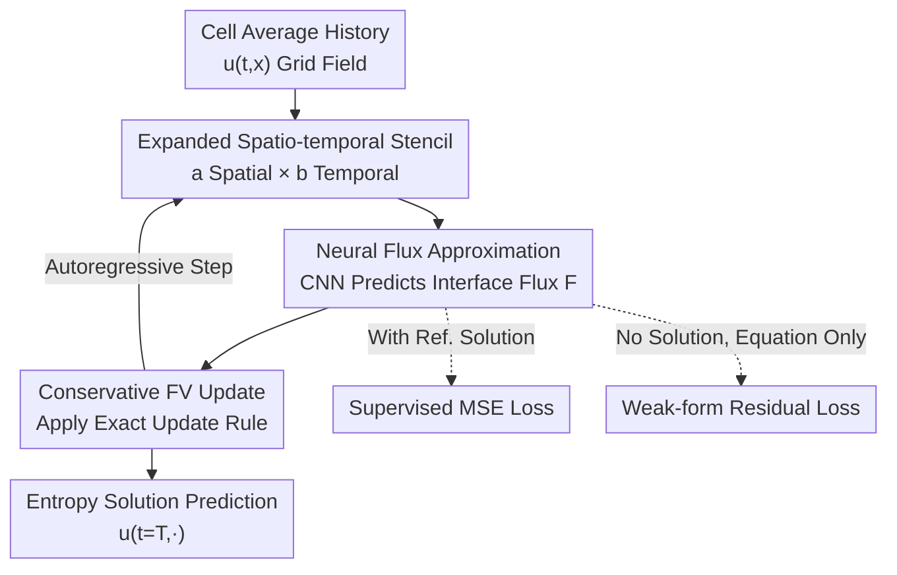

# (U)NFV: (Un)supervised Neural Finite Volume Methods for Solving Hyperbolic PDEs

**Conference**: ICLR 2026  
**OpenReview**: [https://openreview.net/forum?id=AhtDnPyfOE](https://openreview.net/forum?id=AhtDnPyfOE)  
**Code**: https://nathanlichtle.com/research/nfv  
**Area**: Neural PDE Solvers / Scientific Computing  
**Keywords**: Hyperbolic conservation laws, Finite Volume Method, Neural Operators, Weak-form residual, Traffic flow modeling

## TL;DR
This work replaces the "hand-designed numerical flux" in the classic Finite Volume (FV) method with a lightweight CNN. By preserving the conservative update structure of FV, it learns flux approximations across larger spatio-temporal stencils. It supports both supervised training (NFV) and unsupervised training via weak-form residuals (UNFV). On 1D hyperbolic conservation laws, the error is up to 10x lower than the Godunov scheme, approaching Discontinuous Galerkin (DG) performance while maintaining the implementation complexity of standard FV.

## Background & Motivation

**Background**: Hyperbolic partial differential equations (PDEs)—specifically conservation laws $\partial_t u + \partial_x f(u) = 0$—are fundamental models in fluid mechanics and traffic flow. Their solutions spontaneously generate shocks and discontinuities; even with smooth initial conditions, classic strong solutions fail after finite time, requiring dependence on weak solutions. The mainstream engineering approach is the Finite Volume Method (FV), which averages conserved quantities over grid cells and advances them via interface numerical fluxes $\hat F^n_{i+1/2}$, naturally guaranteeing conservation.

**Limitations of Prior Work**: Classical FV involves multiple trade-offs between accuracy, computational cost, stencil size, and implementation complexity. First-order schemes (Godunov, Lax-Friedrichs) are robust but exhibit severe numerical dissipation, smearing shocks. High-order schemes (ENO/WENO) and Discontinuous Galerkin (DG) methods offer high accuracy but require meticulous design of flux reconstruction, quadrature rules, and stabilization strategies, imposing heavy implementation and tuning burdens. Designing analytical schemes for "larger spatio-temporal stencils" manually leads to exponential complexity relative to the stencil dimension.

**Key Challenge**: Conversely, pure data-driven neural methods (FNO, DeepONet, PINN) are flexible but often discard physical structures like conservation laws and entropy conditions. PINNs particularly struggle with hyperbolic PDEs, showing unstable optimization and failure to converge when capturing discontinuities. Consequently, it is difficult to combine the "physical structure of FV" with the "flexibility of neural networks."

**Goal**: Construct a solver that preserves the conservative structure of FV while leveraging the expressiveness of neural networks to break the bottleneck of manual stencil design, allowing flexible training based on data availability.

**Key Insight**: The authors observe that the only "difficult to design" component in the FV framework is the numerical flux function $\hat F$, whereas the update rule $u^{n+1}_i = u^n_i - \frac{\Delta t}{\Delta x}(\hat F^n_{i+1/2} - \hat F^n_{i-1/2})$ is an exact identity that naturally ensures conservation. By allowing a neural network to approximate this flux while keeping the rest of the FV structure intact, neural flexibility can be injected without breaking conservation.

**Core Idea**: Replace the manual numerical flux of FV with a CNN, allowing it to learn flux approximations from larger spatio-temporal stencils, and integrate it back into the classic FV update. Train with MSE for supervised scenarios or weak-form residual loss for unsupervised approximation of entropy solutions.

## Method

### Overall Architecture
The input to NFV (Neural Finite Volume) is the history of cell averages of a conservation law over a grid section, and the output is the solution field advanced step-by-step. It does not reinvent the solver but replaces only the "hard-to-design" part of the FV process—the numerical flux. Specifically, $\text{NFV}^b_a$ is defined as a generalization of $\text{FV}^b_a$: at interface $i+1/2$, a rectangular stencil $U^n_{i+1/2}(a,b)$ of $a$ adjacent spatial cells $\times$ $b$ historical time steps is taken. A neural network $N$ directly predicts the interface numerical flux $\hat F^n_{i\pm 1/2} = N(U^n_{i\pm 1/2}(a,b))$, which is then substituted into the classic FV update rule (3). Because the "inflow of one cell is the outflow of the neighbor" structure is preserved, mass conservation is **constructively** guaranteed rather than forced by loss constraints. The progression is autoregressive: once trained, each time step requires only one forward pass, avoiding optimization problems at inference time; the cost of solving an equation grows linearly with the number of time steps.

The network itself is a lightweight 2D CNN applied at each cell interface: the first layer uses a convolution kernel of width $a$ covering the spatial dimension with $b$ input channels (one per historical slice), followed by 5 layers of $1\times1$ convolutions (15 channels, ELU or ReLU). Total parameters are $1105 + 16(ab+1)$—even the largest $\text{NFV}^{11}_{10}$ (11 spatial cells $\times$ 11 history steps) has only a few thousand parameters. The same architecture supports two training objectives: supervised MSE (NFV) when data is available, and weak-form residual loss (UNFV) to approximate entropy solutions when data is absent.

### Key Designs

**1. Entrusting Numerical Flux to NN while Retaining FV Structure: Conservation Guaranteed by Construction**

The difficulties in classic FV are concentrated in "how to approximate the interface numerical flux," whereas the update rule (3) is exact and inherently conservative. Ours replaces only the flux term with a neural network $\hat F^n_{i\pm1/2} = N(U^n_{i\pm1/2}(a,b))$, leaving the update rule unchanged. The immediate benefit is that because adjacent cells share the same interface flux (one's outflow is the other's inflow), the total mass is strictly conserved during updates without needing to encode conservation into the loss as in PINNs. The physical structure (conservation, additive boundary conditions) is locked into the framework, and the network is only responsible for "learning accurate fluxes within the compliant framework." Furthermore, as it only learns the flux, memory usage is comparable to Godunov and much lower than DG. Boundary conditions (Dirichlet / Neumann / Open) can be applied precisely using ghost cells or specified interface fluxes as in classic FV without modifying the network.

**2. Expanding Spatio-temporal Stencils with $\text{NFV}^b_a$ + Lightweight CNN: Breaking Manual Design Bottlenecks**

Most FV methods in the literature use only a single time step ($b=1$) and very few spatial cells because the complexity of designing analytical schemes for larger stencils grows exponentially—Godunov belongs to $\text{FV}^1_2$. This work generalizes the stencil to any $a\times b$ (experiments cover $\text{NFV}^1_2$ up to $\text{NFV}^{11}_{10}$), allowing the network to utilize more spatial neighbors and historical info to construct more accurate fluxes. This approximation is handled by a 2D CNN applied at each interface: the spatial kernel width $a$ in the first layer and $b$ temporal channels, followed by 5 layers of $1\times1$ convolutions. Parameters are $1105+16(ab+1)$, totaling only a few thousand even for large models. The vectorization of CNNs naturally fits "calculating fluxes across all interfaces in parallel," making single-step advancement an inexpensive forward pass even with large stencils. In other words, the neural network transforms the "higher accuracy from larger stencils" design challenge into a pure training cost—and training on one equation typically converges within fifteen minutes.

**3. Supervised MSE vs. Unsupervised Weak-form Residual Loss: Switching by Data Availability while Converging to Entropy Solutions**

The availability of two objectives determines the application boundaries. The supervised NFV minimizes standard MSE $L_s = \mathbb{E}_{u_0\sim R}\|u-\hat u\|_2^2$ when reference solutions (e.g., analytical solutions to Riemann problems) are available; it can even be used when the PDE is unknown but observation data is present, applying only basic physical constraints like mass conservation. The unsupervised UNFV targets hyperbolic PDEs where closed-form solutions are rare and strong solutions may not exist: it minimizes weak-form residuals rather than relying on reference solutions. Crucially, weak solutions are not unique—multiple functions can satisfy the equation, but only one is the physically relevant entropy solution. The UNFV loss independently optimizes the squared weak-form residual per time step, using a family of 250 compactly supported, 50th-degree random polynomials $\phi\in\Phi$ as test functions:

$$L_w = \mathbb{E}_{\substack{\phi\in\Phi\\ u_0\sim R}}\!\left[\left(\sum_{n}\sum_{i}\Big((\Delta t)^{-1}(\hat u^n_i-\hat u^{n-1}_i)\!\int_{I_i}\!\phi + f(\hat u^n_i)[\phi]_{x_{i-1/2}}^{x_{i+1/2}}\Big)\right)^2\right]$$

Thanks to integration by parts for scalar conservation laws, the weak form eliminates spatial derivatives from the loss and hands temporal derivatives to the finite difference in the FV update. No explicit spatial derivatives of the original variables are needed during training—addressing a major pain point where PINN optimization fails at discontinuities. Although minimizing weak residuals theoretically does not guarantee convergence to the entropy solution, authors empirically demonstrate stable convergence across various equations and trials.

## Key Experimental Results

Experiments address four questions: Is (U)NFV worth replacing classic FV? Does UNFV truly converge to entropy solutions? How does it compare to more complex finite elements (DG)? Can it work on noisy, non-strictly conservative real-world data? Testing includes 6 LWR traffic flow models (Greenshields, Triangular, Trapezoidal, Greenberg, Underwood, etc.) and the inviscid Burgers equation. Training uses only single-discontinuity Riemann problems; evaluation uses hundreds of complex initial conditions with ten discontinuities and multiple shock/rarefaction interactions. Exact solutions are computed via the Lax-Hopf algorithm on a finer grid.

### Main Results

$L_2$ errors (selected) for the minimal configuration $\text{NFV}^1_2$ / $\text{UNFV}^1_2$ (same stencil as Godunov) on 1000 piecewise-constant initial conditions:

| Equation | Godunov | WENO | NFV$^1_2$ | UNFV$^1_2$ | DG |
|------|---------|------|-----------|------------|-----|
| Greenshields | 4.5e−4 | 6.4e−4 | 1.3e−4 | 2.0e−4 | 3.1e−5 |
| Triangular 1 | 2.3e−3 | 1.9e−3 | 1.4e−3 | 1.9e−3 | 2.6e−4 |
| Burgers | 1.9e−3 | 1.0e−4 | 8.5e−4 | 1.3e−3 | 4.1e−4 |

Minimal models consistently outperform all first-order FV and exceed ENO/WENO on about half the equations; DG (finite element) is most accurate but heaviest in implementation/computation. Enlarging the stencil to $\text{NFV}^5_4$ further approaches DG while implementation complexity remains the same as $\text{NFV}^1_2$:

| Equation | Godunov | WENO | NFV$^1_2$ | NFV$^5_4$ | DG |
|------|---------|------|-----------|-----------|-----|
| Burgers | 1.8e−3 | 2.6e−3 | 8.3e−4 | 2.2e−4 | 1.0e−4 |
| Greenshields | 4.1e−4 | 6.9e−4 | 1.2e−4 | 4.6e−5 | 4.2e−5 |
| Triangular | 2.2e−3 | 2.0e−3 | 1.3e−3 | 2.9e−4 | 2.7e−4 |

$\text{NFV}^5_4$ achieves up to a 10x (one order of magnitude) error reduction compared to Godunov/WENO, approaching DG accuracy. Training typically completes within 15 minutes, inference is faster, and memory is on par with Godunov.

### Ablation Study

| Configuration | Key Finding | Description |
|------|---------|------|
| Grid Refinement (Fig.5) | $\text{NFV}^1_2$/$\text{UNFV}^1_2$ errors are consistently lower than the proven Godunov at all discretizations | Log-log plots are nearly linear, suggesting polynomial convergence rates and convergence to entropy solutions. |
| CFL Ratio Sweep (Table 3) | NFV$^1_2$ maintains lower mean error and significantly smaller variance across CFL 0.2–1.2 | DG is optimal only at tiny CFL and fails for CFL $\ge$ 0.4; NFV remains stable. |
| Stencil Size (Table 4, Real Data) | $L_1$/$L_2$/Relative error improves monotonically with $a\times b$ | NFV$^1_2$ < NFV$^5_4$ < NFV$^{11}_{10}$; largest model Rel. 0.283 vs. best calibrated Godunov 0.374. |
| Real Highway Data Generalization (Table 5) | $\text{NFV}^{11}_{10}$ $L_2$ 0.022 vs Godunov 0.037 on 7 days of unseen I-24 data | Even though traffic data isn't strictly conservative (on/off-ramps), conservation remains an effective inductive bias. |

### Key Findings
- Training only on analytically solvable single-discontinuity Riemann problems generalizes to complex initial conditions with ten discontinuities and shock interactions, even real-world highway density fields.
- UNFV stably converges to entropy solutions without reference data by using weak-form residuals; its error is upper-bounded by Godunov, showing good convergence.
- Accuracy increases with stencil size, but the increment is pure training cost: inference remains a single CNN forward pass, linear with the number of time steps.
- On real I-24 highway data, introducing PDE structures makes training significantly more stable (especially with scarce data), with NFV outperforming all calibrated Godunov fits.

## Highlights & Insights
- **"Change only flux, keep the framework"** is the most elegant insight: difficult-to-guarantee physical properties like conservation and boundary conditions stay in the non-learnable FV structure. The network handles only the component that is hard to design manually, achieving both physical guarantees and neural flexibility, avoiding the fragility of PINNs.
- **Weak-form + Integration by Parts to eliminate spatial derivatives** bypasses the issue of PINNs where calculating derivatives at discontinuities leads to optimization collapse. This is the key to making unsupervised training work on hyperbolic PDEs.
- **Design costs for large stencils are offloaded to training**: Manually designing $\text{FV}^{11}_{10}$ is nearly impossible, but training a CNN for it takes only a few thousand parameters and fifteen minutes. This "learning for design" approach is transferable to any numerical method constrained by structure but hindered by hard-to-design operators.
- The fact that a lightweight model with a few thousand parameters approaches DG accuracy indicates the performance bottleneck is not network capacity, but rather "retaining the correct physical structure + using the right stencil."

## Limitations & Future Work
- Only **1D scalar** conservation laws were verified. Extending to multiple dimensions will introduce new challenges in numerical stability, computational complexity, and variable coupling, noted as future work.
- Evaluation initial conditions are complex but still **piecewise constant**; performance on general smooth or mixed initial conditions is not fully demonstrated.
- UNFV convergence to entropy solutions is **empirical without theoretical proof**; authors admit minimizing weak residuals does not mathematically guarantee convergence to the unique entropy solution.
- Each conservation law requires a **dedicated model** (not operator-style, no cross-equation generalization). However, given the low individual training cost, authors consider this an acceptable trade-off.
- Weak-form loss depends on the choice of test function family (250 polynomials of degree 50); sensitivity and optimal configuration are not deeply analyzed.

## Related Work & Insights
- **vs. Classic FV (Godunov / ENO / WENO)**: These manually design fluxes; stencils are limited by design complexity. Ours uses CNN to learn arbitrary $a\times b$ stencil fluxes with higher accuracy and no increase in implementation burden, at the cost of training per equation.
- **vs. DG (Finite Element)**: DG is most accurate but requires complex reconstruction/quadrature/stabilization, is computationally heavy, and unstable at large CFL. NFV approaches DG accuracy with FV-level simplicity, lower memory, and CFL robustness.
- **vs. Neural Operators (FNO / DeepONet)**: These learn solution mappings mostly on elliptic/parabolic (smooth) problems and lack enforced conservation/entropy. Ours targets non-smooth hyperbolic shocks and guarantees conservation by construction.
- **vs. PINN / wPINN**: PINNs put residuals in the loss, leading to unstable optimization at hyperbolic discontinuities. Ours locks conservation into the FV structure and eliminates spatial derivatives via the weak form, enabling stable unsupervised approximation of entropy solutions.

## Rating
- Novelty: ⭐⭐⭐⭐ The positioning of "learning only flux while keeping FV intact" is clean and powerful, elegantly decoupling physical guarantees from neural flexibility.
- Experimental Thoroughness: ⭐⭐⭐⭐ Seven equation comparisons + three types of ablations (grid/CFL/stencil) + real data generalization; however, limited to 1D scalar and mostly piecewise constant initial values.
- Writing Quality: ⭐⭐⭐⭐ Framework and notation ($\text{NFV}^b_a$, stencil, weak-form loss) are clearly explained with smooth motivational logic.
- Value: ⭐⭐⭐⭐ Provides a convincing argument that NFV can replace FV wherever higher accuracy is needed, with high utility for conservation law modeling like traffic flow.

<!-- RELATED:START -->

## Related Papers

- [\[ICLR 2026\] OrthoSolver: A Neural Proper Orthogonal Decomposition Solver For PDEs](orthosolver_a_neural_proper_orthogonal_decomposition_solver_for_pdes.md)
- [\[ICLR 2026\] Locally Subspace-Informed Neural Operators for Efficient Multiscale PDE Solving](locally_subspace-informed_neural_operators_for_efficient_multiscale_pde_solving.md)
- [\[AAAI 2026\] SAOT: An Enhanced Locality-Aware Spectral Transformer for Solving PDEs](../../AAAI2026/physics/saot_an_enhanced_locality-aware_spectral_transformer_for_solving_pdes.md)
- [\[ICML 2026\] TINNs: Time-Induced Neural Networks for Solving Time-Dependent PDEs](../../ICML2026/physics/tinns_time-induced_neural_networks_for_solving_time-dependent_pdes.md)
- [\[ICLR 2026\] Operator Learning with Domain Decomposition for Geometry Generalization in PDE Solving](operator_learning_with_domain_decomposition_for_geometry_generalization_in_pde_s.md)

<!-- RELATED:END -->
