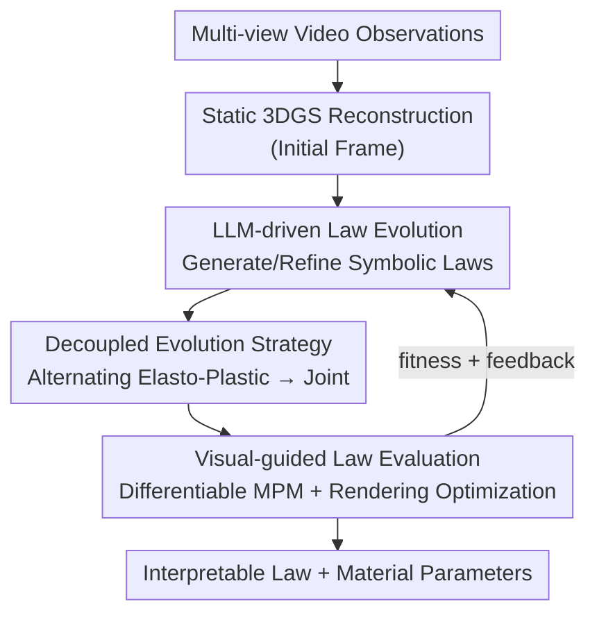

# VisionLaw: Inferring Interpretable Intrinsic Dynamics from Visual Observations via Bilevel Optimization

**Conference**: ICLR 2026  
**OpenReview**: [https://openreview.net/forum?id=eWoUcwEtLt](https://openreview.net/forum?id=eWoUcwEtLt)  
**Code**: https://github.com/JiajingLin/VisionLaw  
**Area**: Physical Simulation / 3D Vision / Constitutive Law Inference  
**Keywords**: Intrinsic Dynamics, Constitutive Law, Bilevel Optimization, LLM Evolution, Differentiable MPM

## TL;DR
VisionLaw models the task of "inferring physical properties from videos" as a bilevel optimization problem—the upper level employs an LLM as a physics expert to evolve **symbolic constitutive laws (Python code)**, while the lower level uses a differentiable MPM simulator to optimize continuous material parameters under visual supervision, returning fitness and feedback. This approach infers both interpretable and generalizable intrinsic dynamics from single-view videos, reducing Chamfer distance on synthetic data from NeuMA's 2.86 to 1.65.

## Background & Motivation
**Background**: Enabling realistic interactive simulation for 3D assets (e.g., responses to pushing/squeezing in VR, embodied AI, or animation) requires knowing their **intrinsic dynamics**—material properties (such as stiffness) and constitutive laws (how materials respond under force). Recent mainstream approaches integrate physical simulators (especially the Material Point Method, MPM) into visual representations like NeRF / 3DGS to "reverse-engineer physics from video." These are categorized into parameter estimation (PAC-NeRF, GIC, PhysDreamer) and constitutive law inference (OmniPhysGS, NeuMA).

**Limitations of Prior Work**: Both approaches face significant hurdles. **Manually predefined constitutive laws** (PAC-NeRF, NCLaw, OmniPhysGS) depend on handcrafted forms or expert-provided sets; however, real-world non-linear behaviors are diverse, and preset forms often fail to match actual dynamics, leading to inaccurate parameter estimation. **Neural constitutive laws** (NeuMA) fit laws directly using neural networks; while flexible, they are "black boxes": ① the learned laws lack interpretability for humans and LLMs; ② they lack physical inductive bias, causing networks to replicate visual observations mechanically rather than modeling underlying dynamics, resulting in overfitting to training views and failure in new scenarios.

**Key Challenge**: There is a trade-off between interpretability/generalization and expressive flexibility—handcrafted laws are interpretable but inflexible, while neural laws are flexible but uninterpretable and prone to overfitting. The root cause is that constitutive laws are essentially **discrete symbolic expressions** (functional forms) plus **continuous parameters** (numerical values), yet existing methods either fix the symbolic part or bury it within neural weights.

**Goal**: To **simultaneously** infer discrete symbolic expressions of constitutive laws and optimize continuous material parameters from multi-view videos, ensuring results are interpretable and generalizable to new scenes.

**Key Insight**: The authors observe that LLMs demonstrate strong symbolic reasoning and rich physical priors in scientific discovery. LLMs can act as "physics experts" to **write constitutive laws**—representing each law as a Python code snippet with explicit physical meaning, preserving symbolic interpretability while leveraging evolutionary search for trial-and-error improvement.

**Core Idea**: A bilevel optimization framework is used to unify "constitutive law evolution" and "visual-guided evaluation": the upper level evolves symbolic laws via LLM (discrete structure search), while the lower level optimizes material parameters under visual supervision using differentiable simulation (continuous parameter optimization), creating a closed-loop mutual drive.

## Method

### Overall Architecture
VisionLaw addresses an inverse problem with dual unknowns: structure and parameters. The constitutive law $\varphi$ (comprising elastic law $\varphi_E$ and plastic law $\varphi_P$) consists of discrete symbolic expressions, while material parameters $\theta$ are continuous values. This is formulated as a bilevel optimization objective:

$$\min_{\varphi,\Theta}\; \mathcal{L}\big(R(\varphi,\Theta,\theta^*;\Phi,G),\,V\big),\quad \text{s.t.}\; h(\varphi,\Theta;\Phi)\le 0,\; \theta^*\in\arg\min_{\theta\in\Theta}\mathcal{L}\big(R(\theta;\varphi,\Phi,G),V\big)$$

where $\Phi$ is the differentiable MPM simulator, $R$ is the differentiable renderer, $V$ represents video observations, and $h(\cdot)\le 0$ constrains the law to be "simulatable." Intuitively: the **upper level** searches for symbolic forms $(\varphi, \Theta)$, and the **lower level** optimizes continuous parameters $\theta$ to an optimal $\theta^*$ given a symbolic form. The minimum loss obtained is used as the "fitness" of the law, while the loss curve and parameter trajectories serve as "feedback" for the upper level's next evolution.

The pipeline operates as follows: reconstruct static 3DGS from the first frame of multi-view video → initialize a purely elastic individual as the population starting point → extract candidate laws into the differentiable MPM for simulation → render predicted dynamics → calculate loss against observations and optimize parameters → output fitness and feedback → select top-k individuals and encode them into prompts for LLM analysis and generation of the next generation (governed by a decoupled evolution strategy) → iterate until convergence.

### Key Designs

**1. Bilevel Optimization Framework: Separating Structure Search and Parameter Optimization**

The difficulty in law inference lies in determining both the **functional form** (discrete) and **numerical values** (continuous). visionLaw addresses this by layering based on variable types: the upper level handles discrete symbolic expression $(\varphi, \Theta)$ generation via LLMs proficient in symbolic reasoning; the lower level handles continuous parameter $\theta$ optimization via differentiable simulation and gradient descent. The levels couple through fitness (minimum loss) and feedback (loss curves), allowing the use of LLMs for symbolic reasoning and differentiable optimization for gradients, avoiding the "black box" nature of pure neural approaches.

**2. LLM-driven Law Evolution: LLM as Physics Expert Writing Interpretable Python Code**

To address the lack of interpretability and physical priors in neural laws, the upper level treats the LLM as an evolutionary operator. Each constitutive law is represented as a Python code snippet with clear physical meaning (elastic models output Kirchhoff stress $\tau$; plastic models output corrected deformation gradient $F_{\text{corrected}}$). The search process is a five-stage cycle: ① **Initialization**—starting from physically plausible laws like linear isotropic elasticity; ② **Fitness Evaluation**—simulating candidates to collect scores and feedback; ③ **Selection**—removing duplicates based on fitness similarity to preserve diversity and selecting top-k parents; ④ **Expression Refinement**—prompting the LLM to analyze parent defects, plan improvements, and generate new candidates, formalized as $\{\varphi_m,\Theta_m\}_{m\in|M|}=\text{LLM}(\{\varphi_k,\Theta_k,O_k\}_{k\in|K|},P)$; ⑤ **Iteration**. This injects inductive bias via LLM priors and ensures the output is naturally interpretable.

**3. Decoupled Evolution Strategy: Alternating then Joint Refinement**

A full law is determined by both elastic $\varphi_E$ and plastic $\varphi_P$ parts. Simultaneous optimization leads to search space explosion. The decoupled strategy splits this into two stages: **Alternating Evolution** optimizes one component while fixing the other in turns; **Joint Evolution** then performs global fine-tuning of both parts after high-quality expressions are found. The implementation uses 4 alternating rounds and 3 joint rounds, "dividing and conquering" the search space for stability before global refinement.

**4. Visual-guided Law Evaluation: Differentiable MPM + Rendering as Supervision**

The lower level evaluates if a candidate law matches video dynamics. It reconstructs static 3DGS from the first frame, embeds the candidate $\varphi(\theta)$ into the differentiable MPM, performs forward simulation, and renders predicted videos $\hat V$ to calculate supervision loss:

$$\mathcal{L}=\frac{1}{N}\sum_{n=1}^{N}\big[\lambda\, L_2(\hat V_n,V_n)+(1-\lambda)\,L_{\text{D-SSIM}}(\hat V_n,V_n)\big]$$

Since $R$ and $\Phi$ are differentiable, loss flows back to optimize $\theta$ (Adam, lr $1\times10^{-3}$). Feedback $O$ (loss curves, trajectories) is fed back to the LLM. The authors also verified that replacing the lower level with non-gradient Differential Evolution (DE) yields comparable results, proving the framework does not strictly require differentiability.

### Loss & Training
The lower-level loss is a weighted sum of L2 and D-SSIM. The upper level is driven by fitness (minimum lower-level loss). GPT-4.1-mini is used for hypothesis generation. Decoupled evolution consists of 4 alternating and 3 joint rounds. Lower-level MPM uses Adam (lr $1\times10^{-3}$) under $9.8\,\text{m/s}^2$ gravity. Experiments use single NVIDIA A40 GPUs. All intrinsic dynamics are inferred using only **single-view video** as ground truth.

## Key Experimental Results

### Main Results
On synthetic data (6 NeuMA scenes), L2-Chamfer distance between simulated and ground-truth particle trajectories (lower is better):

| Method | BouncyBall | ClayCat | HoneyBottle | JellyDuck | RubberPawn | SandFish | Average |
|------|-----------|---------|-------------|-----------|------------|----------|------|
| PAC-NeRF | 516.30 | 15.38 | 2.21 | 137.73 | 15.47 | 1.71 | 114.80 |
| NCLaw | 56.69 | 2.35 | 0.92 | 11.97 | 3.91 | 1.30 | 12.86 |
| NeuMA | 1.78 | 1.24 | 1.09 | 10.96 | 1.01 | 1.07 | 2.86 |
| **Ours** | **1.08** | **0.77** | **0.79** | **5.19** | **0.94** | 1.10 | **1.65** |

VisionLaw achieves an average Chamfer of 1.65, significantly outperforming NeuMA (2.86), particularly in complex scenes. For visual fidelity (PSNR), VisionLaw exceeds NeuMA in average across non-training views; NeuMA shows high PSNR in training views but drops sharply in unseen views, indicating overfitting. On real data (Spring-Gaus Bun/Burger), VisionLaw also surpasses Spring-Gaus and NeuMA.

### Ablation Study

| Configuration | Key Observation | Explanation |
|------|---------|------|
| With Decoupling (4 Alt + 1 Joint) | Lower RGB loss, larger shadow area | Full strategy: smaller search space, higher solution diversity |
| Without Decoupling (5 Joint rounds) | Higher RGB loss, earlier convergence to poor local optima | Joint optimization causes search space explosion |
| Lower: Gradient (Default) | Targeted convergence, lower runtime | Depends on differentiable simulation |
| Lower: Search (DE, pop 5/10) | Converges to comparable solutions (better on ClayCat/RubberPawn) | Proof of utility in non-differentiable environments |

Generalization (Infer from first 200 frames, predict next 200, Chamfer): VisionLaw achieves 0.95 (ClayCat) / 0.96 (HoneyBottle) / 0.93 (RubberPawn) / 1.17 (BouncyBall), while NeuMA diverges significantly (7.93 / 1.24 / 1.39 / 13.6).

### Key Findings
- **Decoupled Evolution is crucial**: Removing decoupling increases RGB loss and leads to stagnation, proving that splitting component search is core to stabilizing LLM-based search.
- **Physical Inductive Bias enables generalization**: Unlike black-box neural laws, the LLM-injected physical priors and symbolic expressions provide implicit regularization, maintaining stability in unseen views and temporal extrapolation.
- **Lower-level optimizer is flexible**: Replacing gradients with Differential Evolution achieves comparable results, meaning the framework is not locked into differentiable simulations.

## Highlights & Insights
- **Bilevel Reformulation**: Restructuring dynamics inference into discrete symbolic search and continuous parameter optimization effectively resolves the flexibility vs. interpretability trade-off.
- **Law as Python Code**: Using executable code snippets ensures laws can be directly used in MPM simulators, remain human-readable, and act as a symbolic stabilizer against overfitting.
- **Transferable Decoupling Trick**: For multi-component tasks, an "alternating-then-joint" strategy stabilizes LLM-as-optimizer performance.
- **Dual-Channel Feedback**: Providing the LLM with both a scalar fitness and natural language feedback (loss/trajectories) allows for evidence-based refinement rather than random modification.

## Limitations & Future Work
- Upper-level performance is sensitive to LLM (GPT-4.1-mini) priors and prompt design; performance with weaker models or unrelated domains is unknown.
- Evaluation cost is high: each candidate requires differentiable simulation and optimization across multiple rounds and seeds.
- The simulator is still limited by the MPM framework; complex materials requiring paradigms beyond elasticity/plasticity (e.g., phase changes) may not be covered.
- Real-world data scale (2 scenes) remains small.

## Related Work & Insights
- **vs NeuMA**: NeuMA uses neural networks for laws; VisionLaw evolved **symbolic laws**, reducing synthetic Chamfer from 2.86 to 1.65 and excelling in generalization.
- **vs PAC-NeRF / NCLaw**: These depend on manual laws; VisionLaw allows the law form itself to be discovered, removing the constraint of preset forms.
- **vs OmniPhysGS**: OmniPhysGS assigns laws from an expert set; VisionLaw generates new symbolic laws on the fly, offering higher expressive diversity.

## Rating
- Novelty: ⭐⭐⭐⭐⭐ Formulating dynamics inference as LLM-evolved symbolic laws via bilevel optimization is highly innovative.
- Experimental Thoroughness: ⭐⭐⭐⭐ Good coverage of synthetic scenes and ablation, though real-world data scale is a bit limited.
- Writing Quality: ⭐⭐⭐⭐⭐ Very clear logic regarding motivation, pain points, and the closed-loop methodology.
- Value: ⭐⭐⭐⭐ Provides a new paradigm for interpretable, generalizable physics-aware 4D Interaction.

<!-- RELATED:START -->

## Related Papers

- [\[ICML 2026\] From Geometry to Dynamics: Learning Overdamped Langevin Dynamics from Sparse Observations with Geometric Constraints](../../ICML2026/physics/from_geometry_to_dynamics_learning_overdamped_langevin_dynamics_from_sparse_obse.md)
- [\[ICLR 2026\] LD-EnSF: Synergizing Latent Dynamics with Ensemble Score Filters for Fast Data Assimilation with Sparse Observations](ld-ensf_synergizing_latent_dynamics_with_ensemble_score_filters_for_fast_data_as.md)
- [\[ICLR 2026\] Stretching Beyond the Obvious: A Gradient-Free Framework to Unveil the Hidden Landscape of Visual Invariance](stretching_beyond_the_obvious_a_gradient-free_framework_to_unveil_the_hidden_lan.md)
- [\[ICLR 2026\] Robust and Interpretable Adaptation of Equivariant Materials Foundation Models via Sparsity-promoting Fine-tuning](robust_and_interpretable_adaptation_of_equivariant_materials_foundation_models_v.md)
- [\[ICLR 2026\] Spectral-Guided Physical Dynamics Distillation](spectral-guided_physical_dynamics_distillation.md)

<!-- RELATED:END -->
