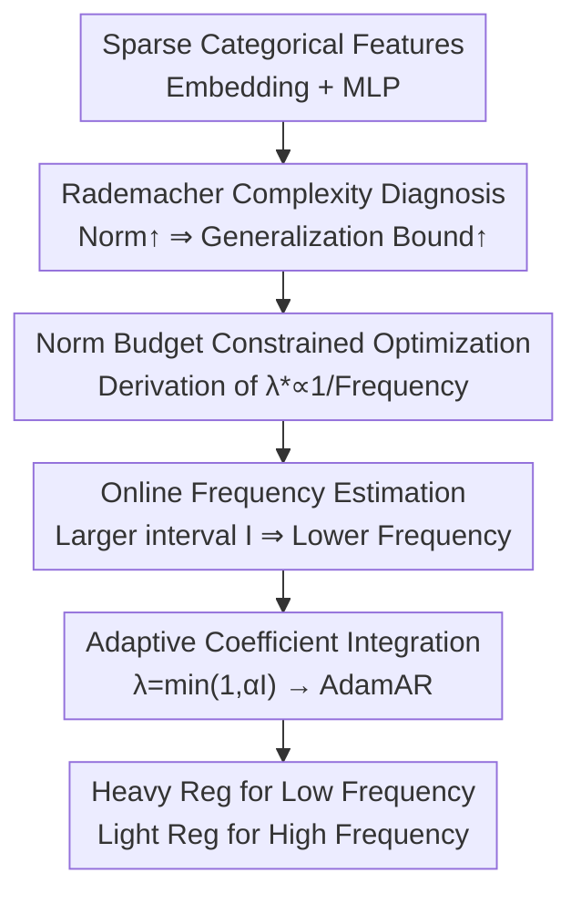

# Adaptive Regularization for Large-Scale Sparse Feature Embedding Models

**Conference**: ICLR 2026  
**OpenReview**: [https://openreview.net/forum?id=QFH5mwP9oH](https://openreview.net/forum?id=QFH5mwP9oH)  
**Code**: https://github.com/alibaba-aidc/adaptive-regularization.git  
**Area**: Recommendation / CTR Prediction / Sparse Feature Embedding  
**Keywords**: one-epoch overfitting, Rademacher complexity, adaptive regularization, embedding norm budget, AdamAR

## TL;DR
This paper theoretically explains the root cause of "one-epoch overfitting" in CTR/CVR models—where performance collapses after the first epoch—using Rademacher complexity. It identifies that the unconstrained growth of embedding norms expands the generalization bound. Consequently, the authors propose AdamAR, an adaptive regularization method that allocates norm budgets based on feature frequency: applying light regularization for high-frequency features and heavy regularization for low-frequency ones. This approach eliminates multi-epoch overfitting while improving single-epoch performance and has been deployed in Alibaba's search advertising system.

## Background & Motivation
**Background**: In e-commerce search, advertising, and recommendation systems (ASR), mainstream CTR/CVR models typically use a "large-scale sparse categorical features → embedding layer → MLP backbone" architecture. These categorical features (item IDs, brand IDs, seller IDs, etc.) can reach billions of dimensions, with the vast majority of values appearing at extremely low frequencies. An anti-intuitive empirical observation in the industry is the "one-epoch overfitting" phenomenon: models can only be trained for one epoch; once training enters the second epoch, the test AUC drops precipitously.

**Limitations of Prior Work**: Existing mitigation strategies are either heuristic or computationally expensive. MEDA (Liu et al. 2023) reinitializes all categorical embeddings and their optimizer states at the start of each epoch. While this suppresses multi-epoch overfitting, it only resets at epoch boundaries, does not guarantee optimal convergence, and discards significant amounts of learned information. Another approach (Wang et al. 2025) uses generative pre-training to obtain frozen embeddings, requiring massive additional computing resources and failing to provide a fair comparison by ignoring pre-training costs. General techniques like dropout, L1/L2, or weight decay (AdamW) apply the **same** decay to all parameters. This is sub-optimal for industrial data with high sparsity variance: it weakens the fitting accuracy of dense features while failing to suppress the overfitting of sparse features.

**Key Challenge**: The fundamental problem is the lack of a theoretical explanation for "why the one-epoch phenomenon occurs." Without understanding the mechanism beyond its correlation with sparsity, practitioners are forced to rely on "patches." There is also a trade-off: allowing embedding norms to grow unchecked expands the generalization error bound, but forcing all norms to be small increases training error and degrades performance.

**Goal**: (1) Provide a theoretical root cause for one-epoch overfitting; (2) Design a method to **differentially** allocate regularization intensity based on feature sparsity to prevent multi-epoch collapse and improve single-epoch performance, while being integrable into existing optimizers for industrial deployment.

**Key Insight**: The authors characterize the model's generalization bound using Rademacher complexity. They find that the upper bound is dominated by the sum of the norms of each row in the embedding matrix $\sum_{i}\sum_{j}\tau_{ij}$ (since most ASR model parameters are in the embedding layer). This directly attributes "why overfitting occurs" to the "unconstrained growth of embedding norms," providing a theoretical guide for regularization.

**Core Idea**: Formulate the problem of "how much norm budget to allocate to each embedding vector" as a global norm-constrained optimization problem. The derived optimal regularization coefficient is **inversely proportional to the feature sample frequency**—high-frequency features receive large budgets (light regularization), and low-frequency features receive small budgets (heavy regularization). An "occurrence interval" is used for online frequency estimation, and this adaptive coefficient is integrated into Adam/Adagrad update rules using decoupled decay.

## Method

### Overall Architecture
The method follows a pipeline of "Theoretical Diagnosis → Constrained Optimization → Online Frequency Estimation → Optimizer Integration." First, Rademacher complexity is used to prove the relationship between embedding norms and the generalization bound to locate the root cause of overfitting. Next, norm budget allocation is framed as a constrained optimization problem, leading to the conclusion that "optimal regularization intensity is inversely proportional to sample frequency." Since exact frequencies are unavailable during training, the "occurrence interval" of each embedding vector serves as an online proxy. Finally, the adaptive regularization coefficients are integrated into the parameter update steps via the AdamW-style decoupled decay method, resulting in AdamAR (and AdagradAR).

### Key Designs

**1. Rademacher Complexity Diagnosis: Attributing One-Epoch Overfitting to Embedding Norm Growth**

The limitation of previous work was observing "sparsity → overfitting" without a known mechanism. The authors treat the embedding layer as a linear projection. Based on norm-dependent bounds (Golowich et al., 2018), they derive the upper bound of the empirical Rademacher complexity for the entire model as:
$$\widetilde{R}_T(\mathcal{H}_L) \le \sqrt{\tfrac{S}{T}}\Big(\prod_{l=1}^{L} M_F(l)\Big)\sqrt{\sum_{i=1}^{S}\sum_{j=1}^{N_i}\tau_{ij}}\;\big(\sqrt{2\log(2)}\,L+1\big),$$
where $\tau_{ij}$ is the squared $\ell_2$ norm of the $j$-th row of embedding matrix $E_i$, $S$ is the number of categorical features, and $T$ is the number of samples. Since ASR parameters are almost entirely in the embedding layer, $\sum_i\sum_j\tau_{ij}$ dominates this upper bound and thus the generalization error bound. Combined with Proposition 2 and experiments in Section 4.4 (where overfitting disappears after manually filtering the sparsest "IP" feature in iPinYou), the conclusion is: embedding norms grow continuously if unconstrained (since the objective $\phi(\tau_{ij})$ is monotonically non-increasing), loosening the bound and leading to collapse in multiple epochs. This elevates the one-epoch phenomenon from an empirical observation to a quantifiable theoretical root cause.

**2. Norm Budget Constrained Optimization: Deriving "Reg Intensity ∝ 1/Frequency"**

With the diagnosis complete, the problem becomes "how much norm budget each embedding should receive." The authors formulate this as an optimization problem with a global budget constraint:
$$\min_{\tau_{ij}>0}\ \sum_{i=1}^{S}\sum_{j=1}^{N_i} m_{ij}\,\phi(\tau_{ij})\quad\text{s.t.}\quad \sum_{i=1}^{S}\sum_{j=1}^{N_i}\tau_{ij}\le C,$$
where $\phi(\tau_{ij})=\min_{\|e_{ij}\|^2\le\tau_{ij}}L(e_{ij})$ is the minimum CE loss reachable given budget $\tau_{ij}$, $m_{ij}$ is the frequency of the embedding, and $C$ is the global norm upper bound (which directly determines the Rademacher bound). Using the Envelope Theorem and KKT conditions, the authors prove Proposition 1: the optimal regularization multiplier satisfies
$$\lambda^*_{ij}=\mu_0/m_{ij},$$
where $\mu_0$ is the Lagrange multiplier. The implication is straightforward: **Optimal regularization intensity is inversely proportional to feature frequency.** High-frequency features should have large norm budgets and light regularization, while low-frequency features should have small budgets and heavy regularization. This explains why the "one-size-fits-all" weight decay in AdamW is sub-optimal.

**3. Online Frequency Estimation via Occurrence Intervals: Implementation as AdamAR**

Proposition 1 is an ideal conclusion, but getting exact frequencies $m_{ij}$ during training is impractical. The authors use the random occurrence interval $I_{ij}$ as an approximation. Under the i.i.d. assumption, $\mathbb{E}[m_{ij}]=T/\mathbb{E}[I_{ij}]$, meaning frequency is inversely proportional to the average interval. Thus, the interval serves as an online proxy. Specifically, they maintain a "last effective update step" $s^k_{ij}$ (a lazy variable updated only when the gradient norm $\|g_{ij}\|>0$). The interval is defined as $I^k_{ij}=k-s^{k-1}_{ij}-1$, and the adaptive regularization coefficient is:
$$\lambda^k_{ij}=\min\big(1,\ \alpha I^k_{ij}\big),$$
where $\alpha\in[0,1)$ is the base regularization coefficient. A larger interval (sparser feature, longer time since update) leads to stronger regularization. If the interval is 0 (like MLP parameters updated every batch), regularization is negligible. This is integrated into the update via AdamW-style decoupled decay: $\theta^k_p\leftarrow\theta^{k-1}_p-\lambda^k_p\theta^{k-1}_p-\eta\cdot\hat m^k_p/(\sqrt{\hat v^k_p}+\varepsilon)$, forming AdamAR. It only requires storing one additional state ("last update step"), adds almost no computation, and is naturally compatible with optimizers like Adagrad (AdagradAR).

**4. Mechanism Interpretation and Unification with MEDA**

Proposition 2 provides an upper bound for the parameter norm after an update: $\|\theta^k_p\|\le(1-\alpha)^{I^k_p}\|\theta^{k-1}_p\|+\|\eta\cdot\hat m^k_p/(\sqrt{\hat v^k_p}+\varepsilon)\|$. When the interval $I^k_p$ is large, $(1-\alpha)^{I^k_p}$ decays exponentially, and the old value $\theta^{k-1}_p$ is virtually erased, making the parameter dominated by the latest gradient. Intuitively, sparse embeddings are updated infrequently; by the time they are updated, the MLP has converged significantly, making old embedding values mismatched with the current MLP state. It is thus logical to discount old values and trust the new gradient. MLP parameters ($I=0$) are virtually unaffected. Furthermore, the authors identify MEDA as a special case of this method where reinitialization occurs only at epoch boundaries (intervals are $1/\alpha$ at boundaries and 0 elsewhere). This explains why MEDA only works at epoch boundaries and fails for features that overfit within a single epoch. Proposition 3 proves that adaptive regularization does not change the minimum convergence bound of Adam, ensuring theoretical safety.

### Loss & Training
The base task loss is binary cross-entropy for CTR/CVR. Regularization is not added to the loss function but integrated directly into the optimizer update step via decoupled decay. The key hyperparameter is the base coefficient $\alpha\in[0,1)$, selected via grid search on $10^n$ ($n$ from $-6.5$ to $-1$, step 0.5). Embeddings are dimension 32 with zero initialization. Adam learning rate is 0.001, Adagrad is 0.01, and batch size is 2048.

## Key Experimental Results

### Main Results
Experiments were conducted on three public datasets (iPinYou, Amazon, Avazu) and LZD (a sponsored search dataset), across four backbones (DNN, WDL, xDeepFM, WuKong) for 4 epochs. Comparison baselines include standard optimizers, MEDA, SAM, and AdamW (weight decay on embeddings only). Representative AUC results for the Adam optimizer (E1/E4 denote after the 1st/4th epoch):

| Dataset / Backbone | Method | E1 (Single Epoch) | E4 (Multi Epoch) |
|--------------|------|------|------|
| iPinYou / DNN | Adam | 0.7515 | 0.7014 (Collapse) |
| iPinYou / DNN | MEDA | 0.7515 | 0.7717 |
| iPinYou / DNN | AdamW | 0.7475 | 0.7568 |
| iPinYou / DNN | **AdamAR** | **0.7566** | **0.7724** |
| Avazu / DNN | Adam | 0.7461 | 0.6883 (Collapse) |
| Avazu / DNN | **AdamAR** | **0.7617** | **0.7629** |
| LZD / DNN | Adam | 0.7118 | 0.6065 (Collapse) |
| LZD / DNN | **AdamAR** | **0.7229** | **0.7234** |

Standard Adam typically collapses by E4. AdamAR not only stabilizes over multiple epochs and achieves the highest AUC across all datasets/architectures but also outperforms MEDA and AdamW in **single-epoch (E1)** performance in almost all cases. The only exception was on the small Amazon dataset, where SAM performed slightly better in E1. Results for AdagradAR were consistently superior as well.

### Ablation Study
Using iPinYou (where the "IP" feature causes the one-epoch issue), the "IP" features were divided into 5 frequency buckets (lower bucket ID means lower frequency). Successive buckets were converted from AdamW to the proposed AdamAR (Adam):

| Configuration | E1 | E4 | Description |
|------|------|------|------|
| AdamW (Uniform Decay) | 0.7486 | 0.7500 | Baseline |
| AR Bucket 1 + W Buckets 2-5 | 0.7457 | 0.7520 | Adaptive only for lowest frequency bucket |
| AR Buckets 1-3 + W Buckets 4-5 | 0.7510 | 0.7614 | Covering more low-frequency buckets |
| AR Buckets 1-4 + W Bucket 5 | 0.7470 | 0.7656 | — |
| **AdamAR (All Buckets Adaptive)** | **0.7549** | **0.7725** | Full Method |

The bucket substitution demonstrates that decreasing decay for high-frequency buckets and increasing it for low-frequency buckets mitigates one-epoch overfitting and consistently raises AUC, validating the core thesis of differential regularization.

### Key Findings
- **Low-frequency embeddings are the root cause of one-epoch overfitting**: In Section 4.4, filtering low-frequency IDs of the "IP" feature by ratio $r$ showed that smaller $r$ (fewer low-frequency IDs) leads to more stable multi-epoch AUC. However, deleting the "IP" feature entirely ($r=0$) dropped E1 AUC from 0.7498 to 0.7429, proving that features should be regulated adaptively rather than removed.
- **Norm is negatively correlated with generalization**: Learning curves show that the cumulative $\ell_2$ norm of embeddings is inversely correlated with test AUC. AdamAR achieves the lowest cumulative norm, supporting the "repress norm = improve generalization" claim.
- **Bucket Analysis**: Adaptive regularization controls the norm of each bucket while preserving AUC gains, with high-frequency buckets performing particularly well due to larger norm budgets.

## Highlights & Insights
- **From "Patching" to "Theoretical Grounding"**: The greatest value of this paper is providing the first theoretical explanation (via Rademacher complexity) for the industry-known "one-epoch" limit. It identifies embedding norm growth as the driver, turning empirical patches into a principled approach.
- **"Reg ∝ 1/Frequency" is Clean and Practical**: Proposition 1 converts the intuition (sparse features overfit more) into a provable equation. Using "occurrence intervals" elegantly bypasses the engineering challenge of calculating exact frequencies during training—this zero-cost trick is transferable to any scenario requiring frequency-aware sparse parameter handling.
- **Unifying Existing Methods**: Proving that MEDA is a special case of this method explains why MEDA only works at epoch boundaries and demonstrates the broader applicability of AdamAR.
- **True Industrial Deployment**: The method is decoupled into the optimizer, requires minimal additional state and computation, and is already fully deployed in Alibaba's sponsored search, providing high credibility.

## Limitations & Future Work
- **Theoretical analysis focused on Embeddings + DNN**: The Rademacher bound derivation focuses on the embedding layer and standard DNNs. For modern backbones with complex feature interactions, the alignment between theory and empirical results requires further systematic verification.
- **Hyperparameter $\alpha$ still requires grid search**: Like weight decay, $\alpha$ is chosen via grid search on a $10^n$ scale. No automated selection or adaptive tuning scheme for $\alpha$ is provided.
- **One-epoch overfitting in LLM SFT**: The authors mention similar phenomena in LLM SFT (where some argue moderate overfitting is beneficial) but leave this as future work. Whether this method transfers to generative scenarios remains open.
- **i.i.d. Assumption**: Using intervals to estimate frequency assumes i.i.d. sampling. In real-world streaming data with strong temporal drift, the interval-based frequency estimate might be biased.

## Related Work & Insights
- **vs. MEDA (Liu et al. 2023 / Fan et al. 2024)**: MEDA resets embeddings/optimizer states at epoch boundaries. It is heuristic, discards information, and fails for features that overfit within an epoch. This paper shows MEDA is a special case and replaces hard resets with continuous frequency-aware regularization, outperforming it in both single and multi-epoch settings.
- **vs. Generative Pre-training (Wang et al. 2025)**: Freezing embeddings via pre-training requires massive extra computation and is not a fair comparison if pre-training parameters aren't counted. Ours solves the problem directly within standard training.
- **vs. AdamW / weight decay**: AdamW applies uniform decay to all parameters, which mismanages sparse data—failing to stop sparse overfitting while harming dense feature fitting. Ours makes decay adaptive to the occurrence interval $\lambda=\min(1,\alpha I)$, effectively acting as frequency-differentiated weight decay.
- **vs. SAM**: SAM improves generalization via sharpness-aware minimization. In experiments, SAM only outperformed AdamAR on the smallest dataset (Amazon) in E1 and still suffered from multi-epoch overfitting.

## Rating
- Novelty: ⭐⭐⭐⭐⭐ First theoretical grounding of one-epoch overfitting via Rademacher complexity; derived the "Reg ∝ 1/Frequency" + interval estimation solution.
- Experimental Thoroughness: ⭐⭐⭐⭐ 4 datasets × 4 backbones × 2 optimizers + bucket analysis + root cause experiments; however, theory is strictly derived for DNN/embeddings.
- Writing Quality: ⭐⭐⭐⭐ Solid flow from diagnosis to method to mechanism; formulas are dense and may be challenging for readers without an optimization background.
- Value: ⭐⭐⭐⭐⭐ Addresses a long-standing industrial CTR/CVR pain point; zero-cost, transferable, and successfully deployed online.

<!-- RELATED:START -->

## Related Papers

- [\[ICLR 2026\] RPM: Reasoning-Level Personalization for Black-Box Large Language Models](rpm_reasoning-level_personalization_for_black-box_large_language_models.md)
- [\[ICLR 2026\] From Evaluation to Defense: Advancing Safety in Video Large Language Models](from_evaluation_to_defense_advancing_safety_in_video_large_language_models.md)
- [\[AAAI 2026\] TraveLLaMA: A Multimodal Travel Assistant with Large-Scale Dataset and Structured Reasoning](../../AAAI2026/recommender/travellama_a_multimodal_travel_assistant_with_large-scale_dataset_and_structured.md)
- [\[NeurIPS 2025\] R²ec: Towards Large Recommender Models with Reasoning](../../NeurIPS2025/recommender/r2ec_towards_large_recommender_models_with_reasoning.md)
- [\[ICLR 2026\] Steering Diffusion Models Towards Credible Content Recommendation](steering_diffusion_models_towards_credible_content_recommendation.md)

<!-- RELATED:END -->
