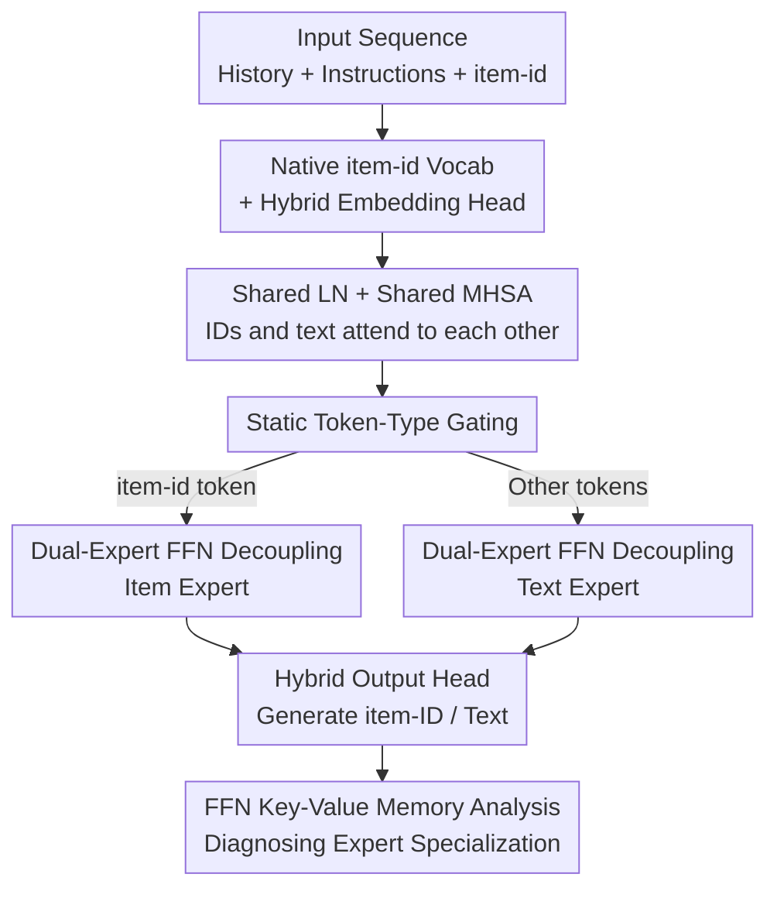

# Catalog-Native LLM: Speaking Item-ID dialect with Less Entanglement for Recommendation

**Conference**: ICLR2026  
**OpenReview**: [https://openreview.net/forum?id=ia9vDh0Ltn](https://openreview.net/forum?id=ia9vDh0Ltn)  
**Code**: To be confirmed  
**Area**: Recommendation Systems / LLM  
**Keywords**: Recommendation Systems, Large Language Models, Mixture-of-Experts, item-ID, Knowledge Interference  

## TL;DR
Addressing the issue where shoving item-IDs into an LLM causes collaborative signals and linguistic semantics to conflict, this paper proposes IDIOMoE: splitting the FFN of each pre-trained LLM block into a **text expert** and an **item expert**. Using static token-type gating to route tokens based on their type (item-id tokens go to the item expert, others to the text expert), the model decouples "collaborative filtering" and "semantic understanding" into different subnetworks. This achieves state-of-the-art recommendation performance on both public and industrial-scale datasets while maintaining the original LLM's linguistic capabilities.

## Background & Motivation
**Background**: Recommendation systems are evolving from "ranking fixed lists" into agents capable of chatting with users, providing explanations, and exploring via natural language instructions. One mainstream approach adapts LLMs for recommendation—P5 reformulates recommendation as text-to-text generation, and prompt-based methods treat LLMs as zero-shot rankers. Another approach (CoVE, CLLM4Rec, URM, etc.) expands the LLM vocabulary with item-ID tokens, allowing the model to generate and retrieve directly at the ID level. Traditional collaborative filtering (CF) models are token-efficient and accurate at scale, but ID sequences are semantically opaque and lack natural language support. Conversely, LLMs are semantically rich and capable of reasoning but fail to capture implicit user preferences when fed only text.

**Limitations of Prior Work**: When item-ID tokens and text tokens **share the same set of parameters**, **knowledge interference** occurs—collaborative signals and linguistic semantics become entangled, leading to performance drops on both sides. The authors confirmed this through pilot experiments: comparing three input methods (pure ID, ID + text-derived bias, ID + explicit attribute text) starting from Qwen2.5-0.5B, they found that while "text-derived bias" provides accurate recommendations, it comes at the cost of **severe linguistic degradation** (significant drops in wikitext NLL and BBH/HellaSwag/MMLU/WinoGrande). Explicit text preserves linguistic ability but makes sequences longer and harder to learn.

**Key Challenge**: Users demand both "dialogue + explainability" (requiring explicit text) and "accurate recommendation" (requiring strong collaborative modeling). However, putting both into the same FFN of an LLM creates a trade-off. The authors emphasize that this interference **cannot be resolved by simply increasing parameters**—widening the FFN or adding layers does not help.

**Key Insight & Core Idea**: The authors draw inspiration from Mixture-of-Experts, framing it as a linguistic metaphor—**viewing item interaction history as a "native dialect" within the linguistic space**. Since it is a different dialect, it should not compete with natural language for the same "linguistic region" but should be assigned a **dedicated collaborative expert** while **preserving the text expert** as-is, orchestrated by a lightweight gate. In short: using token types to split the FFN into "language" and "item" experts structurally eliminates interference by keeping collaborative modeling and semantic understanding separate.

## Method

### Overall Architecture
The input to IDIOMoE (Item-ID + Natural-language Mixture-of-Experts) is a mixed sequence containing natural language instructions/item attributes ("The user has interacted with ... title is ... genre is ...") and special item-id tokens `<|it-121|>`. The output is the next item-ID (recommendation) or natural language (dialogue/explanation). The structural changes are minimal: using a pre-trained decoder-only LLM (Qwen2.5-0.5B/1.5B) as a backbone, only the FFN sub-layers are modified. The single FFN in each block is replaced with a "dual-expert" module, while LayerNorm and Multi-Head Self-Attention (MHSA) are **fully shared**.

A token's path: First, an **extended tokenizer** splits the sequence into text tokens and item-id tokens. Text tokens use the LLM's native embeddings, while item-id tokens use a new trainable item embedding table (hybrid embedding). Within each block, all tokens share the same LN and MHSA—meaning IDs and text can always attend to each other. At the FFN sub-layer, **static token-type gating** routes the token based on its type: item-id tokens enter the **item expert**, and all other tokens (titles, attributes, instructions) enter the **text expert**. Finally, a hybrid output head allows the model to generate either text or item-IDs. Since each token activates only one expert, the computational cost remains equivalent to the original LLM.

### Key Designs

**1. Native item-id Vocabulary + Hybrid Embedding Head: Registering items in the LLM**

To make the LLM truly "speak the item-id dialect," the first step is registering items in the vocabulary. The authors expand the tokenizer with special `<|it-id|>` tokens and attach a **hybrid embedding layer**: text tokens use the frozen native embedding matrix of the backbone LLM, while item-id tokens use a **trainable item embedding table**. The language model head at the output uses the same hybrid parameterization, allowing the model to **generate item-IDs directly** like text, unifying retrieval/ranking into generation. Pilot experiments (Table 1) show that feeding attributes as explicit tokens is beneficial compared to a "pure ID" baseline—it unlocks dialogue and readable explanations, which "text-derived bias" cannot do. Thus, the authors use explicit text tokens and solve the resulting interference via expert splitting.

**2. Dual-Expert FFN Decoupling: Separating the "Language Zone" and "Item Zone"**

This is the core of the paper. The authors observe that knowledge interference occurs where **information is stored**—and in Transformers, the FFN is the sub-layer that stores facts/concepts as "key-value memories" (following Geva et al.). Therefore, the FFN of each block is replaced with a dual-expert module: the **text expert** is the original FFN of the pre-trained LLM, **preserved as-is** to protect linguistic capability; the **item expert** is a new, similarly structured FFN, which can be efficiently scaled using a shrink factor (e.g., $\times\tfrac{1}{2}$, $\times\tfrac{1}{4}$) to adjust its intermediate dimension. Crucially, LN and MHSA are fully shared—allowing IDs and text to jointly reason in attention layers. The split occurs **only at the FFN**, keeping ID-specific and text-specific information separate. Ablations (Table 4) prove this is not due to parameter count: on industrial data, it improves +24.1% NDCG@10 / +28.9% HR@10 over Item-LLM, whereas a Wide-FFN with equivalent parameters only improves +3.8%/+1.3%. Adding additional layers even caused significant drops (-97%), indicating that **structural decoupling** is the source of the gains.

**3. Static Token-Type Gating: Fixed division of labor over learned routing**

Standard MoE uses a learned router to dynamically decide each token's path. The authors instead use a **static rule**: only item-id tokens `<|it-.|>` are routed to the item expert, while all other tokens go to the text expert—no learned gate, no top-k selection. The intuition is to provide each expert with a **clear, stable identity** (one for language, one for items) to ensure specialization without "leakage." Ablations (Table 7) confirm this: replacing this with switch-style dynamic gating leads to a **collapse in recommendation quality** (-24.2% NDCG@10 on industrial data), as dynamic routing mixes item and text assignments, increasing entanglement. This suggests that in scenarios where modal identities are naturally determined by token types, a fixed division is not just simpler but more effective.

**4. FFN Key-Value Memory Analysis: Evidence of expert specialization**

To demonstrate that gains come from specialization, the authors analyze the item expert's FFN as key-value memory. Each row $w_j^{(\ell)}$ of the second projection $W_{out}^{(\ell)}\in\mathbb{R}^{I\times d}$ is treated as a neuron's value vector. They calculate cosine similarities with item embeddings $E_{items}$ and text tokens $E_{text}$, defining three metrics: **Affinity** $a(w)=\mathrm{median}(s^{\text{top-}k}_{items}(w))-\mathrm{median}(s^{\text{top-}k}_{text}(w))$ measures whether a neuron favors items or text; **Purity** $p(w)=\max_{c\in C}\tfrac{1}{k}|\{i\in\text{top-}k(w):\mathrm{cat}(i)=c\}|\in[0,1]$ measures if top-$k$ neighbors cluster in the same item category; **Clustered Rows** $\mathbb{1}_{cluster}(w)=\mathbb{I}[p(w)\ge\tau]$ counts the ratio of neurons forming category clusters (using $k=20,\tau=0.5$). Results (Figure 5) show that while non-MoE baselines drift toward negative affinity in deeper layers (favoring text), MoE maintains item sensitivity. MoE purity increases layer-by-layer, and clustered row ratios surge in deep layers for industrial sets, providing direct evidence of modular representation.

### Loss & Training
Qwen2.5-0.5B is used as the backbone (1.5B for main industrial results), following a leave-last-item-out split. All comparison variants (ID Transformer, text-derived bias, Item-LLM) are **matched for parameter count, token budget, and FLOPS** with IDIOMoE to eliminate "more parameters" as a confounding factor. The item expert capacity is tuned via the shrink factor. Ablations were performed on MoE placement, expert capacity, and routing strategies.

## Key Experimental Results

### Main Results
On six small-scale Amazon domains, IDIOMoE achieved the highest or tied-for-highest NDCG@10 / HR@10 in almost all domains (**LLM-Based highlighted**):

| Dataset (NDCG@10 / HR@10) | Strongest Non-Ours Baseline | IDIOMoE |
|--------|------|------|
| Games | HSTU 0.0609 / 0.1089 | **0.0605 / 0.1102** |
| Instruments | MQL4GRec 0.1060 / 0.1375 | **0.1054 / 0.1385** |
| Arts | MQL4GRec 0.0950 / 0.1327 | **0.1029 / 0.1409** |
| Sports | SASRec 0.0289 / 0.0531 | **0.0391 / 0.0674** |
| Beauty | CoVE 0.0593 / 0.1009 | **0.0665 / 0.1104** |

On large-scale Amazon (Beauty/Books/Toys), IDIOMoE is the strongest LLM-based method. On an industrial dataset (hundreds of millions of users), using SASRec as a baseline, IDIOMoE achieved maximum gains of **+27.1% NDCG@10, +16.6% HR@10, and +31.2% MRR**.

### Ablation Study
Matched-parameter non-MoE comparisons (relative to Item-LLM, Industrial set ∆%):

| Config | NDCG@10 ∆ / HR@10 ∆ (Industrial) | Note |
|------|---------|------|
| Wide-FFN | +3.8% / +1.3% | Simply widening FFN is ineffective |
| Append-blocks | -5.5% / -5.3% | Adding layers at the end degrades performance |
| Prepend-blocks | -15.3% / -16.2% | Adding layers at the start degrades more |
| LoRA-LLM | -79.1% / -76.3% | Sensitive to scale/sparsity; collapses on industrial set |
| **IDIOMoE** | **+24.1% / +28.9%** | Structural decoupling is the key driver |

Other ablations: **Item expert capacity**—shrink=4 was optimal on Amazon-Beauty, but performace worsened with higher shrink on the industrial set, suggesting large-scale data needs larger item experts; **MoE placement**—placing in the last 8 layers performed best, as deeper layers carry task semantics; **Static vs. Dynamic Routing**—dynamic switch routing severely degraded performance, confirming that fixed division facilitates specialization.

### Key Findings
- Interference **does not disappear by stacking parameters**: Wide-FFN / layer-stacking / LoRA are either marginal or catastrophic at industrial scale, whereas decoupling by token type is stable and effective.
- Specialization is real: Key-value memory analysis shows MoE item experts maintain item affinity, higher category purity, and higher clustering in deep layers.
- The larger the scale, the more obvious the interference, and the greater the benefit of decoupling—which is why the authors emphasize industrial results over Amazon.

## Highlights & Insights
- **The "item-ID as a dialect" metaphor is powerful**: It intuitively explains why FFNs should not be shared and reframes MoE from "dynamic sparse routing" to "static modal division."
- **Static gating is counter-intuitive but effective**: When modalities can be deterministically separated by token type, abandoning learned routers removes routing noise, a principle applicable to any multi-modal fusion where identity is known a priori.
- **Modifying only the FFN while sharing Attention** is a clever trade-off: It preserves cross-modal interaction (IDs and text see each other in attention) while confining "storage conflict" to the sub-layers where it belongs, ensuring low-cost adaptation for any pre-trained decoder.
- **The Key-Value memory diagnostic is a valuable tool**: It turns the "specialization" claim into quantifiable metrics like affinity, purity, and clustering.

## Limitations & Future Work
- The authors admit Amazon public benchmarks are small; thus, the industrial set is the main evidence. However, the industrial set is not reproducible, making it hard for external readers to verify the most critical conclusions.
- Other MoE variants like MoA/MoT perform similarly to or slightly better than IDIOMoE on Amazon-Beauty. The authors note that the "best" MoE may depend on the dataset.
- The optimal item expert shrink factor differed between small and large datasets, implying a need for domain-specific tuning rather than a universal adaptive capacity solution.
- Static routing depends on clean modality separation via token types; it is unverified whether this remains optimal when modal boundaries are blurred.

## Related Work & Insights
- **vs. Text-derived Bias (e.g., URM/Jiang et al.)**: They encode text as vectors added to ID embeddings. This keeps sequences short but damages linguistic capability and lacks dialogue support. IDIOMoE uses explicit tokens and expert splitting to keep both.
- **vs. Generative Recommendation with expanded vocab (CoVE/CLLM4Rec/Item-LLM)**: These share parameters between ID and text tokens, leading to interference. IDIOMoE is the first to explicitly separate collaborative filtering from semantic processing in the FFN.
- **vs. Multi-modal MoE-LLM (MoE-LLaVA / Uni-MoE / MoME)**: Those use dynamic gating for Vision-Language tasks. This work argues that for Recommendation, static token-type routing facilitates better specialization.
- **vs. Large-scale Generative Rec (HSTU / OneRec)**: Those train massive decoders from scratch and lack dialogue support. IDIOMoE achieves comparable or better results using smaller backbones (0.5B/1.5B) via structural decoupling while maintaining dialogue/explainability.

## Rating
- Novelty: ⭐⭐⭐⭐ "Item-ID dialect + Static token-type FFN split" is a simple, effective design.
- Experimental Thoroughness: ⭐⭐⭐⭐ Broad testing across public/industrial sets, but core conclusions rely on non-reproducible data.
- Writing Quality: ⭐⭐⭐⭐ Motivation is clear; pilot experiments effectively isolate the "interference" problem.
- Value: ⭐⭐⭐⭐ Practical for industry with no added FLOPs; provides a repeatable paradigm for avoiding "clashes" in LLM-based recommendation.

<!-- RELATED:START -->

## Related Papers

- [\[AAAI 2026\] Tokenize Once, Recommend Anywhere: Unified Item Tokenization for Multi-domain LLM-based Recommendation](../../AAAI2026/recommender/tokenize_once_recommend_anywhere_unified_item_tokenization_for_multi-domain_llm-.md)
- [\[ICLR 2026\] Token-Efficient Item Representation via Images for LLM Recommender Systems](token-efficient_item_representation_via_images_for_llm_recommender_systems.md)
- [\[ACL 2026\] Intent-Driven Semantic ID Generation for Grounded Conversational News Recommendation](../../ACL2026/recommender/intent-driven_semantic_id_generation_for_grounded_conversational_news_recommenda.md)
- [\[ICLR 2026\] Reinforced Latent Reasoning for LLM-based Recommendation](reinforced_latent_reasoning_for_llm-based_recommendation.md)
- [\[ACL 2026\] From Past To Path: Masked History Learning for Next-Item Prediction in Generative Recommendation](../../ACL2026/recommender/from_past_to_path_masked_history_learning_for_next-item_prediction_in_generative.md)

<!-- RELATED:END -->
