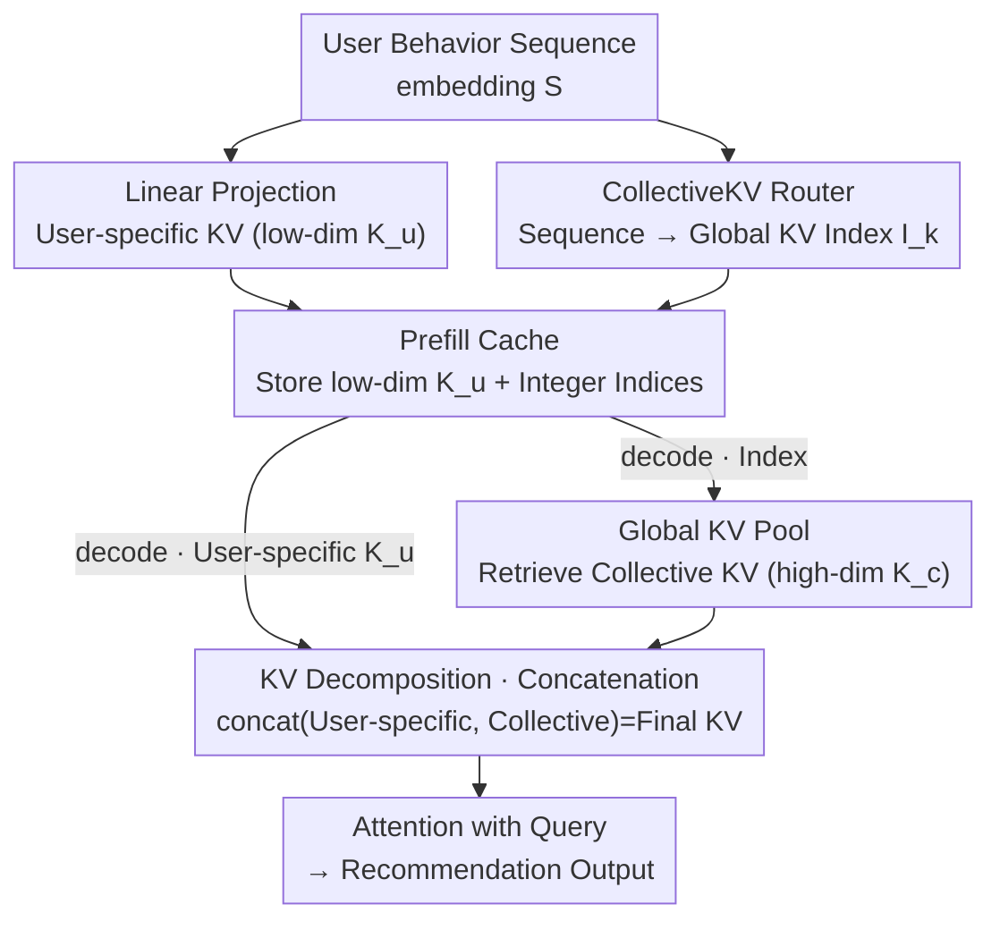

# CollectiveKV: Decoupling and Sharing Collaborative Information in Sequential Recommendation

**Conference**: ICLR 2026  
**arXiv**: [2601.19178](https://arxiv.org/abs/2601.19178)  
**Code**: To be confirmed  
**Area**: Recommendation Systems / Model Compression  
**Keywords**: KV cache compression, cross-user sharing, collaborative signals, sequential recommendation, SVD analysis

## TL;DR
Observing that KV caches of different users in sequential recommendation exhibit significant cross-user similarity (collaborative signals), CollectiveKV is proposed to decompose KV into low-dimensional user-specific parts and high-dimensional shared parts retrieved from a global KV pool, achieving a 0.8% compression rate without performance degradation.

## Background & Motivation

**Background**: Sequential recommendation models (e.g., SIM, HSTU) utilize Transformer attention mechanisms for better performance. KV cache techniques are introduced to precompute and store K/V pairs to reduce inference latency.

**Limitations of Prior Work**: Recommendation systems serve massive user bases (hundreds of millions), where each user may have long behavioral histories. The total volume of KV caches quickly exceeds GPU memory capacity, requiring offloading to CPU or external storage, which introduces massive transmission latency.

**Key Challenge**: KV compression methods in LLMs (e.g., token pruning, MLA dimensionality reduction) only compress single-user sequences, ignoring the unique cross-user collaborative signals inherent in recommendation scenarios.

**Goal**: Utilize cross-user KV similarity to achieve extreme compression—offloading most information into a global shared pool while each user caches only minimal personalized KV data.

**Key Insight**: Through SVD decomposition of K/V, it is observed that principal components (>90% information) show strong cross-user correlation, while residuals (<10% information) are user-specific. This provides a quantitative basis for "what can be shared."

**Core Idea**: A learnable global KV pool stores cross-user shared information. Each user caches only low-dimensional personalized KV and global indices, achieving an extreme compression rate of 0.8%.

## Method

### Overall Architecture
CollectiveKV addresses the issue where GPU memory cannot accommodate complete KV caches for every user. It decomposes KV into a small "personalized" part and a large "shared" part, allowing expensive high-dimensional information to be shared via a pool. The workflow follows the prefill and decode stages of Transformer recommendation models: in the prefill stage, the user sequence is linearly projected into a thin user-specific KV (dimension $d_u$), while a router network calculates the index in the global KV pool for each item. **Only these indices (rather than high-dimensional vectors) are cached.** In the decode stage, high-dimensional shared KV (dimension $d_g$) is retrieved from the GPU-resident global pool based on the cached indices, concatenated with the user-specific part, and used for attention calculation. Thus, users only store low-dimensional $\mathbf{K}_u$ and several integer indices.

### Key Designs

**1. KV Decomposition: Assigning Principal Components to Shared Pool and Residuals to Individuals**

This directly addresses the core pain point of storing high-dimensional KV for millions of users. The paper performs SVD on K/V and finds that principal components (>90% info) are highly correlated across users, while the <10% residuals are user-specific. KV is decomposed based on this: low-dimensional user-specific parts $\mathbf{K}_u \in \mathbb{R}^{n \times d_u}$ are obtained via linear projection $\mathbf{K}_u = \mathbf{S} W_k + b_k$, while high-dimensional collective parts $\mathbf{K}_c \in \mathbb{R}^{n \times d_g}$ are retrieved from the global pool $\mathbf{K}_c[i] = P_k[\mathbf{I}_k[i]]$. The final attention uses the concatenation $\mathbf{K} = \text{concat}(\mathbf{K}_u, \mathbf{K}_c)$. Compression stems from the fact that the high-dimensional segments are no longer stored per user.

**2. CollectiveKV Router: Training Discrete Retrieval via Differentiable Gating**

The router determines which pool entry each item should retrieve. It maps sequence embeddings to a scoring matrix $\mathbf{M} = \mathbf{S} W_r + b_r$, using $\mathbf{I}_k[i] = \arg\max_j \mathbf{M}_{ij}$ as the index. To handle the non-differentiable $\arg\max$, a sigmoid gate is used during training to apply a differentiable weight: $\mathbf{K}_c[i] = \sigma(\mathbf{M}[i, \mathbf{I}_k[i]]) \cdot P_k[\mathbf{I}_k[i]]$. Combined with a peak loss to push the sigmoid output toward 1, this ensures consistency between "soft selection" during training and "hard lookup" during inference.

**3. Global KV Pool: GPU-Resident, Shared High-Dimensional Information Store**

The pool consists of two learnable matrices $P_k, P_v \in \mathbb{R}^{m \times d_g}$ residing in GPU memory. Storage savings are significant because the pool capacity $m$ is much smaller than the total number of tokens across all users. High-dimensional vectors that would otherwise be stored per user/token are collapsed into $m$ reusable entries. Setting $d_g$ sufficiently high ensures shared entries have enough capacity for SVD principal components.

### Loss & Training
The pool, router, and projection layers are optimized end-to-end. Beyond the recommendation loss, two constraints are added: first, peak loss $\mathcal{L}_{\text{peak}} = -\frac{1}{n}\sum_i \log\sigma(\mathbf{M}[i, \mathbf{I}_k[i]])$ to align training and inference; second, a load balance loss (KL divergence) to ensure items in the pool are selected uniformly, preventing entry idling.

## Key Experimental Results

### Main Results (5 Models × 3 Datasets)

| Model | Dataset | GAUC (Original→+Ours) | AUC (Original→+Ours) | Gain | CR |
|------|--------|------------------|------------------|---------|---|
| SIM | MicroVideo | 0.6954→**0.6973** | 0.6933→**0.7057** | +0.0124 | **1.6%** |
| SDIM | MicroVideo | 0.6857→**0.6883** | 0.6749→**0.6871** | +0.0122 | **1.2%** |
| SIM | KuaiVideo | 0.6577→**0.6604** | 0.6798→**0.6900** | +0.0102 | **1.2%** |
| HSTU | MicroVideo | - | - | - | **0.8%** |

### Ablation Study

| Configuration | AUC | Description |
|------|-----|------|
| Complete CollectiveKV | 0.7057 | Best performance |
| User-specific KV only | ~0.69 | Lacks shared information |
| Collective KV only | ~0.69 | Lacks personalization |
| Without peak loss | ~0.70 | Training-inference discrepancy |
| Without balance loss | ~0.70 | Low pool utilization |

### Key Findings
- **Improved Performance at 0.8% CR**: Results across 5 models and 3 datasets show maintained or improved performance, suggesting that shared KV provides regularization or information enhancement.
- SVD analysis provides an interpretable basis for compression—principal components are cross-user correlated while residuals are user-specific.
- Inference latency is significantly reduced—external storage transmission volume shrinks 50-100x, with negligible indexing overhead.

## Highlights & Insights
- **Cross-user KV sharing is a unique compression dimension for recommendation**: Unlike LLMs where each inference usually serves one sequence, recommendation systems naturally possess collaborative signals—a neglected direction with high potential.
- **SVD analysis as a theoretical tool**: Comparing cross-user similarity of principal components vs. residuals provides intuitive justification for "what can be shared."
- **Router Design**: The sigmoid gating and peak loss elegantly solve the non-differentiable discrete indexing problem.

## Limitations & Future Work
- The global KV pool resides in GPU memory; how to select pool size $m$ for extremely large-scale scenarios remains to be explored.
- The method was validated on CTR prediction; validation on ranking or generative recommendation tasks is needed.
- The router uses a simple linear layer; more complex routing strategies may further improve performance.

## Related Work & Insights
- **vs MLA (DeepSeek)**: MLA compresses single-user KV via dimensionality reduction; CollectiveKV utilizes cross-user sharing for more extreme compression.
- **vs Token pruning (Loki/Quest)**: Pruning discards tokens; CollectiveKV transfers information to a shared pool instead of discarding it.
- **vs HSTU**: HSTU introduced KV cache to recommendation without compression; CollectiveKV achieves 0.8% compression on such architectures.

## Rating
- Novelty: ⭐⭐⭐⭐⭐ Cross-user KV sharing is a fresh perspective supported by SVD analysis.
- Experimental Thoroughness: ⭐⭐⭐⭐ Broad coverage across models and datasets, though some ablation details could be further expanded.
- Writing Quality: ⭐⭐⭐⭐ Clear visualization of SVD analysis and logical flow.
- Value: ⭐⭐⭐⭐⭐ 0.8% compression rate offers significant industrial deployment value.

<!-- RELATED:START -->

## Related Papers

- [\[ACL 2025\] Laser: Bi-Tuning with Collaborative Information for Controllable LLM-Based Sequential Recommendation](../../ACL2025/recommender/bi-tuning_with_collaborative_information_for_controllable_llm-based_sequential_r.md)
- [\[AAAI 2026\] FreqRec: Exploiting Inter-Session Information with Frequency-enhanced Dual-Path Networks for Sequential Recommendation](../../AAAI2026/recommender/exploiting_inter-session_information_with_frequency-enhanced_dual-path_networks_.md)
- [\[ICLR 2026\] On the Mechanisms of Collaborative Learning in VAE Recommenders](on_the_mechanisms_of_collaborative_learning_in_vae_recommenders.md)
- [\[AAAI 2026\] HyMoERec: Hybrid Mixture-of-Experts for Sequential Recommendation](../../AAAI2026/recommender/hymoerec_hybrid_mixture-of-experts_for_sequential_recommendation.md)
- [\[ICLR 2026\] Steering Diffusion Models Towards Credible Content Recommendation](steering_diffusion_models_towards_credible_content_recommendation.md)

<!-- RELATED:END -->
