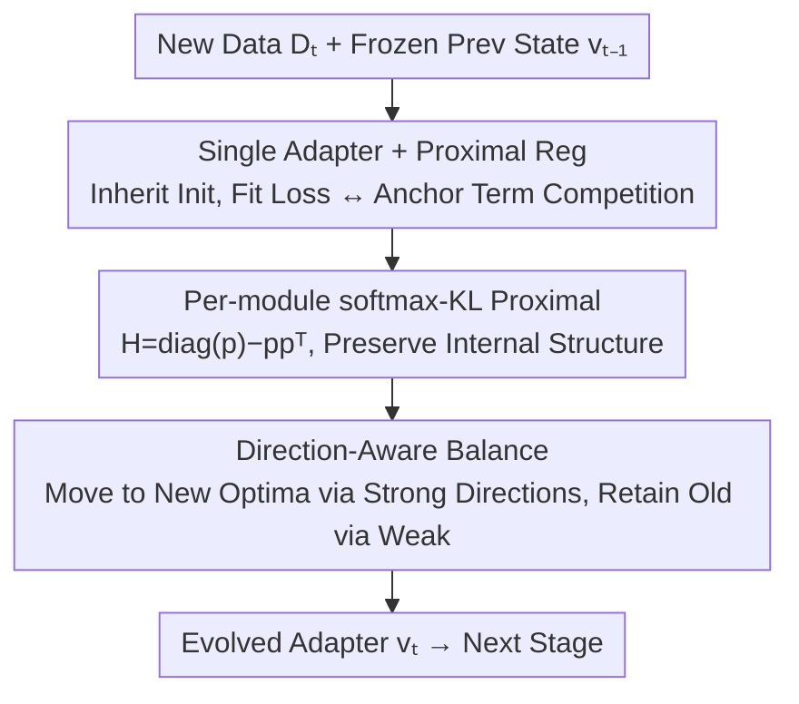

# Continual Low-Rank Adapters for LLM-based Generative Recommender Systems

**Conference**: ICLR2026  
**OpenReview**: [https://openreview.net/forum?id=DBCNTM7mot](https://openreview.net/forum?id=DBCNTM7mot)  
**Code**: https://github.com/hsyoo32/peso  
**Area**: Recommendation Systems / Continual Learning / LoRA / LLM Generative Recommendation  
**Keywords**: Continual Learning, LoRA, Proximal Regularization, Generative Recommendation, Stability-Plasticity

## TL;DR
PESO transforms continual learning for LLM-based generative recommendations from "stacking multiple frozen adapters" into "a single evolving LoRA + a proximal regularization term." By gently anchoring each update to the previous stage's state, the model automatically balances retaining long-term preferences and absorbing new ones, consistently outperforming cumulative LoRA and simple evolving LoRA across three real-world datasets.

## Background & Motivation
**Background**: Treating recommendation as sequence generation—where an LLM autoregressively "completes" the user's next interaction—has become a mainstream approach. Given a user history, the model outputs the next item tokens (items are encoded into semantic IDs using tokenizers like RQ-VAE). Deployment typically involves LoRA fine-tuning: freezing pre-trained weights and training only injected low-rank matrices $A, B$, which is both lightweight and modular.

**Limitations of Prior Work**: Real-world interaction data flows continuously and drifts—new users and items emerge, and old users' tastes change. Retraining from scratch on all data is expensive and slow, making "continual learning" a natural choice. However, existing LoRA-based continual learning methods are mostly adapted from fields like computer vision, where the goal is to **preserve performance on past tasks** (stability) while adapting to new ones (plasticity).

**Key Challenge**: Continual learning in recommendation differs fundamentally from vision. In vision, tasks are often disjoint and non-temporal (e.g., cats/dogs → trucks/cars); preserving old task performance is the goal. In recommendation, the ultimate objective is to **predict what the user will like in the near future**, with little regard for "replicating past preferences." Worse, **outdated preferences can hinder current predictions** (e.g., after a user shifts from action to romance movies, old action preferences become noise). Thus, "stability" in recommendation should mean preserving **still-predictive long-term preferences** (e.g., enduring interest in certain genres), while "plasticity" must **overwrite outdated preferences and capture new trends**.

To mitigate forgetting, **cumulative LoRA**—summing a new trainable adapter with all frozen historical adapters—is popular in vision. It works well when tasks are independent. However, this paper shows that in recommendation, cumulative LoRA often **underperforms** simple single-adapter evolution. This is because users reappear across stages with continuously evolving preferences; the model must capture "useful interference" across stages, which frozen historical adapters struggle to decouple from outdated ones. Moreover, accumulating adapters increases storage costs and makes it difficult to weight their relative importance.

**Goal + Key Insight**: The authors propose two design principles: (1) Avoid using multiple adapters (which implies a "task independence" assumption unsuitable for recommendation); (2) Ensure the method for preserving past knowledge serves the goal of "understanding current user behavior." Their core idea is to **maintain only one evolving LoRA but anchor it near the previous stage's state using a lightweight proximal regularization term**. This creates a natural competition between data-fitting loss and the proximal term, allowing the model to decide which directions to update and which to retain—leading to PESO (Proximally rEgularized Single evolving lOra).

## Method

### Overall Architecture
PESO addresses a temporal continual adaptation problem: a pre-trained model is first fine-tuned on base data $D_1$ using LoRA, then sequentially fine-tuned on data blocks $D_2,\dots,D_T$ as they arrive. Each stage must balance adapting to new data $D_t$ and retaining old knowledge. The system maintains **one** LoRA adapter $v_t$ (flattened $A/B$ parameters). Each new stage inherits $v_{t-1}$ as initialization and updates under the competition of the "cross-entropy loss for $D_t$" and a "proximal term anchoring $v_t$ to $v_{t-1}$." The proximal term starts at zero and grows as $v_t$ deviates from $v_{t-1}$. Theoretically, the authors prove this proximal design provides **direction-aware and data-aware** guidance within the LoRA subspace. In practice, they replace a naive L2 metric with a **per-module softmax–KL proximal** to respect the internal structure of modules.

### Key Designs

**1. Single Adapter + Proximal Reg Framework: Replacing Multiple Adapters with an Anchor**

To address the storage inflation and preference entanglement of cumulative LoRA, PESO keeps one evolving LoRA and anchors each update to the previous stage. LoRA parameters are grouped by module (e.g., attention q/k/v/o, MLP projections) into $G$ groups. The parameters for group $g$ are denoted $v_t^{(g)}$. The total loss at stage $t$ is:

$$L_t = L^{D_t}_{ce} + \frac{\lambda}{2}\sum_{g=1}^{G}\big\|v_t^{(g)}-v_{t-1}^{(g)}\big\|^2_{H^{(g)}_{t-1}},\qquad v_t \leftarrow v_{t-1}\ \text{(initialization)}$$

where $L^{D_t}_{ce}$ is the autoregressive cross-entropy for next-item prediction, $\|z\|_H^2:=z^\top H z$, $\lambda>0$ scales the regularization, and $H^{(g)}_{t-1}\succeq 0$ is a positive semi-definite metric fixed for the stage (reducing to L2 if $H=I$). This design avoids explicitly deciding which knowledge to keep; the **natural competition** between the data-fitting loss (pulling toward $D_t$'s optimal $v_t^*$) and the proximal term (pulling toward $v_{t-1}$) lets the model decide. Since initialization starts at $v_{t-1}$, the penalty grows smoothly from zero, avoiding the rigid reuse typical of cumulative methods.

**2. Per-module softmax–KL Proximal: Structurally-Aware Regularization**

Naive L2 regularization ($H=I$) treats all coordinates equally and ignores information from $v_{t-1}$. PESO instantiates the proximal term as a **per-module softmax–KL** divergence:

$$L_t = L^{D_t}_{ce} + \lambda\sum_{g=1}^{G} D_{KL}\!\big(\mathrm{softmax}(v_t^{(g)})\,\|\,\mathrm{softmax}(v_{t-1}^{(g)})\big)$$

The authors prove this is locally equivalent to the quadratic framework: letting $p^{(g)}=\mathrm{softmax}(v_{t-1}^{(g)})$, for small perturbations $\Delta^{(g)}=v_t^{(g)}-v_{t-1}^{(g)}$, we have $H^{(g)}_{t-1}=\mathrm{diag}(p^{(g)})-p^{(g)}p^{(g)\top}\succeq 0$. More intuitively (Corollary 4), this KL proximal is **equivalent to a $p$-weighted variance**: $\frac{\lambda}{2}\sum_g \mathrm{Var}_{p^{(g)}}(\Delta^{(g)})$. This punishes the **relative reshuffling** of LoRA factors within a module, with heavier penalties on coordinates with higher prior weights $p$. This provides module-specific, state-aware stability without stifling plasticity where data support is strong.

**3. Direction-Aware Stability-Plasticity Balance: Why PESO Succeeds**

To explain the proximal mechanism, the authors use a quadratic approximation of the data-fitting term in the LoRA subspace: $L^{D_t}(v)\approx\frac12(v-v_t^*)^\top\Sigma_t(v-v_t^*)$, where $\Sigma_t=\mathbb{E}_{x\sim D_t}[\Phi(x)\Phi(x)^\top]$ is the second-moment matrix of features, characterizing **data support strength along different directions**. Proposition 1 shows that the solution $\hat v_t$ along the generalized eigenvector $q_k$ of $(\Sigma_t, H_{t-1})$ is a weighted average of $v_t^*$ and $v_{t-1}$. In the L2 case (Corollary 2), the weight toward $v_t^*$ along $q_k$ is precisely $\dfrac{\sigma_k^2}{\sigma_k^2+\lambda}$. Thus, if a direction has strong data support ($\sigma_k^2$ is large, e.g., a trending genre), the update moves significantly toward the new optimum. If support is weak ($\sigma_k^2$ is small, e.g., a quiet brand preference), it stays near the old value. If $\sigma_k^2=0$, the direction is **inherited unchanged**. This "data-aware, direction-based plasticity" is why PESO avoids both the forgetting of single adapters and the rigidity of cumulative ones.

### Loss & Training
The final objective follows Equation (12): cross-entropy for next-item prediction + per-module softmax-KL proximal. $\lambda$ is tuned in $[0.5, 1.0, 2.0, 5.0, 8.0]$ (e.g., 2.0 for Instruments, 5.0 for Movies&TV and Books). The backbone is Llama-3.2 1B. Items are represented by semantic IDs (RQ-VAE). Training uses a sliding window (length 20) for $(x_u, y_u)$ pairs. Inference uses constrained beam search (top-10 items) on valid item tokens. A practical note: incremental data blocks are much smaller than the pre-training set, making the model sensitive to the learning rate; scaling it down to $0.05\sim0.1\times$ of the pre-training rate works best.

## Key Experimental Results

### Main Results
Datasets include three Amazon Review categories (Musical Instruments, Movies & TV, Books), split into $D_1$ (pre-training) and $D_2\dots D_5$ (incremental blocks). Evaluation uses leave-one-out per user, reporting average Hit@5/10 and NDCG@5/10 across $D_2\dots D_4$.

| Dataset | Metric | PESO | Single Adapter | SumLoRA(latest+inherit) | Gain vs Single |
|---------|--------|------|----------------|-------------------------|----------------|
| Instruments | NDCG@5 | 0.0138 | 0.0127 | 0.0130 | +8.66% |
| Instruments | Hit@5 | 0.0193 | 0.0181 | 0.0185 | +6.63% |
| Movies & TV | NDCG@5 | 0.0118 | 0.0116 | 0.0114 | +1.72% |
| Books | Hit@10 | 0.0569 | 0.0557 | 0.0542 | +2.15% |

PESO achieves average gains of **3.71% / 4.62% / 6.26%** over the strongest competitors. Key takeaways: ① All CL methods significantly beat PRETRAIN (trained only on $D_1$), showing that adapting to even small incremental blocks (~10%) is vital. ② Cumulative LoRA, despite being more complex, often performs similarly to or worse than single adapters—rigidly reusing frozen adapters over-constrains adaptation. The **original cumulative design (all) without inheritance performed worst**, sometimes dropping below PRETRAIN.

### Ablation Study

| Configuration | Metric Rank | Note |
|---------------|-------------|------|
| PESO (softmax–KL) | Best | Full model |
| L2 Proximal | Slightly Lower | Comparable to Single Adapter; uniform constraint is insufficient |
| LoRA-Output KL / Per-Rank KL | Close but worse | Module-level parameter space constraints are more effective |
| Orthogonality | Worst | CV-style "interference minimization" is harmful here |

Stability-Plasticity by user group (Instruments, NDCG@5):

| Method | Dormant Users (Stability) | New Users (Plasticity) |
|--------|---------------------------|------------------------|
| Single Adapter (Plasticity bias) | 0.0154 | 0.0116 |
| Cumulative LoRA (Stability bias) | 0.0164 | 0.0101 |
| PESO (Balanced) | **0.0170** | **0.0122** |

### Key Findings
- **Regularization form is critical**: Orthogonalization performed worst, proving that the "interference minimization" logic from CV is misapplied in recommendation. Software-KL—module-level and state-aware—is the most effective.
- **PESO wins on both ends**: It outperforms single adapters for "Dormant" users (no forgetting) and outperforms cumulative LoRA for "New" users (no burden from old preferences), confirming the direction-aware balance.
- **$\lambda$ is the stability-plasticity knob**: Performance typically follows an inverted-U curve with $\lambda$, though it is robust across a reasonable range.
- **Vs Traditional Recommenders**: In the LLM route, PESO outperforms both Pretrain/Fine-tuning and traditional continual recommenders like PISA.

## Highlights & Insights
- **Defining "harmful outdated preferences"**: Most CL work assumes "preserving the past = good." This paper argues this is false for recommendation and proves cumulative LoRA's inadequacy using temporal splitting.
- **Replacing a family of adapters with a proximal term**: Using a "data fit vs. anchor" game lets the optimizer decide what to keep. This saves storage and avoids preference entanglement.
- **Theoretically interpretable knobs**: The $\sigma_k^2/(\sigma_k^2+\lambda)$ derivation clearly explains "direction-aware plasticity." The intuition that "strong data support drives change, weak support preserves values" is generalizable to other fine-tuning scenarios.
- **softmax–KL = $p$-weighted variance**: This elegant equivalence explains why module-level, prior-weighted constraints are superior to naive L2.

## Limitations & Future Work
- **Fixed item tokenizer**: The authors froze the RQ-VAE tokenizer to isolate "model-side adaptation." In real systems, tokenizers must also evolve with new items.
- **Local quadratic approximation**: The stability-plasticity theory relies on second-order expansion and fixed LoRA subspace assumptions, which are "intuitional guides" rather than strict guarantees for non-convex LLMs.
- **Scope of evaluation**: Testing was limited to three Amazon categories and Llama-3.2 1B. Robustness over longer sequences ($T$) or larger backbones remains to be verified.
- **Single-step anchoring**: Anchoring only to $v_{t-1}$ might pose risks for preferences that disappear and reappear over very long intervals, though "Dormant" experiments showed some resilience.

## Related Work & Insights
- **Vs Single Evolving LoRA**: Both use one adapter and inheritance. PESO adds a proximal term to anchor updates. Single adapters rely only on **initialization** to retain knowledge, which is overwritten during fine-tuning (forgetting).
- **Vs Cumulative LoRA (SumLoRA, SD-LoRA, InfLoRA)**: These sum new and frozen adapters to extend capacity, suitable for disjoint tasks. In recommendation, this tangles evolving preferences and inflates storage. PESO achieves flexibility and efficiency via competition.
- **Vs CV-based Orthogonality**: Minimizing interference across stages (orthogonality) is detrimental in recommendation as it discards useful cross-stage evolutionary information.

## Rating
- Novelty: ⭐⭐⭐⭐⭐ Redefines stability-plasticity for recommendation and provides a simple, theoretically-grounded solution.
- Experimental Thoroughness: ⭐⭐⭐⭐ Solid across three datasets and many LoRA variants, though backbone and category variety could be broader.
- Writing Quality: ⭐⭐⭐⭐⭐ Exceptionally clear chain from motivation to theory to experiments.
- Value: ⭐⭐⭐⭐ Minimal, interpretable, and practical for updating generative recommendation systems.

## Related Papers

- [\[ICLR 2026\] Rank-GRPO: Training LLM-based Conversational Recommender Systems with Reinforcement Learning](rank-grpo_training_llm-based_conversational_recommender_systems_with_reinforceme.md)
- [\[ICLR 2026\] Token-Efficient Item Representation via Images for LLM Recommender Systems](token-efficient_item_representation_via_images_for_llm_recommender_systems.md)
- [\[ACL 2026\] GraphLoRA: Structure-Aware Low-Rank Adaptation for Large Language Model Recommendation](../../ACL2026/recommender/graphlora_structure-aware_low-rank_adaptation_for_large_language_model_recommend.md)
- [\[AAAI 2026\] RecToM: A Benchmark for Evaluating Machine Theory of Mind in LLM-based Conversational Recommender Systems](../../AAAI2026/recommender/rectom_a_benchmark_for_evaluating_machine_theory_of_mind_in_llm-based_conversati.md)
- [\[AAAI 2026\] Align³GR: Unified Multi-Level Alignment for LLM-based Generative Recommendation](../../AAAI2026/recommender/align3gr_unified_multi-level_alignment_for_llm-based_generat.md)

<!-- RELATED:END -->

<!-- RELATED:START -->

## Related Papers

- [\[ICLR 2026\] Rank-GRPO: Training LLM-based Conversational Recommender Systems with Reinforcement Learning](rank-grpo_training_llm-based_conversational_recommender_systems_with_reinforceme.md)
- [\[ICLR 2026\] Token-Efficient Item Representation via Images for LLM Recommender Systems](token-efficient_item_representation_via_images_for_llm_recommender_systems.md)
- [\[ICLR 2026\] Low-pass Personalized Subgraph Federated Recommendation](low-pass_personalized_subgraph_federated_recommendation.md)
- [\[ACL 2026\] GraphLoRA: Structure-Aware Low-Rank Adaptation for Large Language Model Recommendation](../../ACL2026/recommender/graphlora_structure-aware_low-rank_adaptation_for_large_language_model_recommend.md)
- [\[ICLR 2026\] Massive Memorization with Hundreds of Trillions of Parameters for Sequential Transducer Generative Recommenders](massive_memorization_with_hundreds_of_trillions_of_parameters_for_sequential_tra.md)

<!-- RELATED:END -->
