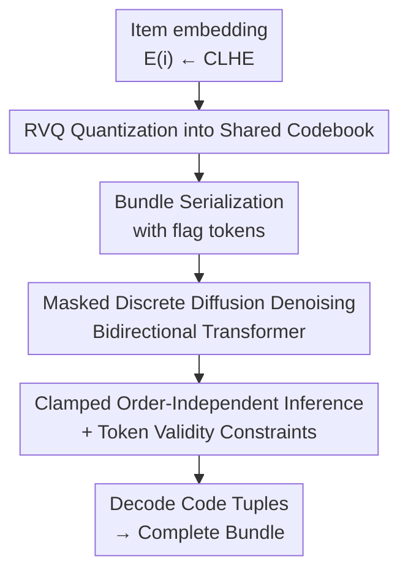

# Discrete Diffusion for Bundle Construction

**Conference**: ICLR2026  
**OpenReview**: [https://openreview.net/forum?id=dKyhgfe50H](https://openreview.net/forum?id=dKyhgfe50H)  
**Code**: https://github.com/LiAi16/DDBC  
**Area**: Recommender Systems / Generative Recommendation / Discrete Diffusion  
**Keywords**: Bundle Construction, Discrete Diffusion, Residual Vector Quantization (RVQ), Masked Denoising, Non-sequential Generation

## TL;DR
DDBC reformulates "Bundle Construction" (selecting a group of items from a large library to form a complete bundle or completing a partial one) as a **masked discrete diffusion** process. It employs Residual Vector Quantization (RVQ) to compress each item into discrete codes within a shared codebook to mitigate the dimensionality explosion of massive item libraries. A bidirectional Transformer then restores `[MASK]` tokens into a complete bundle in an order-independent manner, achieving a relative improvement of over 100% on long-bundle datasets compared to the strongest baselines.

## Background & Motivation

**Background**: Bundle construction is a fundamental task in item bundling—selecting a subset from a massive item gallery to form a complete bundle (e.g., playlists, outfits, game packs) or completing one given partial items. Existing approaches mostly follow the **sequential construction paradigm**, treating bundles as sequences and predicting the "next" item, essentially adopting autoregressive models from sequential recommendation (e.g., Bi-LSTM, SASRec, TIGER, BundleMLLM).

**Limitations of Prior Work**: Bundles are inherently **unordered sets** rather than sequences—user consumption of a playlist or outfit does not follow a fixed left-to-right order, and there is minimal sequential dependency between adjacent items. Forcing a sequential model introduces **artificial order bias**, leading to overfitting on dataset-specific permutations and harming generalization. Even non-sequential methods (outputting the bundle as a set at once) only solve half the problem.

**Key Challenge**: The authors summarize the difficulty as **two curses of dimensionality**. Let $N$ be the item library size and $k$ be the bundle length. Modeling bundles as sequences yields a search space of $P(N,k)$, while relaxing the order constraint reduces it to $C(N,k)$—yet combinations remain **exponential** relative to $N$ and $k$. This leads to two technical challenges: (1) As $k$ grows linearly, the complexity of high-order relations within a bundle (pairwise, triple, quadruple similarity/compatibility) expands exponentially; how can these be efficiently preserved? (2) With $N$ reaching tens of thousands to millions (Spotify/Amazon scale), traditional embedding-per-item approaches struggle to precisely locate items in a vast candidate space.

**Goal**: To model high-order intra-bundle relations (addressing $k$) while compressing the search space of $N$ without losing discriminative power in item representation.

**Key Insight**: Diffusion models are inherently **non-sequential**; they select items based on a strategy learned for the entire bundle structure rather than a fixed left-to-right decoding order. Furthermore, "random mask" training in discrete diffusion allows the model to observe diverse contexts, approximating the modeling of the **joint distribution** of items within a bundle. Combined with RVQ to map items to a **globally shared codebook** much smaller than the library, the curse of $N$ can be mitigated.

**Core Idea**: Replace autoregressive methods with **masked discrete diffusion** for order-independent bundle completion, operating on the **RVQ discrete code space** rather than the original item ID space to address both curses of dimensionality simultaneously.

## Method

### Overall Architecture
DDBC connects two main components: **RVQ to discretize continuous item embeddings into code tokens** + a **Masked Discrete Diffusion Model (DDM) operating on code tokens for whole-bundle construction**. The task is formalized as follows: for a target bundle $\bar b$, given a subset $b_x \subseteq \bar b$, predict the complementary set $b_y = \bar b \setminus b_x$ (where $b_x=\varnothing$ represents construction from scratch).

The workflow proceeds as follows: First, a fixed item encoder (CLHE) generates continuous embeddings for each item, which are quantized into a sequence of discrete codes via $L$-level RVQ. All item codes in a bundle are flattened and serialized into a token sequence punctuated by flag tokens. During training, "absorbing state masking" forward corrosion is applied to code tokens, training a bidirectional Transformer to recover original codes from masked sequences. During inference, codes for known items $b_x$ are **clamped**, while target slots are filled with `[MASK]`. The model iteratively denoises until the bundle is restored, finally mapping the predicted code tuples back to valid items in the library.

### Key Designs

**1. RVQ Residual Quantization: Compressing Massive Libraries into a Small Shared Codebook**

To address the second challenge ($N$ is too large), DDBC abandons unique embeddings per item. Instead, it uses $L$-level Residual Vector Quantization to discreteize a continuous embedding $E(i)$ into a code tuple $z(i)=(z_{i,1},\dots,z_{i,L})$. Each level selects a code based on the **residual** of the previous level: let $r^{(0)}=E(i)$; for $\ell=1,\dots,L-1$, $z_{i,l}=\arg\min_{c}\lVert r^{(\ell-1)}-e^{(\ell)}_c\rVert_2^2$ and $r^{(\ell)}=r^{(\ell-1)}-e^{(\ell)}_{z_{i,\ell}}$. Reconstruction uses the first $L-1$ semantic codebooks: $\hat E(i)=\sum_{\ell=1}^{L-1} e^{(\ell)}_{z_{i,\ell}}$. The final level is a **dedup code**—a non-semantic incrementing field ensuring the code tuple maps one-to-one back to a unique item ID. The loss consists of reconstruction and codebook commitment terms:

$$\mathcal{L}_{\text{RVQ}}=\lVert E(i)-\hat E(i)\rVert_2^2+\beta\sum_{\ell=1}^{L-1}\Big(\lVert \text{sg}[r^{(\ell-1)}]-e^{(\ell)}_{z_{i,\ell}}\rVert_2^2+\lVert r^{(\ell-1)}-\text{sg}[e^{(\ell)}_{z_{i,\ell}}]\rVert_2^2\Big)$$

where $\text{sg}[\cdot]$ denotes stop-gradient and discrete selection uses a straight-through estimator. RVQ provides three benefits: **Vocabulary compression** (theoretical capacity is $\prod_{\ell=1}^L C_\ell$, allowing a massive universe to be indexed with small codebooks $C_\ell\equiv 128$); **Denser supervision** (each item contributes $L$ tokens, providing much denser feedback than a single ID); and **Coarse-to-fine granularity** (early codebooks capture coarse semantics while latter ones refine them, facilitating implicit clustering for denoising).

**2. Masked Discrete Diffusion: Replacing Autoregressive Construction with Order-Independent Denoising**

To address the first challenge (modeling high-order relations as $k$ grows), DDBC treats bundle construction as **absorbing state masked** discrete diffusion. The complete bundle at $t=0$ is the clean state. In each forward step, each unmasked code token is independently replaced by `[MASK]` with probability $\beta_t$, eventually reaching an all-`[MASK]` state. The survival probability $\alpha_t=\prod_{s=1}^t(1-\beta_s)$ defines the closed-form transition: $q(z^{(t)}=v\mid z^{(0)}=u)=\alpha_t\,\mathbb{1}[v=u]+(1-\alpha_t)\,\mathbb{1}[v=\text{MASK}]$. A linear schedule $\alpha_t=1-t/T$ is used. The reverse process employs a bidirectional Transformer $\theta$ to predict original code values using an MDLM-style reconstruction objective—directly predicting the original token $z^{(0)}_{j,l}$ from a corrupted state $Z^{(t)}$ at random time step $t$. The training objective is a weighted cross-entropy for masked tokens:

$$\mathcal{L}_{\text{NELBO}}=\mathbb{E}_{t}\,\mathbb{E}_{M_t}\sum_{(j,\ell)\in M_t}-\log p_\theta\big(z^{(0)}_{j,\ell}\mid Z^{(t)},t\big)$$

Random masking ensures the model observes various "revealed subsets" during training, effectively approximating the joint distribution of items within the bundle rather than being locked into a specific decoding order, thereby capturing high-order intra-bundle relations.

**3. Bundle Serialization with flag tokens: Supplementing Unordered Generation with Boundary Information**

Diffusion denoising has no inherent order, but the model must know "which bits of code belong to the same item." DDBC serializes the bundle using three never-masked flag tokens: each item is preceded by `<boi>`, and the sequence is wrapped with `<bos>`/`<eos>`. Tokens are split into two sets: the flag set $\Omega_{\text{flag}}=\{\texttt{<bos>},\texttt{<boi>},\texttt{<eos>}\}$ which is never corrupted, and the code set $\Omega_{\text{code}}$ (the $L$ codes per item) which participates in masking and prediction. The `<boi>` token provides positional information for item segmentation, allowing unordered denoising to correctly align which code belongs to which item.

**4. Clamped Order-Independent Inference + Token Validity Constraints: Ensuring Feasibility**

During inference, known items $b_x$ and flag tokens are filled with ground truth, while target complement slots $b_y$ are filled with `[MASK]`: $z_u=\mathbb{1}[u\in\Omega_x\cup\Omega_{\text{flag}}]\,x_u+\mathbb{1}[u\in\Omega_y]\,\text{MASK}$. The model then iteratively denoises. A key mechanism is **clamping**: all revealed tokens (from $b_x$ or previous generation steps) are treated as fixed observations, never re-masked or overwritten. This allows the model to decode items in any order. Furthermore, every prediction at position $(j,\ell)$ is constrained within the valid code set $V^{(\ell)}=\{1,\dots,C_\ell\}$ for that level (by setting illegal token logits to $-\infty$ before softmax), ensuring the generated code tuples decode into **valid** items in the library.

### Loss & Training
The total loss comprises the RVQ quantization loss and the masked cross-entropy (NELBO) for diffusion. Implementation details: the encoder is fixed as CLHE; RVQ uses $L=4$ levels with $C=128$ per level; the diffusion backbone is a lightweight DDiT (6 Transformer blocks, hidden dim 64, 8 heads) with only 0.79M parameters; linear noise schedule; trained for 20,000 steps. For data, long bundles are truncated (Spotify to 30/60/90, POG to 4), and intra-bundle shuffling is used for data augmentation.

## Key Experimental Results

### Main Results
Datasets: Spotify Playlist Continuation ($k=30/60/90$) and POG Outfit Completion ($k=4$). Metrics: F1, Jaccard (Jacc), and Optimal Alignment Score (OAS). Candidate ratio $\rho=100$.

| Dataset | Metric | DDBC | Strongest Baseline | Relative Gain |
|---------|--------|------|--------------------|---------------|
| Spotify k=30 | F1 | 0.282 | 0.153 (BundleNAT) | +84.3% |
| Spotify k=60 | Jacc | 0.178 | 0.076 (TIGER) | +134.2% |
| Spotify k=90 | F1 | 0.287 | 0.123 (TIGER) | +133.3% |
| Spotify k=90 | Jacc | 0.177 | 0.070 (TIGER) | +152.9% |
| POG k=4 | F1 | 0.139 | 0.213 (TIGER) | Inferior (see below) |

The advantage of DDBC becomes more pronounced as bundle length increases, confirming its ability to capture high-order structural dependencies in long bundles. On POG ($k=4$), it underperforms relative to TIGER; the authors attribute this to the task degenerating into "next-item prediction" when only two items are predicted, where autoregressive methods naturally excel.

### Ablation Study

| Configuration | F1 | Jacc | OAS | Note |
|---------------|----|------|-----|------|
| DDBC (Full, Spotify k=30) | 0.282 | 0.176 | 0.660 | — |
| w/o RVQ | 0.021 | 0.011 | 0.557 | F1 crashes with item IDs |
| w/o boi token | 0.176 | 0.104 | 0.538 | Significant drop without position info |
| w/o Data Augmentation | 0.254 | 0.158 | 0.599 | Small drop due to sparser context |
| w/o Validity Filtering | 0.276 | 0.173 | – | Illegal rate rises to 2.5% |

### Key Findings
- **RVQ is the linchpin**: Removing it causes F1 to crash (0.282 to 0.021), as learning is nearly impossible without dense code-level supervision in a massive vocabulary (254,155 for Spotify).
- **Scalability**: DDBC's relative gains increase significantly with bundle length and candidate pool size.
- **Extremely Lightweight**: With only 0.79M parameters, it is much faster than LLM-based approaches (BundleMLLM).

## Highlights & Insights
- **Matching Unordered Set Generation with Masked Diffusion**: Since bundles are inherently unordered, the order-independent decoding of masked discrete diffusion is a natural fit, avoiding the sequential bias of autoregressive models.
- **RVQ as a Dimensionality Bridge**: Mapping the curse of dimensionality from "item space" to "code space" allows for indexing millions of items with a capacity of $\prod C_\ell$, providing both dense supervision and coarse-to-fine semantics.
- **Engineering Closure via Clamping and Filtering**: Clamping ensures consistency for known items, and validity filtering ensures feasibility for recommendations.

## Limitations & Future Work
- **Fixed-length Protocol**: The current training is tied to fixed bundle lengths; while training-free variable-length generation is possible, it lacks principled stopping criteria.
- **Weak Personalization**: User signals are mediated through frozen encoders; there is no explicit injection of user instructions into the diffusion process.
- **Evaluation Constraints**: Dependence on random candidate sets for exact-match evaluation only partially reflects the open-world reality where multiple alternative items may be equally valid.

## Related Work & Insights
- **vs TIGER (Generative Retrieval / Autoregressive Semantic IDs)**: Both use RVQ for quantization, but TIGER uses an autoregressive decoder. DDBC replaces the backbone with **discrete diffusion** to eliminate order bias, significantly outperforming TIGER on long bundles.
- **vs BundleNAT (Non-autoregressive Generation)**: BundleNAT predicts all items in one pass using a contrastive decoder but relies on predefined templates. DDBC's iterative denoising allows for continuous intra-bundle context interaction during generation.
- **vs Continuous Diffusion Recs**: Previous diffusion models in recommendation mostly target next-item sequences in continuous latent spaces. DDBC is the **first to use discrete diffusion for bundle construction**, operating directly in the discrete code space to suit the task's nature.

## Rating
- Novelty: ⭐⭐⭐⭐⭐ 
- Experimental Thoroughness: ⭐⭐⭐⭐ 
- Writing Quality: ⭐⭐⭐⭐⭐ 
- Value: ⭐⭐⭐⭐ 

<!-- RELATED:START -->

## Related Papers

- [\[ICLR 2026\] Steering Diffusion Models Towards Credible Content Recommendation](steering_diffusion_models_towards_credible_content_recommendation.md)
- [\[ICLR 2026\] iFusion: Integrating Dynamic Interest Streams via Diffusion Model for Click-Through Rate Prediction](ifusion_integrating_dynamic_interest_streams_via_diffusion_model_for_click-throu.md)
- [\[ICLR 2026\] Catalog-Native LLM: Speaking Item-ID dialect with Less Entanglement for Recommendation](catalog-native_llm_speaking_item-id_dialect_with_less_entanglement_for_recommend.md)
- [\[ICLR 2026\] Continual Low-Rank Adapters for LLM-based Generative Recommender Systems](continual_low-rank_adapters_for_llm-based_generative_recommender_systems.md)
- [\[ICLR 2026\] From Evaluation to Defense: Advancing Safety in Video Large Language Models](from_evaluation_to_defense_advancing_safety_in_video_large_language_models.md)

<!-- RELATED:END -->
