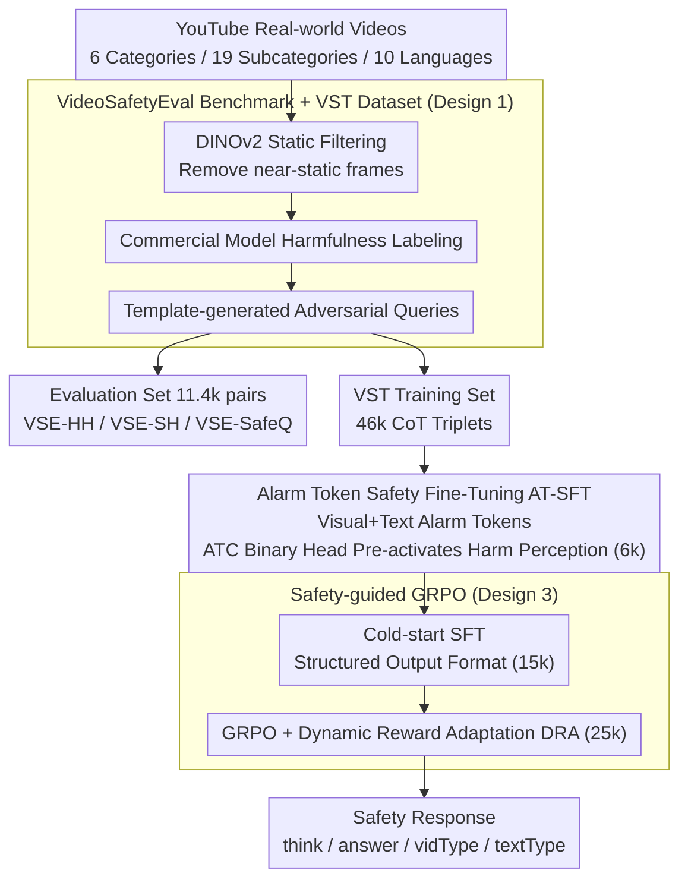

# From Evaluation to Defense: Advancing Safety in Video Large Language Models

**Conference**: ICLR2026  
**arXiv**: [2505.16643](https://arxiv.org/abs/2505.16643)  
**Code**: To be confirmed  
**Area**: Recommender Systems  
**Keywords**: video LLM safety, benchmark, alarm token, GRPO, safety alignment

## TL;DR
Constructed VideoSafetyEval (11.4k video-query pairs covering 19 risk categories) to reveal that the video modality causes a 34.2% decline in safety performance, and proposed the VideoSafety-R1 three-stage framework (Alarm Token + SFT + Safety-guided GRPO) which increases defense success rate by 71.1% on VSE-HH.

## Background & Motivation
**Background**: Safety risks in Image LLMs have been extensively studied (MMBench, SIUO, SafeVLM, etc.), but safety alignment for Video LLMs is significantly deficient. Temporal dynamics, visual cues, and evolving contexts in videos introduce more subtle and effective risks than static images.

**Limitations of Prior Work**: Systematic testing of 21 mainstream Video LLMs found that the Defense Success Rate (DSR) drops by an average of 34.2% upon introducing the video modality, exposing systemic risks in multimodal attack exploitation. The DSR of VideoLLaMA3-2B dropped by as much as 79.4%.

**Safety Research Gap**: Existing defense methods (SafeVLM, SPA-VL, MM-RLHF) all focus on static images, ignoring video safety. Although Video Anomaly Detection (VAD) is related, its goal is different—VAD focuses on detecting abnormal events, while safety alignment focuses on controlling the model's behavioral response to harmful inputs.

**Key Insight**: Safety alignment should upgrade from mere "harm perception" to "proactive reasoning"—the model should not only identify harmful content but also analyze the harmfulness of video-text pairs through reasoning chains and generate helpful safety responses.

## Method

### Overall Architecture
VideoSafety-R1 is a post-training framework that advances the safety capabilities of Video LLMs from passive "harm perception" to proactive "safety reasoning." It first uses large-scale real-world videos to construct the VideoSafetyEval (VSE) benchmark to expose vulnerabilities, reusing the same construction pipeline to produce the accompanying VideoSafetyThinking dataset (VST, 46k video-query-Chain of Thought triplets, of which 6k are used for AT-SFT, 15k for cold-start, and 25k for reinforcement learning). Subsequently, it sequentially completes Alarm Token-guided Safety Fine-Tuning (AT-SFT) and Safety-guided GRPO training, enabling the model to first identify the harmfulness of both video and text and then generate helpful safety responses. The entire pipeline represents the transition "from evaluation to defense" as stated in the title—the benchmark quantifies the problem, and the two-stage post-training supplements the defense capabilities.

### Key Designs

**1. VideoSafetyEval Benchmark and VST Dataset: Quantifying the Safety Degradation Induced by Video**

To study video safety, one first needs an evaluation set capable of exposing issues. The authors collected real-world videos from YouTube based on community guidelines and filtered them through three stages—static filtering using DINOv2 to remove near-static invalid clips, harmfulness labeling using commercial video understanding models, and template-driven generation of adversarial queries. This same pipeline serves a dual purpose: it exports the VideoSafetyEval benchmark (11.4k video-query pairs covering 6 major risk categories, 19 subcategories, and 10 language communities) and produces the VideoSafetyThinking training dataset (46k video-query-CoT triplets for subsequent stages). The benchmark is divided into three subsets to isolate failure modes—VSE-HH (Harmful videos with Harmful queries, strongest adversariality), VSE-SH (Safe videos with Harmful queries), and VSE-SafeQ (Safe queries, specifically measuring over-defense caused by false refusals). On this benchmark, the authors measured an average DSR drop of 34.2% across 21 mainstream models, defining the objective for subsequent defense methods.

**2. Alarm Token-guided Safety Fine-Tuning (AT-SFT): "Pre-activating" Safety Signals at the Perception Layer**

Before reinforcement learning, a starting point for safety perception is required, otherwise reasoning cannot occur. The authors inject a learnable alarm token $\mathbf{h}_v^{\text{alarm}}$ at the end of the visual sequence and $\mathbf{h}_t^{\text{alarm}}$ at the end of the text sequence, letting these tokens act as "safety probes" for their respective modalities. During training, in addition to the original generation loss, a binary harmful/safe classification head (ATC, Alarm Token Classification) is attached to the hidden states of both alarm tokens to align representations with ground-truth safety labels. The overall objective is $\mathcal{L}_{\text{AT-SFT}} = \mathcal{L}_{\text{base}} + \lambda_1 \mathcal{L}_{\text{ATC}}^v + \lambda_2 \mathcal{L}_{\text{ATC}}^t$. This step uses only 6k samples and serves to "explicitly externalize" the harmfulness of video and text within the model, establishing a usable perceptual foundation for subsequent bimodal reasoning in GRPO.

**3. Safety-guided GRPO: Organizing Perceived Safety Signals into Interpretable Reasoning Chains and Balancing Safety and Naturalness with Dynamic Rewards**

Perception alone is insufficient; the model must also reason and provide responses that are both safe and useful. The authors first use 15k samples for cold-start SFT to train a structured output format: `<think>` for safety reasoning, `<answer>` for the final response, and `<vidType>` and `<textType>` for labeling video and text harmfulness, respectively. Subsequently, GRPO is performed on 25k samples, with a reward weighted by four components: format, ROUGE similarity to safety references, video classification, and text classification: $r = r_{\text{format}} + \alpha \cdot r_{\text{ROUGE}} + \gamma_1 \cdot r_v + \gamma_2 \cdot r_t$. The key innovation is Dynamic Reward Adaptation (DRA): the ROUGE weight $\alpha$ is not fixed but changes based on whether bimodal classification is correct: $\alpha = \alpha_{\min} + (1 - \text{Correct}_v \cdot \text{Correct}_t)(\alpha_{\max} - \alpha_{\min})$. When both video and text judgments are correct, $\alpha$ decreases to $\alpha_{\min}$, relaxing the imitation of safety references to encourage response diversity; if any judgment is wrong, $\alpha$ increases to $\alpha_{\max}$ to force alignment with safety references. In this way, the model adaptively trades off between "answering safely" and "answering naturally," suppressing harmful outputs while avoiding rigid rejections.

## Key Experimental Results

### Main Results: Performance of 21 Video LLMs on VSE-HH

| Model | DSR (w/ Video)↑ | DSR (w/o Video) | DSR Drop↓ | Helpfulness↑ |
|------|------------|-----------|----------|--------|
| Gemini-2.5-Pro | 86.7% | 99.5% | 12.8% | 1.6 |
| GPT-4o | 73.0% | 98.4% | 25.9% | 2.2 |
| VideoLLaMA3-2B | 18.4% | 89.3% | **79.4%** | 2.3 |
| InternVideo2.5-8B | 16.5% | 53.5% | 69.2% | 1.0 |

### VideoSafety-R1 Performance

| Metric | Baseline (VideoLLaMA3-2B) | VideoSafety-R1 | Gain |
|------|------|------|------|
| VSE-HH DSR | 18.4% | — | **+71.1%** |
| MMBench DSR | — | — | **+59.1%** |
| VLGuard | — | — | **+44.3%** |
| FigStep | — | — | **+15.0%** |

### Key Findings
- The introduction of the video modality significantly degrades the safety of all models—even GPT-4o drops by 25.9%.
- Models that rely more on efficient video encoding (e.g., 1fps) show more severe degradation (VideoLLaMA3 drops by 79.4% vs. VideoLLaMA2 by 7.3%).
- VideoSafety-R1 achieves the highest DSR in 18 out of 19 subcategories.
- Safety improvements do not significantly impair general capabilities—helpfulness scores remain at reasonable levels.
- The model generalizes to image safety benchmarks (MMBench/VLGuard/FigStep), indicating that safety reasoning capabilities are transferable.

## Highlights & Insights
- First large-scale real-world Video LLM safety benchmark—based on YouTube community guidelines, aligned with actual scenarios.
- Progressive safety alignment design from perception (AT-SFT Alarm Tokens) to reasoning (Safety-guided GRPO Chain of Thought)—generates helpful safety responses rather than simple rejections.
- Dynamic Reward Adaptation mechanism elegantly balances safety and response quality—relaxing ROUGE constraints to encourage natural responses when classification is correct.
- Bimodal independent labeling (video harmfulness vs. text harmfulness) allows the model to distinguish risks from different sources.

## Limitations & Future Work
- Binary labels for safety classification (harmful/safe) may be too coarse, as fine-grained risk levels are not considered.
- Over-defense (false refusal rate) requires a trade-off with safety—the VSE-SafeQ subset allows for evaluation, but the paper does not analyze it in depth.
- The baseline model is VideoLLaMA3-2B (2B parameters); effectiveness on larger models (7B+) has not been fully verified.
- The labeling quality of the 46k training data pairs depends on commercial LLMs, carrying a risk of annotation bias.
- Evaluation relies on the Qwen-Long API as a judge, which may introduce evaluation bias.

## Related Work & Insights
- **vs. SafeVLM/SPA-VL**: Focused on static image safety; this paper is the first to systematically address video safety.
- **vs. Video Anomaly Detection (UCF-Crime/XD-Violence)**: VAD detects abnormal events, while this paper controls model behavioral responses—the goals are different.
- **vs. MM-RLHF**: Uses DPO for visual safety alignment; this paper uses GRPO + rule-based rewards—offering more control.
- **vs. SafeWatch-Bench**: Focuses on video content safety understanding, while this paper focuses on model response safety alignment—complementary directions.

## Rating
- Novelty: ⭐⭐⭐⭐⭐ First systematic work on Video LLM safety, filling a critical gap.
- Experimental Thoroughness: ⭐⭐⭐⭐⭐ Evaluation of 21 models + 4 safety benchmarks + multi-component ablation.
- Writing Quality: ⭐⭐⭐⭐ Clear structure with three components progressing logically.
- Value: ⭐⭐⭐⭐⭐ Establishes the benchmark and methodological foundation for Video LLM safety research.

<!-- RELATED:START -->

## Related Papers

- [\[ICLR 2026\] RPM: Reasoning-Level Personalization for Black-Box Large Language Models](rpm_reasoning-level_personalization_for_black-box_large_language_models.md)
- [\[NeurIPS 2025\] Inference-Time Reward Hacking in Large Language Models](../../NeurIPS2025/recommender/inference-time_reward_hacking_in_large_language_models.md)
- [\[AAAI 2026\] Inference-Aware Prompt Optimization for Aligning Black-Box Large Language Models](../../AAAI2026/recommender/inference-aware_prompt_optimization_for_aligning_black-box_large_language_models.md)
- [\[ICLR 2026\] Adaptive Regularization for Large-Scale Sparse Feature Embedding Models](adaptive_regularization_for_large-scale_sparse_feature_embedding_models.md)
- [\[AAAI 2026\] Hard vs. Noise: Resolving Hard-Noisy Sample Confusion in Recommender Systems via Large Language Models](../../AAAI2026/recommender/hard_vs_noise_resolving_hard-noisy_sample_confusion_in_recommender_systems_via_l.md)

<!-- RELATED:END -->
