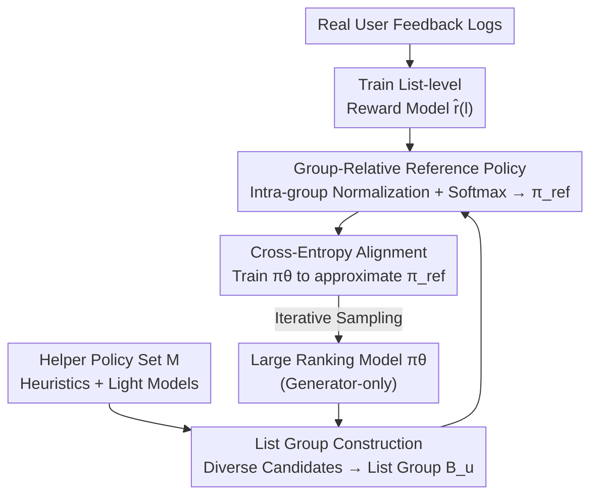

# GoalRank: Group-Relative Optimization for a Large Ranking Model

**Conference**: ICLR 2026  
**arXiv**: [2509.22046](https://arxiv.org/abs/2509.22046)  
**Code**: None  
**Area**: LLM Alignment / Recommendation Ranking  
**Keywords**: ranking, generator-only, group-relative optimization, scaling law, recommendation  

## TL;DR
It is theoretically proven that any Multi-Generator-Evaluator ranking system can be approximated with smaller error by a larger generator-only model that satisfies the scaling law. Accordingly, GoalRank is proposed—training a large generator-only ranking model by constructing group-relative reference policies with a reward model. It significantly outperforms SOTA in online A/B tests.

## Background & Motivation
**Background**: The ranking stage of a recommendation system selects an ordered list of length L from N candidates (a $P(N,L)$ combinatorial space). The mainstream approach is the Generator-Evaluator two-stage paradigm: the generator produces candidate lists, and the evaluator selects the optimal one.

**Limitations of Prior Work**: Gains from increasing the number of generators or integrating multiple generators saturate rapidly (Fig 1d). The two-stage paradigm introduces cross-stage inconsistency and engineering complexity.

**Key Challenge**: The strategy space of two-stage methods is limited by the mixture of k small generators, whereas the scaling laws of end-to-end large models suggest a larger single model might be superior.

**Goal**: (1) Can generator-only models theoretically surpass Multi-G-E? (2) How can such a large ranking model be trained?

**Key Insight**: Theorem 1 proves that the approximation error of a larger generator-only model is strictly smaller than any finite Multi-G-E and tends toward zero as the model size increases.

**Core Idea**: Construct a group-relative softmax reference policy on candidate list groups using a reward model, and train the large ranking model to approximate the optimal policy via cross-entropy.

## Method

### Overall Architecture
GoalRank compresses the traditional two-stage ranking into an end-to-end large generator (generator-only). The training consists of three steps. First, a list-level reward model $\hat{r}(l)$ is trained using real user feedback to estimate the total user feedback (e.g., watch time, interaction) a recommendation list can generate. Second, a batch of candidate lists $\mathcal{B}_u$ is sampled for each user; candidates come from both the main ranking model $\pi_\theta$ under training and a helper policy set $\mathcal{M}$ (heuristic rules + lightweight neural models) to ensure sufficient diversity within the group. Third, the rewards within the group are standardized (subtracting the mean and dividing by the standard deviation) and passed through a softmax to convert rewards into a reference policy $\pi^{ref}$. The model $\pi_\theta$ then approximates this policy via cross-entropy. This process no longer relies on an independent evaluator for selection; instead, the "evaluation" signal is distilled into the training objective of a single model. The theoretical justification for abandoning the evaluator in favor of a large generator is provided by Theorem 1.

### Key Designs

**1. Theorem 1: Theoretical justification for why generator-only is worthwhile**

GoalRank starts from a counter-intuitive conclusion: a single large model can theoretically outperform an ensemble of any number of small generators. The paper abstracts the two-stage scheme as a k-mixture $(\alpha, \beta)$-bounded strategy space $\mathcal{C}_m^k$ and the end-to-end scheme as a generator-only strategy space $\mathcal{F}_M$. It proves that as long as the width of the latter is $\geq k\alpha + n$, there exists $\mathcal{E}(\mathcal{F}_M) < \mathcal{E}(\mathcal{C}_m^k)$, meaning the error in approximating the optimal policy $\pi^*$ is strictly smaller. Furthermore, as model capacity $n \to \infty$, $\lim_{n \to \infty} \mathcal{E}(\mathcal{F}_M) = 0$. This theorem directly explains the "saturation of multi-generator gains" observed in experiments: the strategy space of an ensemble is capped by the mixture of $k$ small models, while scaling up a single model can continuously approach the optimum.

**2. List Group Construction: Stretching reward gaps through diversified candidates**

For the third step's group-relative normalization to be effective, the rewards within the same list group must be distinguishable. If sampling only from a single generator, lists will be too similar, and reward differences will be too small, causing normalization to amplify noise. To address this, GoalRank introduces a helper policy set $\mathcal{M}$ when building the list group $\mathcal{B}_u$, which includes both heuristic rules and lightweight neural models to generate candidate lists with varied styles alongside the main model $\pi_\theta$. This diversity ensures that each group contains both good and bad lists, making reward gaps more likely to exceed critical thresholds and ensuring stable ordinal relationships in the reference policy. Ablation studies show that groups that are too small (3–5) lack sufficient samples, while groups that are too large (50–100) dilute the reward gaps; a medium scale (8–20) is optimal.

**3. Group-relative reference policy: Enabling reliable supervision from biased reward models**

Directly using absolute scores from a reward model as training targets is risky because real-world reward models almost certainly contain systematic bias $\hat{r}(l) = r^*(l) + b(l)$. GoalRank's approach is to trust only the relative relationships within a group. By applying normalization (mean subtraction and division by standard deviation) followed by a softmax over the list group $\mathcal{B}$, the reference policy is obtained:

$$
\pi^{ref}(l|\mathcal{B}) = \frac{\exp((\hat{r}(l) - \bar{r}_\mathcal{B})/\sigma_\mathcal{B})}{\sum_{l'} \exp((\hat{r}(l') - \bar{r}_\mathcal{B})/\sigma_\mathcal{B})}
$$

where $\bar{r}_\mathcal{B}$ and $\sigma_\mathcal{B}$ are the intra-group mean and standard deviation. No matter if the reward model predicts overall higher or lower values, normalization cancels the absolute bias. As long as the intra-group reward gaps are large enough, the ordinal relationship between lists remains correct—which is the exact signal needed for training. After obtaining $\pi^{ref}$, cross-entropy is used to align $\pi_\theta$ (equivalent to minimizing a feasible upper bound of the KL divergence to $\pi^*$). This shares the same core logic as RLHF/DPO: constraining the policy using relative preferences rather than absolute scores.

## Key Experimental Results

### Main Results (ML-1M / Industry / Amazon-Book)

| Method | ML-1M H@6 | Industry H@6 | Book H@6 |
|------|-----------|-------------|----------|
| Best G-E (PIER) | 62.74 | 45.35 | 71.14 |
| Best MG-E (G-100) | 60.64 | - | - |
| **GoalRank** | **64.51** | **55.33** | **74.29** |
| Gain vs. best baseline | +2.77% | +11.3% | +1.7% |

### Scaling Law Validation
The performance of GoalRank improves steadily with the increase in model parameters and training data volume, demonstrating a clear scaling law.

### Online A/B Tests
On an industrial short-video platform, GoalRank achieved significant improvements in core metrics compared to SOTA baselines.

### Key Findings
- Generator-only GoalRank outperforms all G-E and MG-E baselines across all datasets, validating Theorem 1.
- In MG-E methods, increasing generators from 3 to 100 leads to saturation or even a decline in performance gains.
- Group-relative normalization makes training robust to the absolute bias of the reward model, requiring only correct ordinal relationships.

## Highlights & Insights
- **Theory-driven Practice**: Theorem 1 is not just theoretical decoration; it guides the entire framework design—abandoning the two-stage paradigm, scaling up the generator, and using group-relative optimization to avoid the need for precise rewards.
- **Echoes DPO/RLHF**: The group-relative optimization in GoalRank is highly similar to RLHF/DPO in LLM alignment—both use reward signals to construct a reference distribution for training the policy, with the application changing from "text generation" to "list ranking."
- **Recommendation System Version of Scaling Law**: Demonstrates scaling laws in ranking tasks similar to those seen in LLMs for the first time.

## Limitations & Future Work
- Requires a pre-trained reward model; its quality ceiling determines the ceiling for GoalRank.
- The choice of the helper policy set $\mathcal{M}$ impacts list group diversity and reward gaps.
- Only validated in recommendation ranking scenarios; applications in LLM alignment (e.g., RLHF) remain unexplored.

## Related Work & Insights
- **vs. PIER/NAR4Rec**: Two-stage G-E methods limited by finite coverage of the candidate list space. GoalRank optimizes directly across the full policy space.
- **vs. DPO/RCPO**: RCPO uses ranked choice instead of pairwise in text alignment; GoalRank uses group-relative instead of pointwise in recommendation ranking. The core concept is consistent.

## Rating
- Novelty: ⭐⭐⭐⭐ Theoretical proof that generator-only is superior to G-E is a strong contribution; group-relative optimization is an innovative approach.
- Experimental Thoroughness: ⭐⭐⭐⭐⭐ Public datasets + industrial datasets + online A/B testing + scaling law.
- Writing Quality: ⭐⭐⭐⭐ Excellent integration of theory and practice.
- Value: ⭐⭐⭐⭐ Significant impact on the ranking paradigm of recommendation systems.

<!-- RELATED:START -->

## Related Papers

- [\[AAAI 2026\] Inference-Aware Prompt Optimization for Aligning Black-Box Large Language Models](../../AAAI2026/recommender/inference-aware_prompt_optimization_for_aligning_black-box_large_language_models.md)
- [\[ICLR 2026\] Off-Policy Evaluation for Ranking Policies under Deterministic Logging Policies](off-policy_evaluation_for_ranking_policies_under_deterministic_logging_policies.md)
- [\[ACL 2026\] GraphLoRA: Structure-Aware Low-Rank Adaptation for Large Language Model Recommendation](../../ACL2026/recommender/graphlora_structure-aware_low-rank_adaptation_for_large_language_model_recommend.md)
- [\[ICML 2025\] ELMO: Efficiency via Low-precision and Peak Memory Optimization in Large Output Spaces](../../ICML2025/recommender/elmo_efficiency_via_low-precision_and_peak_memory_optimization_in_large_output_s.md)
- [\[NeurIPS 2025\] Measuring What Matters: Construct Validity in Large Language Model Benchmarks](../../NeurIPS2025/recommender/measuring_what_matters_construct_validity_in_large_language_model_benchmarks.md)

<!-- RELATED:END -->
