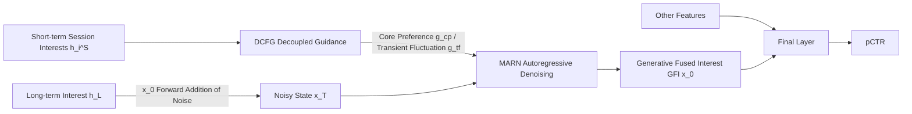

# iFusion: Integrating Dynamic Interest Streams via Diffusion Model for Click-Through Rate Prediction

**Conference**: ICLR 2026  
**OpenReview**: [https://openreview.net/forum?id=iYQgXETC1D](https://openreview.net/forum?id=iYQgXETC1D)  
**Code**: To be confirmed  
**Area**: Recommender Systems / CTR Prediction / Generative User Interest Modeling  
**Keywords**: CTR Prediction, Long-Short Term Interest Fusion, Diffusion Models, Classifier-Free Guidance, Autoregressive Denoising  

## TL;DR
iFusion reformulates "long-short term user interest fusion" as a conditional generation problem—utilizing short-term interests as guidance to perform diffusion denoising on long-term interest representations. This approach bypasses the assumptions of traditional linear fusion (concatenation/attention/gating), achieving CTR improvements across public datasets, industrial datasets, and online A/B tests.

## Background & Motivation

**Background**: CTR prediction is core to recommendation and advertising, predominantly built upon user behavior modeling. Conventional practices partition behaviors into long-term sequences (stable preferences, modeled via historical logs) and short-term sequences (volatile interests, modeled via recent sessions), which are then fused after sophisticated individual modeling. Substantial progress has been made in long-term modeling (SIM, ETA, TWIN series) and short-term modeling independently.

**Limitations of Prior Work**: Conversely, the "fusion" step has been long overlooked. Existing fusion methods (concatenation, attention, gating) inherently rely on linear assumptions. The authors identify three critical flaws:

- **Feature Space Misalignment**: Long-term and short-term behaviors use different features and encoders (e.g., clicks vs. purchases). These two representations are naturally heterogeneous; linear operators presuppose spatial alignment that does not exist.
- **Fragmented Late-Fusion**: Late-fusion splits "behavior modeling" and "interest fusion" into independent pipelines, creating an inductive bias that hinders cross-sequence integration.
- **Perturbation-Interest Entanglement**: Linear fusion lacks a mechanism to distinguish meaningful interest signals from random fluctuations in the short term, allowing noise to propagate uncontrollably and contaminate stable long-term representations.

Furthermore, generative ranking schemes like HSTU concatenate all behaviors into a single sequence, which can lead to insufficient modeling when behaviors are sparse—discriminative ranking fails to "infer and fuse" interests from limited evidence.

**Key Challenge**: Long-short term interests follow heterogeneous, non-stationary, and sometimes contradictory evolution patterns. Linear fusion operators cannot capture these non-linear interactions nor disentangle noise from signals.

**Goal**: To design a fusion mechanism that is robust to perturbations, allows for joint modeling and fusion, and satisfies low-latency requirements for online serving.

**Core Idea**: Instead of treating fusion as a deterministic operator, it is reframed as **conditional generation**. The long-term interest $h_L$ is treated as the initial diffusion state $x_0$, which is diffused to Gaussian noise in the forward process. In the reverse process, guided by short-term session interests $\{h_i^S\}$, a fused representation $\hat{x}_0$ is generated that preserves long-term preferences while absorbing short-term dynamics.

## Method

### Overall Architecture
iFusion employs long-term interest $h_L$ as the starting point $x_0$ of the diffusion process. The forward process incrementally adds noise following a variance schedule $\{\beta_t\}$, where $q(x_t|x_0)=\mathcal{N}(\sqrt{\bar\alpha_t}x_0,(1-\bar\alpha_t)I)$, until it converges to standard Gaussian. The reverse process performs step-wise denoising guided by short-term session interests to yield the "Generative Fused Interest (GFI)" $\hat{x}_0$, which is then concatenated with other features for the final pCTR prediction. Two core components support the reverse process: **DCFG** provides robust guidance under perturbations, and **MARN** models multi-session mixed guidance and interest evolution along the denoising chain.

### Key Designs

**1. DCFG: Decoupling guidance into "Core Preference" and "Transient Fluctuation".** Standard Classifier-Free Guidance (CFG) uses a single scale factor $\gamma$ to mix conditional and unconditional predictions $\hat f_\theta=f_\theta(x_t,t)+\gamma(f_\theta(x_t,t,g)-f_\theta(x_t,t))$, assuming uniform signal quality. However, the signal-to-noise ratio in interest representations is significantly lower than in image generation; stable preferences and transient fluctuations are mixed, and a uniform scale is susceptible to noise. Drawing from stochastic thermodynamics, the authors view user interest dynamics as particles moving in a composite potential field $V(x_t|g)=V(x_t|g_{cp})+V(x_t|g_{tf})$, where core preferences $g_{cp}$ create deep potential wells (stable attractors) and transient fluctuations $g_{tf}$ create shallow perturbations. Functional decoupling is achieved via specialized structures: a "low-pass" path for core preferences $h_{cp}=\text{AvgPool}(\text{Encoder}(g))$ (strong regularization + global pooling for stability) and a "high-pass" path for transient fluctuations $h_{tf}=\text{Attention}(\text{Encoder}(g))$ (capturing variations). Theorem 1 proves that if the Hessian principal eigenspaces of the two energy functions are approximately orthogonal, the conditional score can be precisely decomposed as $\nabla_{x_t}\log p=\gamma_{cp}(-\nabla E_{cp})+\gamma_{tf}(-\nabla E_{tf})$, grounding decoupling in architectural constraints rather than strict independence assumptions. The final guidance is $\hat f_\theta=f_\theta(x_t,t)+\sum_{j\in\{cp,tf\}}\gamma_j(f_\theta(x_t,t,g_j)-f_\theta(x_t,t))$.

**2. MARN: Utilizing autoregressive denoising to chain multi-session guidance.** Current diffusion-based recommendation often relies on single-vector guidance + non-autoregressive (NAR) structures (e.g., parallel injection via MLP/Transformer). Parallel generation fails to capture fine-grained session dependencies and struggles with strong temporal coupling or non-linear guidance relationships. MARN processes $K$ short-term session interests sequentially according to the chain rule—the denoised output from a previous session acts as the "noisy representation" for the subsequent session, decomposing the complex joint distribution into a conditional chain. Theorem 2 provides three guarantees for the superiority of AR over NAR in multi-session diffusion: tighter KL upper bounds when session dependencies exist $I(s_i;s_j)>0$, $O(K)$ lower gradient variance, and adaptive session weighting $\alpha_k\propto\exp(-\|\nabla_{s_k}L\|/\sigma_t)$ based on gradients. NAR only matches AR when sessions are independent or latency constraints are extreme. This advantage scales super-linearly with the number of sessions $K$.

**3. Consistency Constraint: Exchanging noise-invariant representations for "one-step inference" to meet online low-latency requirements.** Iterative denoising is too slow for industrial CTR services. The authors introduce a consistency loss $L_{cons}=\mathbb{E}_{t_1,t_2}\|f_\theta(x_{t_1},t_1)-f_\theta(x_{t_2},t_2)\|^2$, forcing the generated interest representations to be consistent across different noise levels. This allows the model to learn noise-invariant representations, achieving high-quality generation with minimal sampling steps (optimal results achieved with a cosine schedule + single-step inference in experiments), making diffusion models viable for real-time systems.

**4. Multi-objective Training and Zero-data Fallback.** Total loss $L=L_{CE}+\lambda_1 L_{Evol}+\lambda_2 L_{Dist}+\lambda_3 L_{cons}+\beta\|\Theta\|^2$. $L_{CE}$ handles the primary CTR task, $L_{Evol}$ (cosine distance of the next session interest) handles interest evolution, $L_{Dist}=\|g_{cp}^\top g_{tf}\|_2^2$ enforces decoupling, and $L_{cons}$ manages efficiency. Theoretically, Theorems 3 and 4 prove that when behavior data is entirely missing, the denoising process retreats along the interest manifold to a population-level statistical prior $\epsilon_\theta(z_t,t)=\mathbb{E}_{z_0\sim p_{data}}[\epsilon|z_t]$, providing a reasonable fallback for cold-start or sparse scenarios.

## Key Experimental Results

### Main Results (AUC / RelaImpr across four datasets)

| Method | Amazon AUC | Taobao AUC | Ali Ads AUC | Industrial AUC |
|------|-----------|-----------|-------------|----------------|
| AvgPooling DNN | 0.7689 | 0.8539 | 0.6352 | 0.7512 |
| DIN | 0.8162 | 0.8995 | 0.6422 | 0.7564 |
| DIEN | 0.8377 | 0.9222 | 0.6431 | 0.7611 |
| SIM / ETA / SDIM | 0.842x | 0.927x | 0.659x | 0.7625~0.7628 |
| TWIN / TWIN-V2 | 0.8431/0.8433 | 0.9288/0.9289 | 0.6601/0.6607 | 0.7630/0.7634 |
| MTGR | 0.8440 | 0.9296 | 0.6615 | 0.7648 |
| DiffuRec / DreamRec / DiffuMIN | 0.8395~0.8427 | 0.9258~0.9288 | 0.6584~0.6595 | 0.7607~0.7623 |
| **iFusion (Ours)** | **0.8512** | **0.9347** | **0.6652** | **0.7685** |

iFusion leads across all four datasets. On the industrial set, the RelaImpr compared to AvgPooling reaches +6.89% (vs. +5.41% for the strongest baseline, MTGR). In CTR contexts, an AUC gain of 0.001 is considered practically significant. Notably, existing diffusion methods (DiffuRec/DreamRec/DiffuMIN) underperform compared to MTGR, which the authors attribute to their inability to decouple core preferences from transient fluctuations.

### Ablation Study (Industrial Dataset AUC)

| Dimension | Configuration | AUC |
|------|------|-----|
| DCFG | w/o guidance / w/ CFG / **Ours** | 0.7607 / 0.7663 / **0.7685** |
| MARN | NAR-MLP / NAR-Att / AR-Att / **Ours** | 0.7644 / 0.7650 / 0.7689 / **0.7685** |
| Consistency | w/o cons (12.9 b/s) / **Ours (16.2 b/s)** | 0.7686 / **0.7685** |

- DCFG improves AUC by ~0.0022 over standard CFG, validating the necessity of decoupled guidance; naively feeding all guidance leads to performance drops.
- Gains from MARN stem from hierarchical processing across sessions rather than network capacity—deepening the internal network yields no further gain, indicating the "interest space fusion" paradigm is effective.
- Consistency loss has negligible impact on AUC (0.7686→0.7685) while increasing inference speed by +25.6% (12.9→16.2 batches/sec).

### Key Findings
- **Noise Scheduling + Sampling Steps**: Cosine scheduling combined with consistency loss makes single-step inference optimal; increasing steps actually leads to performance drops due to error accumulation (Fig 4a, $r \approx -0.95 \sim -0.97$).
- **Session Number Scaling**: As the number of sessions increases, the advantage of AR (MARN) over NAR becomes more pronounced, confirming the super-linear conclusion of Theorem 2.
- **Efficiency**: Offline inference time increases by only +0.3%, and online TP99 latency increases by only +0.302%.
- **Online A/B** (7 days, hundreds of millions of users): CTR +2.44%, eCPM +2.61% (both $p < 0.001$).

## Highlights & Insights
- **Generative Reframing of Fusion**: Moving beyond the linear mindset of "concat/attention/gate" by viewing long-short term fusion as a conditional generation problem—denoising long-term interest conditioned on short-term factors.
- **Decoupling via Architectural Constraints**: DCFG utilizes low-pass/high-pass structures and Hessian orthogonal approximations for functional decoupling, bypassing strict statistical independence assumptions.
- **Provable Superiority of AR vs. NAR**: Theorem 2 quantifies the benefits of autoregressive denoising under multi-session dependency via KL bounds, gradient variance, and adaptive weights, which is supported by session scaling experiments.
- **Practical Deployment**: The consistency loss allows for one-step inference, keeping offline/online latency overhead under 0.3%, making it highly viable for industrial use.

## Limitations & Future Work
- **Strong Theoretical Assumptions**: Theorem 1 relies on the "approximate orthogonality" of Hessian principal eigenspaces, and Theorem 2's superiority depends on session dependency structures; empirical measurements of these properties were not provided.
- **Hyperparameter Complexity**: Four loss weights $\lambda_1, \lambda_2, \lambda_3, \beta$ plus two guidance scales $\gamma_{cp}, \gamma_{tf}$ suggest high tuning costs and potential generalization robustness concerns.
- **Scoped to CTR Ranking**: The method focuses on CTR; its transferability to multi-task ranking or sequential recommendation generation remains to be verified.
- **Empirical Evidence for Zero-data Theory**: While Theorems 3 and 4 regarding population priors are in the appendix, systematic experiments for cold-start scenarios are lacking in the main text.

## Related Work & Insights
- **Discriminative User Behavior Modeling**: Evolution from MLP → RNN (GRU4Rec) → Attention (DIN/DIEN) and long-term dependency modeling (SIM/ETA/SDIM/TWIN). iFusion connects this lineage of "separate modeling" to generative fusion.
- **Generative / Diffusion Recommendation**: DiffuRec, DreamRec, and DiffuMIN apply diffusion to sequential recommendation, but few target CTR; HSTU/MTGR follow discriminative generation on unified sequences. iFusion addresses the lack of decoupled guidance in these methods.
- **Insight**: Reframing "feature fusion"—a step often linearized by default—as conditional generation, and using classifier-free guidance for signal/noise separation, is a transferable strategy for other multi-source representation tasks. Consistency distillation is a key missing piece for making generative recommendation industrial-ready.

## Rating
- Novelty: ⭐⭐⭐⭐ Reframing fusion as conditional diffusion with DCFG/MARN is conceptually innovative.
- Experimental Thoroughness: ⭐⭐⭐⭐ Comprehensive coverage with four datasets, ablation, hyperparameters, efficiency, and large-scale online A/B; main text lacks zero-data/cold-start empirical validation.
- Writing Quality: ⭐⭐⭐⭐ Clearly organized with 3 motivation points, 2 components, and 4 RQs; theorems are well-mapped to designs.
- Value: ⭐⭐⭐⭐ High industrial value with proven offline/online gains and minimal latency overhead.

<!-- RELATED:START -->

## Related Papers

- [\[AAAI 2026\] Length-Adaptive Interest Network for Balancing Long and Short Sequence Modeling in CTR Prediction](../../AAAI2026/recommender/length-adaptive_interest_network_for_balancing_long_and_short_sequence_modeling_.md)
- [\[ICLR 2026\] Steering Diffusion Models Towards Credible Content Recommendation](steering_diffusion_models_towards_credible_content_recommendation.md)
- [\[ICLR 2026\] Discrete Diffusion for Bundle Construction](discrete_diffusion_for_bundle_construction.md)
- [\[ICLR 2026\] Token-Efficient Long-Term Interest Sketching and Internalized Reasoning for LLM-based Recommendation](token-efficient_long-term_interest_sketching_and_internalized_reasoning_for_llm-.md)
- [\[ICLR 2026\] GoalRank: Group-Relative Optimization for a Large Ranking Model](goalrank_group-relative_optimization_for_a_large_ranking_model.md)

<!-- RELATED:END -->
