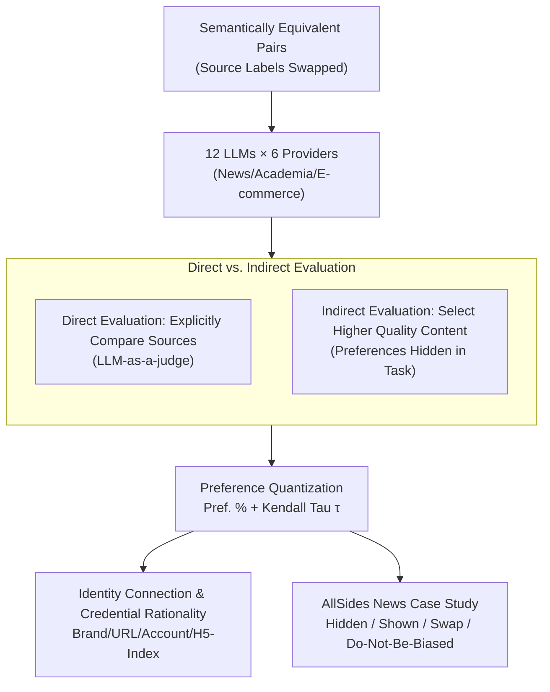

# In Agents We Trust, but Who Do Agents Trust? Latent Source Preferences Steer LLM Generations

**Conference**: ICLR 2026  
**arXiv**: [2602.15456](https://arxiv.org/abs/2602.15456)  
**Area**: Recommender Systems / LLM Bias Analysis  
**Keywords**: LLM Agent, Information Source Preference, Trust Bias, Brand Perception, Recommender Systems

## TL;DR

Through large-scale controlled experiments on 12 LLMs from 6 providers across three domains (news, academia, and e-commerce), this study reveals that LLMs possess systematic **latent source preferences**. When content semantics are identical, simply changing the source labels can significantly alter the model's information selection behavior, and these preferences cannot be eliminated through prompt engineering.

## Background & Motivation

**Background**: LLM-based agents (LLM Agents) are being extensively deployed as user interfaces for online platforms, handling tasks such as news aggregation, academic search, and e-commerce recommendation. These agents filter, prioritize, and synthesize information from backend databases or web searches, effectively controlling the information ultimately received by users.

**Limitations of Prior Work**: Extensive research has focused on biases in LLM-generated content (political, gender, cultural biases, etc.), but few studies have systematically investigated whether LLMs exhibit preferences when **selecting and presenting** existing information. When information carries source labels (e.g., specific publishers, journals, or platforms), do LLMs systematically prioritize information from certain sources?

**Key Challenge**: LLM Agents are assumed to play the role of a "neutral intermediary" in deployment. However, if implicit preferences for specific information sources exist within the model, it leads to information asymmetry—certain sources are systematically amplified while others are suppressed. More critically, users are entirely unaware of these preferences and cannot control them.

**Goal**: This paper proposes the concept of "latent source preferences" and verifies their existence, strength, context-dependence, and resistance to debiasing across 12 LLMs through systematic controlled variable experiments—constructing content pairs that are semantically equivalent but labeled with different sources.

## Method

### Overall Architecture

This paper does not train new models but instead frames "latent source preferences" as a measurable causal experiment. The framework consists of a main pipeline supported by multiple diagnostic layers: first, constructing sets of semantically equivalent content pairs with varying source labels (e.g., the same news item attributed to different publishers, the same paper to different journals, or the same product to different platforms). These pairs are fed into 12 LLMs from 6 providers (GPT-4.1-Mini/Nano, Llama-3.1/3.2, Phi-4/Mini, Mistral-Nemo/Ministral, Qwen2.5-7B/1.5B, DeepSeek-R1-Llama/Qwen), tasking them to select the superior one based on dimensions like "news quality," "paper quality," or "platform reliability." Results are aggregated into comparable quantitative metrics. Two core metrics are used throughout: **Preference Distribution Percentage**, indicating the ratio a source is selected across all its pairwise comparisons (higher denotes greater preference), and **Kendall Tau Ranking Correlation $\tau$**, which measures the consistency between two source rankings ($\tau$ closer to 1 indicates higher consistency). Because content is strictly controlled for equivalence, any systematic bias can only stem from the labels, effectively isolating the "source effect" from the "content effect." Above this baseline, three diagnostic layers are applied: using direct vs. indirect probes to confirm the existence of preferences and behavioral inconsistency, analyzing whether preferences are tied to brands or hard metrics, and finally, using a real-world data control experiment to establish causality.

### Key Designs

**1. Direct vs. Indirect Evaluation: Confronting Explicit Statements with Real Behavior**

Simply asking a model "Who do you trust more?" often yields a politically correct but inaccurate answer. Therefore, this paper uses two complementary probes for cross-validation. Direct evaluation follows the LLM-as-a-judge approach, explicitly asking models to compare two sources (e.g., "Compare the news quality standards of CNN vs. Fox News") to capture stated preferences. Indirect evaluation hides preferences within a task—providing two semantically equivalent articles differing only in source labels and asking the model to choose the one with "higher quality," while balancing presentation order to eliminate position effects. If the model repeatedly favors a specific source despite constant content, latent preference is confirmed. The value of placing both side-by-side is that models perform indirect selection rather than self-declaration during deployment. Comparing direct and indirect rankings via Kendall Tau allows for the quantification of "preaching one thing but doing another."

**2. Identity Association and Credential Rationality: Identifying the "Anchor" of Preference**

Proving preference existence is insufficient; the paper further investigates whether models recognize "brands" or "hard metrics." Identity association analysis presents the same source under different guises (brand name, website URL, social media handle, follower count) to see if the model associates them and assigns similar rankings. Results show most LLMs recognize brand-to-URL mappings, but association capability drops significantly for brand-to-social-media handles. Credential rationality analysis uses ordinally rankable numerical credentials (H5-Index, follower count, founding year) to test if preferences monotonic change with credential strength. While H5-Index is a stable positive signal, the interpretation of follower counts and founding years is often contradictory or irrational—for instance, "founded in Year X" might be viewed as "authoritative" by some models but "outdated" by others. Together, these show preferences are neither pure brand memory nor pure credential reasoning, but a messy, often inconsistent integration of both.

**3. AllSides News Case Study: Isolating Causality with Control Groups**

Supplementing controlled experiments, the authors conduct a comparative case study using 3855 real-world news events from AllSides.com. For each event, the model is given three reports from Left/Center/Right sources and asked to choose and explain. Six conditions are set: *Source Hidden* (only headlines/content, serving as the unbiased baseline); *Source Shown* (observing if bias emerges); *Do Not Be Biased* (testing if debiasing prompts work); and *Swap* conditions—where source labels are swapped between articles (including specific political swaps). If selection flips according to labels rather than content, it proves the source drives the choice. Story order is randomized to balance permutations. This setup clearly demonstrates the causal chain of the source effect and exposes the massive gap between *Source Hidden* and *Source Shown* performance.

## Key Experimental Results

### Main Results: Strength of Source Preferences

| Evaluation Domain | Metric | Key Finding |
|-------------------|--------|-------------|
| Politically Leaning News | Std Dev of Pref % | GPT-4.1-Mini and Phi-4 show highest preference variance; small models show weaker preference. |
| World News | Kendall Tau | High correlation across different models ($\tau > 0.6$), suggesting shared training data effects. |
| Academic Research | Pref % (per domain) | NEJM selection rate is 96% in Medicine but only 19% in CV—strong context dependence. |
| E-commerce Platforms | Pref % (per category) | BestBuy selection rate is 97% in Electronics but only 51% in Grocery. |

### Ablation Study: Causal Verification of Source Preferences

| Experimental Configuration | Key Behavioral Change | Description |
|----------------------------|-----------------------|-------------|
| Source Hidden | Selection distribution near uniform | Without source info, models choose based on content. |
| Source Shown | Distribution becomes significantly skewed | Preferences emerge immediately upon showing the source. |
| Source Swap | Preference direction reverses | Swapping labels causes selection to follow the source, not the content. |
| Do Not Be Biased | No significant reduction in preference | Prompt-based debiasing is nearly ineffective and sometimes strengthens bias. |

### Key Findings

- **Source Preference Can Overpower Content**: In AllSides news selection, the "Source Swap" led to a selection reversal rate of 60-80%, suggesting source labels are more influential than content quality.
- **Larger Models Exhibit Stronger Preferences**: Larger models like GPT-4.1-Mini show stronger and more heterogeneous preferences than smaller models (variance increase $\sim$2-3x).
- **Post-training Reshapes Preferences**: DeepSeek-R1-Distill-Llama-8B and Llama-3.1-8B-Instruct share the same base model, but their Kendall Tau is only 0.42—post-training significantly reshapes preference rankings.
- **Preferences are Context-Dependent**: The same model may have completely different preferences for the same source across different topical domains.

## Highlights & Insights

- **First Systematic Study of LLM Latent Source Preferences**: Shifts focus from what LLMs generate to how they select and present existing content—a novel research perspective.
- **Elegant Controlled Experimental Design**: Rigidly isolates source effects from content effects via "semantically equivalent content + source label swapping," providing clear causal inference.
- **Deep Practical Implications**: Systematic preference for certain sources could lead to filter bubbles, unfair brand competition, and public opinion manipulation. Malicious actors could spoof trusted source labels to manipulate recommendations.
- **"Prompting is Ineffective" as a Critical Negative Result**: Indicates that simple engineering fixes are insufficient; deeper intervention during training is required.
- **Cross-Model Consistency Reveals Training Data Effects**: The high Kendall Tau correlation between different models suggests preferences are rooted in shared pre-training corpora.

## Limitations & Future Work

- Limited to three application domains (News/Academia/E-commerce); high-risk domains like Medical or Legal have not been explored.
- Lack of deep analysis on the causal origins—the relative contribution ratios of pre-training frequency vs. post-training data vs. model architecture remain unclear.
- Found that pre-training co-occurrence frequency does not fully explain preferences; deeper mechanistic study is needed.
- No effective debiasing method proposed (only proof that prompting fails); training-time interventions and inference-time control strategies need exploration.
- Whether multimodal LLMs exhibit similar preferences remains an open question.
- Experiments covered 12 models; the preference patterns of more models (especially open-source Chinese models and vertical-specific models) require further study.

## Related Work & Insights

- **LLM Bias Research**: Feng et al. (2023) on political bias, Manvi et al. (2024) on geographical bias—this work reveals a new "source bias" dimension.
- **LLM Cognitive Bias**: Itzhak et al. (2024) studied the origins of cognitive bias; this paper finds that post-training can also significantly alter preferences.
- **Recommender System Fairness**: Fairness frameworks from traditional recommender systems can be migrated to LLM Agent scenarios.
- **Insights for Future Agent System Design**: Targeted modules for transparent and controllable source preference management should be integrated at the Agent level.

## Rating

- Novelty: ⭐⭐⭐⭐⭐
- Experimental Thoroughness: ⭐⭐⭐⭐⭐
- Writing Quality: ⭐⭐⭐⭐⭐
- Value: ⭐⭐⭐⭐⭐

<!-- RELATED:START -->

## Related Papers

- [\[ICLR 2026\] Reinforced Latent Reasoning for LLM-based Recommendation](reinforced_latent_reasoning_for_llm-based_recommendation.md)
- [\[ICML 2026\] RGMem: Renormalization Group-Inspired Memory Evolution for Language Agents](../../ICML2026/recommender/rgmem_renormalization_group-inspired_memory_evolution_for_language_agents.md)
- [\[ACL 2026\] From Recall to Forgetting: Benchmarking Long-Term Memory for Personalized Agents](../../ACL2026/recommender/from_recall_to_forgetting_benchmarking_long-term_memory_for_personalized_agents.md)
- [\[ACL 2026\] IceBreaker for Conversational Agents: Breaking the First-Message Barrier with Personalized Starters](../../ACL2026/recommender/icebreaker_for_conversational_agents_breaking_the_first-message_barrier_with_per.md)
- [\[ICLR 2026\] More Than What Was Chosen: LLM-based Explainable Recommendation Beyond Noisy User Preferences](more_than_what_was_chosen_llm-based_explainable_recommendation_beyond_noisy_user.md)

<!-- RELATED:END -->
