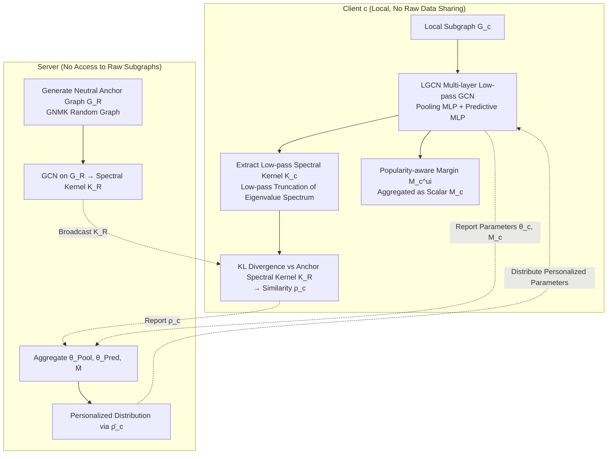

# Low-pass Personalized Subgraph Federated Recommendation

**Conference**: ICLR 2026  
**OpenReview**: [https://openreview.net/forum?id=SSd3GENRAU](https://openreview.net/forum?id=SSd3GENRAU)  
**Code**: To be confirmed  
**Area**: Federated Recommendation / Graph Learning  
**Keywords**: Federated Recommendation Systems, Subgraph Structural Imbalance, Graph Fourier Transform, Low-pass Spectral Filtering, Popularity Bias, Personalized Federated Learning  

## TL;DR
Addressing the issues of representation misalignment and popularity bias caused by immense differences in "subgraph size and connectivity" among clients in federated recommendation, LPSFed utilizes low-pass spectral filtering to extract structural signals that remain stable across subgraphs. These signals measure the similarity between clients and a neutral anchor graph to guide personalized parameter aggregation, supplemented by an adaptive margin correction to handle long-tail popularity. Results show an NDCG improvement of up to 24% across five datasets.

## Background & Motivation
**Background**: Federated Recommendation Systems (FRS) allow each client (e.g., user-item subgraphs partitioned by country/region) to perform local training and exchange only parameters, thereby protecting privacy. Primary approaches include matrix factorization, personalization, and graph neural networks (e.g., FedPerGNN) constructed on the server side, most of which **implicitly assume similar subgraph structures across clients**.

**Limitations of Prior Work**: In reality, subgraphs suffer from severe **subgraph structural imbalance**, where the number of nodes and item degrees can differ by an order of magnitude. This is detrimental to spatial-domain GNNs (LightGCN, NGCF, PinSage) relying on multi-hop message passing. Extreme local topological differences lead to misaligned representations and skewed federated aggregation by "outlier" clients, degrading recommendation quality. Empirical results on Amazon-Book with spectral clustering show significant divergence in Laplacian spectra and a monotonic decline in NDCG@20 as structural differences increase.

**Key Challenge**: Existing spectral domain federated methods (Spectral FL) do mitigate heterogeneity by aligning low-frequency components, but they assume homogeneous graphs with node features (e.g., social/citation networks). Recommendation graphs are **bipartite, featureless, and have long-tailed degree distributions**, making these methods difficult to apply directly. Furthermore, structural imbalance amplifies **local popularity bias**: dense clients are dominated by hub items, while sparse clients depend on unreliable training from a few high-degree items. Federated isolation prevents clients from obtaining global context, creating a self-reinforcing "rich-get-richer" loop.

**Goal**: Construct a structural similarity metric robust to subgraph scale and degree variation without sharing raw subgraphs to drive personalized parameter updates, while explicitly modeling and correcting the local popularity bias of each subgraph.

**Core Idea**: **Extract "scale-stable" low-frequency structural signals as client signatures** using low-pass spectral filtering. Low-frequency components reflect core connectivity patterns and are insensitive to scale and noise. These signatures measure similarity to a neutral "anchor graph" to determine the absorption of global parameters, overlaid with a **popularity-aware adaptive margin** derived from item degree distributions for local correction.

## Method

### Overall Architecture
LPSFed is a three-stage personalized federated recommendation framework (two stages for clients, one for the server). Every global round proceeds as follows: clients use Low-pass Graph Convolutional Networks (LGCN) to train local models, extracting the low-pass spectral kernel $K_c$ and local popularity information (Stage 1). The server generates a "neutral anchor graph" $G_R$ based on high-level statistics reported by clients and broadcasts its spectral kernel $K_R$. Clients compute their structural similarity $\rho_c$ relative to the anchor graph using KL divergence (Stage 2). Finally, the server aggregates pooling MLPs, predictive MLPs, and average margins into global parameters, distributing them via personalized weights based on normalized similarity $\bar{\rho}_c$ (Stage 3). The spectral personalization and popularity correction work in synergy.

### Key Designs

**1. Low-pass GCN Backbone + Spectral Kernel Signatures**: Compressing "subgraph identity" into noise-resistant low-frequency distributions. Each client uses LGCN on local bipartite graphs: first performing eigen-decomposition on the Laplacian $L = I - D^{-1/2}AD^{-1/2} = P\Lambda P^T$, then applying low-pass convolution $Z\bar{*}_g k = \bar{P}\,\mathrm{diag}(\bar{k})\,\bar{P}^T Z$ via a gated function $\tilde{f}$ retaining only the first $\Phi$ eigenvectors. The complexity is $O(n\Phi^2)$ ($\Phi \ll M+N$), and decomposition occurs only once during pre-processing using sparse Lanczos solvers. LGCN outputs are combined via a Pooling MLP into client-specific representations, and a Predictive MLP maps user-item pairs to a preference angle $\hat{R}_{ui} = \arccos(\tanh(f_{\theta_{\mathrm{Pred}}}([U_u, V_i, U_u\odot V_i])))$. Crucially, a **structural signature** is constructed as $K_c = \bar{k}_c = \Lambda_c \odot \tilde{f}_{1:\Phi}$. This signature is scale-invariant and serves as a stable base for comparison. Theorem 3.1 proves that KL divergence between low-pass filtered eigenvalue distributions converges to a limit with high probability, bounded by the minimum eigengap.

**2. Neutral Anchor Graph + KL Similarity-driven Personalized Aggregation**: Preventing structural outlier clients from polluting the global model. To protect privacy, the server uses aggregated statistics (average nodes/edges) to generate a "neutral anchor graph" $G_R$ using a GNMK random graph model, generating spectral kernel $K_R$. Clients **do not share their local kernel $K_c$**; they locally compute $\rho_c = D_{\mathrm{KL}}(K_R\|K_c) = \sum_{i=1}^{\Phi} K_R(i)\log\frac{K_R(i)}{K_c(i)}$. The server normalizes this to $\bar{\rho}_c = 1 - \frac{\rho_c - \min(\rho)}{\max(\rho) - \min(\rho)}$. During aggregation, parameters are updated via a convex combination: $\theta^c_{\mathrm{updated}} = \bar{\theta}\cdot\bar{\rho}_c + \theta^c\cdot(1-\bar{\rho}_c)$. Clients structurally similar to the anchor absorb more global knowledge.

**3. Local Popularity-Aware Adaptive Margin**: Adjusting the long tail by penalizing popularity in the angular loss. User and item popularities $p_u, p_i$ are encoded as $d$-dimensional vectors, with their cosine similarity $\cos(\hat{\xi}_{ui})$ serving as a bias. An adaptive margin $M^c_{ui} = \min\{\gamma\cdot\hat{\xi}_{ui},\ \pi - \hat{R}_{ui}\}$ is constructed for the main task. Each client reports an **irreversible scalar** average margin $M_c = \frac{1}{MN}\sum_{u,i} M^c_{ui}$. The server aggregates a global bias context $\bar{M}$, and clients interpolate this with their local margin to get $\widetilde{M}^c_{ui} = \omega M^c_{\mathrm{updated}} + (1-\omega)M^c_{ui}$ for use in the Bias-aware Contrastive loss $L_{\mathrm{BC}}$. This penalizes over-recommended popular items and encourages long-tail exposure.

## Key Experimental Results

### Main Results
Recall@20 / NDCG@20 on five datasets (Amazon-Book, Gowalla, Movielens-1M, Yelp2018, Tmall-Buy) with subgraphs partitioned via spectral clustering:

| Dataset | Metric | Best Baseline | LPSFed | Gain |
|---|---|---|---|---|
| Amazon-Book | Recall / NDCG | 0.0713 / 0.0356 | **0.0738 / 0.0442** | +3.5% / **+24.2%** |
| Gowalla | Recall / NDCG | 0.1528 / 0.0729 | **0.1621 / 0.0909** | +6.1% / +17.0% |
| Movielens-1M | Recall / NDCG | 0.2564 / 0.1265 | **0.2646 / 0.1342** | +3.2% / +6.1% |
| Yelp2018 | Recall / NDCG | 0.0750 / 0.0315 | **0.0783 / 0.0379** | +4.4% / +20.3% |
| Tmall-Buy | Recall / NDCG | 0.0370 / 0.0186 | **0.0385 / 0.0218** | +4.1% / +17.2% |

NDCG gains significantly outweigh Recall gains, indicating that the method primarily improves top-rank ordering precision.

### Ablation Study

| Variant | Amazon-Book NDCG | Gowalla NDCG | Description |
|---|---|---|---|
| w/o LGCN (Spatial NGCF) | 0.0216 | 0.0427 | Performance collapses; spatial GNNs fail under structural divergence. |
| w/o bias-aware (=LPSFed(BPR)) | 0.0322 | 0.0711 | Removing popularity correction drops long-tail performance. |
| w/o per (No personalization) | 0.0368 | 0.0788 | Similarity-driven distribution is essential. |
| **LPSFed (Full)** | **0.0442** | **0.0909** | — |

### Key Findings
- **Complementary Mechanisms**: Spectral personalization handles representation alignment and structural robustness, while the popularity margin handles long-tail correction.
- **Robustness to Imbalance**: Improvements are largest in the "Large-Dense" group, which is most susceptible to popularity feedback loops.
- **Privacy Resilience**: The variant without statistics for $G_R$ (stricter privacy) still performs competitively, indicating the model works even with purely random anchor graphs.
- **No Head Item Sacrifice**: LPSFed improves Tail item NDCG (+271% vs FedAvg on Amazon-Book) without degrading Head item performance.

## Highlights & Insights
- **Spectral Space Signatures**: Shifting client identity from the parameter space (sensitive to scale) to the spectral space (scale-invariant low-pass eigenvalues) identifies "structural outliers" more reliably.
- **Bipartite Adaptation**: Tailors spectral FL for recommendation by addressing the lack of node features and the extreme degree skewness inherent in bipartite graphs.
- **Unified Problem Solving**: Structural imbalance and popularity bias are treated as coupled issues; the same similarity metric modulates both parameter weights and bias contexts.

## Limitations & Future Work
- **Decomposition Overhead**: While Lanczos helps, eigen-decomposition is required once during pre-processing, which may be costly for extremely large or dynamic subgraphs.
- **Idealized Partitioning**: Experiments use spectral clustering to create clear structural gaps; real-world federated boundary structures may be more complex.
- **Formal Privacy**: Lacks formal Differential Privacy (DP) budget analysis for the reported scalars, although they are empirically shown to be low-leakage.

## Related Work & Insights
- **Federated Recommendation**: Moves beyond the "comparable subgraph structure" assumption of FedPerGNN or FedHGNN.
- **Spectral FL**: Adapts concepts from FedSSP to bipartite graphs while upgrading spectral similarity from a regularizer to a personalization weight.
- **Mechanism**: The use of scale-invariant low-pass signatures for alignment is a transferable paradigm for heterogeneous graph federated learning.

## Rating
- Novelty: ⭐⭐⭐⭐ — Precise problem definition; creative use of scale-invariant signatures for recommendation.
- Experimental Thoroughness: ⭐⭐⭐⭐ — Broad datasets, multiple baselines, and group-wise analysis; theoretically supported.
- Writing Quality: ⭐⭐⭐⭐ — Clear motivation and well-stratified methodology.
- Value: ⭐⭐⭐⭐ — Privacy-friendly and effective for graph-based federated recommendation.

<!-- RELATED:START -->

## Related Papers

- [\[ACL 2026\] GraphLoRA: Structure-Aware Low-Rank Adaptation for Large Language Model Recommendation](../../ACL2026/recommender/graphlora_structure-aware_low-rank_adaptation_for_large_language_model_recommend.md)
- [\[ICLR 2026\] Continual Low-Rank Adapters for LLM-based Generative Recommender Systems](continual_low-rank_adapters_for_llm-based_generative_recommender_systems.md)
- [\[ICLR 2026\] Beyond Markovian Drifts: Action-Biased Geometric Walks with Memory for Personalized Summarization](beyond_markovian_drifts_action-biased_geometric_walks_with_memory_for_personaliz.md)
- [\[ICLR 2026\] ProPerSim: Developing Proactive and Personalized AI Assistants through User-Assistant Simulation](propersim_developing_proactive_and_personalized_ai_assistants_through_user-assis.md)
- [\[ACL 2025\] KERL: Knowledge-Enhanced Personalized Recipe Recommendation using Large Language Models](../../ACL2025/recommender/kerl_knowledge-enhanced_personalized_recipe_recommendation_using_large_language_.md)

<!-- RELATED:END -->
