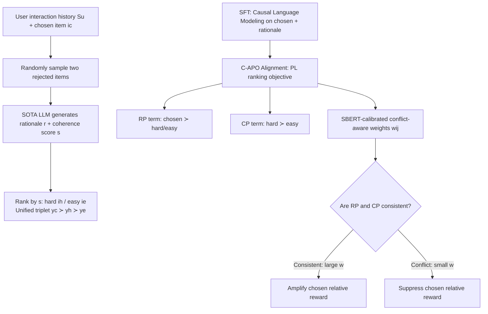

# More Than What Was Chosen: LLM-based Explainable Recommendation Beyond Noisy User Preferences

**Conference**: ICLR 2026  
**OpenReview**: [https://openreview.net/forum?id=WYfDoB44xy](https://openreview.net/forum?id=WYfDoB44xy)  
**Code**: [https://github.com/cpark88/C-APO](https://github.com/cpark88/C-APO)  
**Area**: Recommendation Systems / Explainable Recommendation / LLM Preference Alignment  
**Keywords**: LLM Recommendation, Preference Alignment, DPO, Explainable Recommendation, Revealed Preference, Coherent Preference  

## TL;DR
Items clicked by users are not necessarily truly liked—this paper proposes "Coherent Preference" (CP) to supplement traditional "Revealed Preference" (RP), and designs a conflict-aware DPO variant, C-APO. It amplifies the influence when RP and CP are consistent and suppresses it when they conflict, thereby simultaneously improving recommendation accuracy and the persuasiveness of rationales.

## Background & Motivation

**Background**: Recommendation systems have long been built on the "Revealed Preference" (RP) hypothesis of microeconomics—observed user behaviors (clicks, purchases) faithfully reflect their true interests. Collaborative filtering, sequential recommendation, and even LLM-based recommendation (LLM-Rec) aligned via DPO essentially learn the pairwise order `chosen ≻ unobserved` derived from behavior.

**Limitations of Prior Work**: Real-world choices are noisy—account sharing, social scenarios, impulse buys during promotions, and limited information can cause users to click on items that do not align with their stable interests. Using LLM-as-a-Judge to score "logical consistency with historical behavior" on Amazon Reviews, the authors found that approximately **30% of ground-truth items cannot be logically explained**. This means that even with strong reasoning capabilities provided to LLM-Rec, learning only from RP treats noise as signal, leading to the generation of unpersuasive recommendation rationales—on platforms like Instagram or Amazon that display "recommendations + reasons," weak rationales directly damage user trust.

**Key Challenge**: RP provides high-value real interaction signals (useful for recommendation accuracy), but it cannot self-correct; training purely on RP leads to overfitting on noisy choices. A signal is needed that is **complementary to behavioral signals while reflecting the "reasoning behind choices"** to hedge against noise.

**Goal**: Without discarding the value of RP, introduce a signal modeling "choice plausibility" and adaptively reconcile the two when they are **consistent / in conflict**, ultimately improving both recommendation performance and generating more credible rationales.

**Core Idea**: **[Coherent Preference]** Proposes Coherent Preference (CP)—preferring items that are causally/logically consistent with the user's history (not just asking "what was chosen," but "what would be chosen if behavior were consistent and explainable"). **[Conflict-Aware Alignment]** Unifies RP and CP into a Plackett-Luce full-ranking objective, using trainable "conflict-aware adaptive weights" to dynamically weigh them based on whether they consist, strengthening corresponding terms when CP and RP align and weakening them when they conflict.

## Method

### Overall Architecture

C-APO consists of two stages. First, construct a **triplet rationale dataset** offline: for each user, take the ground-truth chosen item $i_c$, then randomly sample two rejected items that the user hasn't interacted with. Use a SOTA LLM to generate a natural language rationale $r$ and a 1–7 coherence score $s$ for each item; the one with the higher score is denoted as hard rejected $i_h$, and the lower as easy rejected $i_e$, yielding a unified full order $y_c \succ y_h \succ y_e$ (each $y=(i,r,s)$ contains both item and rationale). Then, after SFT, use C-APO, a conflict-aware DPO variant, for preference alignment: decompose the full order into an RP term (chosen higher than all rejected) and a CP term (hard higher than easy), and use SBERT-calibrated weights to reconcile the RP–CP conflict regarding "whether the chosen item should be ranked first."

### Key Designs

**1. Coherent Preference (CP) and Triplet Data Construction: Making the "reasoning behind choices" explicit.** RP only provides the behavioral order `chosen ≻ unobserved`, while CP focuses on the logical consistency of the item with the history $S_u$. For each $i\in\{i_c,i_1^-,i_2^-\}$, the authors have the LLM produce both a rationale and a coherence score $s\in\{1,\dots,7\}$ (single-answer scoring LLM-as-a-Judge), and human annotation validates the credibility of these scores (Spearman $\rho=0.71$, $p<0.0001$). The one with the higher score among the two rejected is $i_h$, and the lower is $i_e$, thus CP induces $i_h\succ i_e$ within the rejected items, which combines with RP's $i_c\succ i_h, i_c\succ i_e$ into a unified triplet $y_c\succ y_h\succ y_e$. Crucially, CP **can also** compare chosen vs. rejected—when a rejected item has a higher coherence score than the chosen item, an RP–CP conflict is exposed (experiments show that in five domains, 31.9%–40.3% of hard rejected items have higher coherence scores than the chosen item), which is precisely what needs calibration.

**2. Plackett-Luce Full Ranking Objective: Enforcing RP and CP with a single loss.** Parameterizing the implicit reward as $g_\theta(x,y)=\beta\log\frac{\pi_\theta(y|x)}{\pi_{\text{ref}}(y|x)}$, writing the PL probability for the expected permutation $\tau^\star=(y_c,y_h,y_e)$ of the three responses $\{y_c,y_h,y_e\}$, and maximizing the log-likelihood yields:
$$
\mathcal{L}_{PL} = -\mathbb{E}\Big[\underbrace{\log\sigma\big(-\log(e^{g_h-g_c}+e^{g_e-g_c})\big)}_{\text{(1) RP}} + \underbrace{\log\sigma\big(-\log e^{g_e-g_h}\big)}_{\text{(2) CP}}\Big]
$$
The first term (RP) encourages the chosen item to rank above both rejected items, while the second term (CP) explicitly models hard $\succ$ easy. Compared to DPO, which only does pairwise chosen vs. rejected comparisons, PL maintains permutation consistency within a single objective. However, PL still does not directly model the "CP order between chosen and rejected," so the RP term cannot correct noise in interactions—this is the motivation for introducing adaptive weights.

**3. Conflict-Aware Adaptive Weights: Softly adjusting reward differences based on RP–CP consistency.** Define the conflict-aware reward difference $w_{i,j}(g_i-g_j)$ and replace all $(g_i-g_j)$ in the above equation with $w_{i,j}(g_i-g_j)$ to obtain the C-APO objective $\mathcal{L}_{\text{C-APO}}$. Weights $w_{i,j}$ do not directly use raw LLM scores (treating them as noisy observations) but instead draw inspiration from the Thurstone-Mosteller model: passing $(S_u,i,r)$ through a frozen text encoder (e.g., SBERT) to get $z_u$, and then calculating the calibrated mean and variance:
$$
\mu = s + \text{Gate}(z_u)\cdot \text{FC}_1(z_u),\quad \tilde\sigma = \text{softplus}(\text{FC}_2(z_u))
$$
Finally, a Gaussian CDF maps the pairwise difference to $[0,1]$: $w_{c,h}=\Phi\big(\frac{\mu_{y_c}-\mu_{y_h}}{\sqrt{\tilde\sigma^2_{y_c}+\tilde\sigma^2_{y_h}}}\big)$ (similarly for others). When RP–CP are consistent (large $w$), the chosen relative reward is amplified; when they conflict (small $w$), it is decayed to avoid overfitting to RP noise. This objective strictly generalizes PL/DPO.

**4. Gradient Modulation: Stronger correction for chosen items with greater conflict.** Taking the gradient of $\mathcal{L}_{\text{C-APO}}$ reveals two types of effects: first, the gradient of the chosen item pushes up its likelihood and the rejected item's gradient pushes it down, with intensity scaled by $w_{c,h}, w_{c,e}$ (more aggressive push for chosen when RP–CP align); second, the $\sigma(\cdot)$ modulation factor—when a rejected item's reward exceeds the chosen one ($\Delta g_{h,c}>0$ or $\Delta g_{e,c}>0$), $\sigma(s_1)$ increases, applying a larger gradient to push the chosen item up for error correction. This provides a theoretical explanation for why the selection probability of low-consistency chosen items is effectively suppressed.

## Key Experimental Results

### Main Results (RQ1, Amazon Review 2023 Five Domains, HR@1/HR@5/NDCG@5)

Gemma-2-4B-it is used as the backbone, comparing against nearly 20 CF-Rec and LLM-Rec baselines using leave-one-out evaluation. The table below shows HR@1 for each domain:

| Area | Prev. SOTA HR@1 (Rep.) | Ours HR@1 | Gain |
|---|---|---|---|
| Fashion | 8.43 (Rec-R1) | **9.47** | +12.34% |
| Grocery | 6.57 (S-DPO) | **6.90** | +5.02% |
| Scientific | 7.57 (S-DPO) | **12.22** | +61.43% |
| Clothing | 5.66 (Rec-SAVER) | **7.11** | +25.62% |
| Health | 4.55 (GRAM) | **4.83** | +24.48% |

After switching the backbone to Qwen-2-7B-Instruct, C-APO still achieves HR@5 +15.38% and NDCG@5 +12.29% compared to the second-best S-DPO, indicating that the gains come from the training method rather than the backbone.

### Ablation Study (RQ3/RQ4, Fig. 5 Six Variants)

| Variant | Description | Conclusion |
|---|---|---|
| (A) Base | Gemma-2-4B-it vanilla | Weakest, requires recommendation-specific training |
| (B) +SFT | Fine-tuned only on chosen | Weaker than preference alignment variants |
| (C) +SFT+DPO | Pairwise alignment only on RP | Preference alignment is useful |
| (D) +SFT+PL | RP+CP full rank but no calibration | Superior to DPO, validates CP value (RQ3) |
| (E) +C-APO w/o SBERT | Weighting with raw LLM scores | Better than (D), worse than (F) |
| (F) +C-APO (Ours) | Full conflict-aware calibration | Best, validates calibration value (RQ4) |

(C)→(F) shows that joint modeling of CP is better than pure RP; (D)→(F) shows additional gains from conflict-aware adaptive weights; (E) in the middle indicates that the LLM coherence scores are useful, but SBERT calibration contributes the main gain.

### Key Findings

- **Rationale Quality (RQ2)**: ChatGPT 4-level scoring (0 Hallucination / 1 Weak / 2 Plausible / 3 Persuasive), 1500 samples. Ours obtained a score-3 ratio of **84.33%**, which is **+5.99%p** higher than the second-best Rec-SAVER (human agreement QWK=0.75).
- **Online A/B (RQ6)**: Deployment in a production environment, showing top-1 recommendation + rationale. Compared to the ML baseline, CTR increased by +60.88% (abstract claims 1.65× relative Gain, $Z=39.42$, $p<0.001$); even compared to the SFT model which also displays rationales, CTR increased by +1.47%p and CVR also significantly improved, with a latency of only 138ms/call.
- **Weight Behavior (Fig. 7)**: As the coherence score difference $\Delta s=s_c-s_i$ increases, the calibration weight $w$ monotonically increases, directly confirming "amplify when consistent, suppress when in conflict"; $\beta \approx 1$ is optimal.

## Highlights & Insights

- **Clean Problem Characterization**: The observation that "30% of chosen items cannot be logically explained" shatters the implicit assumption that "behavior = preference," providing a strong motivation for introducing CP rather than just a conceptual exercise.
- **Turning LLM Rationales into Optimizable Order Signals**: CP is not a post-hoc explanation but directly enters the preference order of DPO/PL. Through the design of hard/easy rejected items, "rationale consistency" is quantified into training labels.
- **Conflict Awareness is the Core Contribution**: It's not just adding a CP term, but explicitly modeling the consistency/conflict between RP and CP, and using SBERT calibration to convert noisy LLM scores into soft weights. Theoretically, it strictly generalizes DPO/PL, and gradient analysis provides an explainable mechanism for "suppressing low-consistency chosen items."
- **Closed-Loop to Online**: From 5 offline domains with nearly 20 baselines to real production A/B (including controls for rationale exposure), with open datasets and code, the engineering credibility is high.

## Limitations & Future Work

- **Dependence on LLM Coherence Scoring Quality**: CP labels come from 1–7 scores from SOTA LLMs. Although calibrated with SBERT and validated by humans, it remains "LLMs judging logical consistency" at its core, which may be systematically distorted in categories or cultural contexts where the LLM itself is biased.
- **Only Two Rejected Items**: The authors admit that expanding to more rejected items would significantly increase LLM generation and training costs, leaving this for future work; two negative samples may not be sufficient to characterize more complex RP–CP conflict structures.
- **"Consistency" Does Not Necessarily Equal "True Interest"**: CP prefers items consistent with history, which might reinforce filter bubbles and suppress valid exploration or interest shifts by users—treating all "atypical choices" as noise carries risks.
- **Cost**: The cost of APIs/GPUs for constructing triplet rationale datasets is high (the authors emphasized hosting the data despite high costs), limiting direct replication for ultra-large-scale item pools or long-tail users.

## Related Work & Insights

- **DPO Family**: Built upon DPO (Rafailov 2023) and recommendation alignment methods like S-DPO. The core difference is upgrading from pairwise RP comparison to RP+CP PL full ranking + conflict-aware weighting.
- **LLM-Rec / Explainable Rec**: Competes with Rec-SAVER, Rec-R1, SumRecDPO, GRAM, etc., emphasizing joint optimization of "recommendation + persuasive rationale."
- **Behavioral Economics Perspective**: CP is a behavioral economics critique and extension of the classic Revealed Preference paradigm, introducing "what ought to be preferred" into modeling.
- **Inspiration**: Explicitly modeling "reward signal credibility" as a trainable weight (rather than a hard label) and using a small encoder to calibrate noisy judgments from a large model is a strategy for "softly reconciling two conflicting preference sources" that can be transferred to general scenarios involving multiple reward/labeling conflicts in RLHF or multi-objective alignment.

## Rating
- **Novelty**: ⭐⭐⭐⭐ — The combined perspective of RP/CP dichotomy + conflict-aware adaptive weighting is novel and strictly generalizes DPO/PL rather than just adding regularization.
- **Experimental Thoroughness**: ⭐⭐⭐⭐⭐ — 5 domains + nearly 20 baselines + cross-backbone + fine-grained ablation + human evaluation of rationales + real online A/B (including rationale exposure control) provides comprehensive coverage.
- **Writing Quality**: ⭐⭐⭐⭐ — Motivational data (30% unexplainable) is compelling; formulas and gradient analysis are clear; notation is slightly dense but logically coherent.
- **Value**: ⭐⭐⭐⭐ — Directly addresses an industrial pain point regarding the "behavior = preference" assumption; CTR 1.65× online validation + open-source data/code offer high practical and reproducibility value.

<!-- RELATED:START -->

## Related Papers

- [\[ACL 2026\] Where and What: Reasoning Dynamic and Implicit Preferences in Situated Conversational Recommendation](../../ACL2026/recommender/where_and_what_reasoning_dynamic_and_implicit_preferences_in_situated_conversati.md)
- [\[AAAI 2026\] Preference is More Than Comparisons: Rethinking Dueling Bandits with Augmented Human Feedback](../../AAAI2026/recommender/preference_is_more_than_comparisons_rethinking_dueling_bandits_with_augmented_hu.md)
- [\[ICLR 2026\] Reinforced Latent Reasoning for LLM-based Recommendation](reinforced_latent_reasoning_for_llm-based_recommendation.md)
- [\[ICLR 2026\] In Agents We Trust, but Who Do Agents Trust? Latent Source Preferences Steer LLM Generations](in_agents_we_trust_but_who_do_agents_trust_latent_source_preferences_steer_llm_g.md)
- [\[ICLR 2026\] Beyond Markovian Drifts: Action-Biased Geometric Walks with Memory for Personalized Summarization](beyond_markovian_drifts_action-biased_geometric_walks_with_memory_for_personaliz.md)

<!-- RELATED:END -->
