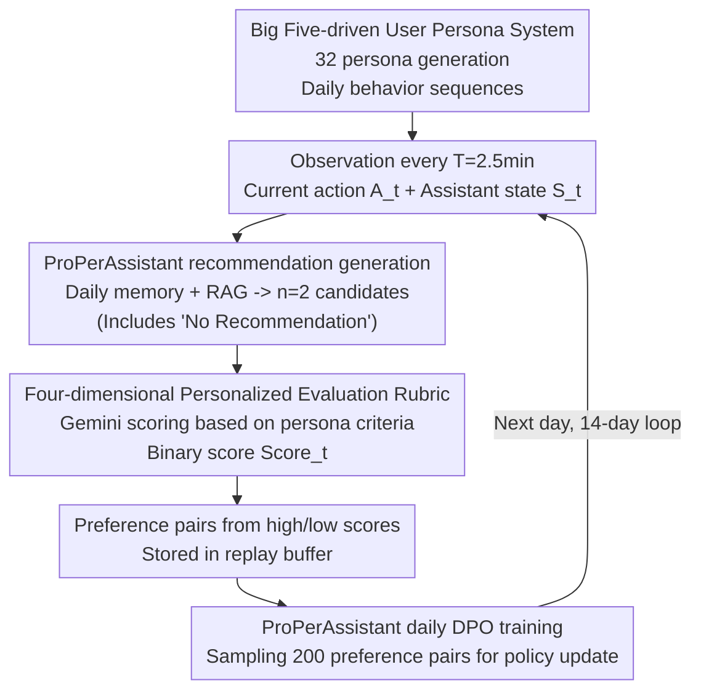

# ProPerSim: Developing Proactive and Personalized AI Assistants through User-Assistant Simulation

**Conference**: ICLR 2026  
**arXiv**: [2509.21730](https://arxiv.org/abs/2509.21730)  
**Code**: [GitHub](https://github.com/jiho283/ProPerSim)  
**Area**: Recommender Systems  
**Keywords**: proactive agent, personalization, user simulation, DPO, Big Five personality, generative agents

## TL;DR
This work proposes ProPerSim, a simulation framework that constructs 32 user personas based on the Big Five personality traits within the Smallville household environment. AI assistants perform proactive recommendation decisions every 2.5 minutes. Through DPO preference learning over a 14-day simulation, user satisfaction improved from 2.2/4 to 3.3/4, validating for the first time the feasibility of unifying proactivity and personalization.

## Background & Motivation

**Background**: LLM assistants are evolving from passive response towards two distinct directions: proactive recommendation and personalization. Proactive Agents (Lu et al., 2024) explore initiation without considering personal preferences, while personalization methods (e.g., RLHF) adapt to users but still rely on user-initiated interactions.

**Limitations of Prior Work**:
- Proactivity alone → Recommending a steakhouse to a vegetarian (as in Figure 1), where timing and content mismatch personal preferences.
- Personalization alone → Accurate recommendations still require user prompts, missing optimal proactive windows.
- Large-scale real-world behavior data collection faces significant cost and privacy challenges; human experiments are prohibitively expensive.
- Existing proactive research is often event-driven (triggered by specific user actions), failing to explore time-based continuous monitoring modes.

**Key Challenge**: The need for massive user-assistant interaction data to simultaneously learn "when to recommend" and "what to recommend" — yet real-world data collection is infeasible.

**Goal**: To unify proactivity and personalization in a simulated environment, developing AI assistants that adapt to individual users over time.

**Key Insight**: Leveraging LLM-based user agents with rich personas based on the Big Five model to simulate realistic user behavior and collect preference data for DPO training.

**Core Idea**: Utilizing Generative Agents to simulate users + personalized rubrics to evaluate recommendations + DPO preference learning → forming a continuous improvement loop for proactive and personalized assistance.

## Method

### Overall Architecture

This paper aims to create an assistant that is both "proactive" and "understanding." Since real user data is hard to acquire, the entire system runs in a simulation driven by a three-party cycle. The first party is a persona-based user agent generating daily behavior sequences $\{(A_i, \text{Range}_i)\}$ in the Smallville environment (e.g., "7:00–7:30 Preparing breakfast"). The second party is the AI assistant, which observes the current action $A_t$ and its internal state $S_t^{(a)}$ every $T=2.5$ minutes to decide whether and what to recommend: $R_t = \mathcal{A}_\theta(A_t, S_t^{(a)})$. The third party is the evaluator (part of the user agent), which scores the recommendation based on persona-specific rubrics: $\text{Score}_t = \mathcal{E}(P, r, A_t, R_t, S_t^{(u)})$. These scores serve as training signals: the assistant collects (recommendation, score) pairs daily for preference learning to improve its understanding for the next day. After 14 simulation days, the assistant achieves dual adaptation of "timing" and "content" without human intervention.

### Key Designs

**1. Big Five-driven User Persona System: Making Simulated User Behavior and Taste Truly Diverse**

The diversity of simulated users is crucial. The paper utilizes the Big Five model (Extraversion, Agreeableness, Openness, Conscientiousness, Neuroticism, each High/Low) to create 32 personas. Each persona is augmented with six attributes (age, background, interests, lifestyle, daily needs, long-term goals) generated by GPT-4o. UMAP and HDBSCAN clustering on persona embeddings confirm that these 32 profiles are distinct and cover a wide representation space. Personality differences naturally dictate preference: low-extraversion users prefer solitude and low disruption, while high-conscientiousness users prefer structured, planned recommendations.

**2. Four-dimensional Personalized Evaluation Rubric: Standardized yet Persona-tailored**

A large-scale AMT survey (353 participants) was conducted to filter 10 candidate evaluation dimensions. Based on >50% support, four dimensions were selected: Personal Preference (content suitability), Frequency (appropriate rate), Timing (right moment), and Communication & Safety. To ensure personalization, specific criteria under these dimensions are customized by GPT-4o for each persona. For instance, the Frequency criterion for a low-extraversion persona might specify "no more than once every two hours." Gemini 2.0 Flash performs the actual scoring, providing binary ratings for each dimension.

**3. RAG+DPO Preference-Aligned ProPerAssistant: Turning Daily Scores into Training Signals**

The assistant's internal state $S_t^{(a)}$ comprises structured daily memory (full details for the last 10 minutes, compressed summaries for 1-hour and 4-hour blocks) and RAG-retrieved top-5 similar historical interactions. At each step, it generates $n=2$ candidate recommendations (one can be "No Recommendation"). High- and low-score items form preference pairs stored in a replay buffer. At the end of each day, 200 pairs are sampled for DPO training:

$$\mathcal{L}_{\text{DPO}} = -\log\sigma\left(\beta\left(\log\frac{\pi_\theta(y_w|x)}{\pi_{\text{ref}}(y_w|x)} - \log\frac{\pi_\theta(y_l|x)}{\pi_{\text{ref}}(y_l|x)}\right)\right)$$

DPO is chosen over standard RLHF to avoid training a separate reward model. The inclusion of "No Recommendation" in the candidate set is vital, allowing the assistant to learn when to remain silent, reducing recommendation frequency from 24/hour to approximately 6/hour.

### Loss & Training

Base Model: LLaMA 3.3 70B (4-bit quantization), LoRA fine-tuned. DPO training: 200 samples from the cumulative replay buffer daily, candidate count $n=2$. Simulation setup: $T=2.5$ minutes, 14 days per persona. Resource cost: Approx. 10 days × 1 A100 GPU + ~$30 API cost per persona.

## Key Experimental Results

### Main Results

| Method | Day 1 Avg Score | Day 14 Avg Score | Features |
|------|-----------|------------|------|
| No Memory | ~2.1 | ~2.2 | Current action only |
| AR Memory (A,R) | ~2.3 | ~2.3 | History of actions + recs |
| ARS Memory (A,R,Score) | ~2.6 | ~2.5 | Scores included in prompt |
| **Ours (ProPerAssistant)** | **~2.2** | **~3.3** | DPO preference learning |

### Persona Dimension Analysis

| Analysis Dimension | Best Persona | Worst Persona | Reason for Difference |
|---------|-------------|-------------|---------|
| Final Score | 3.8/4 | 2.5/4 | Complexity of preferences |
| Preference Features | Philosophical/Creative | Data-driven/Debative | Latter requires multi-dimensional match |
| Time Window | Flexible | Strict (6-9AM/21:00+) | Narrow windows are harder to adapt |

### Key Findings
- ProPerAssistant shows a rapid score increase from Day 2, maintaining a lead with an average score near 3.4/4, proving DPO preference learning is superior to in-context reward signals (ARS Memory).
- Recommendation frequency dropped from 24/hr to ~6/hr, demonstrating that learning "not to recommend" is equally important.
- Successful recommendation rate (score $\ge 3$) increased from 51.06% to 71.51%.
- Low-extraversion and low-openness personas showed significant improvement due to higher consistency in preferences.
- Frequency and Timing dimensions improved most significantly; Personal Preference improvement was steadier, though high-quality recommendation ratios increased (0.77 → 0.83).
- Human evaluation confirms high quality: Behavior naturalness 8.25/10, Persona consistency 8.02/10, Rubric logic 90.54%.

## Highlights & Insights
- **Unified Proactivity & Personalization**: Fills the gap between two independent research areas, defining a new task paradigm.
- **Time-driven vs. Event-driven Proactivity**: Decision-making at every $T$ time step closer approximates the continuous monitoring mode of real-world assistants.
- **DPO >> In-context Reward**: Explicit preference learning is necessary as in-context reward signals in prompts are insufficient to drive true adaptation.
- **"Silence" as a Capability**: The ability to suppress recommendations (4x reduction in frequency) is as critical as content quality.

## Limitations & Future Work
- High computational cost (10 days A100 + $30 API per persona).
- User behavior and evaluation are LLM-simulated; the gap between simulation and real-world behavior remains unquantified.
- Limited to household scenarios (Smallville); not yet extended to work or outdoor environments.
- Candidate count $n=2$ is limited by cost; more candidates might provide richer signals.
- Optimization targets immediate reward rather than long-term satisfaction or diversity.

## Related Work & Insights
- **vs Proactive Agent (Lu et al., 2024)**: Lu's work uses 6,790 events for training without persona variation; ProPerSim achieves personalization via persona-driven simulation.
- **Generative Agents (Park et al., 2023)**: ProPerSim extends the social simulation framework to user-assistant interaction, adding structured evaluation and preference learning.
- **vs Personalized RLHF**: While traditional personalization is often a one-time alignment, ProPerAssistant achieves continuous adaptation through a daily cumulative replay buffer.

## Rating
- Novelty: ⭐⭐⭐⭐ Significant new direction unifying proactivity and personalization.
- Experimental Thoroughness: ⭐⭐⭐⭐ 32 personas, 4 baselines, and human evaluation, though lacks real-world validation.
- Writing Quality: ⭐⭐⭐⭐ Clear framework description and systematic evaluation design.
- Value: ⭐⭐⭐⭐ Provides a valuable simulation platform and baseline for personal assistant research.

<!-- RELATED:START -->

## Related Papers

- [\[ACL 2026\] Learning to Retrieve User History and Generate User Profiles for Personalized Persuasiveness Prediction](../../ACL2026/recommender/learning_to_retrieve_user_history_and_generate_user_profiles_for_personalized_pe.md)
- [\[ICLR 2026\] Low-pass Personalized Subgraph Federated Recommendation](low-pass_personalized_subgraph_federated_recommendation.md)
- [\[ICLR 2026\] More Than What Was Chosen: LLM-based Explainable Recommendation Beyond Noisy User Preferences](more_than_what_was_chosen_llm-based_explainable_recommendation_beyond_noisy_user.md)
- [\[ICLR 2026\] iFusion: Integrating Dynamic Interest Streams via Diffusion Model for Click-Through Rate Prediction](ifusion_integrating_dynamic_interest_streams_via_diffusion_model_for_click-throu.md)
- [\[ICLR 2026\] Beyond Markovian Drifts: Action-Biased Geometric Walks with Memory for Personalized Summarization](beyond_markovian_drifts_action-biased_geometric_walks_with_memory_for_personaliz.md)

<!-- RELATED:END -->
