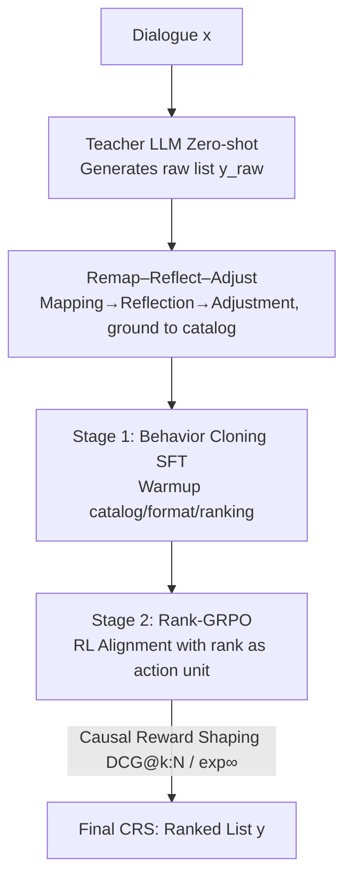

# Rank-GRPO: Training LLM-based Conversational Recommender Systems with Reinforcement Learning

**Conference**: ICLR 2026  
**OpenReview**: [https://openreview.net/forum?id=Xgw2D9cALS](https://openreview.net/forum?id=Xgw2D9cALS)  
**Code**: https://github.com/yaochenzhu/Rank-GRPO  
**Area**: Recommender Systems / RLHF Alignment / LLM Reasoning  
**Keywords**: Conversational Recommendation, GRPO, RL Alignment, Ranking Reward, Behavior Cloning

## TL;DR
This paper proposes the ConvRec-R1 two-stage framework to train LLM-based conversational recommender systems: first, a Remap–Reflect–Adjust distillation pipeline is used to generate high-quality demonstrations from a black-box teacher that are "grounded within the target catalog" for SFT warmup; then, Rank-GRPO (recrafting GRPO to treat "each rank" in the recommendation list as an action unit) is applied for RL alignment. This allows small models (0.5B–3B) to converge faster on REDDIT-V2 in terms of Recall/NDCG and match or even exceed GPT-4o.

## Background & Motivation
**Background**: Conversational Recommender Systems (CRS) are shifting from "passively predicting user behavior" to "active agents understanding preferences and recommending via dialogue." The dominant approach uses LLMs to directly output recommendation lists in natural language (movie title + year) rather than item ID tokens, preserving the LLM's linguistic capabilities while allowing flexible guidance for objectives like novelty and diversity.

**Limitations of Prior Work**: Directly aligning pre-trained LLMs to real-world recommendation tasks faces three specific issues: ① The model is unaware of the specific item catalog of a platform, frequently generating "out-of-catalog (OOC)" or non-existent entries in zero-shot settings; ② It fails to follow prescribed output formats (e.g., missing years), making downstream item matching difficult; ③ The ranking quality of the generated list **deteriorates towards the tail**, as pre-training lacks high-quality ranking-style data. These issues are particularly severe for the small models commonly used in industry.

**Key Challenge**: Reinforcement Learning from Verifiable Rewards (RLVR) is a promising direction for alignment, but two fundamental mismatches exist for CRS. First, RL requires a warm-start behavior cloning phase, but "manually annotating large-scale, in-catalog, well-ranked item lists" is virtually impossible. Second, mainstream algorithms like GRPO perform "token-level updates based on sequence-level rewards," whereas recommendation is a **ranked structural output**. Sequence-level rewards (like NDCG of the entire list) are too coarse to capture individual item contributions, while token-level updates are too fine (one item consists of multiple tokens). This mismatch leads to **non-causal credit assignment**, importance weight misalignment, and unstable training.

**Goal**: ① Automatically generate high-quality in-catalog ranking demonstrations without human labor; ② Design an RL alignment algorithm specifically matched for "ranking-style outputs."

**Key Insight**: The authors observe that the natural "action unit" of a recommendation list is neither a token nor the entire sequence, but a **rank (each position in the list)**; meanwhile, sequence rewards like DCG@N can be decomposed into a sum of item-wise rewards discounted by rank, allowing non-causal parts to be explicitly masked.

**Core Idea**: Use "Teacher Distillation + Catalog Alignment" to generate SFT data for warmup, and then modify the update granularity of GRPO from token/sequence to the **rank-level**—utilizing rank-level advantages, rank-level importance ratios, and causal reward masking to align for ranking tasks.

## Method

### Overall Architecture
ConvRec-R1 models conversational recommendation as "given dialogue $x$, policy $\pi_\theta(y|x)$ autoregressively generates an $N$-item ranked list $y=(y^{(1)},\dots,y^{(N)})$, where each item is a natural language token sequence grounded in catalog $\mathcal{C}$." The pipeline consists of two stages: Stage 1 uses Remap–Reflect–Adjust to generate demonstration data $\mathcal{D}_{\text{SFT}}$ from a black-box teacher (GPT-4o), performing behavior cloning to warm up the policy to "recognize the catalog, follow formats, and possess basic ranking ability"; Stage 2 builds upon this with Rank-GRPO, using user feedback (which items received positive feedback) as verifiable rewards for RL alignment, specifically targeting tail quality.

### Key Designs

**1. Remap–Reflect–Adjust: Grounding Black-box Teacher Recommendations to the Target Catalog**

The pain point is that "no one can manually label large-scale, in-catalog, well-ranked demonstrations." The authors have the teacher LLM generate an initial list $y_{\text{raw}}^{\text{SFT}}$ zero-shot, but it exists in the teacher's own recommendation space $\mathcal{C}_\Theta$, containing OOC items and bias. Three steps calibrate this into a score vector $s_{\text{final}}\in\mathbb{R}^{|\mathcal{C}|}$ on the target catalog, taking the top-$N$ as demonstrations:

- **Remap**: Transfer scores from the teacher space to the catalog space, $s_{\text{remap}} = p\cdot(S_{\text{item-item}} + I_{ic}) + \lambda\cdot s_{\text{conv-item}}$. Here $p$ is a sparse position score ($1/\sqrt{k}$ for rank $k$), $S_{\text{item-item}}$ maps items via semantic similarity, $I_{ic}$ is an identity matrix for name matches, and $s_{\text{conv-item}}$ encodes content similarity between dialogue and catalog items.
- **Reflect**: For top-$N_r>N$ candidates, "LLM-as-a-judge" is used for the same teacher to score from $-L$ to $+L$, normalized as $r_{\text{reflect}}$ and added: $s_{\text{reflect}} = s_{\text{remap}} + \gamma\cdot r_{\text{reflect}}$, improving contextual relevance.
- **Adjust**: Learn multiplicative/additive biases to align with the empirical distribution of real items in the training set: $s_{\text{final}} = w\odot s_{\text{reflect}} + b$, correcting residual popularity bias from the teacher.

The final demonstration $y^{\text{SFT}}$ is used for behavior cloning by minimizing the negative log-likelihood $L_{\text{SFT}}(\theta) = -\mathbb{E}[\log \pi_\theta(y^{\text{SFT}}|x^{\text{SFT}})]$. Its value lies in providing "in-catalog, correctly formatted, and reasonably ranked" demonstrations without human cost, making RL exploration efficient.

**2. Rank-GRPO: Changing Action Units from Tokens/Sequences to Ranks**

This is the core of the paper. Vanilla GRPO's gradient is "token-level importance ratio × sequence-level advantage × token-level gradient," which has two mismatches for ranking: sequence rewards are evenly spread across tokens, causing tail tokens to inherit credit from head tokens (**non-causal**); and during off-policy updates, token-level importance ratios are too fine-grained. Rank-GRPO's insight is to treat **each rank as an action unit**, being neither as fine as tokens nor as coarse as a full sequence.

It performs rank-level advantage estimation over $G$ trajectories, reducing complexity to linear. The objective is $J_{\text{Rank-GRPO}}(\theta)=\mathbb{E}\big[\frac{1}{GN}\sum_i\sum_k \min(w_{i,k}\hat A_{i,k},\,\mathrm{clip}(w_{i,k},1-\epsilon,1+\epsilon)\hat A_{i,k})\big]$. The rank-level advantage $\hat A_{i,k}$ is standardized relative to the same rank in the group. The rank-level importance ratio is defined as the **geometric mean** of the token probabilities for that rank:

$$\bar\pi_\theta(y_i^{(k)}|x) = \Big(\prod_{t=1}^{|y_i^{(k)}|}\pi_\theta(y_{i,k,t}|x,y_{i,k,<t})\Big)^{1/|y_i^{(k)}|},\quad w_{i,k}(\theta)=\frac{\bar\pi_\theta(y_i^{(k)}|x)}{\bar\pi_{\theta_{\text{old}}}(y_i^{(k)}|x)}.$$

The geometric mean is crucial to **eliminate token length variance** between items, ensuring stable importance weights for items of different lengths. The modified gradient becomes "rank-level importance ratio × rank-level advantage × rank-level average gradient," unifying granularity.

**3. Causal Reward Shaping: DCG@k:N and Exponentially Decayed Returns**

The pain point is that DCG@N includes contributions from the current item and subsequent ones, but also **preceding ranks**—this is particularly bad for the tail. The authors utilize the decomposability of DCG into a sum of discounted rank-wise terms to mask out the "non-causal part":

$$r(x,y_i^{(k)}) \triangleq \text{DCG@}k{:}N = \sum_{j=k}^{N}\frac{\text{rel}_j}{\log_2(j+1)},$$

where $\text{rel}_k=1$ if the item at rank $k$ is in the ground-truth and hasn't appeared earlier, else 0. An exponentially decayed variant is also provided: $r_{\exp\Gamma}(x,y_i^{(k)})=\sum_{j=k}^N \text{rel}_j/\Gamma^{(j-k)}$. In practice, the $\exp\infty$ variant (only calculating current item relevance) is the simplest and most stable.

### Loss & Training
Stage 1 uses negative log-likelihood for behavior cloning; RRA constructs demonstrations for 25% of training data. Stage 2 uses the Rank-GRPO objective. Backbones include Qwen2.5-0.5B / Llama-3.2-1B / Llama-3.2-3B. Off-policy setting $\mu=2$. Training starts from a slightly overfitted 1500-step SFT checkpoint to retain catalog grounding.

## Key Experimental Results

### Main Results
On REDDIT-V2 (383k training dialogues). R@k=Recall@k, N@k=NDCG@k.

| Method (Qwen2.5-0.5B backbone) | R@5 | R@20 | N@5 | N@20 |
|------|------|------|------|------|
| GPT-4o-mini (zero-shot) | 0.0949 | 0.1687 | 0.0747 | 0.0973 |
| GPT-4o (zero-shot) | 0.1106 | 0.2147 | 0.0861 | 0.1197 |
| CRAG (GPT-4o, 5–7 calls) | 0.1146 | 0.2212 | 0.0885 | 0.1227 |
| Qwen0.5B + SFT | 0.0642 | 0.1308 | 0.0502 | 0.0704 |
| Qwen0.5B + SFT + Vanilla GRPO | 0.0834 | 0.1803 | 0.0651 | 0.0945 |
| Qwen0.5B + SFT + Rank-GRPO (exp∞) | 0.0946 | 0.2047 | 0.0744 | 0.1079 |
| **Llama-3B + SFT + Rank-GRPO (exp∞)** | **0.1178** | **0.2368** | **0.0919** | **0.1283** |

Key Finding: 0.5B models with ConvRec-R1 exceed GPT-4o-mini; 3B models **outperform GPT-4o and CRAG** on Recall/NDCG@20, while the latter requires 5–7 GPT-4o API calls per recommendation.

### Ablation Study

| Configuration (Qwen0.5B) | R@5 | N@20 | Note |
|------|------|------|------|
| SFT (Full RRA) | 0.0642 | 0.0704 | Behavior Cloning Baseline |
| – w/o remap-reflect | 0.0579 | 0.0637 | Weakened catalog grounding |
| – w/o reflect | 0.0623 | 0.0698 | Lower quality at large $k$ |
| SFT + Rank-GRPO (exp∞) | 0.0946 | 0.1079 | Full Model |
| – w/o SFT stage (R1-zero) | 0.0440 | 0.0431 | Direct RL fails |

### Key Findings
- **SFT is indispensable**: Removing SFT (R1-zero) causes performance to collapse. SFT pushes the in-catalog ratio to 99%+.
- **Rank-GRPO gains are concentrated at the tail**: Improvements accumulate as $k$ increases compared to vanilla GRPO.
- **Training dynamics "retrieve then rerank"**: Under exp∞, relevance for low-rank items (15/20) first rises then falls, while high-ranks (1/2/5) rise monotonically—relevant items are first brought into the list then pushed to the top.

## Highlights & Insights
- **"Rank is the natural action unit for ranking tasks"**: Finding the intermediate granularity between token and sequence unifies advantage, importance ratio, and gradient.
- **Geometric Mean Importance Ratio**: Eliminating item length variance allows for stable reinforcement of multi-token items.
- **Causal Reward Masking**: Explicitly removing non-causal credit directly addresses "tail items piggybacking on head performance."
- **Small Model Parity**: Properly aligned 0.5B–3B models can match or exceed GPT-4o, a strong signal for industrial deployment.

## Limitations & Future Work
- Reward shaping remains rudimentary; window-based constraints are future work.
- Validation is limited to movie (REDDIT) and movie-related (REDIAL) domains.
- Dependence on a strong black-box teacher (GPT-4o) for SFT; the pipeline relies on item-item similarity matrices.
- The $\exp\infty$ variant being optimal suggests that the causal influence of preceding high-rank items on subsequent ones is negligible in this task, which warrants further analysis.

## Related Work & Insights
- **vs Vanilla GRPO**: Conventional GRPO's token-level updates with sequence rewards are non-causal for ranking; this work refines the unit to rank.
- **vs GSPO**: GSPO uses sequence-level importance weights; Rank-GRPO further refines this to the rank-level.
- **vs CRAG / GPT-4o Prompting**: These rely on multiple expensive calls; the proposed method uses a single small model generation.
- **vs ID-token Recommendations**: This method sticks to natural language representations, preserving linguistic capability.

## Rating
- Novelty: ⭐⭐⭐⭐⭐ "Rank as action unit" + causal reward masking is a principled modification of GRPO for ranking.
- Experimental Thoroughness: ⭐⭐⭐⭐ Solid across multiple backbones and baselines, though domain variety is limited.
- Writing Quality: ⭐⭐⭐⭐⭐ Clear derivation and motivation.
- Value: ⭐⭐⭐⭐⭐ Enables small models to reach GPT-4o quality for CRS with a reusable RL framework.

<!-- RELATED:START -->

## Related Papers

- [\[ICLR 2026\] Continual Low-Rank Adapters for LLM-based Generative Recommender Systems](continual_low-rank_adapters_for_llm-based_generative_recommender_systems.md)
- [\[ICLR 2026\] Token-Efficient Item Representation via Images for LLM Recommender Systems](token-efficient_item_representation_via_images_for_llm_recommender_systems.md)
- [\[AAAI 2026\] RecToM: A Benchmark for Evaluating Machine Theory of Mind in LLM-based Conversational Recommender Systems](../../AAAI2026/recommender/rectom_a_benchmark_for_evaluating_machine_theory_of_mind_in_llm-based_conversati.md)
- [\[ICLR 2026\] Reinforced Latent Reasoning for LLM-based Recommendation](reinforced_latent_reasoning_for_llm-based_recommendation.md)
- [\[ICLR 2026\] On the Mechanisms of Collaborative Learning in VAE Recommenders](on_the_mechanisms_of_collaborative_learning_in_vae_recommenders.md)

<!-- RELATED:END -->
