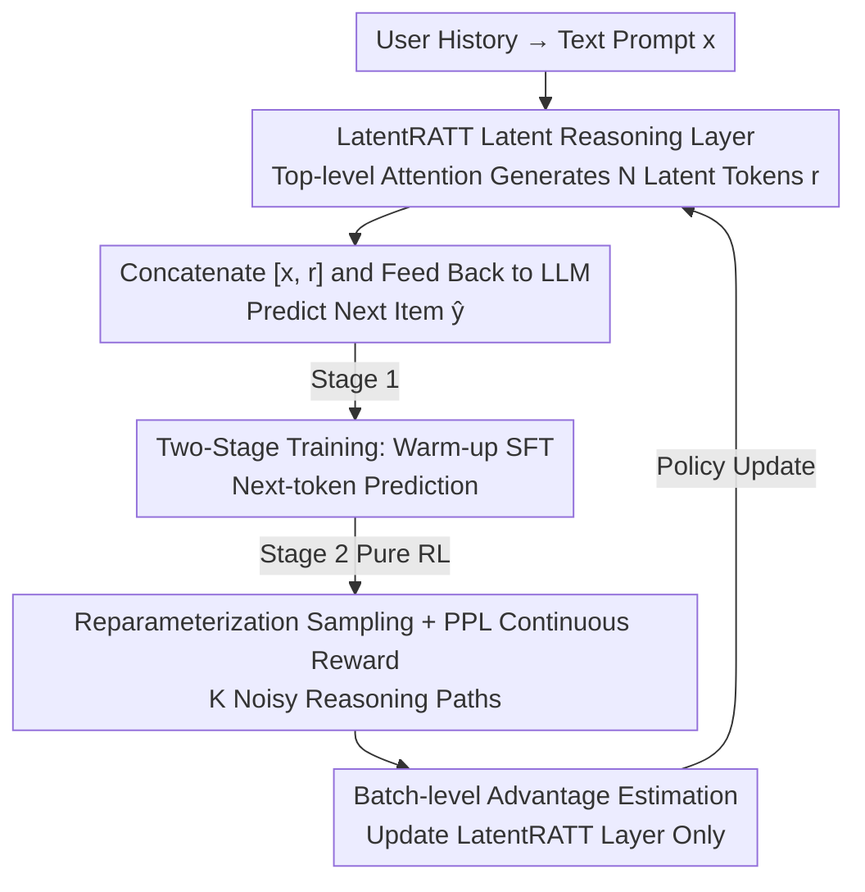

# Reinforced Latent Reasoning for LLM-based Recommendation

**Conference**: ICLR 2026  
**OpenReview**: [https://openreview.net/forum?id=eUtIZT2ONS](https://openreview.net/forum?id=eUtIZT2ONS)  
**Code**: [https://github.com/xuwenxinedu/R3](https://github.com/xuwenxinedu/R3)  
**Area**: LLM Recommendation / Latent Reasoning / Reinforcement Learning  
**Keywords**: Latent Reasoning, LLM Recommendation, GRPO, Reinforcement Learning, Inference Efficiency

## TL;DR
Addressing the pain points where explicit Chain-of-Thought (CoT) in LLM recommendations is both difficult to obtain as supervisory data and slow during inference, this paper proposes LatentR3. By adding a LatentRATT attention layer at the top of the LLM to compress reasoning into a **continuous latent space** (requiring only 1 latent token) and employing a modified GRPO (utilizing PPL continuous rewards + batch-level advantage), the model learns latent reasoning end-to-end without any CoT supervision. This approach yields relative improvements of 17.0% and 8.4% when applied to BIGRec and D3, respectively.

## Background & Motivation
**Background**: Transferring the reasoning capabilities of LLMs to the recommendation domain is a current research hotspot. The essence of recommendation is "inferring" implicit preferences from user history, which naturally aligns with the chain-of-thought reasoning at which LLMs excel. Prevailing practices follow general-domain paradigms by fine-tuning models with explicit CoT text data, requiring the model to "think for a while" before providing a recommendation.

**Limitations of Prior Work**: This explicit CoT route faces two major obstacles in recommendation scenarios. First, **inference is too slow**: the auto-regressive generation of long CoT text leads to latency and computational overhead that are nearly unacceptable in real-world recommendation systems (the paper measures a ~25x cost increase on Toys and nearly 30x on Games). Second, **supervisory data is unavailable**: user feedback in recommendation consists only of final click/purchase results, lacking any annotation of the underlying reasoning process. Moreover, preferences are highly subjective and personalized, making manual or synthetic CoT both expensive and unreliable.

**Key Challenge**: Explicit CoT binds "reasoning" strictly to natural language text—requiring payment in generation latency for this text and forcing the training to use non-existent CoT annotations.

**Goal**: Can we release the reasoning potential of LLMs while **eliminating explicit CoT during both training and inference**?

**Key Insight**: The authors shift reasoning from the natural language space to the LLM's **hidden (latent) space**. The information density of hidden states is much higher than that of discrete text tokens; thus, a few (1 is sufficient in experiments) latent tokens can encode the entire reasoning process, removing text generation and significantly reducing latency. However, existing latent reasoning methods (e.g., Coconut) still rely on CoT data distillation, failing the "zero CoT" requirement.

**Core Idea**: Utilize **Reinforcement Learning** (RL) to learn latent reasoning end-to-end from weak signals of final user feedback. Without any CoT supervision, the model follows a DeepSeek-R1-style paradigm—SFT warm-up followed by pure RL exploration—while adapting GRPO to be more suitable for continuous latent spaces.

## Method

### Overall Architecture
LatentR3 addresses learning latent reasoning without CoT supervision through two components: **Architecture-wise**, it adds a LatentRATT attention layer at the top of the LLM to aggregate context into continuous latent reasoning tokens; **Learning-wise**, it employs a two-stage strategy—supervised warm-up followed by pure RL exploration—to cultivate true reasoning capabilities within this layer.

The inference workflow is as follows: user history is formatted into a text prompt $x$ and input into the LLM; LatentRATT auto-regressively generates $N$ latent reasoning tokens $r=[r_1,\dots,r_N]$ (where each $r_i\in\mathbb{R}^d$ resides in the input embedding space of the LLM); $x$ and $r$ are then concatenated and fed back into the LLM to predict the next item $\hat y$. During training, the first stage performs SFT warm-up on the entire model, and the second stage freezes the LLM to tune only the LatentRATT layer using a modified version of GRPO (termed LR-GRPO).

### Key Designs

**1. LatentRATT: "Producing" Latent Thought via a Dedicated Attention Layer**

The pain point is that previous latent reasoning methods directly used the hidden states of the LLM decoder as "thought tokens," which are optimized for predicting the next text token and are not naturally suited to be fed back as inputs. This paper adds an **extra attention layer**, LatentRATT, atop the final LLM decoder layer. It serves two roles: a "reasoning token generator" that aggregates contextual information into coherent latent thoughts, and an alignment tool that maps these latent tokens into the LLM's input embedding space. To generate the $i$-th latent token, $x$ and previously generated $r_1,\dots,r_{i-1}$ are input to the LLM to obtain the final hidden state sequence $H_{i-1}=\text{LLM}_{-1}(x,r_1,\dots,r_{i-1})$. Then, $r_i=\text{LatentRATT}(H_{i-1})[-1]$. In this framework, $N=1$ achieves strong results, which is the source of the low latency.

**2. Two-Stage Training: SFT Warm-up followed by Pure RL Exploration**

Performing RL from scratch in the **high-dimensional continuous space** of latent reasoning is unstable. Following the DeepSeek-R1 paradigm, this paper uses two stages: **Warm-up SFT**, where the full model is fine-tuned using standard next-token prediction to provide the reasoning layer with meaningful initialization: $L_{\text{warm}}=-\sum_{(x,y)\in D}\sum_{i=1}^{|y|}\log P_\theta(y_i\mid x,r,y_{<i})$. The second stage starts from the SFT result and performs **pure RL** to encourage the model to explore better reasoning paths beyond merely fitting data. SFT alone outperforms no-reasoning baselines but is significantly inferior to the full method with RL.

**3. PPL Continuous Reward + Reparameterization Sampling: RL Without Full Decoding**

Since latent reasoning involves continuous vectors, they cannot be sampled like discrete text. The paper uses the **reparameterization trick**: the generated latent vector $r$ is treated as the mean of a Gaussian distribution, with the $k$-th sample being $r_k=r+\epsilon,\ \epsilon\sim\mathcal N(0,\sigma^2)$, allowing $K$ different reasoning paths to be derived. For rewards, instead of costly auto-regressive decoding for every sample as in standard GRPO, the paper uses the **Perplexity (PPL)** of the ground-truth answer as a proxy reward: $s_k=-\exp\!\big(-\tfrac{1}{|y|}\sum_{i=1}^{|y|}\log\pi_\theta(y_i\mid x,r_k,y_{<i})\big)$. This avoids decoding while transforming discrete feedback into a **continuous signal**.

**4. Batch-level Advantage Estimation: Stabilizing RL with Continuous Rewards**

Original GRPO uses **intra-group** mean rewards as a baseline. For continuous rewards, this is problematic: even if an entire group of sampled reasoning is low quality, intra-group comparison might provide a positive advantage. This paper uses **batch-level mean** rewards as the baseline: $A_k=\dfrac{s_k-\bar s_{\text{batch}}}{\lVert S_{\text{batch}}-\bar s_{\text{batch}}\rVert}$, where $\bar s_{\text{batch}}$ is the average reward of the first (un-noised) sample across the entire batch. The training **only updates the LatentRATT layer and freezes the original LLM**, causing the KL divergence $D_{KL}(\pi_\theta\|\pi_{\text{ref}})$ to vanish, further saving computation.

### Loss & Training
- **Stage 1 (SFT)**: Full model next-token prediction via $L_{\text{warm}}$.
- **Stage 2 (LR-GRPO)**: Objective $L_{\text{GRPO}}=\sum_{(x,y)}-\tfrac{1}{K}\sum_{k=1}^{K}\tfrac{1}{|y|}\sum_{i=1}^{|y|}\tfrac{\pi_\theta(y_i\mid x,r_k,y_{<i})}{\pi_{\text{old}}(y_i\mid x,r_k,y_{<i})}A_k$.
- Latent reasoning length $N=1$ in experiments. It can be integrated into different LLM recommendation backbones such as BIGRec and D3.

## Key Experimental Results

### Main Results
Testing on four Amazon subsets (Toys, CDs, Games, Instruments) with HR@5/10 and NDCG@5/10.

| Dataset | Metric | BIGRec | +LatentR3 | D3 | +LatentR3 |
|--------|------|--------|-----------|------|-----------|
| Toys | H@5 | 0.0701 | 0.0821 | 0.0830 | **0.0898** |
| Toys | N@5 | 0.0508 | 0.0600 | 0.0610 | **0.0670** |
| CDs | H@5 | 0.0757 | 0.0934 | 0.1122 | **0.1137** |
| Games | H@5 | 0.0461 | 0.0580 | 0.0608 | **0.0716** |
| Instruments | H@5 | 0.0938 | 0.1029 | 0.0984 | **0.1066** |

LatentR3 yields an average relative **Gain** of **17.0%** for BIGRec and **8.4%** for D3, exceeding the **Prev. SOTA** AlphaRec. Notably, using raw LLMs (Base) even with explicit CoT performs worse than traditional models, underscoring the necessity of alignment.

### Ablation Study

| Configuration | Toys H@5 | CDs H@5 | Description |
|------|----------|---------|------|
| LatentR3 (Full) | 0.0821 | 0.0934 | Full model |
| w/o Reasoning | 0.0701 | 0.0757 | Baseline codebase |
| w/o LatentRATT | 0.0772 | 0.0705 | Direct hidden states; worse than no-reasoning on CDs |
| w/o RL (SFT only) | 0.0804 | 0.0830 | Warm-up only; significantly inferior to RL |
| w/o Batch Advantage | 0.0812 | 0.0828 | Using intra-group advantage; unstable on CDs |

### Key Findings
- **LatentRATT is critical**: Without it, performance on CDs drops below the no-reasoning baseline, proving a dedicated alignment layer is required for latent tokens.
- **RL is indispensable**: While SFT provides a start, RL significantly lifts the performance ceiling. Batch-level advantage is necessary for stability.
- **Greater gains on difficult samples**: Relative improvements are significantly higher for long-tail (non-popular) items compared to popular ones, suggesting reasoning is most beneficial in sparse scenarios.
- **Efficiency advantage**: Using only 1 latent token keeps inference costs near the baseline, while explicit CoT increases costs by 25~30 times.

## Highlights & Insights
- **Dual Efficiency**: Reduces inference latency with a single latent token and reduces training costs by using PPL as a proxy reward to bypass auto-regressive decoding.
- **Clean GRPO Adaptation**: The combination of reparameterization sampling, continuous PPL rewards, and batch-level advantage provides a clear solution for RL in continuous spaces.
- **Frozen Backbone**: Tuning only a thin attention layer (LatentRATT) makes the KL term zero and significantly preserves computational resources.

## Limitations & Future Work
- **Lack of Interpretability**: Latent reasoning is not human-readable text, unlike explicit CoT.
- **Reward Proxy**: PPL is a proxy for ground-truth items and may have a gap with actual recommendation utility (ranking/clicks).
- **Domain Scope**: Evaluation is primary limited to the Amazon domain and specific backbones.
- **Upper Bound of $N$**: While $N=1$ is effective, the scaling behavior of longer latent reasoning for complex tasks is not fully explored.

## Related Work & Insights
- **vs. Explicit CoT Rec**: Unlike methods requiring CoT supervision and long text generation, this method operates in the latent space with zero CoT supervision and much lower latency.
- **vs. Coconut**: Shifts from CoT distillation to RL-based end-to-end learning from final feedback.
- **vs. DeepSeek-R1**: adopts the "SFT + pure RL" paradigm but translates reasoning from discrete tokens to continuous latent vectors.

## Rating
- Novelty: ⭐⭐⭐⭐
- Experimental Thoroughness: ⭐⭐⭐⭐
- Writing Quality: ⭐⭐⭐⭐
- Value: ⭐⭐⭐⭐

<!-- RELATED:START -->

## Related Papers

- [\[ICLR 2026\] Token-Efficient Long-Term Interest Sketching and Internalized Reasoning for LLM-based Recommendation](token-efficient_long-term_interest_sketching_and_internalized_reasoning_for_llm-.md)
- [\[ICLR 2026\] In Agents We Trust, but Who Do Agents Trust? Latent Source Preferences Steer LLM Generations](in_agents_we_trust_but_who_do_agents_trust_latent_source_preferences_steer_llm_g.md)
- [\[ACL 2026\] ReRec: Reasoning-Augmented LLM-based Recommendation Assistant via Reinforcement Fine-tuning](../../ACL2026/recommender/rerec_reasoning-augmented_llm-based_recommendation_assistant_via_reinforcement_f.md)
- [\[NeurIPS 2025\] Think before Recommendation: Autonomous Reasoning-enhanced Recommender](../../NeurIPS2025/recommender/think_before_recommendation_autonomous_reasoning-enhanced_recommender.md)
- [\[ICLR 2026\] More Than What Was Chosen: LLM-based Explainable Recommendation Beyond Noisy User Preferences](more_than_what_was_chosen_llm-based_explainable_recommendation_beyond_noisy_user.md)

<!-- RELATED:END -->
