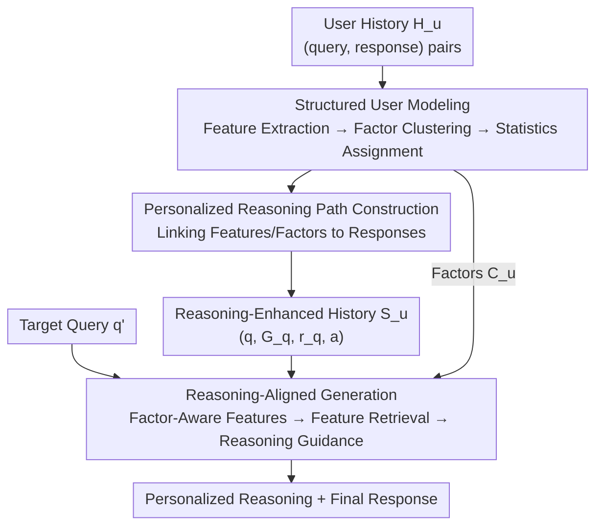

# RPM: Reasoning-Level Personalization for Black-Box Large Language Models

**Conference**: ICLR 2026  
**OpenReview**: [https://openreview.net/forum?id=oKKVLHFzZ8](https://openreview.net/forum?id=oKKVLHFzZ8)  
**Code**: https://github.com/jieyong99/RPM  
**Area**: LLM Personalization / Black-Box LLMs / Recommendation & User Modeling  
**Keywords**: Black-box LLM personalization, reasoning-level personalization, user behavior modeling, features and factors, reasoning path retrieval

## TL;DR
RPM upgrades black-box LLM personalization from "aligning final responses" to "aligning underlying reasoning processes." It automatically extracts a structured user model of "features → factors → statistics" from raw user history, constructs personalized reasoning paths for each history entry, and feeds these reasoning examples to the model via feature-based retrieval. This enables the LLM to reason following the user's private logic, consistently outperforming existing response-level personalization methods across four task categories with enhanced interpretability.

## Background & Motivation
**Background**: Personalization for black-box LLMs (models like GPT-4o with inaccessible parameters) mainly follows two routes: retrieval-based methods (selecting examples from user history based on similarity or utility, e.g., RAG, HYDRA) and prompt optimization methods (incorporating user information via heuristic templates or iterative feedback, e.g., PAG, Fermi).

**Limitations of Prior Work**: Both routes are confined to **Response-Level Personalization**, where the goal is merely to match the final output with the user's past responses. This leads to two issues: first, **shallow pattern learning**, where the system only captures shallow "input ↔ output" correlations without understanding which specific input components influence the response; second, a **lack of interpretability**, as the absence of explicit reasoning paths makes it difficult to distinguish whether outputs reflect true user preferences or misleading correlations.

**Key Challenge**: User behavior is driven by a stable underlying logic ("why this score/response was given"). Response-level methods align results rather than this logic, leading to insufficient depth and clarity. The authors also identify a counter-intuitive phenomenon: directly applying Zero-shot CoT or few-shot CoT to baselines **often leads to performance degradation**, as CoT produces generic logic irrelevant to the specific user.

**Goal**: Propose and formalize **Reasoning-Level Personalization** as a new paradigm and develop the first system framework that automatically transforms raw behavior data into a "structured reasoning model" that the model can reliably follow.

**Key Insight**: Since general reasoning structures (CoT, ToT) are independent of user identity, the reasoning structure should be **directly derived from observed user behavior**, treating it as a data-driven modeling principle rather than a prompting trick.

**Core Idea**: Structure user history into "response-influencing features + statistical factors," label personalized reasoning paths for historical samples, and use feature-based retrieval to extract the most instructive examples to guide the LLM's reasoning process.

## Method

### Overall Architecture
RPM aims to generate a personalized output $a'$ for a black-box model $M$, user history $H_u=\{(q_i,a_i)\}_{i=1}^N$, and a target query $q'$ without modifying parameters. The process is divided into three serial stages: **offline structured user modeling**, **personalized reasoning path construction**, and **online reasoning-aligned generation**.

Specifically: (1) **Structured User Modeling** extracts response-influencing features $G_{q_i}$ from each history query, clusters them into user-level factors $C_u$, and assigns statistical meanings; (2) **Personalized Reasoning Construction** generates a reasoning path $r_{q_i}$ linking features/factors to the response for each $(q_i,a_i)$, stored in a "reasoning-enhanced history" $S_u$; (3) **Reasoning-Aligned Generation** performs "factor-aware" feature extraction for the target query and retrieves top-$K$ reasoning examples to guide $M$.

### Key Designs

**1. Structured User Modeling: Refining history into "Feature → Factor → Statistic"**

To address the issue of shallow correlations, RPM builds a three-layer structured user model. In **Feature Extraction**, $M$ extracts features $G_{q_i}=\{f_j\}$ from each $q_i$, where each feature is a triplet $f_j=(\text{name}_j,\text{context}_j,\text{factor}_j)$. In **Factor Generation**, features are clustered across all queries $\{F^{(m)}\}=\text{LLM\_Cluster}(\cup_i G_{q_i})$ to obtain user-level semantic clusters representing reasoning tendencies.

The **Statistics Assignment** layer quantifies these factors. For discrete tasks, a propensity score is defined:

$$\text{Propensity}(y, F^{(m)}) = \frac{\sum_{(q_i,a_i)\in H_u} \mathbb{I}[a_i=y \wedge F^{(m)}\cap G_{q_i}\neq\varnothing]}{\sum_{(q_i,a_i)\in H_u} \mathbb{I}[F^{(m)}\cap G_{q_i}\neq\varnothing]}.$$

For open-ended tasks, factors are characterized by Coverage, Influence, and Polarity. These statistics $C_u=\{F^{(m)},\theta^{(m)}\}$ serve as quantitative reference points during reasoning.

**2. Personalized Reasoning Path Construction: Explicitly modeling the path to responses**

This stage fills the gap between "available signals" and "how signals lead to responses." $M$ is used to derive a reasoning path $r_{q_i}=M(q_i,G_{q_i},C_u,a_i)$ based on observed responses. These paths are stored in the reasoning-enhanced history:

$$S_u=\{(q_i, G_{q_i}, r_{q_i}, a_i)\,|\,(q_i,a_i)\in H_u\}.$$

These examples serve as demonstrations for the model on how the user processes specific signals to reach conclusions.

**3. Reasoning-Aligned Generation: Factor-aware feature retrieval and guidance**

RPM utilizes a three-step online process. **Factor-aware feature extraction** anchors target query features to the user's existing factor structure $C_u$. **Feature-based retrieval** uses the feature set as the key to calculate semantic similarity with items in $S_u$:

$$S^{ret}_{u,q'}=\{(q,G_q,r_q,a)\in S_u \mid \text{Top-}K\;\cos(f(G_{q'}), f(G_q))\},$$

where $f(\cdot)$ is the embedding of concatenated feature text. Finally, **Reasoning-aligned generation** uses the retrieved examples as explicit conditions to produce both personalized reasoning and the final response.

## Key Experimental Results

### Main Results
Evaluation was conducted across four tasks (LaMP-2, LaMP-3, LaMP-5, GlobalOpinionQA) using GPT-4o-mini as the backbone.

| Dataset/Metric | Zero-shot | Prev. SOTA | RPM | Description |
|--------|------|------|------|------|
| LaMP-2 Acc ↑ | 0.430 | 0.526 | **0.561** | ~3.5 point lead in classification |
| LaMP-3 MAE ↓ | 0.361 | 0.312 | **0.259** | Significant error reduction |
| LaMP-5 R-1 ↑ | 0.446 | 0.466 | **0.492** | Improvement in generation |
| GOQA Acc ↑ | 0.562 | 0.820 | **0.852** | Overall lead in QA |

Notably, adding generic CoT to baselines often resulted in performance drops, confirming that "general reasoning is not personalized reasoning." RPM also demonstrated strong cross-model transferability.

### Ablation Study
Incremental contribution of components (Table 2):

| Configuration | LaMP-2 Acc | LaMP-3 MAE | GOQA Acc | Description |
|------|---------|------|------|------|
| Zero-shot ($q'$) | 0.430 | 0.361 | 0.562 | Target query only |
| + Features/Factors ($G_{q'},C_u$) | 0.465 | 0.287 | 0.647 | Structured representation is effective |
| + Retrieved pair $(q,a)$ | 0.485 | 0.274 | 0.755 | Contextual examples improve results |
| + General CoT | 0.492 | 0.385 | 0.735 | Generic reasoning degrades MAE |
| RPM (Personalized Reasoning) | **0.561** | **0.259** | **0.852** | Largest gain from personalized paths |

### Key Findings
- **Personalized reasoning paths are the primary driver**: Generic CoT degraded LaMP-3 MAE to 0.385, while personalized paths reduced it to 0.259.
- **Structural components are essential**: Removing features/factors significantly degrades performance, as they provide the foundation for reasoning and retrieval.
- **Feature-based vs. Surface retrieval**: Retrieval using features $G_{q'}$ consistently outperforms surface-level query retrieval by matching decision structures rather than topics.
- **Cost-effective**: Preprocessing costs ~\$0.058/user and inference costs ~\$0.0037, significantly lower than methods like Fermi or HYDRA.

## Highlights & Insights
- **Paradigm Redefinition**: Shifting personalization from output alignment to reasoning process alignment provides a cleaner, more robust objective.
- **Quantifiable User Models**: The 3-layer structure (features→factors→statistics) creates a high-density digital profile more effective than natural language summaries.
- **Structural Retrieval**: Using features as retrieval keys allows for "utility-based" selection without extra training or rerankers.
- **Cross-model Inference Memory**: Reasoning memories $S_u$ constructed by one model can be reused by others, indicating that the framework captures the signal rather than model bias.

## Limitations & Future Work
- **Backbone Dependency**: The quality of features and reasoning depends on the backbone LLM's judgment; errors in initial extractions may propagate.
- **Preprocessing Costs**: Costs scale linearly with the number of users, which may be a consideration for massive user bases.
- **Evaluation Scale**: Sampling (50-100 users per task) is relatively small; performance on extremely long-tail individual users requires further validation.
- **Future Directions**: Exploring causal modeling for factors and specialized encoders for structural feature retrieval.

## Related Work & Insights
- **vs. RAG**: RAG uses surface query similarity; RPM uses structural feature similarity to retrieve decision-relevant examples.
- **vs. HYDRA**: HYDRA trains an expensive reranker; RPM achieves high-quality retrieval via structured keys with zero extra training.
- **vs. Fermi / PAG**: These optimize prompts but offer limited guidance on how to map input to output; RPM provides explicit personalized reasoning paths as contextual demonstrations.
- **vs. General CoT (ToT)**: General structures are task-specific; RPM is user-specific and data-driven.

## Rating
- Novelty: ⭐⭐⭐⭐⭐ 
- Experimental Thoroughness: ⭐⭐⭐⭐ 
- Writing Quality: ⭐⭐⭐⭐⭐ 
- Value: ⭐⭐⭐⭐ 

<!-- RELATED:START -->

## Related Papers

- [\[AAAI 2026\] Inference-Aware Prompt Optimization for Aligning Black-Box Large Language Models](../../AAAI2026/recommender/inference-aware_prompt_optimization_for_aligning_black-box_large_language_models.md)
- [\[ICLR 2026\] From Evaluation to Defense: Advancing Safety in Video Large Language Models](from_evaluation_to_defense_advancing_safety_in_video_large_language_models.md)
- [\[ICLR 2026\] Adaptive Regularization for Large-Scale Sparse Feature Embedding Models](adaptive_regularization_for_large-scale_sparse_feature_embedding_models.md)
- [\[NeurIPS 2025\] R²ec: Towards Large Recommender Models with Reasoning](../../NeurIPS2025/recommender/r2ec_towards_large_recommender_models_with_reasoning.md)
- [\[ICLR 2026\] Reinforced Latent Reasoning for LLM-based Recommendation](reinforced_latent_reasoning_for_llm-based_recommendation.md)

<!-- RELATED:END -->
