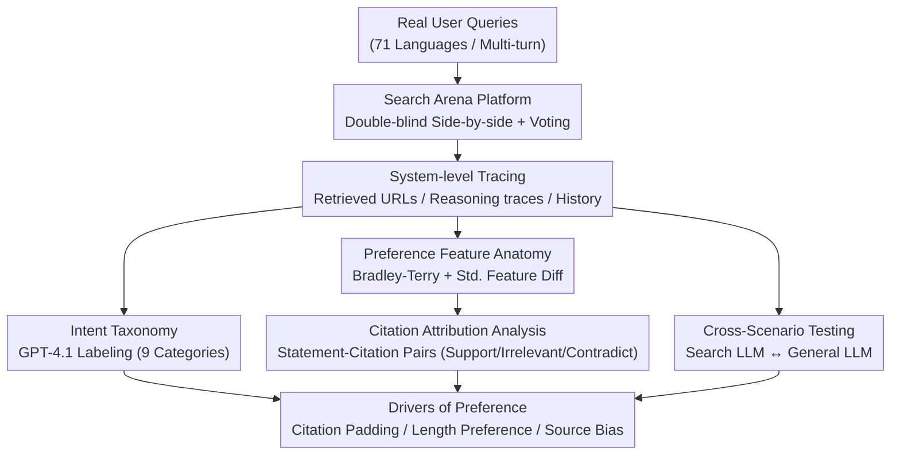

# Search Arena: Analyzing Search-Augmented LLMs

**Conference**: ICLR 2026  
**arXiv**: [2506.05334](https://arxiv.org/abs/2506.05334)  
**Code**: [Project Page](https://github.com/) (Open-source dataset)  
**Area**: Recommender Systems  
**Keywords**: search-augmented LLM, benchmark, human preference, citation analysis, Chatbot Arena

## TL;DR
The authors construct Search Arena—the first large-scale search-augmented LLM human preference dataset (24,069 conversations + 12,652 preference votes across 71 languages). The study discovers that user preferences are heavily influenced by citation count (even when citations do not support statements), community-driven platforms are preferred over Wikipedia, and search augmentation does not degrade general chat performance, whereas general LLMs significantly deteriorate in search scenarios.

## Background & Motivation
**Background**: Search-augmented LLMs (e.g., Perplexity, Gemini Search, ChatGPT Search) combining web search with LLM reasoning are increasingly popular. Existing evaluation benchmarks like SimpleQA (4,326 items) and BrowseComp (1,266 items) are small-scale, single-turn, English-only, and focused on factual queries.

**Limitations of Prior Work**:
- **Insufficient Coverage**: Factual queries account for only ~19% of real user queries; most require synthesis, analysis, recommendation, or creativity.
- **Lack of Preference Understanding**: It remains unclear what users prefer in search scenarios—the role of citations, the influence of source sites, or the value of reasoning.
- **Cross-scenario Evaluation Gap**: How do search LLMs perform in general scenarios, and how do general LLMs perform in search scenarios?

**Key Challenge**: Evaluating search-augmented LLMs requires large-scale, authentic, and diverse interaction data, yet existing datasets are small-scale and expert-constructed.

**Core Idea**: Crowdsource real-world interactions and preferences between users and search LLMs via the Chatbot Arena platform for systematic analysis.

## Method

### Overall Architecture
Rather than proposing a new model, this paper establishes an "Arena" capable of continuously generating real preference data and uses statistical tools to uncover the drivers of user preference. The pipeline is as follows: A user submits a real query → the Search Arena platform (a standalone search tab on Chatbot Arena) displays side-by-side anonymous responses from two search-augmented LLMs → the user votes for the better response. The platform records comprehensive system-level traces for each conversation (retrieved URLs, reasoning traces, multi-turn history). After 7 weeks of collection (March 18 – May 8), 24,069 conversations and 12,652 preference votes were collected and analyzed through three branches: quantifying the distribution of queries via an intent taxonomy, decomposing pairwise votes into feature-level preference contributions using Bradley-Terry models (with citation attribution as a crucial sub-analysis), and performing bidirectional cross-scenario testing.

### Key Designs

**1. Arena Dataset & System Tracing: Moving beyond "who won" to "why they won"**

To analyze preference drivers, knowing the winner is insufficient; fine-grained intermediate states are required. The platform records **complete system traces**—retrieved URL lists, model reasoning traces, final response text, and multi-turn history. This metadata enables detailed analyses such as "whether citations support statements," "source site distribution," and "whether reasoning filtered irrelevant sources." The final dataset covers 11,650 users, 136 countries, 71 languages (58.3% English, 11.8% Russian, 7.0% Chinese), and 13 models. 22.4% are multi-turn and 11% are multilingual. The scale is 5–19x larger than SimpleQA and BrowseComp.

**2. Intent Taxonomy: Quantifying real-world queries to expose benchmark bias**

Existing benchmarks assume "search equals fact-checking." Ours first performs open coding on 100 samples to derive 9 intent categories (Factual Lookup, Information Synthesis, Analysis, Recommendation, Explanation, Creative Generation, Guidance, Text Processing, Other), then extends labels via GPT-4.1. Reliability was verified using Cohen's kappa on 150 multilingual samples, achieving 0.812 (strong agreement) between the model and humans on top-2 intents. Results disprove the "search = fact-checking" hypothesis: Factual Lookup only accounts for 19.3%. The remaining four-fifths require higher-order synthesis and analysis, and these complex queries are longer (avg. 66.7 words vs. 17.2 for facts).

**3. Preference Feature Anatomy & Citation Attribution: Decomposing preference via Bradley-Terry models**

The core analysis uses a Bradley-Terry model where the **standardized difference between two responses on a specific feature** is a covariate. The fitted coefficient $\beta$ represents the marginal contribution of that feature to being preferred. Standard features follow intuition: reasoning models are favored (win rate >60%), larger search context windows are preferred (sonar-pro win rate 63.9% at high context vs. 57.6% at medium), and longer responses are preferred ($\beta_{length}=0.334$), though this decreases to $0.156$ for factual queries. Citation count is also positively correlated ($\beta_{citations}=0.209$).

Crucially, **citation attribution analysis** shows that while supported statement-citation pairs are positively correlated ($\beta_{support}=0.285$), **irrelevant pairs are almost equally positively correlated ($\beta_{irrelevant}=0.273$)**, while contradictory ones are insignificant. Users essentially treat the presence of a citation as a proxy for credibility, regardless of whether it actually supports the claim. Regarding sources, technical platforms, community blogs, and social networks are preferred over Wikipedia for time-sensitive topics.

**4. Cross-Scenario Testing: Search as a toggleable variable**

To determine if search augmentation has side effects, Ours performs bidirectional testing. Testing search-augmented LLMs in general chat (Text Arena) shows they do not lose general performance and are preferred in factual queries (p=0.012). Conversely, testing general LLMs in search tasks shows significant deterioration (p=0.009), as parametric knowledge cannot replace real-time information. Expert labeling on 100 samples shows 68% agreement with user preferences (excluding ties), indicating crowdsourced votes reflect meaningful quality judgements.

## Key Experimental Results

### Preference Factors (Bradley-Terry Coefficients)

| Feature | Coefficient $\beta$ | Significance | Meaning |
|------|-------------|-----------|------|
| Response Length | 0.334 (0.156 for facts) | ✓ | Long responses preferred, except for facts |
| Citation Count | 0.209 | ✓ | More citations correlate with higher preference |
| Supported Pairs | 0.285 | ✓ | Justified preference |
| **Irrelevant Pairs** | **0.273** | ✓ | Concerning—almost equivalent to supported pairs |
| Contradictory Pairs | Not Sig. | — | Users do not penalize contradictory citations |
| Search Context Size | Positive | ✓ | Larger windows are better |
| Reasoning Ability | Positive | ✓ | Reasoning models have higher win rates |

### Cross-Scenario Analysis

| Model Type | Search Scenario | General Scenario |
|---------|---------|---------|
| Search-Augmented LLM | Normal | **No Gain/Loss** (Gain in factual queries) |
| General LLM | **Significant Loss** (p=0.009) | Normal |

### Comparison with Benchmarks

| Benchmark | Scale | Languages | Multi-turn | Intent Coverage |
|------|------|------|------|---------|
| SimpleQA | 4,326 | English | ✗ | Factual only |
| BrowseComp | 1,266 | English | ✗ | Constraint-based |
| **Search Arena** | **24,069** | **71** | **✓** | **9 Categories** |

### Key Findings
- **Citation count bias** is a major discovery: users equate the presence of citations with credibility, failing to distinguish if they support the claim. This suggests models have an incentive to "pad" responses with irrelevant citations.
- Factual queries represent only 1/5 of real usage; existing benchmarks underestimate the complexity of search LLM applications.
- Search augmentation is "all gain, no loss"—it improves performance on time-sensitive facts without degrading general chat ability.
- Community-driven platforms (e.g., Reddit) are often preferred over Wikipedia, likely due to freshness and depth of discussion.

## Highlights & Insights
- **Systematic exposure of "citation padding"**: A critical alignment discovery—if irrelevant citations receive similar preference scores as correct ones, models are incentivized to generate false references to boost satisfaction.
- **Unique dataset value**: Complete system traces (URLs + reasoning traces + multi-turn history) enable downstream research into citation verification and search strategy optimization.
- **Practical cross-scenario implications**: Search augmentation should likely be enabled by default as a one-way performance boost.

## Limitations & Future Work
- User preferences are inherently subjective; preference does not strictly equal correctness or high quality.
- Crowdsourced data may have selection bias (Chatbot Arena users may not represent the general public).
- Confounding factors: Citation count is highly correlated with response length and search depth.
- Analysis is correlational rather than causal; controlled experiments are needed for causal links.
- Limited model coverage (13 models), excluding some proprietary search-augmented systems.

## Related Work & Insights
- **vs. SimpleQA/BrowseComp**: 5-19x larger, multilingual, multi-turn, multi-intent, and providing preference votes rather than just ground truth.
- **vs. Chatbot Arena**: Search Arena is a specialized tab; different user expectations lead to different query distributions.
- **vs. CORAL/WildChat**: These datasets lack search augmentation and citation metadata.

## Rating
- Novelty: ⭐⭐⭐⭐ First large-scale preference dataset for search-augmented LLMs; meaningful reveal of citation bias.
- Experimental Thoroughness: ⭐⭐⭐⭐⭐ 24K conversations + 12K votes + deep multi-dimensional analysis + cross-scenario testing.
- Writing Quality: ⭐⭐⭐⭐ Systematic analysis with rich visualizations.
- Value: ⭐⭐⭐⭐⭐ High impact on search LLM evaluation and design; open-source dataset is highly valuable.

<!-- RELATED:START -->

## Related Papers

- [\[AAAI 2026\] CroPS: Improving Dense Retrieval with Cross-Perspective Positive Samples in Short-Video Search](../../AAAI2026/recommender/crops_improving_dense_retrieval_with_cross-perspective_positive_samples_in_short.md)
- [\[AAAI 2026\] Semi-Supervised Synthetic Data Generation with Fine-Grained Relevance Control for Short Video Search Relevance Modeling](../../AAAI2026/recommender/semi-supervised_synthetic_data_generation_with_fine-grained_relevance_control_fo.md)
- [\[ICML 2026\] Prompts for Public-Sector LLMs Should Be Governed as Commons](../../ICML2026/recommender/prompts_for_public-sector_llms_should_be_governed_as_commons.md)
- [\[ACL 2026\] MemRec: Collaborative Memory-Augmented Agentic Recommender System](../../ACL2026/recommender/memrec_collaborative_memory-augmented_agentic_recommender_system.md)
- [\[AAAI 2026\] Tool4POI: A Tool-Augmented LLM Framework for Next POI Recommendation](../../AAAI2026/recommender/tool4poi_a_tool-augmented_llm_framework_for_next_poi_recommendation.md)

<!-- RELATED:END -->
